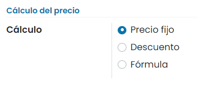

============================================================
Cómo adaptar tus precios a tus clientes y aplicar descuentos
============================================================

Daeris tiene una poderosa función de listas de precios para respaldar la estrategia de precios adaptada a tu negocio.
Una lista de precios es un conjunto de reglas que Daeris utiliza para determinar el precio sugerido de los productos.
Puedes establecer varios criterios para utilizar un precio específico: períodos, cantidad mínima de pedido, etc.

Configuración
=============

.. _sitios_web/ecommerce/productos_precios/precios/precios:

Conceder descuentos en líneas de pedido de venta
------------------------------------------------

Es posible aplicar descuentos manuales en las líneas de los pedidos de venta. Para activar esta función, navega a la
pantalla :menuselection:`Sitio web --> Configuración --> Ajustes` y marca la opción **Descuentos**:

Una vez marcada la opción, pulsa el botón *Guardar* de la pantalla de ajustes.

Con esta configuración, si un cliente abandona un carro de la compra, el agente podrá informar un descuento en el
campo *Desc.%* desde la pantalla :menuselection:`Sitio web --> Pedidos --> Carros abandonados`:

De esta manera, al enviar el correo electrónico de recuperación al cliente, le aparecerá el pedido con el descuento.

Mostrar el porcentaje de descuento a los clientes
-------------------------------------------------

En caso de descuento, puedes mostrar el precio público y el porcentaje de descuento calculado en la tienda online.
Para hacerlo, navega a la pantalla :menuselection:`Sitio web --> Productos --> Tarifas`, y en el detalle de la tarifa,
selecciona la opción **Mostrar al cliente el precio público y el descuento**:

.. note::
   Para que aparezca esta opción en las tarifas, es necesario que estén habilitados los descuentos en los ajustes del
   sitio web.

Mostrar precios con impuestos incluidos
---------------------------------------

Para mostrar los precios de los productos con los impuestos incluidos en la tienda online, navega a la pantalla
:menuselection:`Sitio web --> Configuración --> Ajustes` y marca la opción de **Impuestos incluidos**:

Una vez hecho esto, pulsa el botón *Guardar* de la pantalla de ajustes.

Crear una tarjeta regalo
------------------------

Para crear una tarjeta regalo que se pueda utilizar como pago para futuros pedidos, navega a la pantalla
:menuselection:`Sitio web --> Configuración --> Ajustes` y marca la opción **Tarjeta regalo**:

Una vez hecho esto, pulsa el botón *Guardar* de la pantalla de ajustes.

A continuacón, puedes configurar una tarjeta regalo desde la pantalla :menuselection:`Sitio web --> Configuración --> Tarjetas regalo`,
pulsando el botón *Crear*:

En el formulario de detalle de la tarjeta, informa una fecha de vencimiento, el monto de la tarjeta y, de forma opcional,
el cliente asociado a la tarjeta:

Una vez informados los campos, pulsa el botón *Guardar*.

Desde el menú :menuselection:`Imprimir --> Tarjeta regalo` es posible imprimir la tarjeta para entregársela al cliente:

Esto generará un fichero PDF y lo descargará en el sistema para que pueda ser impreso, con el código y el importe de la tarjeta:

A partir de ese momento, cuando el cliente se disponga a pagar un pedido desde la tienda online, tendrá la posibilidad
de canjear su tarjeta regalo:

El cliente deberá introducir el código de la tarjeta y pulsar el botón *Pagar*:

Si todo es correcto, el importe de la tarjeta regalo será descontado del importe total del pedido, y el cliente podrá
confirmarlo mediante el botón *Confirmar pedido*:

En el pedido de venta se podrá observar el detalle del pago con la tarjeta regalo:

Múltiples precios por producto
==============================

Para configurar múltiples precios de venta por producto, marca la opción correspondiente desde la pantalla
:menuselection:`Sitio web --> Configuración --> Ajustes`:

Una vez marcada la opción, pulsa el botón *Guardar* de la pantalla de ajustes.

Con esta opción, es posible configurar varias estrategias de precios.

Precios por segmento de clientes
--------------------------------

Es posible crear listas de precios en base al segmento del cliente. Para ello, navega a la pantalla
:menuselection:`Sitio web --> Productos --> Tarifas`, y crea una nueva tarifa mediante el botón *Crear*:

Especifica un nombre para la nueva tarifa:

Una vez completados los campos necesarios, pulsa el botón *Guardar*.

A continuación, navega al detalle de un producto desde la pantalla :menuselection:`Sitio web --> Productos --> Productos`
y pulsa el botón *Precios extras*:

Incorpora la tarifa y el precio sobre el producto. En este caso, el precio del producto es de 110,50€ + IVA, pero para los
clientes VIP, el precio será de 95,00€ + IVA:

Para asociar a un cliente a la nueva lista de precios, navega a la pantalla :menuselection:`Sitio web --> Pedidos --> Clientes`,
y accede al detalle de un cliente. Desde la pestaña *Venta y compra*, puedes asociarle la nueva lista de precios en el
campo *Tarifa*:

Con esta configuración, si el cliente hace un pedido desde la tienda online, se le incorpora la nueva tarifa y el
precio indicado al seleccionar el producto:

Precios temporales
------------------

Es posible asociar la lista de precios a los productos fijándoles un periodo predeterminado. Para ello, navega al detalle
de un producto desde la pantalla :menuselection:`Sitio web --> Productos --> Productos` y pulsa el botón *Precios extras*:

Asocia al producto la lista de precios, indicándole el rango de fechas en la que la lista de precios estará vigente. En
este caso, el precio del producto es de 100€ + IVA, pero del 01/08/2022 al 31/08/2022 el precio será de 80€ + IVA:

Con esta configuración de producto, si los clientes hacen un pedido desde la tienda online, podrán comprobar que el
descuento se aplica correctamente:

Precios por cantidad mínima
---------------------------

También es posible asociar listas de precios a los productos fijándoles una cantidad mínima predeterminada. Para ello,
navega al detalle de un producto desde la pantalla :menuselection:`Sitio web --> Productos --> Productos` y pulsa el botón
*Precios extras*:

Asocia al producto la lista de precios, incorporando la tarifa, cantidad mínima y precio sobre el producto. En este caso,
el precio del producto es de 25€ + IVA, pero si el cliente compra 2 unidades, el precio será de 20€ + IVA:

Con esta configuración de producto, si los clientes hacen un pedido desde la tienda online y seleccionan la cantidad
mínima del producto, podrán comprobar que el descuento se aplica correctamente:

Reglas de precio avanzadas
==========================

Las reglas de precio avanzadas permiten establecer reglas de cambio de precios. Los cambios de precio pueden ser relativos
a la lista de productos, al precio de coste del producto o a otra lista de precios. Los cambios de precio se calculan a
través de descuentos o recargos y pueden forzarse para entrar dentro del margen mínimo y margen máximo. Los precios
pueden redondearse al céntimo o euro más cercano, o al múltiplo de cualquiera (los 5 céntimos más cercanos, los 10 euros
más cercanos, etc.).

Para utilizar reglas de precio avanzadas, marca la opción correspondiente desde la pantalla
:menuselection:`Sitio web --> Configuración --> Ajustes`:

.. image:: precios/reglas-precio-avanzadas.png
   :align: center
   :alt: Reglas de precio avanzadas

Una vez marcada la opción, pulsa el botón *Guardar* de la pantalla de ajustes.

A partir de ese momento, si navegas al detalle de una tarifa desde la pantalla :menuselection:`Sitio web --> Productos --> Tarifas`,
puedes ver el listado de reglas de precio que permite establecer reglas de cambio de precio:

Cada elemento de la lista de precios se puede asociar a todos los productos, a una categoría interna del producto
(conjunto de productos) o a un producto específico. Puedes establecer fechas y cantidades mínimas.

.. note::
   Asegúrate de que al menos un artículo de la lista de precios cubra todos tus productos.

Hay 3 modos de cálculo: precio fijo, descuento y fórmula.

Descuentos con redondeos
------------------------

Por ejemplo, descuentos del 20% con precios redondeados hasta 9.99.

Costes con recargos (venta minorista)
-------------------------------------

Por ejemplo, precio de venta igual a 2 por el coste (100% de margen) con 5€ de margen mínimo.

Precios por pais
================

Las listas de precios se pueden establecer por grupo de países. Cualquier cliente nuevo registrado en Daeris obtiene una
lista de precios predeterminada, es decir, la primera en la lista que coincide con el país. En caso de que no se
establezca un país para el cliente, Daeris toma la primera lista de precios sin ningún grupo de países.

.. tip::
   Puedes cambiar la secuencia de listas de precios arrastrando y soltando en la vista de lista.

El grupo de países de una lista de precios se puede configurar desde la pantalla :menuselection:`Sitio web --> Productos --> Tarifas`,
accediendo al detalle de la misma:

.. note::
   Los grupos de países se pueden editar sobre la pantalla :menuselection:`Contactos --> Configuración --> Grupo de países`.

Administrar promociones y programas de cupones
==============================================

Daeris te ayuda a crear cupones y programas promocionales para atraer clientes en la tienda online. Puedes activar
la función de **Cupones & Promociones** en la pantalla :menuselection:`Sitio web --> Configuración --> Ajustes`:

Una vez marcada la opción, pulsa el botón *Guardar* de la pantalla de ajustes.

Después de habilitar este campo, dispondrás de dos nuevos menús en :menuselection:`Sitio web --> Productos`, llamados
**Programa de promociones** y **Programas de cupones**:

Programa de promociones
-----------------------

Al navegar a la pantalla :menuselection:`Sitio web --> Productos --> Programa de promociones`, obtendrás una vista de las
promociones ya creadas en la plataforma. La vista de tipo listado mostrará el nombre de la promoción y el estado, junto
con el nombre de la compañía:

La vista de tipo Kanban mostrará el nombre de la promoción y el estado, junto con información de los cupones y ventas
relacionadas:

Al hacer clic en el botón *Crear*, el sistema navegará al formulario de detalle, donde puedes agregar detalles sobre el
nuevo programa promocional:

El primer paso en la creación de un nuevo programa promocional es agregar el **Nombre del programa** en el campo
correspondiente. Hay varias condiciones disponibles para definir en el formulario. Puedes establecer las condiciones en
función de los clientes y de los productos. Puedes decidir dónde aplicar las reglas seleccionando la opción *Editar dominio*.
En el campo **Cantidad**, puedes mencionar la cantidad mínima de producto para obtener la recompensa. El campo **Compra mínima**
se puede usar para especificar el monto mínimo de compra requerido para obtener la recompensa. Puedes establecer el uso
del código de promoción seleccionando *Aplicación automática* o *Usar un código*.

En el apartado **Validez**, puedes mencionar el sitio web de tu empresa y la validez del programa promocional. En el campo
**Aplicar en el primero**, puedes especificar la cantidad máxima de pedidos de ventas a los que se otorgan recompensas.
También puedes encontrar campos adicionales para agregar la fecha de inicio y la fecha de finalización del programa en
particular.

En el apartado de **Recompensas**, puedes establecer condiciones para las recompensas. Puedes generar la recompensa de dos
formas, *Aplicar en orden actual* y *Envía un cupón*. Daeris ofrece tres tipos de recompensas, descuento, producto gratuito
y envío gratuito.

Si has seleccionado la opción *Producto gratis*, aparecerá un campo adicional para agregar los productos gratis como
recompensa. En caso de que hayas elegido la opción *Envío gratis*, el cliente obtendrá una oferta de envío gratis para
los productos seleccionados. Al seleccionar la opción *Descuento*, en el campo **Aplicar descuento en**, debes indicar el
porcentaje del descuento. Puedes aplicar este descuento en pedidos, en el producto más barato o en productos específicos.
Especifica el **Importe descontado máximo** que se puede proporcionar como recompensa en el campo dado.

Después de agregar todos los detalles, puedes guardar la promoción y usarla para el próximo pedido de ventas.

Programas de cupones
--------------------

Al navegar a la pantalla :menuselection:`Sitio web --> Productos --> Programas de cupones`, puedes crear atractivos
programas de cupones para que los clientes mejoren las operaciones de venta en Daeris. Esta pantalla contiene todos los
cupones ya creados. Podrás ver el nombre del programa de cupones, el sitio web, el estado activo y el nombre de la
compañía en la vista de tipo listado:

La vista de tipo Kanban mostrará el nombre del cupón y el estado, junto con información de los cupones y ventas
relacionadas:

Para crear un nuevo cupón para la tienda online, puedes hacer clic en el botón *Crear*:

Especifica el **Nombre del programa** en el campo especificado. Puedes establecer condiciones para el cupón en función del
producto. Puedes establecer las reglas sobre los productos a los que se aplican los cupones en el campo **Según productos**.
Los campos **Cantidad** y **Compra mínima de** se pueden usar para indicar la cantidad mínima y el monto de compra para
obtener la recompensa. Agrega el nombre de tu compañía en el campo indicado. En el apartado **Validez**, puedes agregar el
**Periodo de validez** del cupón junto con los detalles de tu sitio web.

Hay tres tipos de recompensas disponibles para cupones, descuento, producto gratis y envío gratis:

Si la recompensa se selecciona como *Descuento*, puedes indicar el porcentaje de descuento proporcionado en un pedido en
particular en el campo **Aplicar descuento**. Puedes aplicar el descuento en pedidos, en el producto más barato o en
productos específicos. El importe de descuento máximo proporcionado en un pedido o presupuesto se puede especificar en
el campo **Importe descontado máximo**. Si has seleccionado *Producto gratis* como recompensa, obtendrás un campo
complementario para seleccionar el producto gratuito. Al seleccionar la opción de *Envío gratis*, el cliente recibirá el
pedido sin pagar gastos de envío.

Después de agregar todos los detalles, puedes guardar el cupón. Para usarlo en el próximo pedido la tienda online, deberás
pulsar el botón *Generar cupón*:

El sistema desplegará un formulario donde poder informar el número de cupones a generar:

Al seleccionar la opción *Número de cupones* se podrá especificar el número de cupones a generar. Mediante la opción
*Número de clientes seleccionados* se podrá especificar a qué clientes enviar los cupones, y una plantilla de correo,
para que el sistema envíe de forma automática los cupones a los clientes por correo electrónico.

Utilizar promociones y cupones en la tienda online
--------------------------------------------------

Cuando los clientes compran un producto de tu sitio web, obtendrán los cupones correspondientes y las ofertas de promoción
si se aplican recompensas o descuentos para ese producto, compra o servicio en particular. Se informará en el momento de
los procedimientos de check-out. Podrán usar el código de promoción que se muestra para reclamar la oferta.

Por otro lado, tras haber configurado promociones, al hacer clic en el enlace *Compartir*, obtendrás el enlace para compartir esta
promoción con tus clientes:

El sistema permitirá seleccionar el sitio web y generará un enlace para compartir la promoción. Se aplicará en el momento
del pago cuando el cliente utilice este enlace:

Crear un código promocional en la tienda online
===============================================

Los códigos promocionales permiten a las empresas ofrecer cupones a sus clientes que pueden canjear por un descuento en
alguno de los productos del sitio web.

Para configurar un código navega a la pantalla :menuselection:`Sitio web --> Productos --> Tarifas`, y crea una nueva
tarifa mediante el botón *Crear*:

Es importante especificar el nombre del código promocional (en el ejemplo, *NAVIDAD*) y definir el nuevo precio o descuento
de los productos:

.. note::
   El nuevo precio o descuento de los productos se configura de forma distinta en función de si tienes configurados
   múltiples precios por producto o precios calculados a partir de fórmulas.

A partir de ese momento, si un cliente navega a la tienda del sitio web, y añade uno de los productos a la cesta,
podrá introducir el código promocional para conseguir el descuento correspondiente:

Al solicitar la promoción, se aplica de forma automática el descuento en la cesta de la compra, y el cliente ya puede
continuar con el pago con los descuentos aplicados:

