==============
Gestión básica
==============

.. _sitios_web/ecommerce/productos_precios/productos/crear_producto:

Crear un producto en la tienda online
=====================================

Para crear un producto de venta en la tienda online, pulsa el botón *Nuevo*:

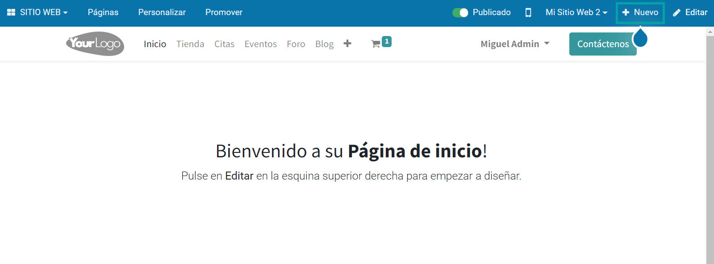

A continuación, selecciona crear un nuevo *Producto*:

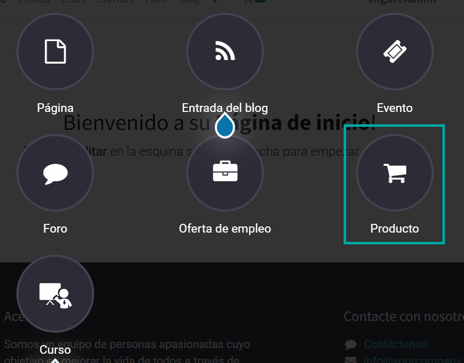

En el formulario desplegado en pantalla, informa el nombre del producto y pulsa el botón *Crear*:

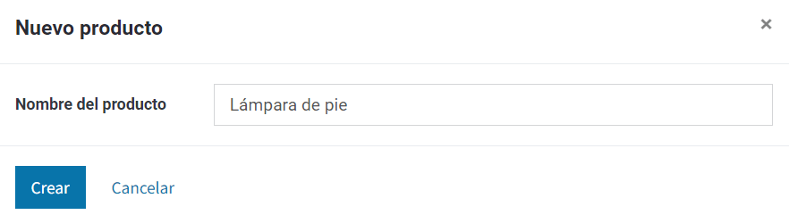

El sistema navegará a la pantalla de detalle del producto, desde donde podrás personalizar dicha página, añadiendo los
bloques desde el editor del sitio web:

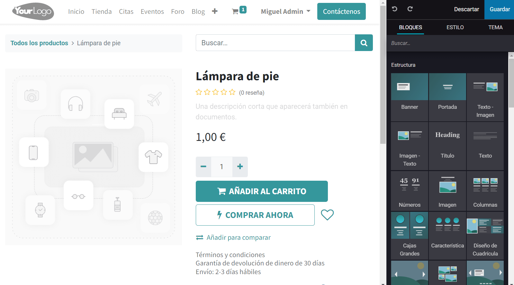

Una vez finalizados los cambios, pulsa el botón *Guardar*.

A continuación, puedes editar el producto desde el backend seleccionando la opción correspondiente del menú:

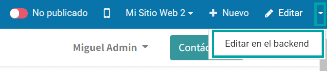

En primer lugar, puedes subir una imagen del producto mediante el campo de imagen:

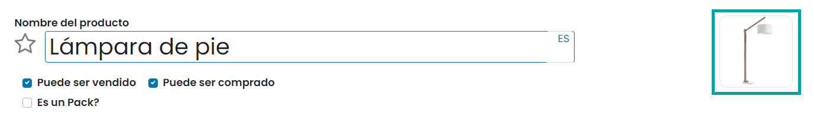

En la pestaña de *Información General*, puedes definir el tipo de producto, política de facturación, unidad de medida,
precio de venta, impuestos del cliente y la categoría del producto:

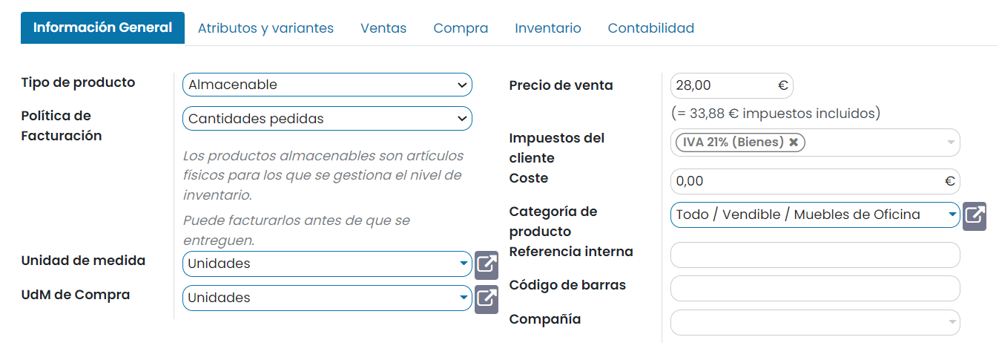

Por otro lado, desde la pestaña de *Ventas*, puedes incluir una descripción del producto, que se muestra en el producto
publicado en el sitio web, mediante el campo **Descripción para Clientes**. También puedes indicar si este producto tiene
una cantidad mínima mediante el campo **Cantidad mínima del pedido**. En caso de tener informada una cantidad mínima mayor a
1, los clientes tendrán que añadir al carrito como mínimo las unidades aquí especificadas.

.. note::
   Si se informa una cantidad mínima del pedido, debes asegurarte de que este producto no se ha informado como un producto
   opcional, alternativo o de accesorio de otro producto, ya que estas funcionalidades no son compatibles. La cantidad
   mínima del pedido tampoco se valida en la TPV (Terminal Punto de Venta).

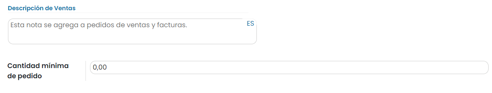

Además, es posible definir lo siguiente desde la pestaña de *Ventas*:

-  Las **categorías del producto**, que permiten filtrar por productos similares en el sitio web.

-  La **disponibilidad del producto**, que permite continuar la venta si un producto está agotado, mostrar la cantidad
   disponible de un producto si se encuentra por debajo de un umbral, así como mostrar un mensaje cuando el producto
   esté agotado.

   .. note::
      Puedes configurar la disponibilidad predeterminada de los productos desde la pantalla :menuselection:`Sitio web --> Configuración --> Ajustes`,
      informando los campos **Agotado** y **Mostrar cantidad disponible**, debajo de la sección de *Productos*.

-  Los **productos alternativos** y los **productos de accesorio**.

-  Las **imágenes extra**, que te permiten añadir diversas imágenes asociadas a un producto.

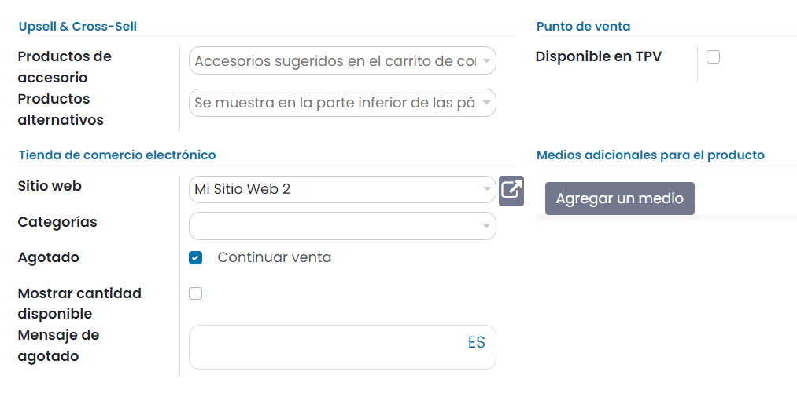

Una vez configurado el producto, pulsa el botón *Guardar*.

A partir de ese momento, puedes visualizarlo desde el sitio web, desde donde se podrá proceder a su activación mediante
la opción ubicada en la parte superior derecha del menú:

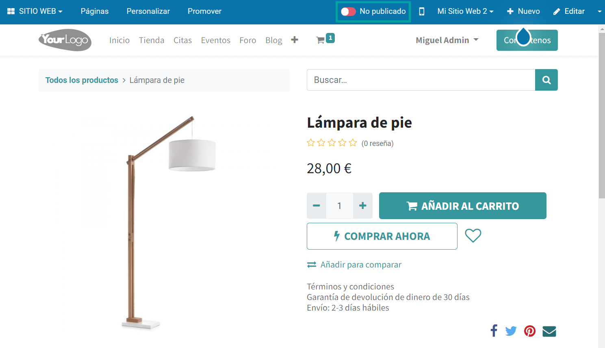

Configurar productos accesorios y opcionales (cross-selling)
============================================================

Los productos accesorios y opcionales son aquellos productos que son presentados al cliente cuando este revisa la cesta
antes del pago. De esta manera, Daeris te permite maximizar las ventas, sugiriendo al cliente productos accesorios y
opcionales para sus productos, de manera que pueda complementar su compra.

Los productos accesorios se pueden configurar desde la pantalla :menuselection:`Sitio web --> Productos --> Productos`,
accediendo a la pestaña *Ventas* del detalle de un producto. Para añadir productos accesorios pulsa el botón *Editar*, y
añade los productos en el campo **Productos de accesorio**:

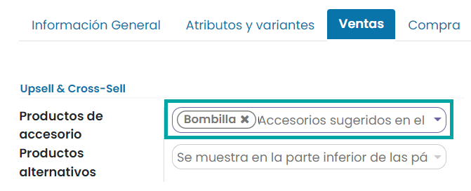

Una vez añadidos los productos accesorios, pulsa el botón *Guardar*.

A continuación, si navegas al sitio web y añades a la cesta de la compra el producto editado, al navegar a la revisión
del pedido, te aparecerá el listado de productos accesorios:

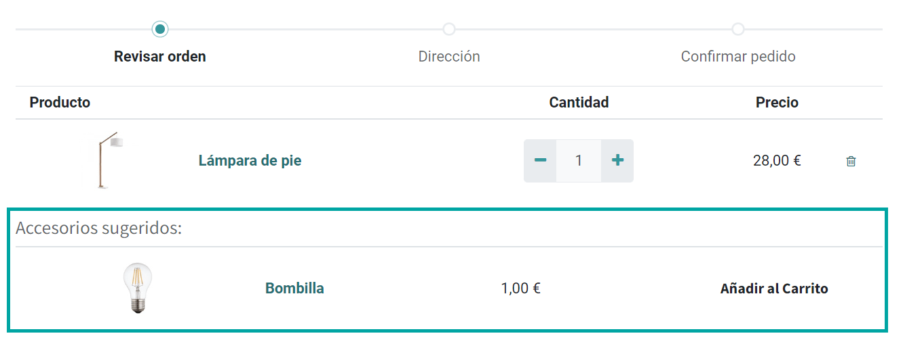

Si el cliente está interesado en ese accesorio, puede pulsar el enlace **Añadir al Carrito**, para que ese producto quede
añadido también a la cesta, maximizando así las ventas. Al añadir el producto accesorio a la cesta, el importe se suma al
total del pedido, y el producto queda añadido a la lista de productos:

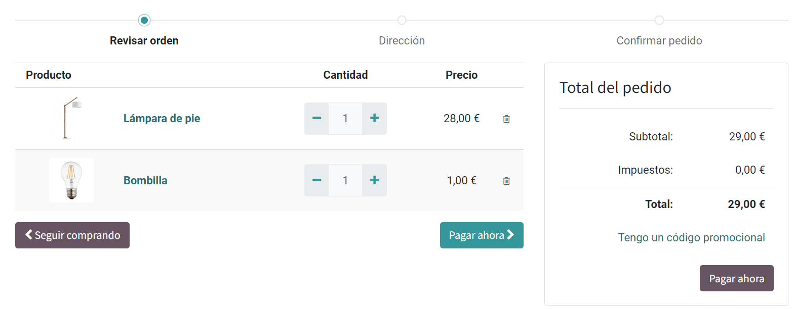

Por otro lado, los productos opcionales se pueden habilitar desde la pantalla :menuselection:`Sitio web --> Configuración --> Ajustes`,
marcando el campo correspondiente:

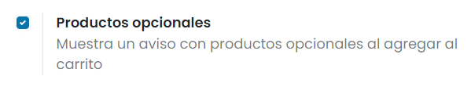

Una vez activado, pulsa el botón *Guardar* de la pantalla de ajustes.

A partir de ese momento, los productos opcionales se pueden configurar desde la pantalla :menuselection:`Sitio web --> Productos --> Productos`,
accediendo a la pestaña *Ventas* del detalle de un producto. Para añadir productos opcionales pulsa el botón *Editar*, y
añade los productos en el campo **Productos opcionales**:

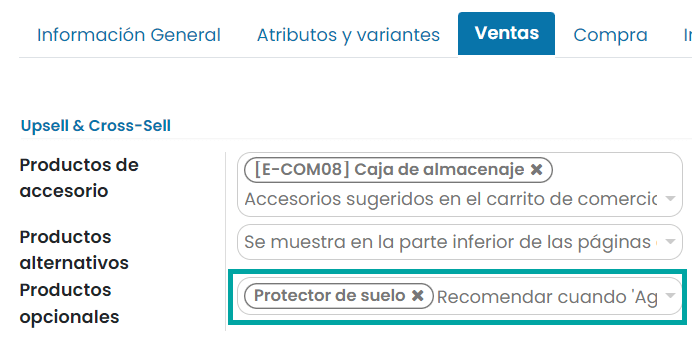

Una vez añadidos los productos opcionales, pulsa el botón *Guardar*.

A continuación, si navegas al sitio web y añades a la cesta de la compra el producto editado, te aparecerá el listado de
productos opcionales:

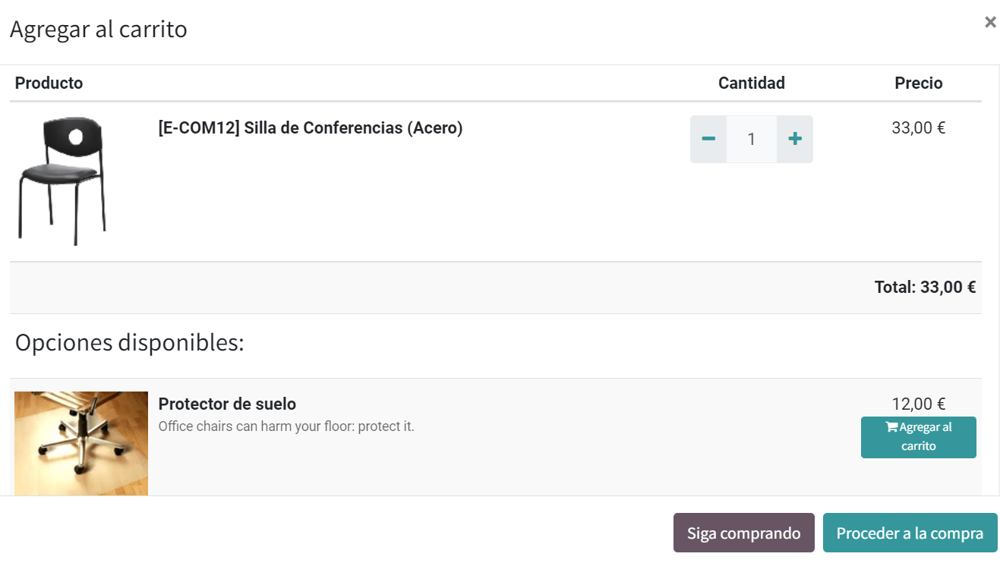

Si el cliente está interesado en ese producto, puede pulsar el enlace **Agregar al Carrito**, para que ese producto quede
añadido también a la cesta, maximizando así las ventas:

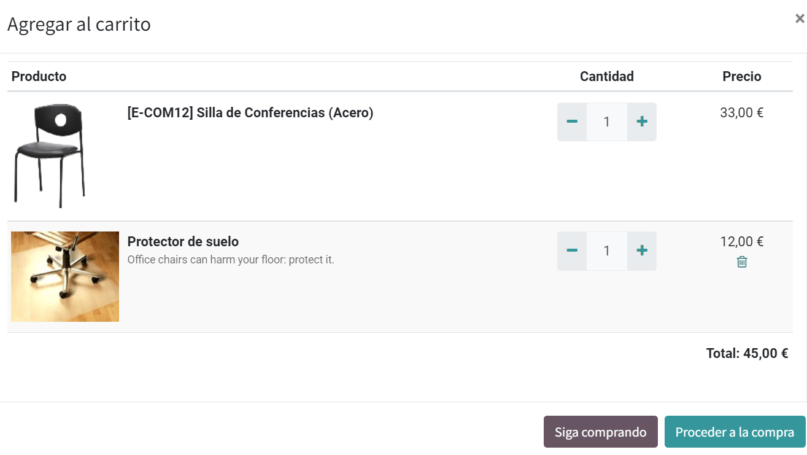

Configurar productos alternativos (up-selling)
==============================================

Mediante la sugerencia de productos alternativos (up-selling), Daeris permite mostrar en la página de un producto, productos
similares a los clientes, con el objetivo de maximizar las ventas.

Para configurar un producto alternativo, navega al detalle de un producto desde la pantalla :menuselection:`Sitio web --> Productos --> Productos`,
y accede a la pestaña de *Ventas*. Para añadir productos alternativos, pulsa el botón *Editar*, y añade la lista de
productos alternativos en el campo correspondiente:

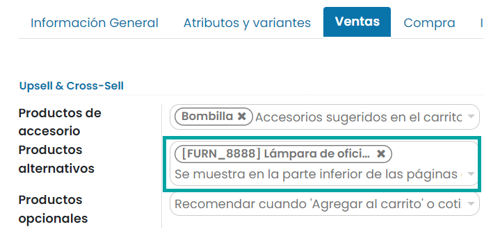

Una vez añadidos los productos alternativos, guarda el registro.

En la página de detalle del producto del sitio web, puedes visualizar una nueva sección en donde se muestra la lista de
productos alternativos a sugerir a los clientes, con el objetivo de proponer ideas alternativas a los mismos, maximizando
así las ventas:

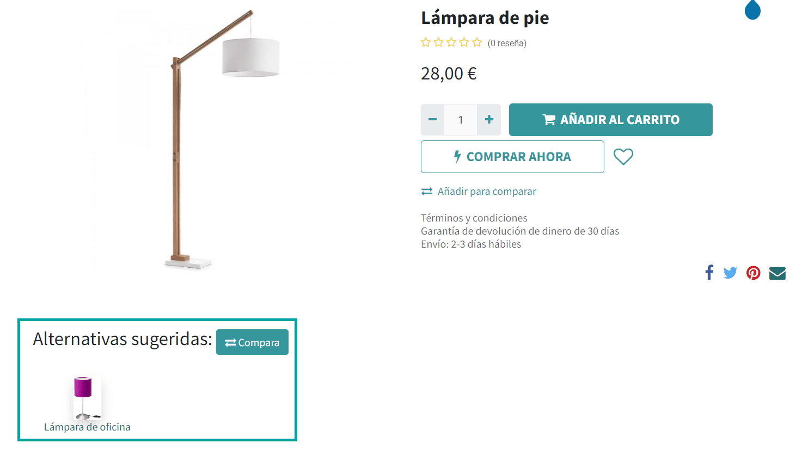

.. note::
   Es necesario disponer de la opción de *Productos Alternativos* marcada desde el menú :menuselection:`Personalizar`.

Al pulsar en el enlace del producto alternativo, el sistema navega de forma automática a la página de detalle del producto:

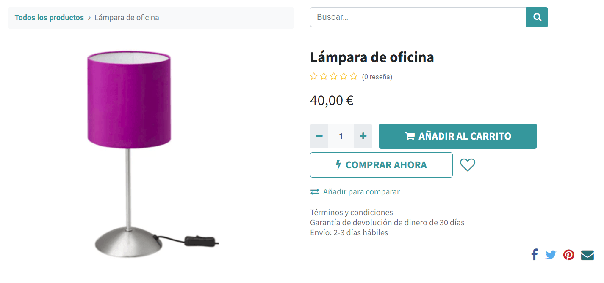

Configurar un producto digital de la tienda online
==================================================

Los productos digitales son aquellos que no es necesario enviar físicamente a los clientes cuando los compran, y que
simplemente necesitan ser descargados, como, por ejemplo, un libro electrónico, una aplicación, etc.

Para habilitar esa función, navega a la pantalla :menuselection:`Sitio Web --> Configuración --> Ajustes` y marca la
opción **Contenido Digital**:

Una vez marcada la opción, pulsa el botón *Guardar* de la pantalla de ajustes.

Para configurar un producto digital es necesario navegar a la pantalla :menuselection:`Sitio Web --> Productos --> Productos`
y acceder al detalle del producto digital. El producto digital debe tener marcado el tipo de producto *Servicio*:

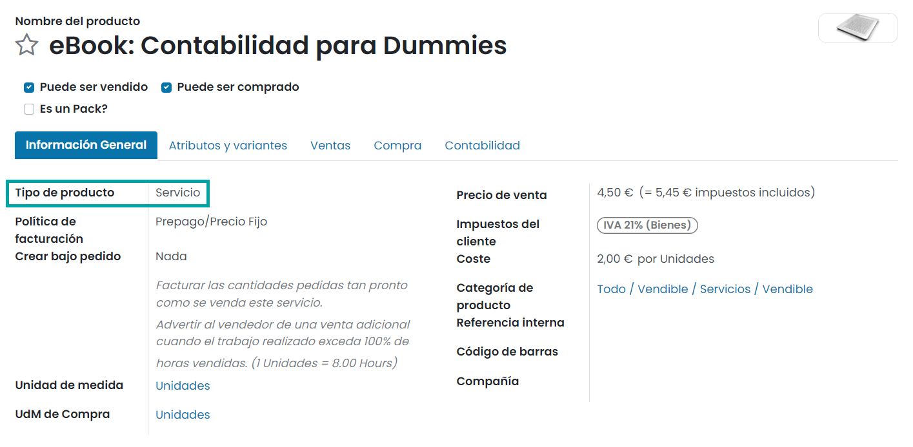

Será necesario adjuntar los ficheros digitales que los clientes podrán descargar cuando adquieran el producto. Para ello,
pulsa el botón **Archivos digitales**:

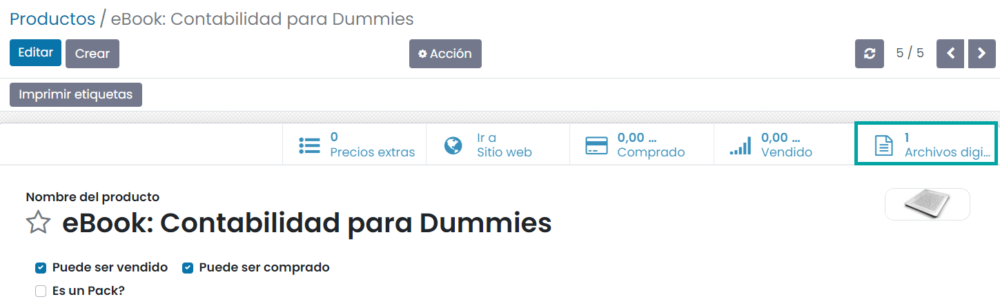

El sistema navegará a la pantalla de listado de archivos digitales, donde podrás crear un nuevo archivo digital con el
botón *Crear*. El formulario de creación de ficheros digitales tendrá los siguientes campos:

-  **Nombre**: Nombre del archivo digital.

-  **Contenido del archivo**: Mediante este campo podrás subir el fichero asociado al producto digital, como, por ejemplo,
   un libro electrónico en formato pdf.

-  **Sitio web**: En caso de estar disponible solamente para un sitio web, seleccionar en qué sitio web debe estar disponible.

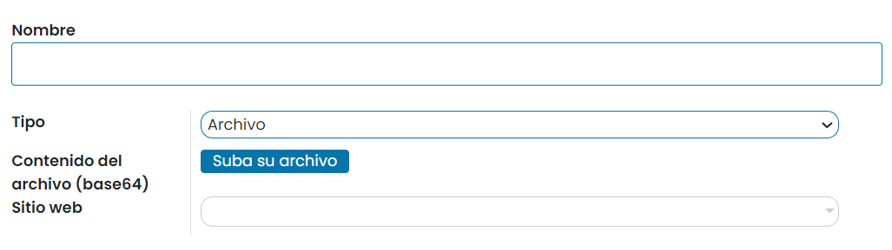

Una vez guardado el registro, cuando los clientes adquieran ese producto desde la web, podrán proceder a la descarga
del archivo digital desde su área privada de clientes desde el menú **Mi cuenta**:

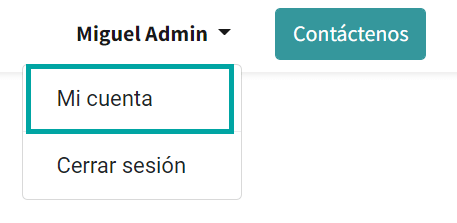

El cliente debe acceder a sus pedidos de ventas desde la opción correspondiente del área de clientes:

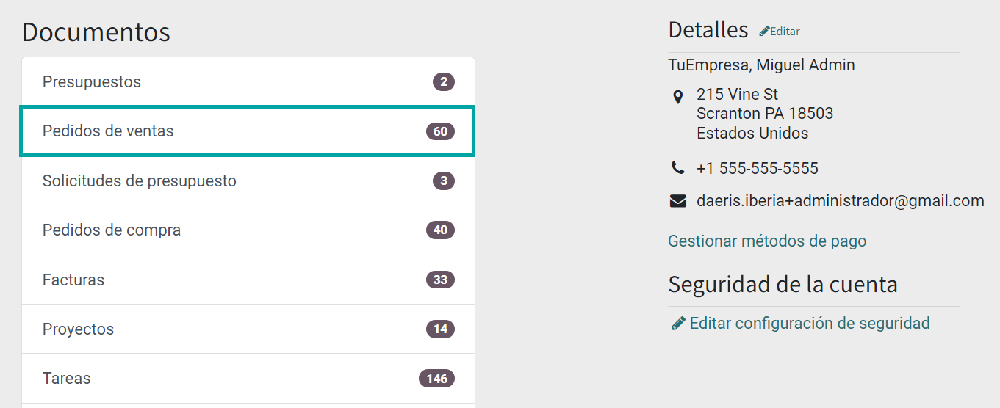

Del listado de pedidos de venta, se deberá acceder al pedido correspondiente a la compra del producto digital:

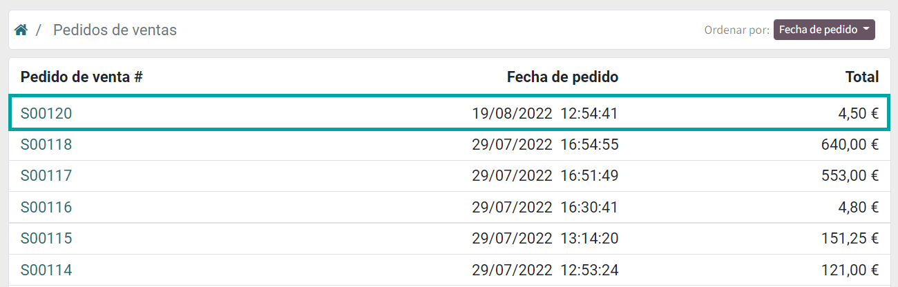

En el detalle del pedido, junto al producto digital, aparecerá un botón llamado **Descargas** que permitirá descargar el fichero:

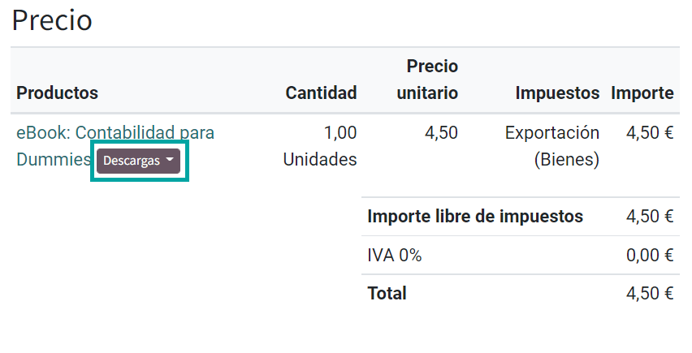

Al seleccionar la descarga, el fichero se descargará de forma automática al equipo local del cliente.

Agregar precio por unidad de medida base en tus productos
=========================================================

Para agregar un precio por unidad de medida base en tus productos, navega a la pantalla :menuselection:`Sitio Web --> Configuración --> Ajustes`
y marca la opción **Precio unitario base**:

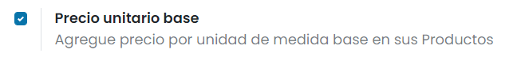

Una vez activado, pulsa el botón *Guardar* de la pantalla de ajustes.

A continuación, navega a la pantalla :menuselection:`Sitio Web --> Configuración --> Unidades Base` y crea un registro
mediante el botón *Crear*. Informa el nombre de las unidades base que utilizarás en tus productos:

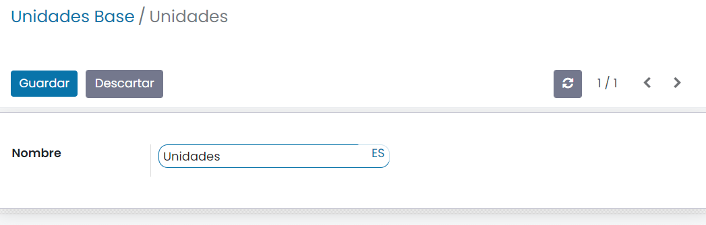

Una vez hecho esto, navega al detalle de un producto desde la pantalla :menuselection:`Sitio Web --> Productos --> Productos`
e informa el campo de **Recuento de unidades base**:

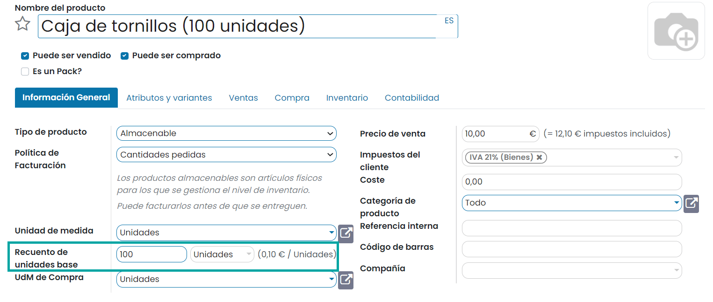

.. note::
   Puedes informar el campo en 0 si quieres ocultar el recuento de unidades base para este producto.

Tras guardar el registro, navega a la página de detalle del producto en el sitio web. El producto mostrará información
acerca del precio unitario base del producto al lado del precio:

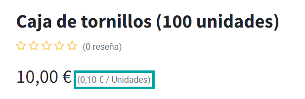

Permanecer en la página después de agregar productos al carrito
===============================================================

Es posible configurar el comportamiento de la tienda online cuando un usuario añade un producto al carrito de la compra
para que el usuario permanezca en la misma página o no, después de agregar productos al carrito. Para ello, navega a
la pantalla :menuselection:`Sitio Web --> Configuración --> Ajustes`. Si se activa la opción **Permanezca en la página después de agregar al carrito**
los usuarios permanecerán en la misma página después de agregar productos al carrito. Por el contrario, si se desactiva dicha
opción, el sistema redirigirá al usuario a la cesta de la compra tras añadir un producto al carrito:

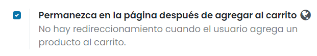

Una vez configurada la opción con el comportamiento deseado, pulsa el botón *Guardar* de la pantalla de ajustes.