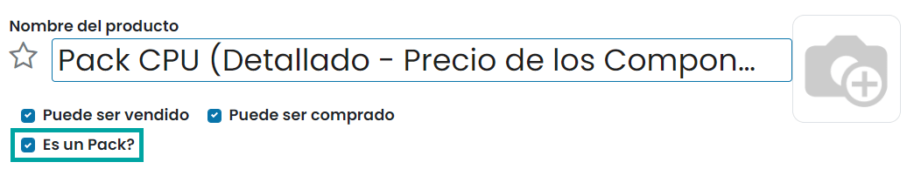
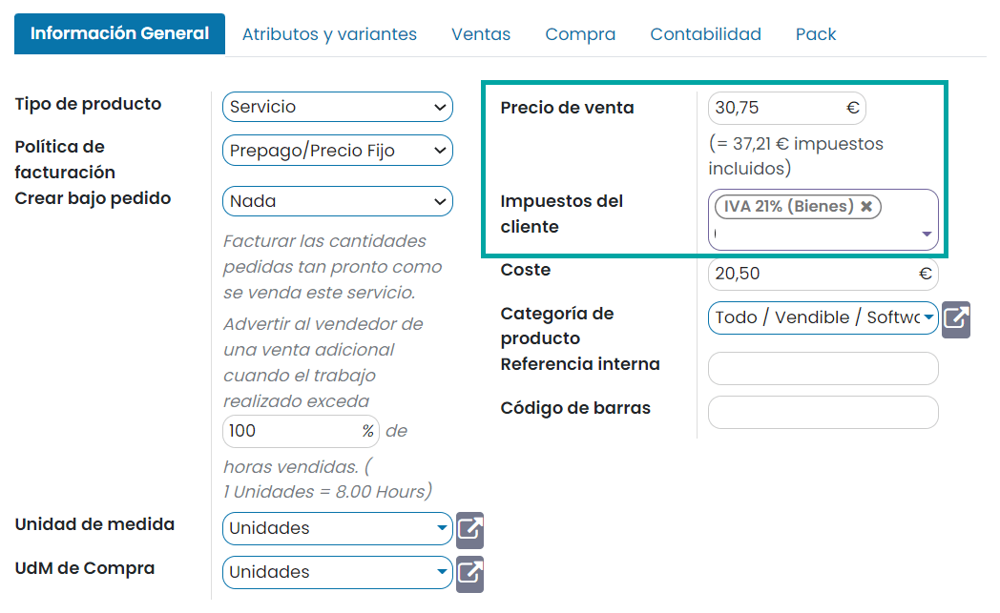
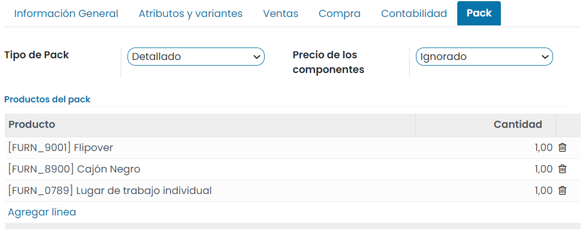
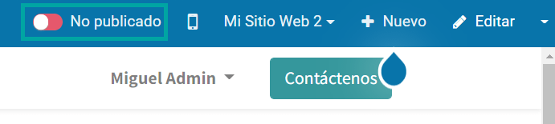
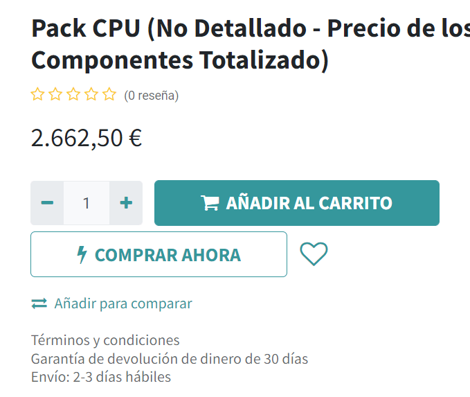
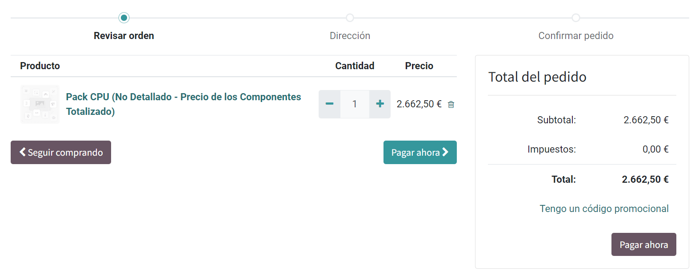

==========================
Crear un pack de productos
==========================

Los **packs de productos** te permiten agrupar varios productos en un pack y ponerlos a la venta de modo conjunto, de
forma que el cliente que adquiere el pack, adquiere todos los productos que lo conforman.

Mediante los packs de productos es posible controlar el stock del propio pack, así como el stock de cada uno de los
productos del pack, de forma que, si vendes packs de productos, estos se restarán del inventario una vez se hayan
completado las transferencias asociadas.

Crear el producto de tipo pack
==============================

Para crear un pack de productos, navega a la pantalla :menuselection:`Sitio web --> Productos --> Productos`, y pulsa el
botón *Crear*. El producto debe disponer de la marca *Es un Pack?* informada:

A continuación, establece un nombre para el producto, una imagen, y desde la pestaña de *Información General*, define el
precio del producto y los impuestos que se aplicarán al cliente:

Desde la pestaña *Pack*, puedes definir la lista de productos asociados al pack, así como la forma de gestionar su precio:

.. important::
   En los packs de productos publicados en el sitio web, el tipo de pack debe ser siempre **No detallado**, ya que de
   otra manera, aparecerán todos los productos del pack en la cesta de la compra, pudiendo provocar errores si los
   usuarios eliminan productos de la cesta.

-  **Tipo de Pack**

   -  **Detallado**: Muestra los componentes individualmente en las líneas de los pedidos de venta. Permite seleccionar
      el campo *Precio de los componentes*.

   -  **No detallado**: No muestra los componentes individualmente en las líneas de los pedidos de venta, solo el
      pack de productos. El precio será el precio del pack más la suma de precios de todos los componentes.

-  **Pack modificable**: Al marcar esta casilla, será posible editar las líneas de pedidos de venta relativas a sus
   componentes. Esta opción solo se habilita cuando el precio de los componentes es detallado por componente.

-  **Productos del pack**: Listado de productos asociados al pack.

Una vez configurado el pack, pulsa el botón *Guardar*.

Para publicar el pack de productos en la tienda online, navega al detalle del producto, y pulsa el botón de publicación:

Utilizar el pack de productos en un pedido la tienda online
===========================================================

A partir de ese momento, el pack ya podrá ser seleccionado desde la tienda online. Añade el pack a la cesta de la compra
mediante el botón **Añadir al carrito**:

Al navegar a la cesta de la compra, se podrá visualizar el producto de tipo pack junto con su precio:

A partir de ahí, el cliente puede continuar con el proceso de compra y pago del pack de productos.