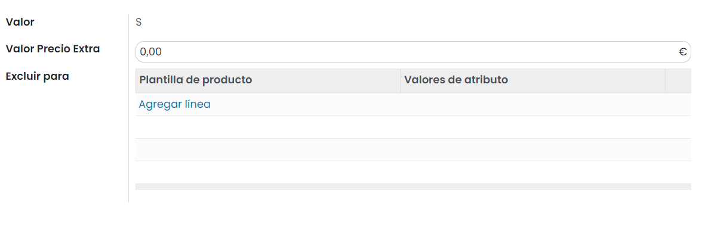

===========================
Usar variantes de productos
===========================

Las variantes de productos son usadas para administrar productos que tienen diferentes variaciones, como talla, color, etc.
Permite administrar el producto a nivel de modelo (para todas las variaciones) y a nivel de variante (atributos específicos).

Por ejemplo, una compañía que vende camisetas puede tener el siguiente producto:

-  Camiseta B&C

   -  Tallas: S, M, L, XL, XXL

   -  Colores: Azul, Rojo, Blanco, Negro

En este ejemplo, **Camiseta B&C** es la denominación del modelo y **Camiseta B&C, S, Azul** es una variante. Las tallas
y colores son **atributos**.

El ejemplo anterior tiene un total de 20 productos diferentes (5 tallas x 4 colores). Cada uno de estos productos tiene
su propio inventario, ventas, etc.

Configuración
=============

Activar la función variante
---------------------------

Antes que puedas usar las variantes de producto, debes activar esta funcionalidad en los ajustes. Para hacerlo, debes
navegar a la pantalla :menuselection:`Sitio web --> Configuración --> Ajustes`, y marcar la opción **Variantes**:

Una vez activada la opción, pulsa el botón *Guardar*.

Crear productos con variantes
-----------------------------

Para dar de alta los atributos de los productos navega a la pantalla :menuselection:`Sitio web --> Configuración --> Atributos`
y pulsa el botón *Crear*.

.. image:: variantes/crear-atributos.png
   :align: center
   :alt: Crear atributos de producto

Sobre el formulario de atributos puedes encontrar la siguiente información:

-  **Nombre del Atributo**: Nombre del nuevo atributo.

-  **Categoría**: Categoría a la que está asociada el atributo.

-  **Tipo de pantalla**: El tipo de visualización utilizado en el configurador del producto.

   -  **Opción**: El atributo se permite seleccionar entre una lista de opciones.

   -  **Recuadro**: El atributo se permite seleccionar de entre varios recuadros.

   -  **Selección**: El atributo se permite seleccionar mediante un campo desplegable.

   -  **Color**: El atributo se permite seleccionar de entre una gama de colores.

-  **Modo de creación de variantes**: Indica si se deben crear variantes para este atributo y cuándo.

   -  **Instantáneamente**: Mediante esta opción, siempre se crearán variantes en el producto.

      .. note::
         Hay que tener especial atención al seleccionar esta opción ya que, si el número de variantes a generar es muy elevado,
         no se permitirá guardar el producto. En esos casos, se recomienda no generar variantes o generarlas solo cuando el
         producto se agrega a un pedido de venta.

   -  **Dinámicamente**: Las variantes se crearán de forma automática cuando el producto se agregue a un pedido de venta,
      de manera que solo se crearán las variantes que tengan ventas.

   -  **Nunca (opción)**: Seleccionando esta opción, no se crearán variantes en el producto.

   .. note::
      El modo de creación de variantes no se puede modificar una vez que el atributo se utiliza en al menos un producto.

-  **Valores de atributo**: Sobre el listado de valores se pueden incorporar los posibles valores de que dispondrá el
   atributo. En el caso de que quieras permitir a los usuarios incorporar valores personalizados, debes marcar la opción
   *Es valor personalizado*.

.. image:: variantes/detalle-atributos.png
   :align: center
   :alt: Formulario de detalle de atributos de producto

Una vez completada la información del atributo, pulsa el botón *Guardar*.

Gestionar variantes de producto
===============================

Gestionar combinaciones posibles
--------------------------------

Una vez dispones de los atributos y de sus posibles valores, crear las variantes resulta muy sencillo. Para ello, navega
al detalle de un producto, desde la pantalla :menuselection:`Sitio web --> Productos --> Productos`, y posiciónate sobre la
pestaña *Atributos y variantes*. Sobre el listado de variantes, puedes seleccionar el atributo e incorporar todos los
valores posibles del producto seleccionado:

.. note::
   Si un atributo solo dispone de un valor, no genera variantes. Para que un atributo genere variantes debe disponer de,
   al menos, dos posibles valores.

Una vez hayas añadido los atributos y sus posibles valores al producto, pulsa el botón *Guardar*.

Establecer un precio extra por variante
---------------------------------------

Para configurar las variantes del producto, pulsa el botón *Configurar* ubicado en el listado de atributos del producto:

El sistema navegará a la pantalla de valores de la variante de producto:

Al acceder al detalle de una variante de producto, puedes editar la siguiente información:

-  **Valor Precio Extra**: Precio extra de la variante, que se suma al precio final del producto.

-  **Excluir para**: Bajo este apartado puedes incorporar aquellas variantes que no son compatibles con esta variante,
   en caso de haber alguna. Por ejemplo, si la talla S no estuviera disponible para el color rojo, se podría excluir esta
   variante para que no pueda ser seleccionada al realizar un pedido.

Editar información adicional de las variantes
---------------------------------------------

Una vez configuradas las variantes, puedes consultar el número de variantes de que dispone tu producto bajo el icono de
*Variantes* del formulario de detalle del producto:

Al pulsar el icono de *Variantes*, el sistema navega a la pantalla de variantes de producto. El precio de venta de cada
una de las variantes del producto es un cálculo del precio del producto más el precio extra de los valores de sus atributos:

Al editar una variante puedes informar los siguientes campos:

-  **Imagen**: Reemplaza a la imagen original del producto.

-  **Referencia interna**: Se incorpora un código de referencia exclusivo de esta variante.

-  **Código de barras**: Se incorpora un código de barras exclusivo de esta variante.

-  **Coste**: Precio de coste de la variante.

-  **Volumen**: El volumen en metros cúbicos de la variante.

-  **Peso**: El peso en kilogramos de la variante.

-  **Medios adicionales para la variante**: URL del vídeo o imágenes adicionales de la variante.

Finalmente, cuando un usuario navegue a la página de detalle del producto desde el sitio web, podrá seleccionar la
variante del producto en función de la configuración del producto:

