=============
Tienda Online
=============

Personalización
===============

.. _sitios_web/ecommerce/tienda_online:

Configurar la tienda online
---------------------------

Desde la página principal de la tienda online en el sitio web, es posible configurar la página y los diferentes productos
mostrados pulsando en el botón *Editar*:

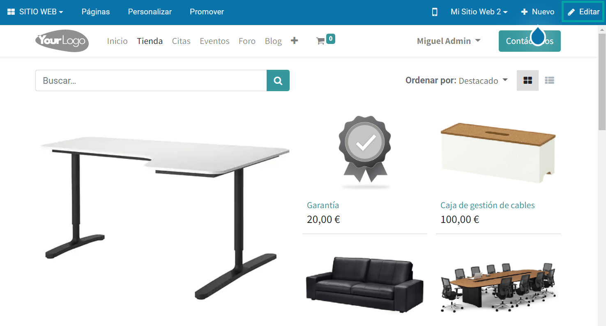

Esto te llevará a la vista en modo edición, desde donde podrás añadir los diferentes tipos de bloques ubicados en la parte
derecha, arrastrándolos a la parte izquierda. Por ejemplo, es posible añadir una cabecera de página con un banner:

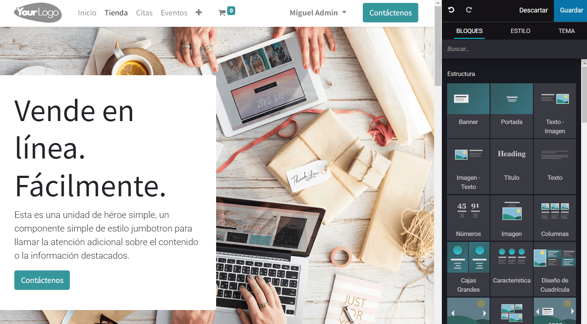

Además, puedes editar cada uno de los productos mostrados desde el editor, seleccionando el producto en cuestión, donde
dispones de las siguientes opciones:

-  **Tamaño**: Permite modificar el tamaño de la imagen en miniatura mostrada para ese producto.

-  **Cinta**: Hay varios estilos a elegir:

   -  **Oferta**: Muestra el producto como destacado, añadiendo una banda con el texto *Oferta*.

   -  **Agotado**: Muestra el producto como agotado, añadiendo una banda con el texto *Agotado*.

   -  **¡Nuevo!**: Muestra el producto como nuevo, añadiendo una banda con el texto *¡Nuevo!*.

-  **Posición**: Permite mover hacia delante o hacia atrás la imagen, para que se muestre al principio o al final, o en
   la posición que más te convenga.

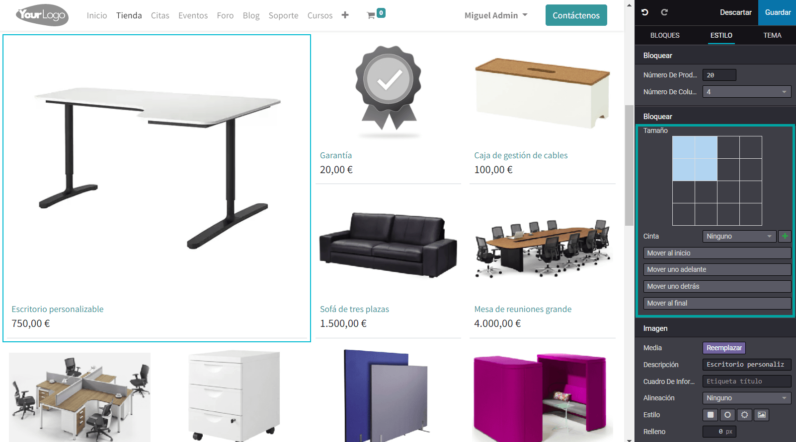

De este modo se puede conseguir personalizar la página destacando aquellos productos que te interese, de manera que sea
más atractivo para tus clientes:

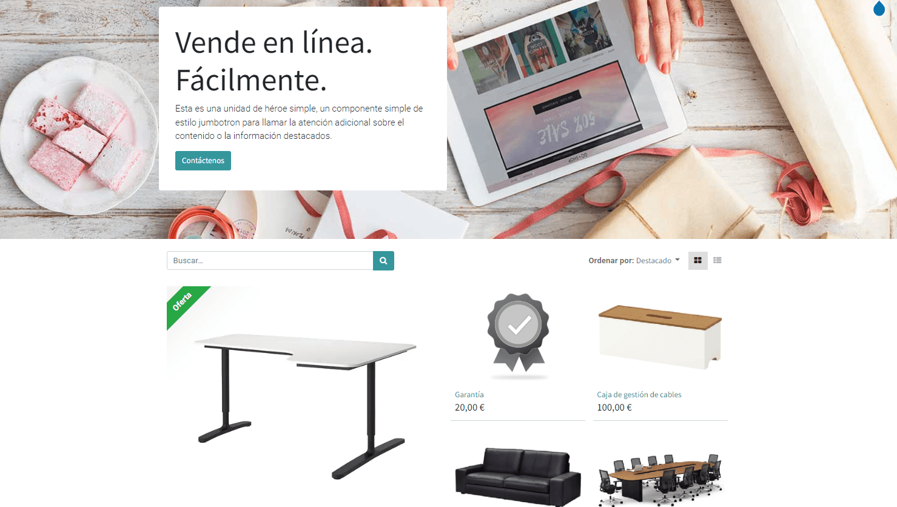

Desde la página de detalle de un producto, también puedes editar la página para añadir bloques de personalización:

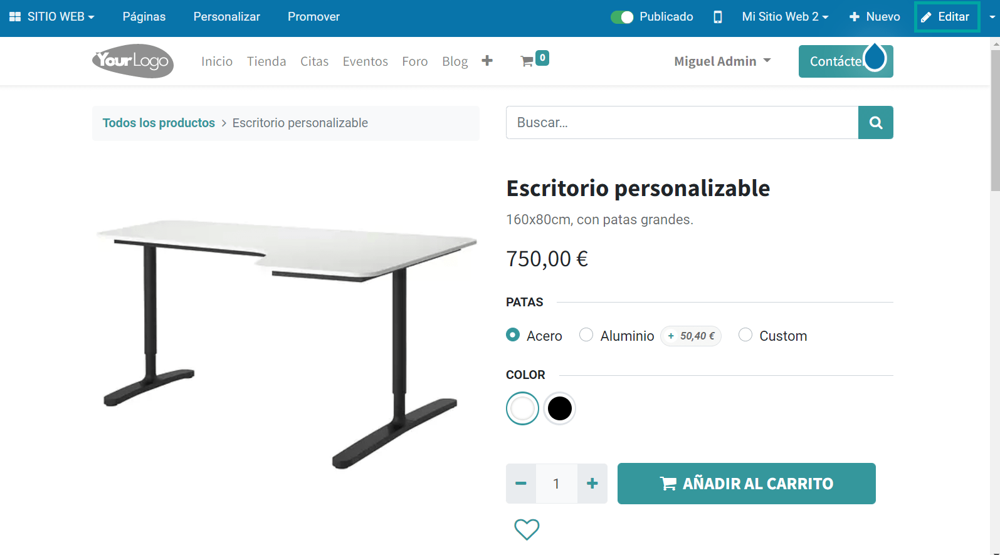

Por ejemplo, es posible añadir un bloque de características de producto para destacar las características principales
del producto y hacerlo así más vistoso para los clientes:

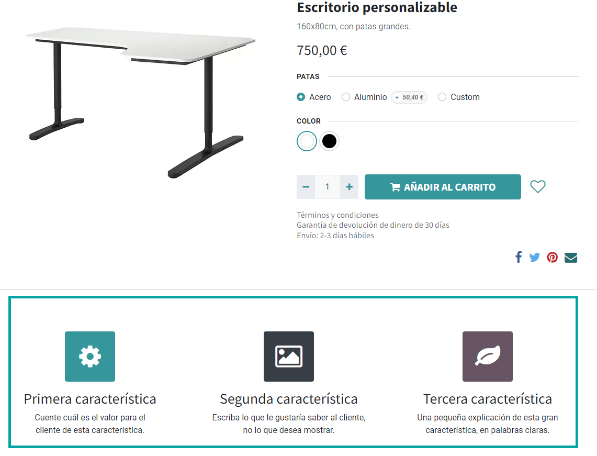

Personalizar la página principal de la tienda online
----------------------------------------------------

El menú :menuselection:`Personalizar` de la página principal de la tienda online ofrece varias opciones de personalización
para los administradores de la tienda online:

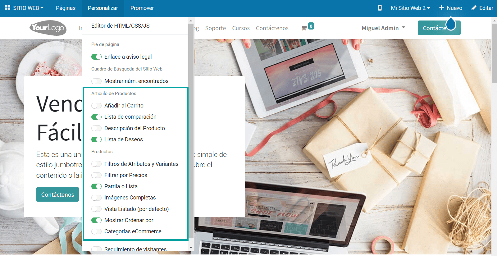

A continuación, se describen dichas opciones:

-  **Añadir al Carrito**: Incluye un icono en los productos para añadirlos a la cesta.

-  **Lista de comparación**: Incluye un icono en los productos para añadirlos a la comparativa.

-  **Descripción del Producto**: Añade la descripción del producto debajo del nombre.

-  **Lista de Deseos**: Incluye un icono en los productos para añadirlos a la lista de deseos.

-  **Filtros de Atributos y Variantes**: Incluye campos en la parte izquierda de la pantalla para filtrar por atributos
   de los productos.

-  **Filtrar por Precios**: Incluye un campo en la parte izquierda de la pantalla para filtrar por precios de los productos.

-  **Parrila o Lista**: Permite cambiar la visualización de los productos a los usuarios entre modo parrilla o lista.

-  **Imágenes Completas**: Amplia el tamaño de las imágenes de productos mostradas.

-  **Vista Listado (por defecto)**: Cambia el modo de la vista para que se muestre en modo listado por defecto.

-  **Mostrar Ordenar por**: Incluye un campo desplegable que permite ordenar los productos por nombre, precio, llegadas
   más recientes o destacados.

-  **Categorías eCommerce**: Incluye enlaces en la parte izquierda de la pantalla para filtrar por categorías de productos.

Personalizar la página de detalle de los productos
--------------------------------------------------

Desde la página de detalle de los productos dispones de las siguientes opciones de personalización mediante el menú
:menuselection:`Personalizar`:

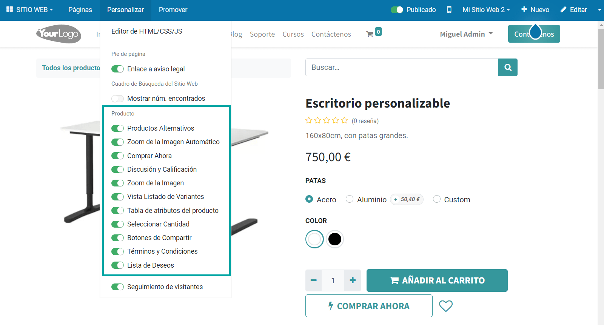

A continuación, se describen dichas opciones:

-  **Productos Alternativos**: Muestra una sección con las imágenes de los productos alternativos.

-  **Zoom de Imagen Automático**: Al pasar el ratón por encima de la imagen del producto se muestra un zoom de forma automática.

-  **Comprar Ahora**: Añade un botón que permite comprar ahora el producto, accediendo directamente al proceso de pago.

-  **Discusión y Calificación**: Permite incluir comentarios y calificaciones por parte de los visitantes del sitio web.

-  **Zoom de la Imagen**: Al pasar el ratón por encima de la imagen del producto y hacer clic, se muestra un zoom de la imagen.

-  **Vista Listado de Variantes**: Incluye una vista en modo listado con las variantes para ese producto.

-  **Tabla de atributos del producto**: Incluye una tabla con la lista de atributos del producto.

-  **Seleccionar Cantidad**: Permite seleccionar la cantidad del producto antes de añadirlo a la cesta.

-  **Botones de Compartir**: Incluye unos iconos para compartir el producto en redes sociales.

-  **Términos y Condiciones**: Incluye un enlace hacia los términos y condiciones de la tienda de comercio electrónico.

-  **Lista de Deseos**: Incluye un icono para añadir el producto a la lista de deseos.

.. _sitios_web/ecommerce/cesta:

Personalizar la cesta de la compra
----------------------------------

Desde la página de cesta de la compra dispones de las siguientes opciones de personalización mediante el menú
:menuselection:`Personalizar`:

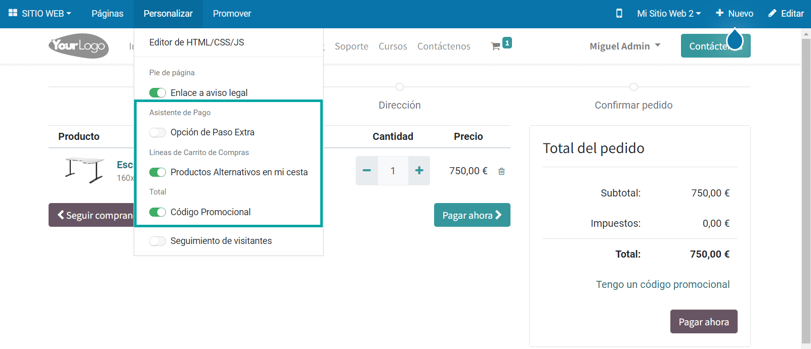

A continuación, se describen dichas opciones:

-  **Opción de Paso Extra**: Añade un paso extra en el proceso de pago para incluir información adicional.

-  **Productos Alternativos en mi Cesta**: Incluye una lista de productos alternativos, relacionados con los productos
   que tienes en la cesta.

-  **Código Promocional**: Incluye un enlace que permite a los clientes añadir un código promocional.

Además, desde el paso de pago de la cesta de la compra, es posible seleccionar la siguiente opción de personalización:

-  **Aceptar Términos y Condiciones**: Obliga a los usuarios a aceptar los términos y condiciones antes de finalizar la compra.

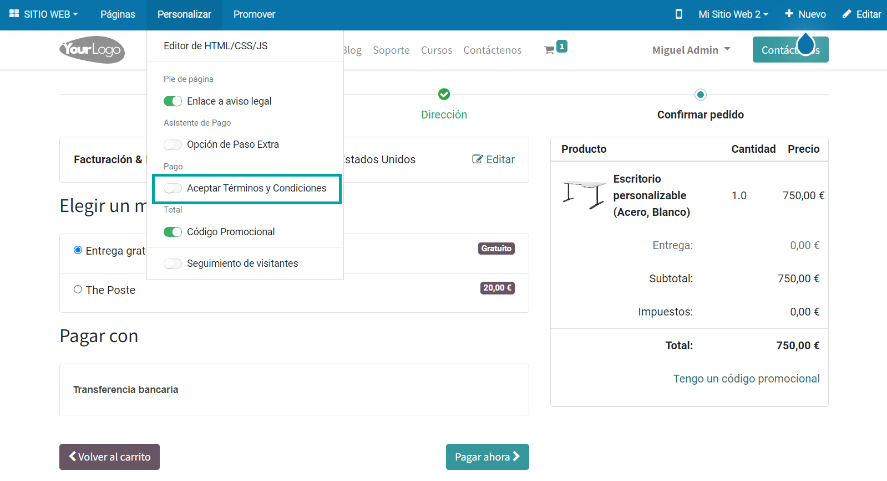

.. _sitios_web/ecommerce/seguimiento_pedidos:

Seguimiento de pedidos
======================

Asignación de pedidos en línea
------------------------------

Es posible definir el equipo de ventas y el comercial al que quedarán asignados los pedidos que se realicen desde la
tienda online. Para ello, navega a la pantalla :menuselection:`Sitio web --> Configuración --> Ajustes` e informa los
campos **Equipo de ventas** y **Comercial** del apartado de *Asignación*:

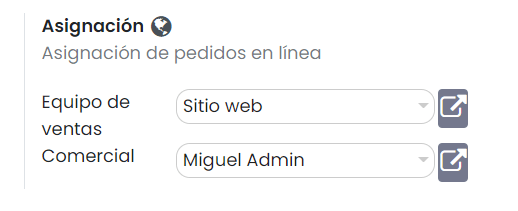

Una vez informados los campos, pulsa el botón *Guardar* de la pantalla de ajustes.

Enviar un correo electrónico al cliente al final del proceso de compra
----------------------------------------------------------------------

El sistema envía un correo electrónico al cliente al final del proceso de compra. Es posible seleccionar una plantilla
de correo para este tipo de envíos. Para ello, navega a la pantalla :menuselection:`Sitio web --> Configuración --> Ajustes`
e informa el campo **Email de Confirmación**:

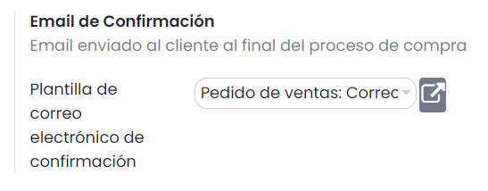

Una vez informado el campo, pulsa el botón *Guardar* de la pantalla de ajustes.

Gestionar los carros abandonados
--------------------------------

Es posible gestionar los carros abandonados del sitio web desde la pantalla :menuselection:`Sitio web --> Pedidos --> Carros abandonados`.
En esta pantalla aparece un listado de los carros o pedidos abandonados por los visitantes del sitio web:

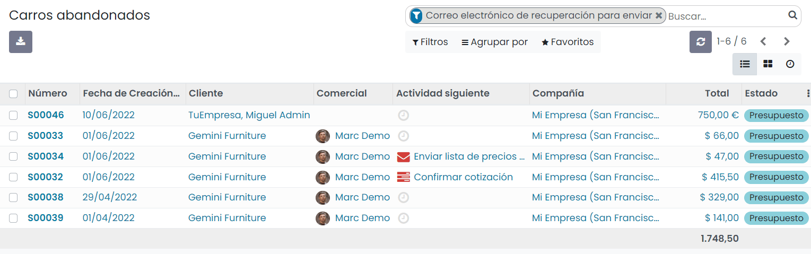

Si accedes al detalle de uno de los pedidos, es posible consultar los detalles de dicho pedido, las diferentes líneas de
pedido, el precio total del pedido, los datos del cliente, etc.

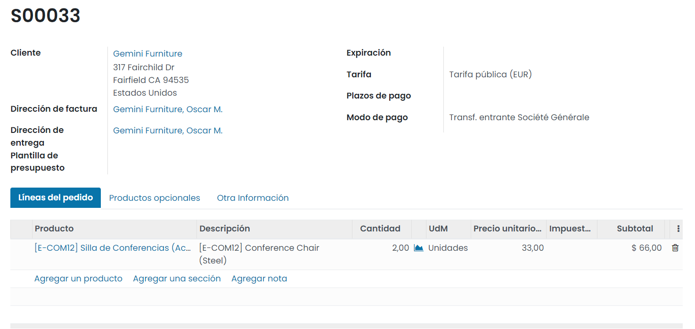

Desde esta pantalla dispones de varias opciones para intentar finalizar el pedido abandonado por el cliente, siempre y
cuando el cliente haya llegado a introducir sus datos de contacto en el formulario del proceso de compra.

Mediante el botón **Enviar un correo electrónico de recuperación**, es posible enviar un correo al cliente:

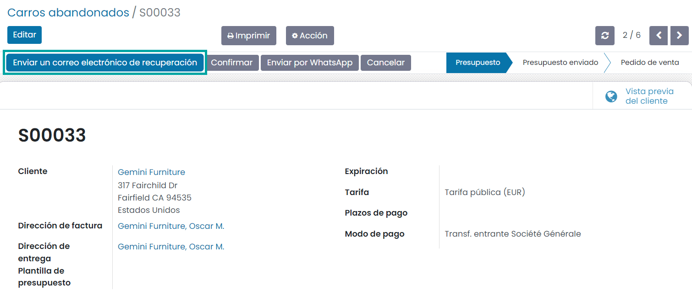

El envío del correo se hace en base a una plantilla especificada en la pantalla :menuselection:`Sitio web --> Configuración --> Ajustes`.
Desde esta pantalla de ajustes también es posible especificar el tiempo tras el cual un carro se considera abandonado:

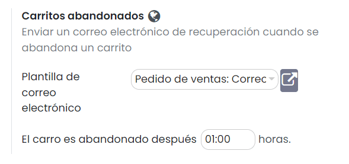

Volviendo al detalle del pedido abandonado, tras pulsar el botón para enviar el correo electrónico de recuperación, se
despliega en pantalla un formulario con el contenido del correo:

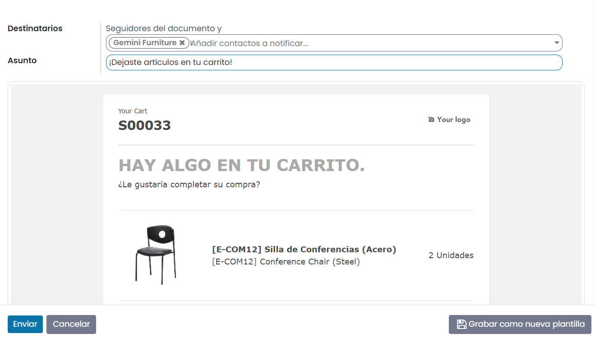

Una vez revisado el contenido del correo, pulsa el botón **Enviar**.

El cliente recibirá un correo para reanudar el pedido, y si está interesado tendrá la opción de pulsar el botón **Reanudar pedido**:

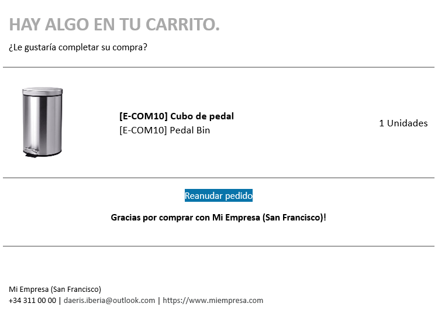

Al reanudar el pedido, el sistema navegará al sitio web, y dará la opción al cliente de recuperar su cesta de la compra:

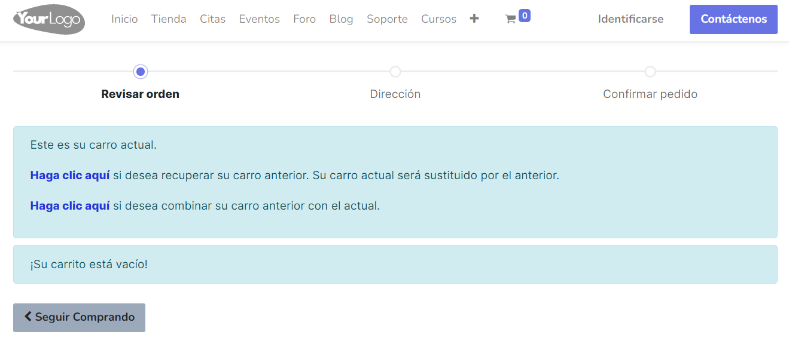

Si el cliente recupera su carro anterior, se añadirán a la cesta los artículos recuperados de su cesta anterior, y podrá
continuar con el proceso de compra:

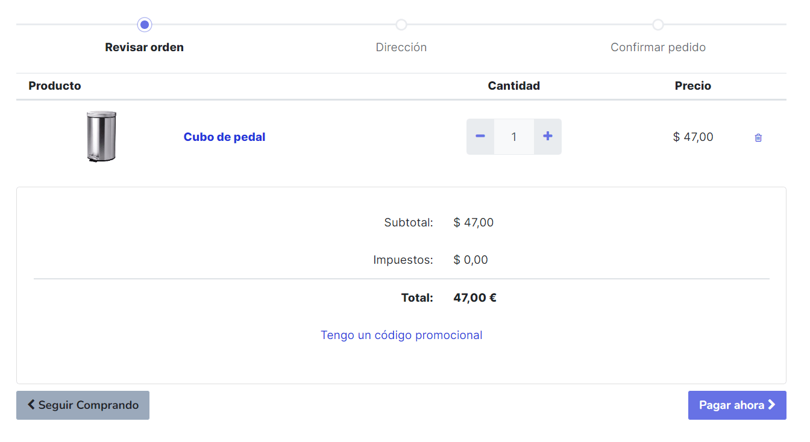

¿Cómo pueden acceder los clientes a su cuenta?
==============================================

Nunca había sido tan fácil que los clientes accedan a su cuenta. Olvídate de los infinitos formularios de registro, Daeris
lo hace tan fácil como aprenderse el ABC. Se sugiere que se registren (nombre, correo electrónico, contraseña) al momento
de realizar el pedido y no antes. De hecho, nada es más molesto que pasar por un proceso de registro antes de comprar algo.

Registrarse
-----------

La invitación a registrarse aparece cuando el cliente finaliza el proceso de compra:

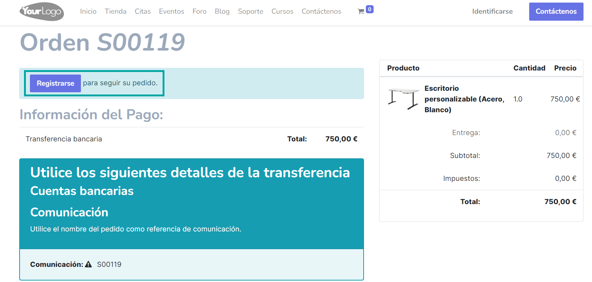

Al pulsar el botón **Registrarse**, el sistema permitirá introducir una contraseña:

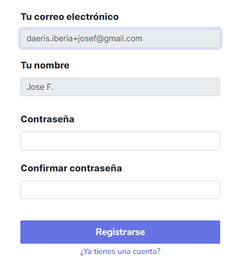

Cuenta del cliente
------------------

Una vez que haya iniciado sesión, el cliente podrá acceder a su cuenta si hace clic en **Mi cuenta** en el menú desplegable
de inicio de sesión:

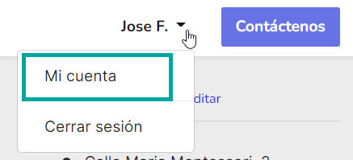

Allí los clientes podrán encontrar todo su historial. La dirección principal (de facturación) también se puede modificar:

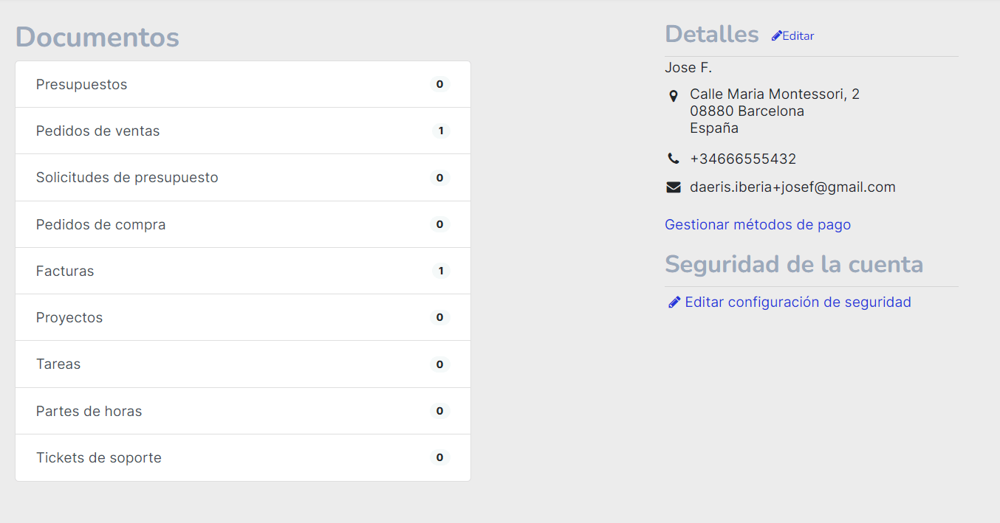

.. note::
   Si el cliente está configurado como contacto de una empresa en tu libreta de direcciones, verá todos los documentos
   de la empresa a la que pertenece.

Cambiar datos de facturación de un cliente
------------------------------------------

Cuando se ha generado una factura para un cliente, si intenta modificar sus datos de facturación desde su portal de clientes,
se encontrará que los campos *Nombre de la compañía* y *NIF* están en modo de solo lectura:

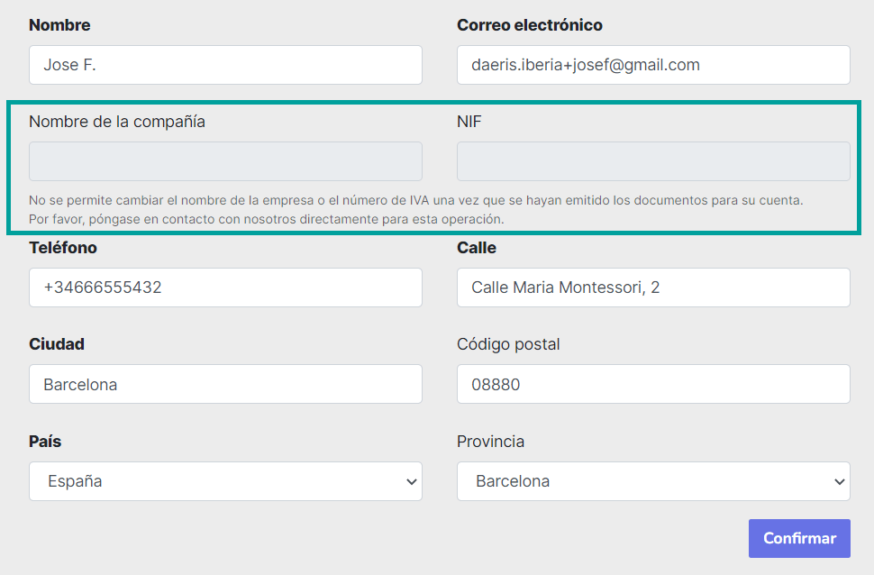

Si el cliente quiere cambiar el nombre de su compañía o su NIF, deberá ponerse en contacto contigo para realizar esta operación.

Una vez recibida la petición del cliente, deberás navegar a la pantalla :menuselection:`Contactos --> Contactos` y buscar
el contacto asociado al cliente:

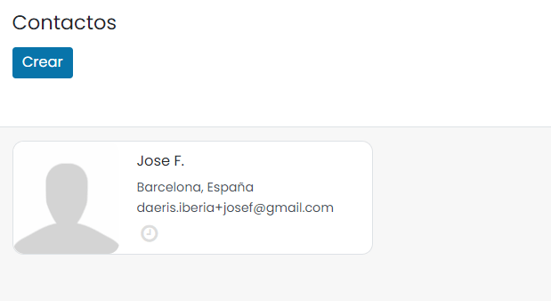

En el detalle del contacto, duplica el registro mediante la opción del menú :menuselection:`Acción --> Duplicar`:

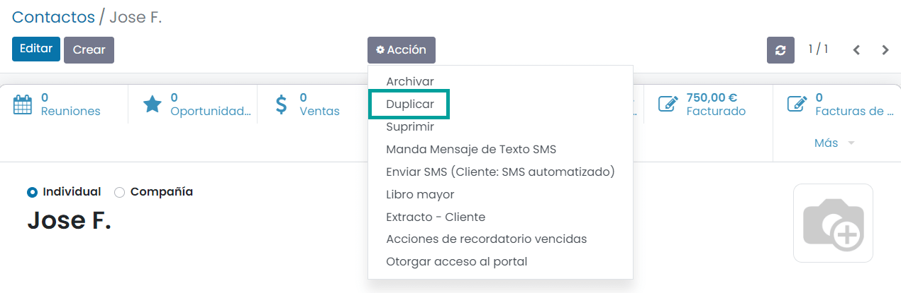

Sobre el contacto duplicado, cambia sus datos de facturación, informando el NIF y/o nombre de compañía asociado. Una
vez hayas modificado sus datos de facturación, concede acceso al nuevo contacto al portal de clientes mediante la opción
del menú :menuselection:`Acción --> Otorgar acceso al portal`:

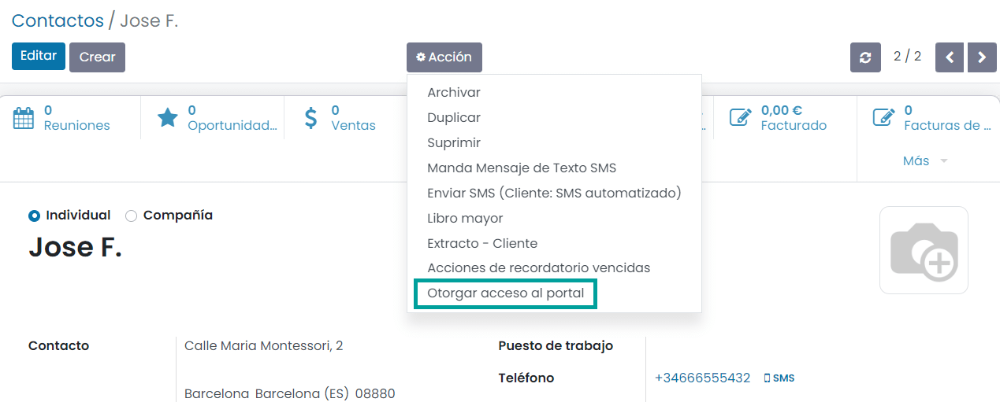

A partir de ese momento, el cliente podrá acceder con su nuevo usuario de portal para hacer sus pedidos y descargar
sus facturas.

.. note::
   Las facturas y pedidos asociadas al usuario de portal antiguo, no se trasladan de forma automática al nuevo usuario,
   por lo que si el cliente quiere consultar dichos documentos, deberá seguir accediendo con el usuario antiguo.