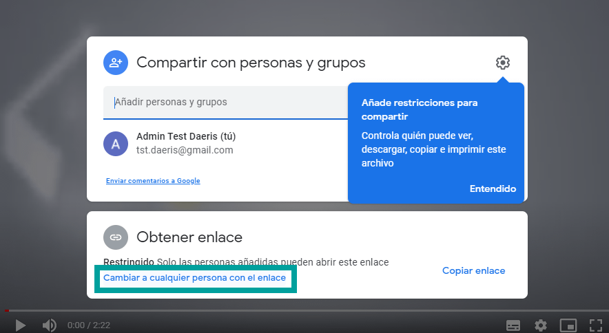

:show-content:

==========
eLearning
==========

La educación en línea o eLearning permite a los docentes y estudiantes participar en un entorno digital
a través de las nuevas tecnologías, haciendo uso intensivo de las facilidades que proporciona Internet y
las tecnologías digitales.

Los dos grandes beneficios que propicia el e-learning son la eliminación de las barreras físicas
y temporales, de espacio y tiempo, y la oportunidad de acceder al aprendizaje permanente a lo largo de
nuestras vidas, adaptado a nuestras necesidades personales.

Daeris dispone de un módulo de **eLearning**. Este módulo puede ser usado para ofrecer formaciones
en línea y puede utilizarse tanto para la venta de cursos online como para la formación de nuestros empleados o seguidores.

Crear un curso de eLearning
=============================

Para crear un curso, navega a la pantalla :menuselection:`Sitio Web --> Tablero --> Analítica` y haz clic sobre el botón *Ir al sitio web*.

Desde la página principal del sitio web, haz clic sobre el menú *cursos*

Sobre el menú superior izquierdo, pulsa el botón *+ Nuevo* y pulsa de nuevo sobre la opción *curso*:

A continuación, sobre el asistente de creación de cursos, puedes informar los siguientes campos:

- **Nombre**: Nombre del curso, que aparece en la lista de cursos del sitio web.
- **Etiquetas**: Lista de etiquetas relacionadas con el curso. Es posible definir etiquetas de cursos navegando a la pantalla :menuselection:`eLearning --> Configuración --> Categorías de los cursos`.
- **Diseño**: Ofrece la posibilidad de seleccionar la forma de visualizar los contenidos del curso. En el caso de seleccionar el tipo *Formación* , nos Permite seguir la secuencia de los contenidos para completar el curso. Se muestra una parrilla inicial agrupada por secciones. En el caso de seleccionar el tipo *Documentación*, aparece una línea de agrupación de contenidos desde donde se puede seleccionar el grupo en base a su tipología.
- **Descripción**: Resumen descriptivo del curso.
- **Permitir que los estudiantes valoren el curso**: Ofrece a los alumnos la opción de valorar el contenido y publicar comentarios sobre el curso.

Una vez informados todos los campos necesarios, pulsa el botón *Guardar*, acción que registrará el curso y navegará a su página web.

Si deseas dar acceso a los visitantes de tu sitio web, debes publicar tu curso. Para ello, pulsa el botón *no publicado* de la barra superior izquierda.

Añadir una sección a un curso
=============================

Las **secciones** son apartados que agrupan contenidos del curso.
Para añadir una nueva sección, pulsa el botón *Añadir sección* que encontrarás sobre la página principal del curso.

.. image:: elearning/añadir-seccion.png
   :align: center
   :alt: Añadir una sección a un curso de elearning

Introduce el nombre de la sección sobre el formulario y pulsa el botón *Guardar*.

La nueva sección quedará registrada y aparecerá sobre la página del curso.

Añadir contenidos
=================

Añadir una presentación a un curso
----------------------------------

Para añadir tus presentaciones como contenidos de un curso de eLearning debes guardarlas previamente como ficheros PDF.
Si dispones de presentaciones en formato Power Point o documentos de Microsoft Word, debes guardarlas en formato PDF, antes
de adjuntarlas en tus presentaciones. En el caso de que quieras subir una imagen, los formatos soportados son JPG y PNG.
Todos los contenidos de tipo imagen serán considerados *Infografías*.

Para añadir una presentación a un curso de eLearning, pulsa el botón *+ Añadir contenido* de la sección que desees, que
encontrarás sobre la página principal del curso.

Selecciona la opción **Presentación** sobre el formulario.

Al seleccionar esta opción, se presentará un nuevo formulario.

Informa los siguientes campos del formulario:

- **Elegir un archivo**: Mediante el botón *examinar*, selecciona un archivo de tipo pdf para presentaciones o imagen (jpg, png) para infografías.
- **Título**: Se recomienda incorporar un texto breve y descriptivo.
- **Sección**: El apartado sobre donde se ubicará el contenido.
- **Etiquetas**: Sirven para complementar la información del contenido.
- **Duración**: Tiempo medio que pasarán los usuarios realizando este contenido.

Por último pulsa el botón *Guardar y Publicar* para volver a la pantalla principal del curso. Tus cambios se registrarán y el contenido será publicado.

Al hacer clic sobre el título del contenido, este se muestra en pantalla completa. Esta pantalla dispone de un asistente desde donde es posible pasar páginas y seguir los contenidos del curso.

.. image:: elearning/presentación-completa.png
   :align: center
   :alt: Presentación en pantalla completa de un curso de elearning

Añadir una página web a un curso
--------------------------------

Para añadir una página web como contenido de un curso de eLearning es necesario crear un contenido de tipo *página web*.
Posteriormente es posible editar el contenido mediante el configurador de sitios web con el cual es posible soltar bloques de creación en tu página y editarlos.

Para crear un nuevo contenido de un curso de eLearning , pulsa el botón *+ Añadir contenido* de la sección que desees, que encontrarás sobre la página principal del curso.

Selecciona sobre el formulario la opción **Página web**.

Al seleccionar esta opción, se presentará un nuevo formulario.

Informa los siguientes campos sobre el formulario:

- **Título**: Se recomienda incorporar un texto breve y descriptivo.
- **Sección**: El apartado sobre donde se ubicará el contenido.
- **Etiquetas**: Sirven para complementar la información del contenido.
- **Duración**: Tiempo medio que pasarán los usuarios realizando este contenido.

Una vez informados los campos necesarios pulsa el botón *Guardar y Publicar* para navegar a la pantalla de edición de la web.
Tus cambios se registrarán, el contenido será publicado y podrás editar la web mediante el gestor de bloques.

Por último, edita tu página con los contenidos que desees usando el gestor de bloques. Recuerda pulsar el botón *Guardar* del menú superior derecho al finalizar tus cambios.

Añadir una video  de YouTube o Google Drive a un curso
------------------------------------------------------

El sistema de eLearning de Daeris permite incorporar videos publicados en YouTube o Google Drive sobre sus contenidos.

Para crear un nuevo contenido de un curso de eLearning , pulsa el botón *+ Añadir contenido* de la sección que desees, que encontrarás sobre la página principal del curso.

Selecciona sobre el formulario la opción **Video**.

Al seleccionar esta opción, se presentará un nuevo formulario.

Informa los siguientes campos sobre el formulario:

- **Enlace a YouTube**: Enlace del video de Youtube que deseas incorporar.
- **Título**: Se pre-informa con el título  del video de YouTube seleccionado. Es posible modificarlo y se recomienda incorporar un texto breve y descriptivo.
- **Sección**: El apartado sobre donde se ubicará el contenido.
- **Etiquetas**: Sirven para complementar la información del contenido.
- **Duración**: Tiempo medio que pasarán los usuarios realizando este contenido. Se pre-informa con la duración del video incorporado sobre el campo enlace.

Por último, pulsa el botón *Guardar y Publicar* para volver a la pantalla principal del curso. Tus cambios se registrarán y el contenido será publicado.

Al hacer clic sobre el título del contenido, este se muestra en pantalla completa. Esta pantalla dispone de un asistente desde donde es posible reproducir el video y seguir los contenidos del curso.

.. important:: Si no deseas compartir tus videos de YouTube de forma pública, ocúltalos. Un video de YouTube "Oculto" o "Unlisted" significa que es un video que solo pueden ver los usuarios con el enlace hacia él. Tu vídeo nunca aparecerá en los resultados de búsqueda ni en tu canal de YouTube.

.. important:: En el caso de usar un video de Google Drive, debes ejecutar la opción "compartir el video a cualquier persona con el enlace" y usar este enlace sobre tu contenido.

Añadir un cuestionario a un curso
---------------------------------

El sistema de eLearning de Daeris permite incorporar cuestionarios sobre sus contenidos. Esta opción ofrece la posibilidad
de que los alumnos pongan a prueba sus conocimientos sobre las lecciones aprendidas.

También es posible incorporar cuestionarios sobre contenidos de otras tipologías (videos, presentaciones, páginas web...) que aparecerán tras finalizar el contenido.

Para crear un nuevo contenido de un curso de eLearning , pulsa el botón *+ Añadir contenido* de la sección que desees, que encontrarás sobre la página principal del curso.

Selecciona sobre el formulario la opción **Cuestionario**.

.. image:: elearning/nuevo-cuestionario.png
   :align: center
   :alt: Añadir un nuevo cuestionario.

Al seleccionar esta opción, se presentará un nuevo formulario.

Informa los siguientes campos sobre el formulario:

- **Título**: Incorporar un texto breve y descriptivo.
- **Sección**: El apartado sobre donde se ubicará el contenido.
- **Etiquetas**: Sirven para complementar la información del contenido.
- **Duración**: Tiempo medio que pasarán los usuarios realizando este contenido.

Por último, pulsa el botón *Guardar y Publicar* para volver a la pantalla principal del curso. Tus cambios se registrarán, aunque el contenido no será publicado, ya que queda pendiente introducir las preguntas y respuestas.

Al hacer clic sobre el título del contenido, este se muestra en pantalla completa.

Haz clic sobre el botón *Salir de pantalla completa* para navegar a la página de detalle del cuestionario.

.. image:: elearning/añadir-prueba.png
   :align: center
   :alt: Pantalla de detalle del Cuestionario

Posteriormente, haz clic sobre el botón *Añadir prueba* para que aparezca el asistente de generación de preguntas y respuestas.

Sobre el apartado *Escribe tu pregunta* debes informar la consulta que deseas realizar.
Sobre los apartados *Escribe tu respuesta* debes indicar varias respuestas.

.. image:: elearning/asistente-preguntas2.png
   :align: center
   :alt: Asistente de generación de preguntas del cuestionario

La respuesta correcta debe indicarse mediante el botón de confirmación. El resto de respuesta se darán como incorrectas.

Para añadir más posibles respuestas pulsa el botón *+* e informa la respuesta.

Si deseas incorporar sobre la respuesta un mensaje, que solo aparecerá si el alumno la selecciona, pulsa el botón *i*. A continuación, informa el mensaje sobre el cajetín inferior.

Por último, pulsa el botón *Guardar*.

Las nuevas preguntas aparecen bajo el contenido del cuestionario.

Puedes añadir tantas preguntas como desees pulsando el botón *+ Añadir pregunta*.

Recuerda pulsar el botón *Publicar* del menú superior izquierdo para publicar tu cuestionario.

Recordamos que los cuestionarios se pueden incorporar sobre contenidos de cualquier tipología (Presentaciones, videos, páginas web...).

Sobre la página de detalle de un contenido, encontrarás el botón *Añadir prueba*. Al pulsarlo aparecerá el asistente de generación de preguntas y respuestas.

Una vez completada la prueba, esta será visible desde el contenido haciendo clic sobre el apartado *prueba*.

Añadir una certificación a un curso
-----------------------------------

El sistema de eLearning de Daeris permite generar exámenes para certificar los conocimientos de los alumnos.
Las certificaciones se han de generar en el backend del sistema. Posteriormente, desde el sitio web, se puede generar
un contenido de tipo certificación, asociándole la certificación previamente creada.

Para crear una nueva certificación , navega a la pantalla :menuselection:`eLearning --> Cursos --> Certificaciones` y haz clic sobre
el botón *Crear*.

.. image:: elearning/pantalla-certificación.png
   :align: center
   :alt: Pantalla de certificaciones de e-learning

A continuación, sobre el formulario de la certificación, informa los siguientes campos:

- **Título de la encuesta/certificación**: Se recomienda incorporar un texto breve y descriptivo.
- **Responsable**: Usuario gestor de la certificación.
- **Imagen**: Imagen descriptiva del contenido de la certificación.

Mediante el enlace *Agregar una sección* puedes incorporar secciones para agrupar las preguntas por diferentes temáticas.

.. image:: elearning/seccion-certificación.png
   :align: center
   :alt: Añadir sección a una certificación de e-learning

Mediante el enlace *Agregar preguntas* puedes incorporar las preguntas y respuestas que compondrán tu certificación. Al pulsar el enlace
se muestra el formulario para generar las preguntas.

.. image:: elearning/certificación-preguntas.png
   :align: center
   :alt: Añadir preguntas a una certificación

La forma de generar las preguntas es exactamente la misma que las preguntas que se realizan en la aplicación de encuestas.

.. image:: elearning/certificación-preguntas2.png
   :align: center
   :alt: Añadir preguntas a una certificación

Puedes obtener más información sobre como generar las preguntas de las encuestas haciendo clic :doc:`aquí <../marketing/encuestas>`.

.. image:: elearning/certificación-preguntas3.png
   :align: center
   :alt: Añadir preguntas a una certificación

Bajo la pestaña *Descripción* debes informar el texto que se mostrará al iniciar la certificación.
Es recomendable incorporar información relevante sobre el examen, así como las pautas que deben seguir.

Bajo la pestaña *Mensaje final* debes informar el texto que se mostrará al finalizar la certificación.
En él, puedes incorporar un mensaje de agradecimiento así como facilitar instrucciones en el caso de que haya o no haya superado la certificación.

.. image:: elearning/certificación-mensaje-fin.png
   :align: center
   :alt: Mensaje final de una certificación

Desde la pestaña opciones, puedes indicar varios parámetros de tu certificación.
Para que las opciones se muestren en su totalidad, haz clic sobre el botón guardar y vuelve a hacer clic sobre el botón editar, posicionándote de nuevo sobre la pestaña opciones.
Desde este apartado puedes informar los siguientes campos:

- **Diseño**: Permite mostrar una página con todas las preguntas, una página por sección o una página por pregunta.
- **Modo de progresión**: Si seleccionamos *Número* se mostrará el número de preguntas respondidas sobre el número total de preguntas por responder. Si se selecciona *porcentaje* mostrará la media de preguntas respondidas.
- **Límite de tiempo**: Al informar esta opción, incorporamos un tiempo máximo para realizar la certificación.
- **Selección**: Si seleccionamos *Aleatorizado por sección* es posible indicar el número de preguntas aleatorias por sección. Este modo no aplica en las sesiones en vivo.
- **Botón de retroceso**: Esta opción permite a los usuarios volver a las páginas anteriores.

- **Modo de acceso**: Esta opción permite dar acceso a la certificación a cualquier persona que disponga del enlace o solamente a aquellos usuarios invitados a realizarla.
- **Necesario iniciar sesión**: Si esta informado, los usuarios deben iniciar sesión, incluso si disponen de un enlace válido.
- **Límite de intentos**: Informando esta opción es posible limitar el número de veces que puede realizar un usuario la certificación.

- **Puntuación**: Esta opción permite indicar si queremos mostrar la puntuación obtenida a los asistentes tras finalizar la certificación, así como mostrar las respuestas.
- **% de Éxito**: Porcentaje de preguntas respondidas correctamente para aprobar la certificación.
- **Es una certificación**: Indicador requerido para tratar la encuesta como una certificación.
- **Plantilla de correo electrónico**: Plantilla de correo que se envía a los usuarios cuando logran la certificación. Anexo, contiene el documento que acredita su certificación.
- **Plantilla de certificación**: Plantilla del documento que acredita la certificación. Es posible seleccionar entre varios modelos, así como previsualizarlos mediante el botón *previsualizar*.
- **Dar medalla**: Mediante esta opción otorgamos una medalla al usuario que logra la certificación. Esta medalla se añade al conjunto de medallas que el usuario dispone en su perfil.
- **Medalla de certificación**: Medalla que acredita la certificación. Mediante el asistente de creación es posible indicar el nombre, el mensaje que enviamos al usuario tras recibir la medalla, una imagen descriptiva, así como el nivel.

- **Recompensa las respuestas rápidas**: Mediante esta opción se recompensa a los usuarios si responden rápidamente a las preguntas.
- **Código de sesión**: Código que el usuario ha de introducir para iniciar la certificación. Es posible incorporar cualquier texto y recomendado cambiarlo para cada certificación.

.. image:: elearning/certificación-opciones.png
   :align: center
   :alt: Opciones de una certificación

Una vez completados los campos necesarios, pulsa el botón *Guardar*.

Para probar que la certificación se ha definido correctamente, pulsa el botón *Prueba*, que te llevará al sitio web a completar una certificación en modo de prueba.

Por último, para añadir la certificación a un curso, navega a la página de Cursos del sitio web.
Desde la página inicial de cursos, se visualizan todos los cursos a los que tienes acceso con el usuario conectado, que podría ser un simple visitante, un cliente registrado o un empleado de tu organización.
En función de las opciones de visibilidad del curso, se aplican unas reglas que determinan el tipo de usuario que puede visualizarlo.

A continuación, accede al detalle de un curso, desde donde se visualizan todos los contenidos (vídeos, páginas web, documentos o infografías), y se puede navegar al detalle de cada uno de ellos.

Para subir una nueva certificación, pulsa el botón *Añadir contenido*.

Esta acción, muestra un formulario donde deberás seleccionar el tipo de contenido  Certificación.

A continuación, se muestra un formulario donde completar los siguientes campos:

- **Certificación**: Certificación de la lista de certificaciones disponibles.
- **Título**: Título del contenido que se preinforma con el nombre de la certificación seleccionada.
- **Sección**: Ubicación sobre la que aparecerá la certificación.
- **Etiquetas**: Etiquetas asociadas al contenido.
- **Duración**: Tiempo medio que pasarán los usuarios realizando este contenido.

Una vez completados todos los campos, es posible pulsar uno de los siguientes botones:

- **Guardar y publicar**: Guarda el contenido y lo publica de forma automática en el curso.
- **Guardar**: Guarda el contenido como borrador para que sea revisado y publicado posteriormente. Esta es la opción recomendada, ya que es la que garantiza una mejor calidad del contenido publicado en el curso.
- **Volver atrás**: Descarta los cambios y se posiciona sobre la pantalla de selección anterior.

.. image:: elearning/formulario-certificación.png
   :align: center
   :alt: Formulario de un contenido de tipo certificación

Una vez publicado, es posible editar el contenido desde el sitio web o también desde el backend, seleccionando la opción deseada.

Gestionar los contenidos de un curso
====================================

Para gestionar los contenidos de un curso, navega a la pantalla :menuselection:`eLearning --> Cursos --> Cursos` y haz clic sobre el número de contenidos:

.. image:: elearning/editar-cursos.png
   :align: center
   :alt: Editar cursos de e-learning

También puedes acceder a la pantalla de contenidos de todos los cursos desde :menuselection:`eLearning --> Cursos --> Contenidos`.
Desde esta pantalla puedes ver la ficha de cada contenido, que contiene la siguiente información:

- **Nombre y descripción del contenido**
- **Etiquetas asociadas al contenido**
- **Tiempo estimado de duración para completar el contenido**
- **Número de preguntas de que dispone el contenido**
- **Numero de visualizaciones**
- **Tipo de contenido**
- **Imagen del gestor**

Al hacer clic sobre un contenido, el sistema navega al formulario de edición, desde donde puedes gestionar su información mediante el botón *Editar*.
Sobre la pestaña *Documento* es posible editar la siguiente información:

- **Título del contenido**: Se recomienda incorporar un texto breve y descriptivo.
- **Etiquetas**: Sirven para complementar la información del contenido.
- **Tipo**: Tipo de contenido.
- **Imagen**: Imagen descriptiva del contenido. En el caso de tratarse de una infografía, es en esta imagen debes incorporar la imagen de tu infografía. Es importante recordar que esta imagen no es posible modificarla desde el sitio web.
- **Subido por**: Usuario gestor del contenido.
- **Duración**: Tiempo medio que pasarán los usuarios realizando este contenido.
- **Permitir previsualizaciones**: Opción que permite visualizar el contenido sin estar registrado en el curso.

Sobre la pestaña *Descripción* es posible informar un texto descriptivo del contenido.

Sobre la pestaña *Recursos adicionales* es posible incorporar enlaces a otras páginas y adjuntar ficheros que sirvan
como información complementaria al contenido.

Sobre la pestaña *Cuestionario* es posible incorporar preguntas y respuestas relacionadas con el contenido, que el usuario
deberá contestar a modo de cuestionario. Sobre el apartado de recompensas es posible indicar los puntos de Karma que
obtendrá el alumno en función del número de intentos que haya necesitado para obtener la respuesta correcta.

Sobre la pestaña *Estadísticas* es posible visualizar estadísticas relacionadas con el contenido como son el número de visualizaciones y de comentarios.

Una vez informados todos los campos necesarios, pulsa el botón *Guardar*.

.. warning:: Es importante recordar que si el contenido es de tipo *infografía* , la imagen de la infografía se ha de incorporar sobre el campo imagen del contenido. No es posible modificarla desde el editor del sitio web.

Vender cursos de eLearning en la tienda online
===============================================

Daeris permite vender los cursos de tipo formación sobre la tienda online, así como en la página de registro de cada curso. De este modo, los estudiantes deberán registrarse en la plataforma y completar el pago para inscribirse en el curso.

Para vender cursos en tu página web, tus visitantes deben poder registrarse en tu plataforma ya que cuando compren el curso, este quedará asociado automáticamente al usuario que realizó la compra.
Para permitir a tus visitantes el darse de alta como usuarios de forma autónoma, debes navegar a la pantalla :menuselection:`Sitio Web --> Configuración --> Ajustes`, e informar el campo *Registro gratis*.

Una vez informado, pulsa el botón *Guardar*.

Para poder vender tu curso, debes incorporarle una serie de opciones.
Para ello, navega a la pantalla :menuselection:`eLearning --> Configuración --> Ajustes`, e informa la opción *vender en ecommerce*,si no lo está ya. Recuerda pulsar el botón *Guardar* para que tus cambios queden registrados.

Posteriormente, navega a la pantalla :menuselection:`eLearning --> Cursos`, y haz clic sobre el nombre del curso que quieres vender.
Sobre la pestaña *Opciones* debes indicar como *política de registro* el valor *en el momento del pago*. Esta acción habilita el campo *producto* el cual debes informar con el nombre del producto que quieres crear.
Se recomienda incorporar el mismo nombre que el curso.

Al pulsar el botón que aparece junto al nombre, es posible editarlo. Por defecto, el producto se crea con los siguientes valores informados:

- **Puede ser vendido**: Informado.
- **Tipo de producto**: Servicio.
- **Política de facturación**: Prepago.

Informa la *imagen*, el *precio de venta* y sus correspondientes *impuestos del cliente* así como el resto de campos que consideres oportunos y pulsa el botón *Guardar*.

.. important::
   Un curso debe estar publicado para que pueda venderse. Si el curso no está publicado no aparecerá la opción de compra correspondiente.

Una vez tu curso esta publicado y relacionado con un producto, aparece la posibilidad de realizar la compra.

El proceso de compra es exactamente el mismo que el de los productos de tu página web.

.. image:: elearning/pagar-curso.png
   :align: center
   :alt: Pagar un curso

Desde tu eCommerce, tus visitantes también pueden realizar la compra del curso.

.. warning::
   Para que un visitante pueda comprar un curso y acceder de forma instantánea tras realizar el pago, el visitante debe registrarse o identificarse con su usuario previamente. Si no realiza esta acción, el curso quedará asociado al contacto vinculado al proceso de compra. Si esto ocurre será necesario que el contacto se registre en nuestra web, para posteriormente, fusionar ambos contactos desde la pantalla de contactos.

Integrar YouTube con los cursos de eLearning
=============================================

Mediante la integración con la API de Google, el módulo de cursos obtiene información de YouTube al compartir
un enlace de cualquiera de estas aplicaciones web, y completa de forma automática los metadatos del enlace
compartido (descripción, transcripción, etc.).

Para obtener una clave API es necesario disponer de una cuenta de Google y seguir los siguientes pasos:

- Navega a la página de `APIs de Google <https://console.developers.google.com/flows/enableapi?apiid=drive,youtube>`_.

- Selecciona un proyecto existente en donde registrar la aplicación o crea uno nuevo, y pulsa el botón *Continuar*:

- El sistema habilita la API y te permite navegar a las credenciales generadas mediante el botón *Ir a las credenciales*:

- Desde la pantalla de añadir las credenciales al proyecto, haz clic en el enlace para crear una clave de API: 0.

- Establece un nombre de la clave API si lo deseas, o deja el nombre por defecto, y pulsa el botón *Crear*:

- Por último, copia la clave API generada:

- Para configurar la API de Google en Daeris, es necesario navegar a la pantalla :menuselection:`Sitio Web --> Configuración --> Ajustes`, e informar la clave API en el campo *Clave API de Google Drive* :

- Una vez informada la clave, pulsa el botón *Guardar* de la pantalla de Ajustes.