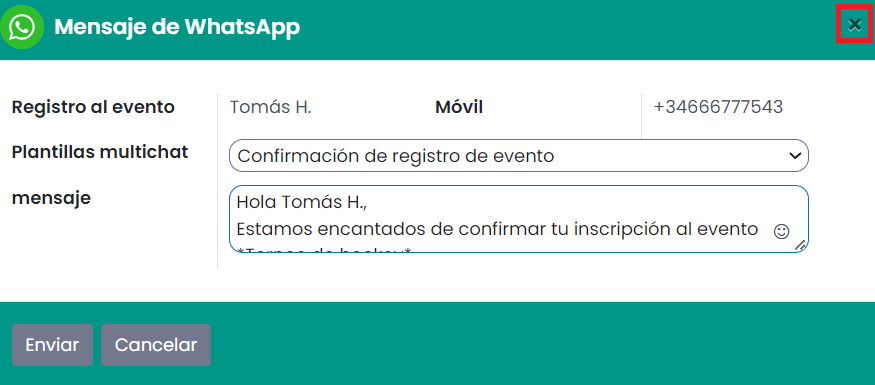

=======
Eventos
=======

La realización de un evento es una de las mejores estrategias de marketing que utilizan las empresas hoy en día para dar
a conocer sus productos y servicios a una gran audiencia. En Daeris, dispones de un sistema de gestión de eventos todo
en uno capaz de realizar todo tipo de eventos. Este módulo se puede manejar y operar fácilmente sin ninguna complicación.
La plataforma fácil de usar que proporciona Daeris en el módulo de gestión de eventos te ayudará a crear nuevos eventos,
publicarlos en el sitio web de la empresa, administrar el registro, vender tickets y muchas más actividades relacionadas
con la planificación y realización de eventos.

Configuración
=============

.. _sitios_web/eventos/eventos/salas:

Crear salas de conferencia virtuales
------------------------------------

Es posible fomentar las interacciones entre los asistentes a los eventos al crear salas de conferencia virtuales. Para
crear salas de conferencia virtuales, navega a la pantalla :menuselection:`Eventos --> Configuración --> Ajustes`
y activa la opción **Salas de chat de la comunidad**:

Una vez marcada la opción, pulsa el botón *Guardar* de la pantalla de ajustes.

Después de activar esta opción, obtendrás el botón de **Salas** en la ventana de creación de eventos, como se muestra a
continuación:

Al pulsar el botón de **Salas** el sistema navega a la pantalla de salas asociadas al evento, donde es
posible crear una nueva sala mediante el botón *Crear*:

Puedes especificar un tema, un resumen y la audiencia de la sala. El evento estará informado por defecto con el nombre
del evento desde el cuál se ha creado la sala. Activa la opción **Está anclado** si quieres que la sala no pueda ser
archivada. Especifica también la capacidad máxima de la sala, así como el idioma.

Una vez informados todos los campos necesarios, pulsa el botón *Guardar*.

El sistema generará un nombre para la sala de chat:

Al pulsar en el botón **Ir a sitio web** el sistema accederá a la sala de chat, donde será posible publicarla mediante
el botón *No publicado*:

.. _sitios_web/eventos/eventos/patrocinadores:

Mostrar patrocinadores y expositores en las páginas de tu evento
----------------------------------------------------------------

Para mostrar patrocinadores y expositores en las páginas de tu evento, navega a la pantalla :menuselection:`Eventos --> Configuración --> Ajustes`
y activa la opción **Expositores en línea**:

Una vez marcada la opción, pulsa el botón *Guardar* de la pantalla de ajustes.

Después de activar esta opción, obtendrás el botón de **Patrocinadores** en la ventana de creación de eventos, como se muestra a
continuación:

Al pulsar el botón de **Patrocinadores** el sistema navega a la pantalla de patrocinadores asociados al evento, donde es
posible crear un nuevo patrocinador mediante el botón *Crear*:

Puedes especificar el nombre del patrocinador, el slogan, una fotografía y datos de contacto, como el contacto asociado,
correo electrónico, teléfono, móvil y sitio web. El evento estará informado por defecto con el nombre del evento desde
el cuál se ha creado el patrocinador. También puedes seleccionar un nivel de patrocinio, y el tipo de patrocinador, que
permite seleccionar entre *Patrocinador*, *Expositor* o *Expositor Online*. Por último, si activas la opción de
*Mostrar en el pie de página*, el patrocinador se mostrará en el pie de página del evento:

Una vez informados todos los campos necesarios, pulsa el botón *Guardar*.

.. _sitios_web/eventos/eventos/stands:

Crear stands y gestionar sus reservas
-------------------------------------

Mientras realizas eventos, puedes alquilar puestos a otras empresas comerciales para promocionar sus productos y servicios.
Para configurar los stands para un evento, primero debes habilitar la opción **Gestión de stands** desde la pantalla
:menuselection:`Eventos --> Configuración --> Ajustes`:

Una vez marcada la opción, pulsa el botón *Guardar* de la pantalla de ajustes.

Después de activar esta opción, obtendrás el botón de **Stands** en la ventana de creación de eventos, como se muestra a
continuación:

Al pulsar el botón de **Stands** el sistema navega a la pantalla de stands asociados al evento, donde es posible crear
un nuevo stand mediante el botón *Crear*:

.. image:: eventos/gestion-stands-3.png
   :align: center
   :alt: Gestión de stands en eventos (3)

Puedes especificar el nombre, la categoría del stand y los detalles del arrendatario en los campos respectivos. Los
detalles del arrendatario incluyen el nombre del arrendatario, el correo electrónico, el teléfono y el número de móvil:

Una vez informados todos los campos necesarios, pulsa el botón *Guardar*.

.. _sitios_web/eventos/vender_entradas:

Activar la venta de entradas de eventos
---------------------------------------

Para activar la venta de entradas de eventos, navega a la pantalla :menuselection:`Eventos --> Configuración --> Ajustes`.
Ahí dispones de las las opciones **Tickets** y **Venta de tickets en línea**. Estas opciones te ayudarán a vender entradas
con pedidos de venta y en tu sitio web, respectivamente:

Una vez marcadas esas opciones, pulsa el botón *Guardar* de la pantalla de ajustes.

Ahora, puedes configurar entradas para los eventos en la pestaña **Tickets** de la ventana de creación de eventos:

Usando el botón *Agregar línea*, puedes seleccionar tickets para el evento. Antes de eso, puedes configurar el ticket
para el evento como un producto en Daeris. Al configurar el ticket, puedes establecer el tipo de producto como *Ticket evento*:

Puedes agregar estos tickets en la pestaña **Tickets**. Especifica el precio, las fechas de inicio y finalización de las
ventas y el número máximo de entradas disponibles en los campos respectivos. Obtendrás la cantidad de tickets confirmados
y no confirmados en esta pestaña cuando los usuarios reserven tickets en tu sitio web.

.. _sitios_web/eventos/cuestionarios:

Consultar a los usuarios cuando se registren online
---------------------------------------------------

Cuando los asistentes se registran en línea para el evento, puedes hacerles ciertas preguntas. Por ejemplo, si tu empresa
decidió distribuir alimentos para los asistentes, puedes preguntarles si son vegetarianos o no vegetarianos al registrarse
en línea. Puedes informar estas preguntas en la pestaña **Cuestionario** en la ventana de creación de eventos. Para obtener
esta pestaña, debes activar la opción **Cuestionario** desde la pantalla :menuselection:`Eventos --> Configuración --> Ajustes`:

Una vez marcada esa opción, pulsa el botón *Guardar* de la pantalla de ajustes.

Después de activar esta opción, la ventana de creación de eventos mostrará la pestaña **Cuestionario** como se muestra
en la imagen a continuación:

Haz clic en la opción *Agregar línea* para agregar preguntas y aparecerá una ventana emergente:

Especifica la pregunta en el campo dado. Si se activa **Pregunte solo una vez por pedido**, esta pregunta se hará solo una
vez y su valor se propagará a todos los asistentes. Puedes establecer el **Tipo de pregunta** como *Selección* o *Entrada de texto*.
En el tipo *Selección*, puedes informar las respuestas para seleccionar en la pestaña **Respuestas**.

Utiliza el botón *Guardar y cerrar* para guardar la pregunta.

.. _sitios_web/eventos/eventos/plantillas:

Configurar plantillas del evento
--------------------------------

En Daeris, puedes configurar plantillas adecuadas para eventos desde la pantalla :menuselection:`Eventos --> Configuración --> Plantilla del evento`.
Puedes usar estas plantillas mientras creas un nuevo evento. Según el tipo de evento, puedes crear varias plantillas en
esta plataforma. Como puedes ver en la captura de pantalla a continuación, puedes usar una de las plantillas dadas o
personalizar una nueva plantilla para tu evento:

Puedes crear nuevas plantillas con el botón *Crear*:

El nombre de la nueva plantilla se puede informar en el campo *Plantilla de evento*. Los demás campos son los mismos que
los de la ventana de creación de nuevos eventos. Puedes completar la plantilla proporcionando detalles sobre *Tickets*,
*Comunicación*, y *Notas*. Puedes usar estas plantillas recién creadas para eventos cuando creas un nuevo evento que
pertenece a la misma categoría.

Una vez informados los campos necesarios, pulsa el botón *Guardar*.

.. _sitios_web/eventos/eventos/etapas:

Configurar las etapas del evento
--------------------------------

Es fácil categorizar y organizar eventos en el módulo de eventos asignándoles diferentes etapas según el proceso por el
que están pasando. Desde la pantalla :menuselection:`Eventos --> Configuración --> Etapas del evento` es posible crear
nuevas etapas para el evento. Todas las etapas configuradas para eventos en el módulo de eventos se pueden ver desde
esta pantalla:

Usa el botón *Crear* para agregar una nueva etapa:

En el **Nombre de la etapa**, informa su nombre. Al activar la opción **Etapa final**, Daeris moverá automáticamente los
eventos terminados a esta etapa. Si deseas plegar esta etapa en la vista kanban, puedes activar la opción **Doblado en Kanban**.
Establece el número de **Secuencia** de esta etapa en el campo correspondiente. Puedes establecer varias etiquetas para
esta etapa y agregar una descripción sobre esta etapa en el campo **Descripción**.

Haz clic en el botón *Guardar* después de completar todos los campos.

.. _sitios_web/eventos/eventos/categorias_etiquetas:

Configurar las categorías de etiquetas de evento
------------------------------------------------

Daeris te permite agregar etiquetas adecuadas para los eventos en el módulo de eventos. Estas etiquetas te ayudarán a
categorizar eventos fácilmente y puedes usar las etiquetas aplicadas para buscar un evento en particular. Para configurar
las categorías de etiquetas navega a la pantalla :menuselection:`Eventos --> Configuración --> Categorías de etiquetas de evento`:

La lista incluye el nombre de la categoría, las etiquetas incluidas en cada categoría y también muestra si la categoría
de la etiqueta está visible en el sitio web o no. Ahora, con el botón *Crear*, puedes crear fácilmente una nueva categoría
para las etiquetas:

Puedes informar el nombre de la categoría de la etiqueta y activar la opción **Mostrar en el sitio web** para que la
categoría de la etiqueta sea visible en el sitio web. Con la opción *Agregar línea*, puedes agregar etiquetas en esta
categoría. Selecciona los colores adecuados para cada etiqueta incluida en esta categoría.

Finalmente, puedes usar el botón *Guardar* para agregar esta nueva categoría a la lista existente.

.. _sitios_web/eventos/eventos/reglas_clientes:

Configurar reglas de generación de clientes potenciales
-------------------------------------------------------

A partir de los detalles de los asistentes registrados para un evento, puedes generar fácilmente clientes potenciales en
Daeris. Para establecer reglas para la generación de clientes potenciales, puedes navegar a la pantalla
:menuselection:`Eventos --> Configuración --> Generación de Clientes Potenciales`:

En esta lista obtendrás los detalles sobre el nombre de la regla, el tipo de generación de clientes potenciales, cuándo
crear el cliente potencial, las categorías de eventos, el evento y la compañía asociada. Usa el botón *Crear* para
establecer una nueva regla de generación de clientes potenciales:

Inicialmente, introduce el nombre de la regla en el campo correspondiente. Puedes generar clientes potenciales por
asistente o por pedido. El cliente potencial se puede crear de forma manual o automática cuando se crean, confirman o
atienden los asistentes. Puedes informar una categoría de evento, compañía y evento en particular, de modo que Daeris
pueda activar esta regla en todos los asistentes incluidos en la categoría de evento, compañía y evento mencionados. Con
la opción *Añadir filtro*, también puedes establecer condiciones para filtrar a los asistentes. Para asignar los clientes
potenciales creados a un equipo de ventas y un vendedor en particular, puedes informarlos en los campos especificados.
Del mismo modo, también puedes informar etiquetas para los clientes potenciales.

Con el botón *Guardar*, puedes guardar la regla de generación de clientes potenciales recién creada.

Gestión de eventos
==================

Crear un evento
---------------

Cuando abras el módulo de **Eventos**, llegarás al panel principal, que mostrará todos los eventos configurados en esta
plataforma. Dispondrás de vistas tipo kanban, calendario, lista, pivote y gráfico para la plataforma de eventos:

Los eventos se organizan en diferentes etapas en la vista kanban. Obtendrás una idea exacta sobre la progresión del evento
colocándolos en las etapas adecuadas.

La vista previa de los eventos mostrará el nombre del evento, la ubicación, la fecha y la hora, y la cantidad de
asistentes esperados y confirmados. También puedes ver la imagen del empleado que creó ese evento. El ícono del reloj en
cada evento te ayudará a programar actividades para ese evento en particular:

Si deseas agregar un nuevo evento directamente debajo de una etapa específica, puedes hacer clic en el ícono **+** que
se encuentra en el lado derecho del título de la etapa. Puedes especificar el nombre del evento y la fecha de inicio y
finalización en los espacios proporcionados. Al hacer clic en el botón *Añadir*, se agregará el evento en la etapa
respectiva y el botón *Editar* te ayudará a editar el evento:

También puedes crear nuevos eventos haciendo clic en el botón *Crear*:

Puedes especificar el nombre del evento en el campo **Nombre del evento**. Informa la fecha de inicio y finalización del
evento, la zona horaria, la plantilla de evento adecuada, las etiquetas, el organizador del evento, el empleado responsable
del evento, la empresa, el sitio web para restringir la publicación del evento al sitio web especificado y la sede en los
campos correspondientes. Puedes cargar un mapa de la exposición utilizando la opción *Suba su archivo*. Al activar la
opción **Limitar registros**, obtendrás un campo adicional para especificar el número máximo de asistentes. El registro
se confirmará automáticamente al momento de la creación al habilitar la opción **Autoconfirmación**.

La pestaña de **Tickets** aparecerá solamente en caso de haber activado la opción de :ref:`Tickets <sitios_web/eventos/vender_entradas>`
en la pantalla de ajustes.

También es posible definir una serie comunicaciones (correos o SMS) para que se envíen a los usuarios del evento en
diferentes momentos de tiempo. Para ello, debes navegar a la pestaña **Comunicación**, y agregar los registros correspondientes:

La pestaña de **Cuestionarios** aparecerá solamente en caso de haber activado la opción de :ref:`Cuestionarios <sitios_web/eventos/cuestionarios>`
en la pantalla de ajustes.

La pestaña **Notas** se puede usar para mencionar información adicional sobre el evento y las instrucciones de la entrada:

.. image:: eventos/notas-evento.png
   :align: center
   :alt: Notas del evento

Una vez dispones de toda la información del evento completada, debes pulsar el botón *Guardar* en el formulario del evento.

.. _sitios_web/eventos/invitar_personas_evento:

Invitar personas al evento
--------------------------

Una vez creado el evento, obtendrás el botón **Invitar**, que se puede usar para invitar a los participantes al evento:

.. image:: eventos/invitar-evento.png
   :align: center
   :alt: Invitar a evento

Este botón te lleva a una nueva ventana como se muestra a continuación:

Puedes crear un correo de invitación o SMS en esta plataforma, tal y como se detalla en los módulos de **Marketing por correo electrónico**
y **Marketing por SMS**.

Publicar un evento
------------------

Para publicar un evento debes pulsar el botón **Ir a sitio web** de la página de detalle del evento:

Una vez revisado el evento, debes pulsar el botón de publicación ubicado en la parte superior derecha del menú:

A partir de ese momento el evento quedará publicado y accesible para los usuarios del sitio web.

Registrarse en un evento
------------------------

Los usuarios del sitio web pueden registrarse en los eventos publicados accediendo al detalle de los mismos. Desde el
apartado de registro, deben pulsar el botón **Registro**:

.. note::
   En el caso de registrarse a un evento de pago, el sistema añadirá el ticket de entrada al carrito de la compra, e
   iniciará un nuevo proceso de compra online, para lo cual se debería haber configurado previamente el módulo de tienda
   online (eCommerce).

Para los eventos gratuitos, se desplegará un formulario en donde poder completar la información requerida. Si habías
especificado alguna pregunta en el apartado de cuestionario, también aparecerá dicha pregunta para que pueda ser
seleccionada por los usuarios. Una vez completada la información, deben pulsar el botón **Siguiente**:

El sistema mostrará un mensaje de confirmación, junto con los detalles del evento, y permitirá añadir el evento a
*Calendario de Outlook* y *Google Calendar*:

Personalizar la página de eventos
---------------------------------

Desde la página principal de eventos del Sitio Web dispones de una serie de opciones para personalizar la página de eventos.
Estas opciones están disponibles desde el menú :menuselection:`Personalizar` ubicado en la parte superior izquierda de la
pantalla:

Las opciones relacionadas con la página de eventos son las siguientes:

-  **Mostrar Barra Lateral**: Muestra una barra lateral en la parte derecha de la pantalla con información y fotografías
   acerca del evento. Al activar esta opción, se habilitan nuevas opciones de personalización:

   -  **Acerca de**: Muestra una sección con información acerca del evento.

   -  **Eventos del País**: Muestra una sección con información acerca de los eventos de tu país.

   -  **Síguenos**: Muestra una sección con enlaces a redes sociales del evento.

   -  **Fotos**: Muestra una sección con fotografías del evento.

   -  **Citas**: Muestra una sección con una cita de uno de tus asistentes al evento para dar confianza en tus eventos.

-  **Filtrar por País**: Incluye un apartado que permite filtrar por los diferentes países de los eventos.

-  **Filtrar por Fecha**: Incluye un apartado que permite filtrar por las diferentes fechas de los eventos.

-  **Diseño de Tarjetas**: Modifica el diseño de los eventos mostrados en pantalla para que se muestren en forma de tarjetas.

-  **Diseño de Columnas**: Modifica el diseño de los eventos mostrados en pantalla para que se muestren en varias columnas.

-  **Mostrar Plantillas**: Muestra los nombres de las plantillas de los eventos encima de los mismos.

Por otro lado, desde la página de detalle de un evento del Sitio Web, dispones de otra serie de opciones para personalizar
la página de detalle de los eventos. Estas opciones están disponibles desde el menú :menuselection:`Personalizar` ubicado
en la parte superior izquierda de la pantalla:

Las opciones relacionadas con la página de detalle de los eventos son las siguientes:

-  **Submenú evento**: Genera un submenú en la página de detalle del evento con las opciones *Introducción*, *Ubicación*,
   *Expositores*, *Comunidad*, *Consigue un stand* y *Registro*, en función de las diferentes características instaladas.

-  **Patrocinadores**: Muestra una sección con los diferentes patrocinadores del evento.

-  **Doblar los detalles del ticket**: Por defecto, dobla los detalles del ticket del evento.

.. _sitios_web/eventos/contactar_personas_evento:

Contactar con los asistentes del evento
---------------------------------------

Para contactar con los asistentes del evento, debes acceder al detalle del evento en :menuselection:`Eventos --> Eventos`,
y hacer clic en el botón **Contactar con los asistentes** ubicado en el formulario de detalle del evento:

Este botón te lleva a una nueva ventana como se muestra a continuación:

Puedes crear un correo de invitación o SMS en esta plataforma, tal y como se detalla en los módulos de **Marketing por correo electrónico**
y **Marketing por SMS**.

.. _sitios_web/eventos/enviar_whatsapp_asistentes_evento:

Enviar un mensaje de WhatsApp a los asistentes del evento
---------------------------------------------------------

.. seealso::
   * :doc:`../../varios/whatsapp`

Es posible enviar un WhatsApp a un asistente del evento desde el formulario de asistentes al evento. Para ello, debes navegar a la
pantalla :menuselection:`Eventos --> Eventos`, y acceder al detalle de un evento. Mediante el botón inteligente de
**Asistentes** el sistema navegará al listado de asistentes al evento, donde podrás acceder al detalle de un asistente
haciendo clic sobre cualquier registro.

Desde esta pantalla, aparecerá un botón que permitirá enviar un mensaje de WhatsApp:

.. note::
   El número de teléfono móvil del asistente debe estar informado con formato internacional (por ejemplo, +33123456789).

El sistema desplegará un formulario desde donde podrás redactar el mensaje de WhatsApp o seleccionar una plantilla que
informe el mensaje de forma automática:

Una vez informado el mensaje, debes pulsar el botón *Enviar*.

En caso de estar conectado a la aplicación mediante un dispositivo de escritorio, el sistema tratará de establecer
conexión mediante la aplicación WhatsApp Web, para lo cual, habrá que escanear el código QR mostrado en pantalla, e
iniciar sesión en tu cuenta de WhatsApp.

Por otro lado, en caso de estar conectado a la aplicación mediante un dispositivo móvil, el sistema tratará de enviar
el mensaje mediante la aplicación WhatsApp instalada en el dispositivo.

Una vez enviado el mensaje desde WhatsApp, cierra la ventana del mensaje mediante la cruz ubicada en la parte superior
derecha del formulario:

Confirmar y registrar la asistencia de personas al evento
---------------------------------------------------------

Para confirmar la asistencia de personas al evento, será necesario acceder al detalle del evento en :menuselection:`Eventos --> Eventos`,
y hacer clic en el icono de **Asistentes** ubicado en el formulario de detalle del evento:

Esto te llevará a la pantalla de asistentes al evento:

Para confirmar la asistencia de las personas al evento, puedes acceder al detalle de los asistentes y pulsar el botón
**Confirmar**:

Del mismo modo, si quisieras cancelar el registro de un asistente, lo podrías hacer mediante el botón **Cancelar registro**:

Para registrar la asistencia de las personas al evento, los asistentes deben estar confirmados y debe haber llegado la
fecha de inicio del evento. Si se cumplen esas dos premisas, puedes pulsar el botón **Asistido**:

El estado del asistente cambiará a *Asistido*:

Informes
========

En el módulo de eventos de Daeris, puedes crear informes sobre los eventos creados en este módulo y los asistentes que
participan en los eventos. Al proporcionar funciones de informes, Daeris garantiza una plataforma útil para analizar el
desempeño de la empresa en la realización de eventos. Puedes mejorar tus estrategias de trabajo y elegir nuevos métodos
para mejorar la productividad analizando los informes creados en esta plataforma.

Eventos
-------

El informe de **Análisis de eventos** proporciona vistas de tipo pivote y gráficas:

Puedes utilizar medidas adecuadas para tu informe desde la opción *Medidas*. Obtendrás el número de asientos reservados,
asientos disponibles, máximo de asistentes permitidos, número de asistentes y reservas de asientos sin confirmar. También
puedes usar la opción *Filtros* y *Agrupar por* para expandir los datos disponibles en el informe. También puedes utilizar
estas opciones en la vista gráfica:

Asistentes
----------

La vista pivote del informe de asistentes mostrará el número de asistentes que participaron en cada evento:

También tienes disponibles las vistas de tipo gráfico, kanban y lista:

.. seealso::
   * :ref:`productividad/informes/analizar_datos`