===================
Sesiones de eventos
===================

En el módulo de **Eventos** de Daeris, es posible aceptar propuestas de charlas de diferentes oradores y publicar la
agenda del evento en tu sitio web. El menú **Sesiones de eventos** en el módulo de eventos registrará todas las sesiones
de los eventos publicados en el sitio web.

.. _sitios_web/eventos/sesiones/horario:

Administrar y publicar un horario con sesiones
==============================================

Para activar esta funcionalidad, navega a la pantalla :menuselection:`Eventos --> Configuración --> Ajustes` y activa
la opción **Horario y Sesiones**:

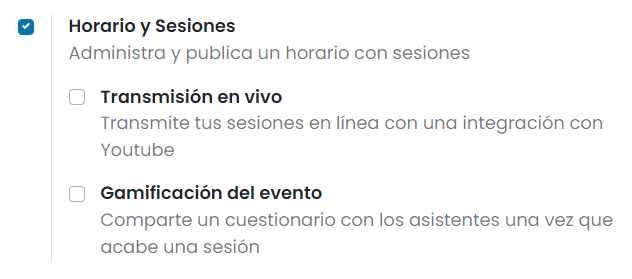

Una vez marcada la opción, pulsa el botón *Guardar* de la pantalla de ajustes.

Después de activar esta opción, obtendrás el botón de **Sesiones** en la ventana de creación de eventos, como se muestra a
continuación:

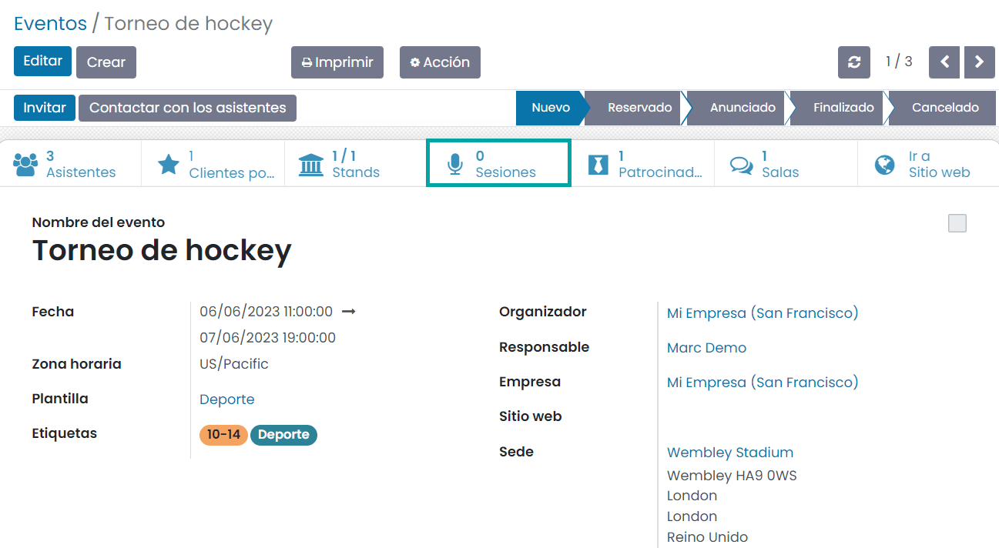

Esto te llevará al listado de sesiones del evento, desde donde podrás crear una nueva sesión en la agenda mediante el
botón *Crear*:

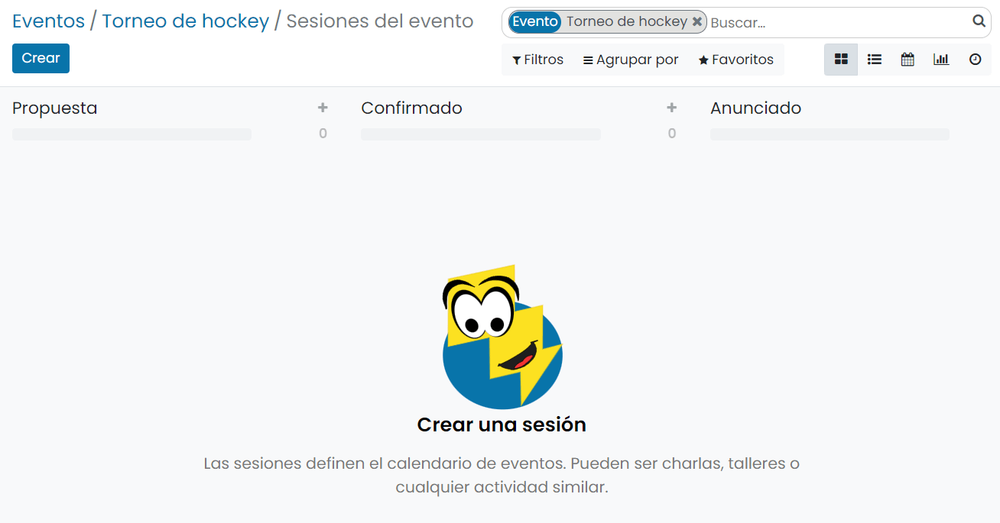

Será necesario completar los detalles de la sesión, como se indica a continuación. En el campo título, informa el
título de la sesión del evento. Del mismo modo, informa la fecha de la sesión, la ubicación y la duración de
la sesión en los campos correspondientes. Al activar la opción *Siempre en lista de deseos*, la charla se establecerá
como favorita para cada asistente registrado en el evento. Agrega el nombre del empleado responsable, el evento,
las etiquetas adecuadas y el color en los campos respectivos:

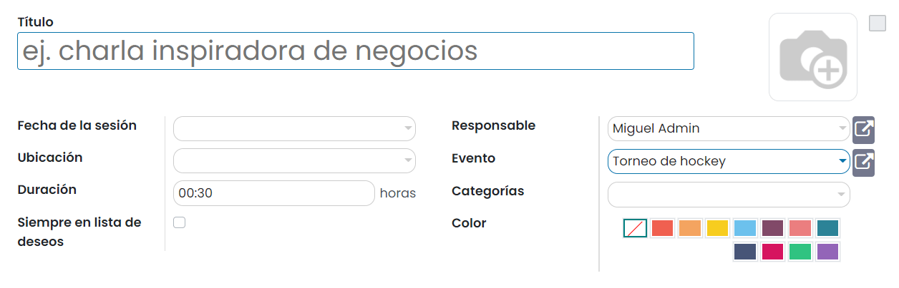

En la pestaña **Ponente**, puedes agregar información sobre el orador de esta charla. Esto incluye detalles de contacto
y biografía del orador. Puedes especificar el nombre del contacto, el correo electrónico y el número de teléfono en el
apartado de detalles del contacto. La biografía del orador incluye el nombre del orador, el correo electrónico, el
teléfono, el puesto de trabajo, el nombre de la empresa y la biografía. También puedes cargar una imagen del orador en
el campo indicado:

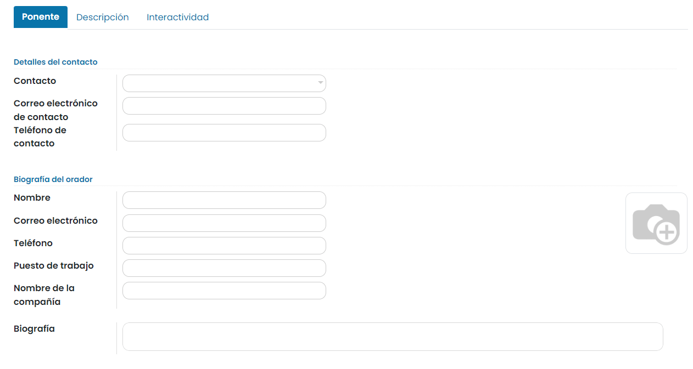

La pestaña **Descripción** se puede usar para incluir instrucciones e información importante relacionada con la charla.

En la pestaña **Interactividad**, dispones de una opción llamada **Botón mágico**. Al activar esta opción, Daeris mostrará
una llamada a la acción a tus asistentes mientras asisten a tu charla. En esta pestaña, puedes especificar el título del
botón, la URL de destino del botón y el tiempo de aparición del botón:

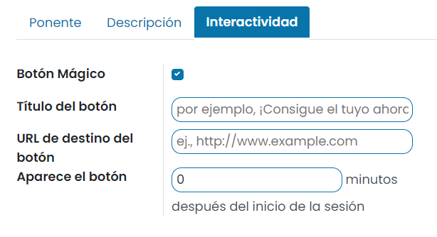

Ahora, puedes hacer clic en el botón *Guardar* para guardar la sesión recién creada.

Para publicar una sesión del evento debes pulsar el botón **Ir a sitio web** de la página de detalle de la sesión:

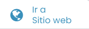

Una vez revisada la sesión del evento, debes pulsar el botón de publicación ubicado en la parte superior derecha del menú:

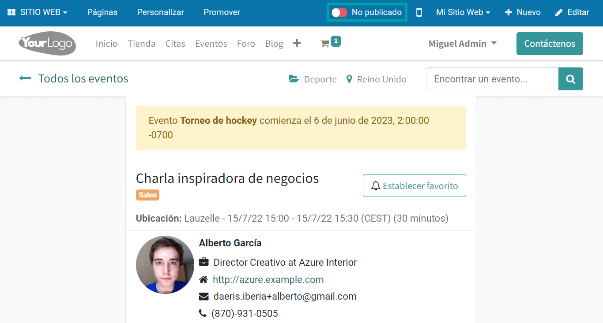

A partir de ese momento la sesión del evento quedará publicada y accesible para los usuarios del sitio web.

Proponer una sesión para un evento
==================================

Existe la posibilidad de que los usuarios del sitio web propongan sesiones para los eventos. Los usuarios dispondrán de
una opción en el menú de navegación del evento en el sitio web para proponer charlas, llamado **Propuestas de charlas**.
Esto te llevará al siguiente formulario que los usuarios podrán rellenar para proponer sus charlas para el evento en cuestión:

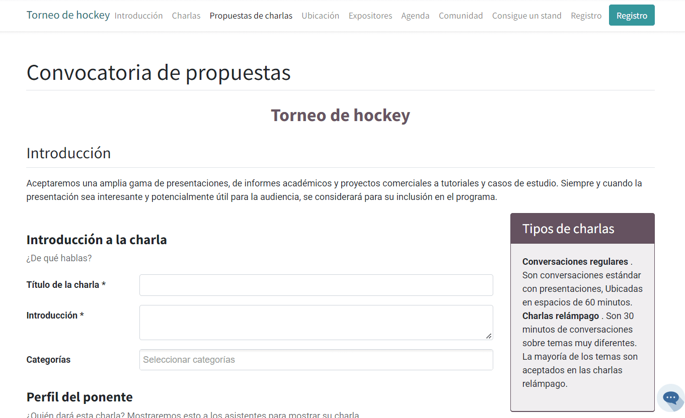

.. note::
   Para que aparezca el submenú de **Propuestas de charlas** en la página de detalle del evento, debes activar la opción
   de personalización **Submenú evento**, disponible en el menú *Personalizar* del sitio web.

El orador puede informar los detalles de la charla en la sección de **Introducción a la charla**. Esta sección incluye
el título de la charla, la introducción de la charla y las categorías de la charla.

En el **Perfil del ponente**, el usuario puede informar el nombre, el correo electrónico, el teléfono, el cargo y la
biografía del orador y cargar una imagen del orador en el campo de foto. Al activar la opción *Póngase en contacto conmigo a través de un correo electrónico / teléfono diferente*,
el usuario obtendrá campos adicionales para introducir información de contacto complementaria:

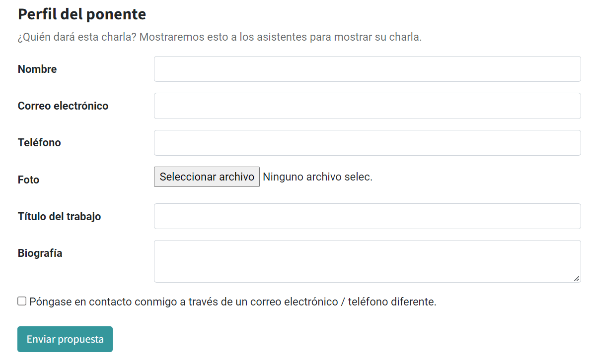

Haz clic en el botón **Enviar propuesta** para enviar la propuesta de sesión.

.. _sitios_web/eventos/sesiones/sesion_youtube:

Transmitir tus sesiones en línea con una integración con Youtube
================================================================

Para transmitir tus sesiones en línea con una integración con Youtube, navega a la pantalla :menuselection:`Eventos --> Configuración --> Ajustes`
y activa la opción **Transmisión en vivo**:

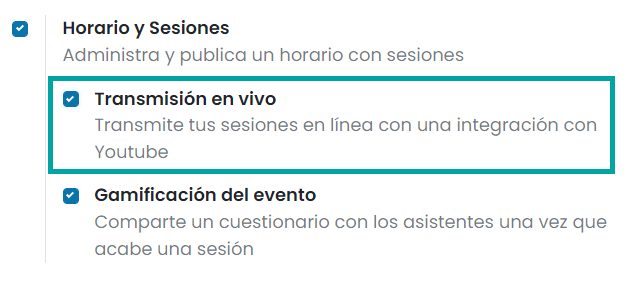

Una vez marcada la opción, pulsa el botón *Guardar* de la pantalla de ajustes.

Ahora, puedes ver nuevos campos en la ventana de creación de tu sesión del evento. Puedes informar la URL del video de
YouTube de la sesión en el campo especificado, para que los asistentes puedan ver la sesión en YouTube. Si el video ya
está disponible en YouTube, puedes activar la opción **Disponible en YouTube**:

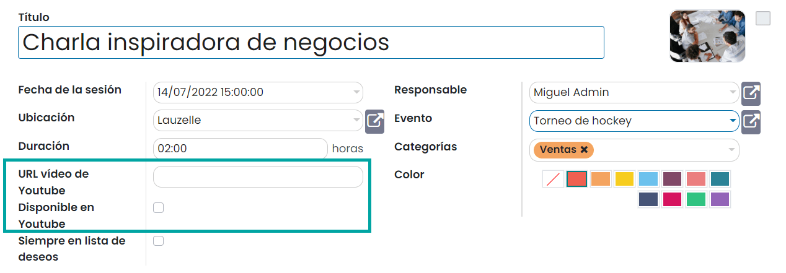

En las sesiones en las que se haya informado una URL del vídeo de YouTube, al acceder a la página de sesión del evento
en el sitio web, se podrá visualizar el vídeo:

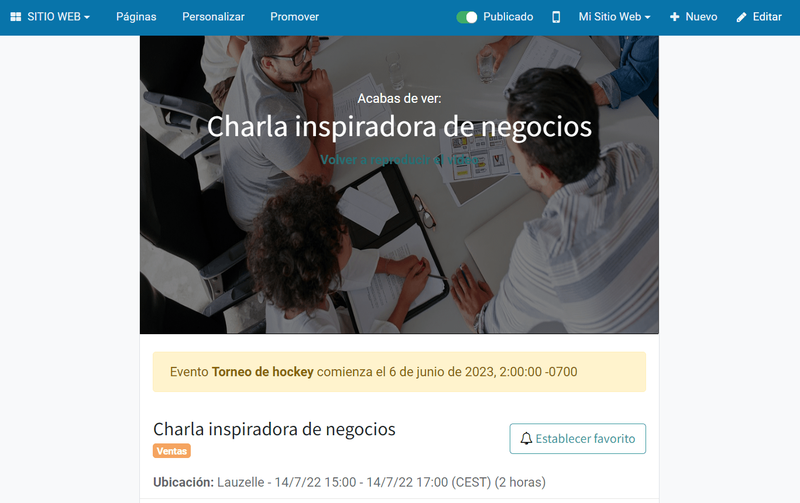

Compartir un cuestionario con los asistentes una vez que acabe una sesión
=========================================================================

Una vez finalizada la sesión, se pueden realizar preguntas relacionadas con la charla a los asistentes. En Daeris, puedes
activar la opción **Gamificación del evento** para agregar preguntas a tu sesión, desde la pantalla
:menuselection:`Eventos --> Configuración --> Ajustes`:

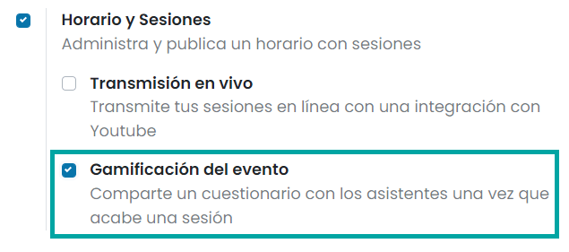

Una vez marcada la opción, pulsa el botón *Guardar* de la pantalla de ajustes.

Ahora, puedes ver la opción **Añadir cuestionario** en la ventana de creación de tu sesión del evento:

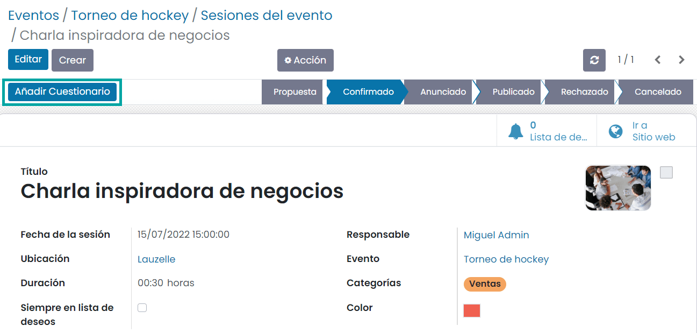

A continuación, haz clic en el botón **Añadir cuestionario** para agregar preguntas para la sesión del eventos y el sistema
te redirigirá a una nueva ventana como se muestra a continuación:

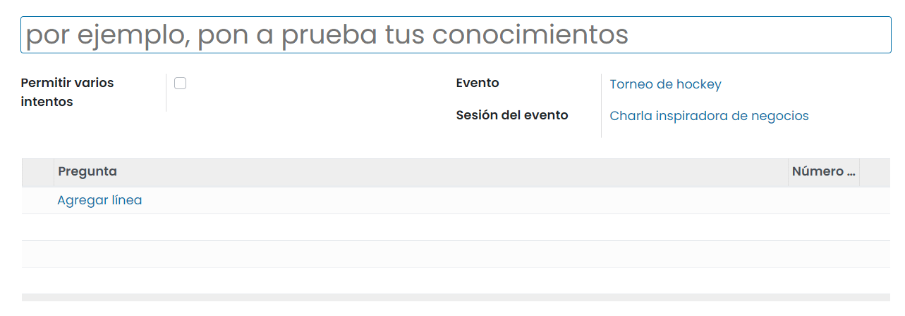

Puedes agregar un título para el cuestionario en el espacio correspondiente. La opción **Permitir varios intentos** se
puede activar para permitir que los asistentes restablezcan el cuestionario y vuelvan a intentarlo. El nombre del
evento y la sesión del evento se pueden ver en los campos dados. Obtendrás la opción *Agregar línea* para configurar
preguntas en la pestaña **Pregunta**:

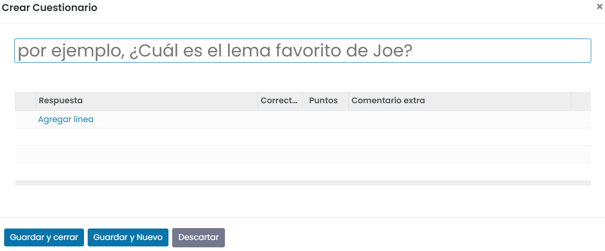

En la ventana emergente, informa la pregunta en el campo especificado y agrega opciones de respuesta debajo de la línea
**Respuesta**. Entre las opciones de respuesta especificadas, puedes marcar la respuesta correcta y especificar puntos
para la respuesta correcta en los campos correspondientes. Cuando un asistente selecciona la respuesta correcta para las
opciones dadas, obtendrá los puntos especificados como recompensa. Si deseas agregar comentarios adicionales para la
línea de respuesta, también puedes agregarlos en esta ventana.

Finalmente, haz clic en el botón *Guardar* para guardar el cuestionario.

Después de asistir a la charla, los asistentes podrán hacer clic en el botón **Hacer el cuestionario**:

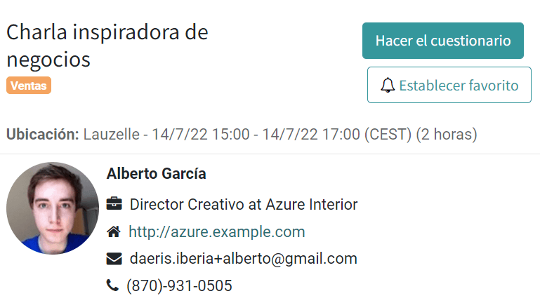

El botón **Revisar sus respuestas** comprobará tus respuestas y mostrará la respuesta correcta:

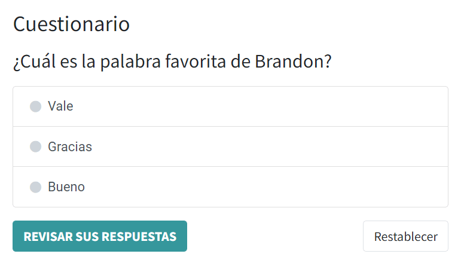

Por último, el botón *Ir al cuestionario* te llevará a la plataforma que contiene las preguntas del cuestionario:

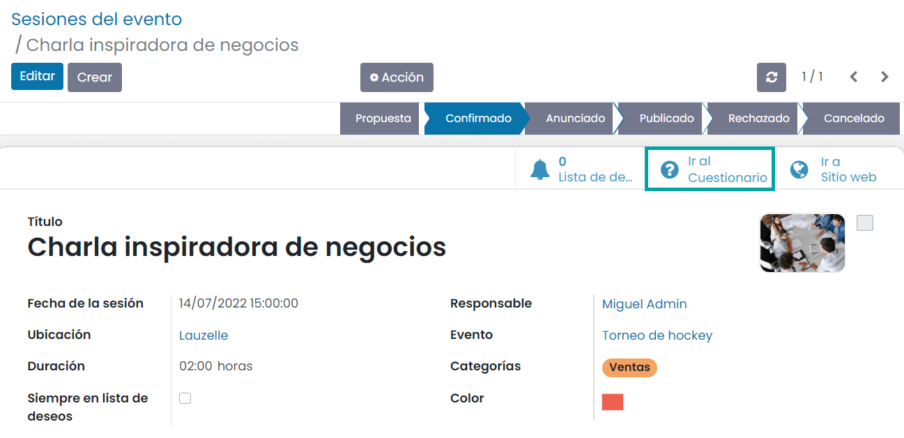