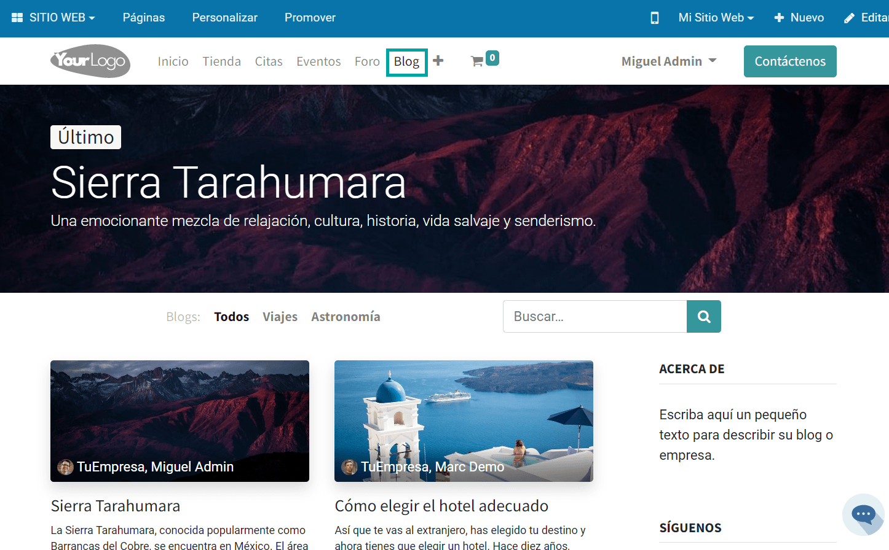
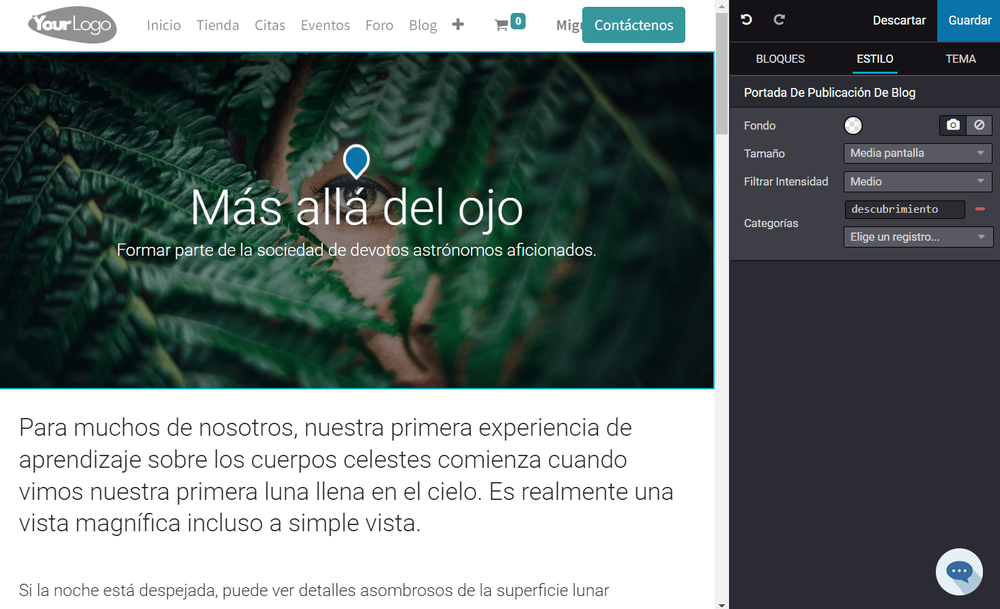

:show-content:

====
Blog
====

El sistema Daeris ha habilitado una plataforma efectiva para administrar las páginas de entradas de blogs en el módulo
del sitio web. Puedes crear fácilmente una página de entrada de blog en esta plataforma sin ninguna dificultad.

Editar la información general
=============================

Para configurar la página inicial del blog, navega a la opción del menú correspondiente del sitio web:

Para poder configurar la descripción del blog, necesitarás mostrar la barra lateral. Para ello, activa la opción del
menú :menuselection:`Personalizar --> Mostrar Barra Lateral`:

A continuación, pulsa el botón *Editar*, ubicado en la parte superior derecha de la pantalla:

A continuación, puedes editar el título del blog, el subtítulo y la descripción:

Una vez realizados los cambios, pulsa el botón *Guardar*.

Crear una entrada
=================

Para crear una nueva entrada en el blog desde el sitio web, pulsa el botón *Nuevo*, ubicado en la parte superior
derecha de la pantalla:

A continuación, selecciona la opción *Entrada del blog*:

El caso de haber varios tipos de blogs creados, el sistema solicitará seleccionar uno de ellos. Una vez seleccionado,
pulsa el botón *Crear*:

El sistema navegará a la página de creación de la entrada del blog, donde puedes especificar un título, un subtítulo y
añadir contenido:

También puedes incluir una imagen de portada, haciendo clic en el icono de *Imagen* disponible desde el apartado de
edición:

Esto te permite seleccionar una imagen de portada para la entrada del blog:

Cuando hayas seleccionado la imagen adecuada, pulsa el botón *Guardar*. La imagen quedará establecida en la portada de
la entrada del blog:

Para ajustar el tamaño de la imagen, selecciona la imagen y desde el apartado de edición, selecciona una de las opciones
disponibles:

.. image:: blog/crear-entrada-blog-8.png
   :align: center
   :alt: Crear una entrada en el blog de Daeris (8)

Del mismo modo, puedes ajustar la intensidad de la imagen, si seleccionas la imagen y desde el apartado de edición,
seleccionas una de las opciones disponibles:

También puedes añadir categorías o etiquetas a la entrada del blog, desde el apartado de edición, seleccionando el
campo de *Categorías*:

.. image:: blog/crear-entrada-blog-10.png
   :align: center
   :alt: Crear una entrada en el blog de Daeris (10)

Por otro lado, si seleccionas el apartado de *Bloques* en el modo de edición, se encuentran disponibles todos los bloques
de edición del sitio web, por lo que, si quieres arrastrar y configurar alguno de los bloques, solamente tienes que
arrastrarlo a la parte izquierda de la pantalla, y ubicarlo dentro de la entrada del blog:

Una vez hayas finalizado todos los cambios, pulsa el botón *Guardar*. Esto te llevará de forma automática a la entrada
del blog, donde podrás revisar su contenido.

Gestionar los suscriptores
==========================

Desde la página principal del blog en el sitio web, existe un botón para que los visitantes puedan proporcionar su
correo electrónico y suscribirse al blog:

.. note::
   La opción de suscribirse al blog solamente aparece cuando se ha activado la barra lateral desde el menú
   :menuselection:`Personalizar --> Mostrar Barra Lateral`. En caso de disponer de varios blogs, este botón solo
   aparece en las páginas iniciales de cada uno de los blogs, y no aparece en la página de *Todos* los blogs.

De esa manera, cada vez que se publique un nuevo artículo en el blog, los suscriptores recibirán un correo informativo
con el siguiente contenido:

Para gestionar las suscripciones del blog, navega a la pantalla :menuselection:`Sitio Web --> Configuración --> Blogs`,
y accede al detalle del blog que quieres gestionar:

En la sección de *chatter*, puedes gestionar los suscriptores mediante el icono de seguidores ubicado en la parte
superior derecha:

.. image:: blog/gestionar-suscriptores-4.png
   :align: center
   :alt: Gestionar los suscriptores del blog (4)

De esta forma, es posible consultar, añadir o eliminar suscriptores al blog.

Personalizar la página principal
================================

Desde la página principal del blog, dispones de las siguientes opciones de personalización, mediante el menú :menuselection:`Personalizar`:

A continuación, se describen dichas opciones:

-  **Autor**: Al marcar esta opción, se mostrará un avatar junto con el autor de la publicación.

-  **Estadísticas de Comentarios/Visualizaciones**: Al marcar esta opción, se mostrará información acerca de los comentarios
   y las visualizaciones de las publicaciones del blog.

-  **Portada**: Al marcar esta opción, se mostrará la imagen de portada de las publicaciones del blog.

-  **Vista previa y Etiquetas**: Al marcar esta opción, se mostrará una vista previa del contenido de la publicación del
   blog, así como sus etiquetas asociadas.

-  **Diseño de Tarjetas**: Modifica el diseño de las publicaciones de blog mostradas en la página inicial para que se
   muestren en formato kanban.

-  **Incrementar Legibilidad**: Modificar el diseño de las publicaciones de blog mostradas en la página inicial para
   mejorar su legibilidad.

-  **Vista Listado**: Muestra las publicaciones del blog en modo listado.

-  **Mostrar Barra Lateral**: Muestra una barra lateral con información descriptiva acerca del blog y una serie de
   opciones configurables, como se describe a continuación.

   -  **Archivo**: Muestra una sección en la barra lateral con un filtro de fechas para filtrar por publicaciones
      antiguas.

   -  **Síguenos**: Muestra una sección en la barra lateral con iconos con enlaces a las redes sociales de la empresa.

   -  **Lista de Etiquetas**: Muestra una sección en la barra lateral con las etiquetas disponibles, para que los
      usuarios puedan filtrar las publicaciones por dichas categorías.

-  **Banner superior - Nombre / Publicación más reciente**: Muestra un banner superior con la imagen de portada de la
   publicación más reciente llevada a cabo en el blog.

   -  **Portada de Ancho Completo**: Cambia el diseño de la imagen del banner superior.

Personalizar la página de una entrada
=====================================

Si navegas a la página de una entrada del blog, dispones de las siguientes opciones de personalización desde el menú
:menuselection:`Personalizar`:

A continuación, se describen dichas opciones:

-  **Portada Regular**: Cambia el diseño de la imagen del banner superior.

-  **Permitir Comentarios**: Al marcar esta opción, se permite a los visitantes dejar comentarios en la entrada del blog.

   -  **Seleccionar para Comentar**: Al marcar esta opción, los visitantes pueden seleccionar texto del contenido del blog, y
      tienen la opción de dejar un comentario en la sección de comentarios.

-  **Incrementar Legibilidad**: Modifica el diseño de la publicación para mejorar su legibilidad.

-  **Leer Siguiente Artículo**: Al marcar esta opción, se muestra la siguiente publicación del blog justo debajo de la actual.

-  **Seleccionar para Tweet**: Al marcar esta opción, los visitantes pueden seleccionar texto del contenido del blog, y
   tienen la opción de publicarlo directamente en Twitter.

-  **Mostrar Barra de Navegación**: Al marcar esta opción, se muestra una barra de navegación de las páginas debajo de
   la portada.

-  **Mostrar Barra Lateral**: Muestra una barra lateral con una serie de opciones configurables, como se describe a continuación.

   -  **Archivo**: Muestra una sección en la barra lateral con un filtro de fechas para filtrar por publicaciones
      antiguas.

   -  **Autor**: Al marcar esta opción, se mostrará un avatar junto con el autor de la publicación en la barra lateral.

   -  **Lista de Blogs**: Muestra una sección en la barra lateral con enlaces a los diferentes blogs creados en el sitio web.

   -  **Enlaces para Compartir**: Muestra una sección en la barra lateral con iconos para compartir la entrada del blog
      en redes sociales.

   -  **Etiquetas**: Muestra una sección en la barra lateral con las etiquetas disponibles, para que los
      usuarios puedan filtrar las publicaciones por dichas categorías.