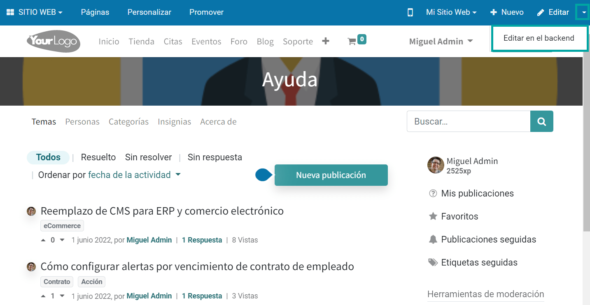
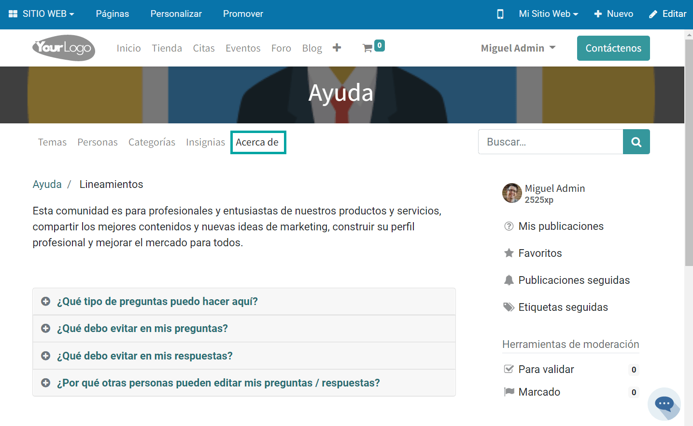
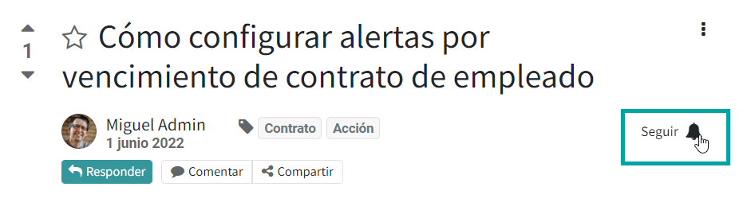

:show-content:

====
Foro
====

La función de foro en Daeris proporcionará una plataforma de discusión para que las personas obtengan respuestas a sus
preguntas. Las personas que tienen ideologías similares pueden reunirse para realizar una discusión publicando un tema de
discusión o un foro para hacer preguntas en tu sitio web. Puedes crear fácilmente publicaciones en el foro en el módulo
del sitio web de Daeris.

Configuración
=============

Personalizar la página principal
--------------------------------

Desde la página principal del foro, dispones de las siguientes opciones de personalización, mediante el menú
:menuselection:`Personalizar`:

A continuación, se describen dichas opciones:

-  **Vista Listado**: Muestra los diferentes foros en modo listado.

-  **Mostrar Última Publicación**: Al marcar esta opción, se mostrará un enlace en cada foro que permita acceder a la
   última publicación realizada.

-  **Mostrar Recuento de Publicaciones**: Al marcar esta opción, se mostrará un contador en cada foro con el número de
   publicaciones.

-  **Dividir foros / cursos regulares**: Divide los foros de los cursos de los foros regulares, en dos secciones distintas.

Configurar el mensaje de bienvenida
-----------------------------------

Los visitantes que acceden a un foro visualizan un mensaje de bienvenida en la cabecera de la página. Para configurar
el mensaje de bienvenida, navega a la página principal del foro en el sitio web y haz clic en *Editar*:

.. image:: foro/configurar-mensaje-bienvenida.png
   :align: center
   :alt: Configurar el mensaje de bienvenida

A continuación, el sistema navega a la vista de edición, donde se puede visualizar el mensaje de bienvenida configurado
por defecto, y permite editarlo para que se adapte a tus necesidades:

Una vez realizados los cambios, pulsa el botón *Guardar*.

Configurar las opciones del foro
--------------------------------

Para configurar el foro, navega a la página principal del foro en el sitio web, y haz clic en *Editar en el backend*:

A continuación, podrás visualizar y editar las diferentes opciones de configuración del foro:

El detalle de los campos es el siguiente:

-  **Nombre del foro**: Nombre del foro en el sitio web.

-  **Modo**: Es posible seleccionar entre el modo de una respuesta por pregunta, o de múltiples respuestas por pregunta.

-  **Sitio web**: En caso de informar un sitio web, el foro quedará restringido a dicho sitio web.

En la pestaña de *Opciones* dispones de la siguiente información:

-  **Orden por Defecto**: Especifica el orden predeterminado de las publicaciones del foro.

-  **Privacidad**: Es posible seleccionar entre un foro público, solo para usuarios que hayan iniciado sesión o solo
   para algunos usuarios en concreto.

-  **Descripción**: Descripción detallada del foro.

En la pestaña de *Ganancias de karma* se incluye información acerca de los puntos de karma que se obtienen al realizar ciertas
acciones. El karma es una puntuación que se atribuye a los usuarios del foro, en función de diversas reglas.

Por último, en la pestaña de *Derechos relacionados con el karma* se definen una serie de derechos otorgados a los usuarios
que tengan un mínimo de puntos de karma disponibles. Por ejemplo, que solo puedan dar un voto negativo aquellos usuarios
que tengan como mínimo 50 puntos de karma.

.. image:: foro/configurar-opciones-4.png
   :align: center
   :alt: Configurar las opciones del foro (4)

Configurar las preguntas frecuentes
-----------------------------------

El foro incluye una página de preguntas frecuentes que se puede consultar desde el enlace **Acerca de** ubicado en la
página principal del foro:

Al pulsar ese enlace, el sistema navega a la página de preguntas frecuentes por defecto. Para editar esta página, pulsa
el botón *Editar*, y modifica el contenido de la misma:

Una vez modificado el contenido, pulsa el botón *Guardar*:

Configurar los usuarios
-----------------------

Por invitación
~~~~~~~~~~~~~~

Para seleccionar el modo de acceso al portal, navega a la pantalla :menuselection:`Sitio web --> Configuración --> Ajustes`
y modifica el apartado de cuenta de cliente:

Si seleccionas la opción **Por invitación**, será necesario dar acceso al portal a los usuarios que consideres necesarios.
Para ello, navega a la pantalla de :menuselection:`Contactos --> Contactos`, y selecciona el contacto al que quieras dar
de alta en el portal. Desde la ficha de detalle del contacto, selecciona la acción *Otorgar acceso al portal*:

A continuación, el sistema muestra una ventana en donde se permite informar un mensaje que se incluirá en el correo electrónico
enviado a los nuevos usuarios de portal. Una vez informado el mensaje, debes marcar la opción *Permitir acceso*:

Esta acción llevará a cabo el envío de un correo electrónico al contacto seleccionado para que se pueda registrar en el portal.

Al pulsar el enlace correspondiente, el usuario podrá informar su contraseña de acceso al portal, que le servirá para
poder iniciar sesión en el portal y participar en el foro.

Registro gratuito
~~~~~~~~~~~~~~~~~

Para seleccionar el modo de acceso al portal, navega a la pantalla :menuselection:`Sitio web --> Configuración --> Ajustes`
y modifica el apartado de cuenta de cliente:

Al seleccionar la opción de **Registro gratuito**, todos los visitantes del sitio web tienen la posibilidad de crear su
propio usuario de portal desde la página de inicio de sesión:

.. image:: foro/registro-gratuito-sitio-web.png
   :align: center
   :alt: Registro gratuito desde el sitio web

Al pulsar el enlace de **¿No tienes una cuenta?**, el sistema redirige a la siguiente pantalla, desde donde poder crear
una nueva cuenta de acceso al portal:

Gestionar el foro
=================

Validar el acceso al foro
-------------------------

Sea cual sea el modo de creación de la cuenta, ya sea por invitación o por registro gratuito, al acceder al foro por
primera vez, el usuario debe validar su dirección de correo electrónico. Para ello, debe pulsar en el enlace correspondiente:

Este enlace enviará un correo electrónico al usuario para que confirme su cuenta:

Al pulsar en el botón **Validar mi cuenta**, se abre una nueva ventana de navegador y se muestra un mensaje de
felicitación informando de que ya es posible participar en el foro:

Hacer una pregunta
------------------

Para hacer una pregunta en el foro pulsa el botón **Nueva publicación**, ubicado en la página principal del foro:

A continuación, escribe el título de la pregunta, la descripción, y de forma optativa, añade etiquetas asociadas a la
pregunta de entre la lista de etiquetas disponibles:

Una vez completada la información, pulsa el botón **Publicar su pregunta**. El sistema mostrará un mensaje de agradecimiento,
y te invitará a compartir la publicación en las redes sociales una vez haya sido validada:

.. image:: foro/hacer-pregunta-foro-3.png
   :align: center
   :alt: Hacer una pregunta en el foro (3)

La pregunta quedará en estado pendiente de validación.

El usuario administrador del foro, puede visualizar desde la página inicial del foro, los mensajes pendientes de
validación, desde el apartado de *Herramientas de moderación*:

Al acceder al enlace de validaciones pendientes, el sistema muestra las preguntas pendientes de validación, y permite
aceptarlas o rechazarlas:

Al validar la publicación, el sistema envía un correo electrónico al usuario creador de la misma, para informarle de que
ya ha sido publicada. A partir de ese momento, la pregunta queda publicada, y los usuarios la pueden visualizar y
aportar sus respuestas.

Responder a una pregunta
------------------------

Para responder a una pregunta del foro, es necesario acceder al detalle de la pregunta, y pulsar el botón **Responder**:

A continuación, completa el campo de respuesta:

Una vez completada la respuesta, pulsa el botón **Publicar respuesta**. El sistema mostrará un mensaje de agradecimiento,
junto con unos botones para compartir la respuesta en redes sociales:

El usuario que publicó la pregunta, recibirá un correo electrónico informándole de que una nueva respuesta ha sido
proporcionada para su pregunta:

El usuario podrá entonces revisar la respuesta a su pregunta desde la propia aplicación, y si la respuesta ha resuelto
su duda, la podrá marcar como correcta mediante el icono ubicado al lado de la respuesta:

.. note::
   Por defecto, es necesario tener, como mínimo,  20 puntos de karma para poder marcar una respuesta como válida.

A partir de ese momento, la pregunta habrá quedado marcada como resuelta, y se podrá visualizar un icono al lado de la
pregunta en la página inicial del foro:

Comentar una publicación
------------------------

Para comentar una publicación del foro, accede al detalle de la publicación, y sobre la pregunta o respuesta a comentar,
pulsa el botón de **Comentario**:

.. image:: foro/comentar-publicacion-foro.png
   :align: center
   :alt: Comentar una publicación del foro

Esto desplegará un nuevo campo en donde poder publicar un comentario:

Al pulsar el botón **Publicar comentario**, el comentario queda registrado sobre la pregunta o respuesta:

Suprimir una publicación
------------------------

Para suprimir una publicación del foro, accede al detalle de la publicación, y sobre la pregunta o respuesta a suprimir,
pulsa el enlace de **Suprimir**:

.. note::
   Por defecto, es necesario tener, como mínimo, 500 puntos de karma para poder suprimir una publicación.

En el caso de suprimir una pregunta, esto conllevará la eliminación de dicha publicación del foro y ya no será visible
desde el listado. Una vez suprimida una publicación, es posible reactivarla mediante el enlace **Recuperar**, ubicado en
el detalle de la publicación suprimida:

Esto volverá a dejar la publicación visible para los usuarios del foro.

Marcar una publicación
----------------------

Para marcar una publicación del foro, accede al detalle de la publicación, y sobre la pregunta o respuesta a marcar,
pulsa el enlace de **Marcar**:

.. note::
   Por defecto, es necesario tener, como mínimo, 500 puntos de karma para poder marcar una publicación.

Esto marcará la publicación, y la colocará en el cuadro de herramientas de moderación, indicando que existe una publicación
marcada:

Al acceder al enlace de la publicación marcada, aparece un listado con todas las publicaciones marcadas, y se permite
validar la publicación o marcarla como ofensiva:

Si se marca la publicación como ofensiva, se oculta para la mayoría de usuarios:

Del mismo modo que cuando se suprime una publicación, quedará oculta y solo podrá ser visible por usuarios con un karma
alto. Una vez marcada como ofensiva una publicación, será posible reactivarla mediante el enlace **Validar**, ubicado
en el detalle de la publicación:

Esto volverá a dejar la publicación visible para los usuarios del foro.

Cerrar una publicación
----------------------

Para cerrar una publicación del foro, accede al detalle de la publicación, y sobre la pregunta a cerrar, pulsa el enlace
de **Cerrar**:

.. image:: foro/cerrar-publicacion-foro.png
   :align: center
   :alt: Cerrar una publicación del foro

.. note::
   Por defecto, es necesario tener, como mínimo, 100 puntos de karma para poder cerrar una publicación.

Será necesario informar el motivo del cierre de entre la lista de opciones disponibles:

Una vez informado el motivo, pulsa el botón de **Cerrar publicación**, lo que te llevará al detalle de la pregunta ya
cerrada. En caso de querer reabrir la pregunta, será posible hacerlo mediante el enlace **Reabrir**:

Esto volverá a dejar la pregunta publicada y visible para los usuarios del foro.

Convertir un comentario en respuesta
------------------------------------

Para convertir un comentario del foro en una respuesta, pulsa el enlace **Convertir en respuesta** ubicado en el comentario:

Al convertir en respuesta, el comentario dejará de existir en comentarios y pasará a ser una respuesta a la pregunta publicada:

Convertir una respuesta en comentario
-------------------------------------

Para convertir una respuesta del foro en un comentario, pulsa el enlace **Convertir en comentario** ubicado en la respuesta:

Al convertir en comentario, la respuesta dejará de existir en respuestas y pasará a ser un comentario a la pregunta publicada:

Marcar una publicación como favorita
------------------------------------

Para marcar una publicación del foro como favorita, accede al detalle de la publicación, y haz clic en el icono de estrella
ubicado en la parte izquierda de la publicación:

Una vez pulsada la estrella, la publicación quedará marcada como favorita:

Votar una publicación
---------------------

Para votar una publicación en el foro, accede al detalle de la publicación, y haz clic en el icono ubicado en la parte
izquierda de la publicación, mediante el cuál puedes otorgar un voto positivo (flecha arriba) o un voto negativo
(flecha abajo):

.. note::
   Por defecto, es necesario tener, como mínimo, 5 puntos de karma para poder votar una publicación.

Una vez otorgado el voto, se sumará o restará el punto a la publicación:

Suscribirse a una publicación del foro
--------------------------------------

Existe la posibilidad de suscribirse a una publicación del foro mediante el icono de **Seguir**:

Los usuarios no registrados también puedes seguir publicaciones del foro introduciendo su dirección de correo electrónico:

Es posible consultar los suscriptores de las publicaciones accediendo a la página de detalle de la publicación, desde la
pantalla :menuselection:`Sitio Web --> Foro --> Entradas`. Desde la sección de *chatter* será posible gestionar los suscriptores:

Suscribirse a etiquetas
-----------------------

Desde la sección de **Categorías**, ubicada en el menú principal del foro, es posible consultar todas las etiquetas
creadas en el foro:

.. image:: foro/suscribirse-etiquetas.png
   :align: center
   :alt: Suscribirse a etiquetas del foro

Al pasar el punto por alguna de las etiquetas, es posible suscribirse a la etiqueta:

.. image:: foro/suscribirse-etiquetas-2.png
   :align: center
   :alt: Suscribirse a etiquetas del foro (2)

Al hacer clic sobre el enlace de *Ver publicación*, es posible navegar a una pantalla de listado en donde se
muestran todas las publicaciones asociadas a la etiqueta seleccionada:

Consultar las insignias
-----------------------

Las insignias son premios que se otorgan a los usuarios del foro en función de su grado de participación en el mismo.

Desde la sección de **Insignias**, ubicada en el menú principal del foro, puedes consultar todas las insignias disponibles
actualmente en el foro:

Para gestionar las insignias, debes navegar a la pantalla :menuselection:`Sitio Web --> Configuración --> Insignias`:

Las insignias que quieras que aparezcan publicadas en el foro, deben disponer de la marca de *Publicado* en el detalle
de la misma:

