:show-content:

================
Listas de correo
================

Crear una lista de correo en el sitio web
=========================================

Mediante la funcionalidad de listas de correo del sitio web, los visitantes pueden unirse a los canales de correo público
para recibir actualizaciones periódicas o comunicarse con su comunidad. También es posible crear canales para usuarios
autenticados o para grupos de usuarios específicos.

Para ello, navega a la pantalla :menuselection:`Sitio web --> Grupos --> Grupos de listas de correo` donde aparece un listado
con todas las listas de correo creadas en la aplicación:

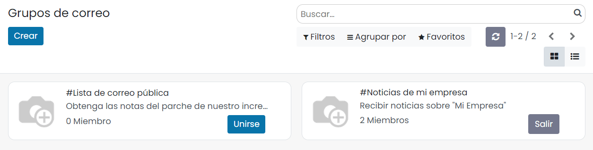

Para crear una nueva lista, pulsa el botón *Crear*. El sistema navegará al formulario de detalle, donde puedes informar
los siguientes campos:

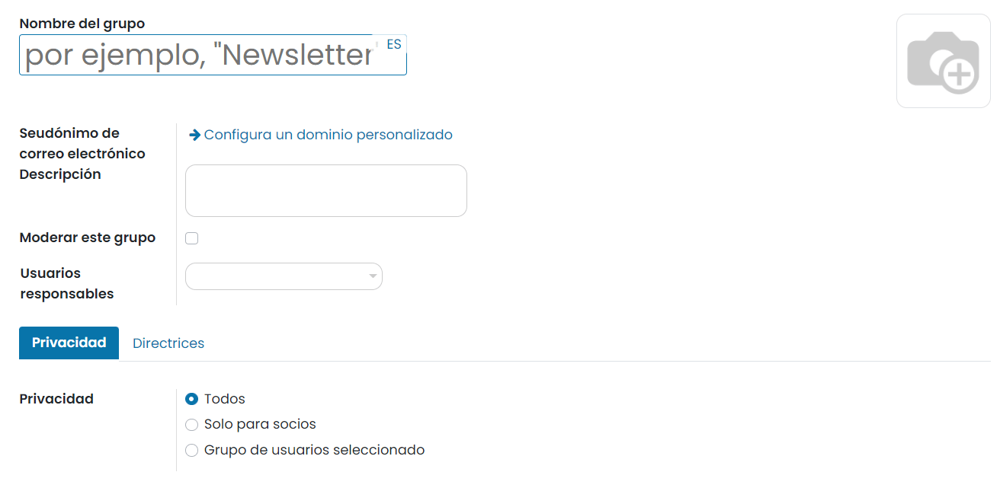

En primer lugar, puedes proporcionar un nombre de grupo. Luego puedes definir un alias de correo electrónico y una breve
descripción. Además, puedes activar o desactivar el campo *Moderar este grupo* y seleccionar los *Usuarios Responsables*.
En la pestaña *Privacidad*, debes definir la política de privacidad. Aquí tienes tres opciones: *Todos*, *Solo para socios*
y *Grupo de usuarios seleccionado*. Desde la pestaña *Directrices* puedes activar la opción *Enviar directrices a nuevos suscriptores*.
Al hacerlo, los recién llegados a este grupo moderado recibirán automáticamente las directrices.

Una vez informados los campos necesarios, pulsa el botón *Guardar*.

Establecer reglas de moderación de listas
=========================================

Para establecer reglas de moderación de listas de correo, nevaga a la pantalla :menuselection:`Sitio web --> Grupos --> Reglas de moderación de listas`:

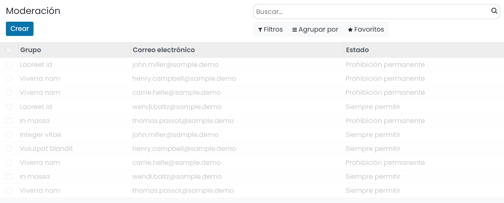

Para crear una nueva regla, pulsa el botón *Crear*. El sistema creará un nuevo registro en el listado, donde puedes informar
el grupo, correo electrónico y estado:

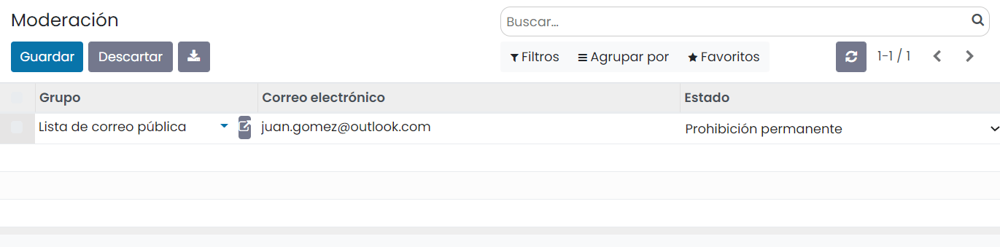

Una vez informados los campos, pulsa el botón *Guardar*.

Suscribirse a una lista de correo en el sitio web
=================================================

Los visitantes del sitio web pueden consultar las listas de correo públicas desde la página `/groups`:

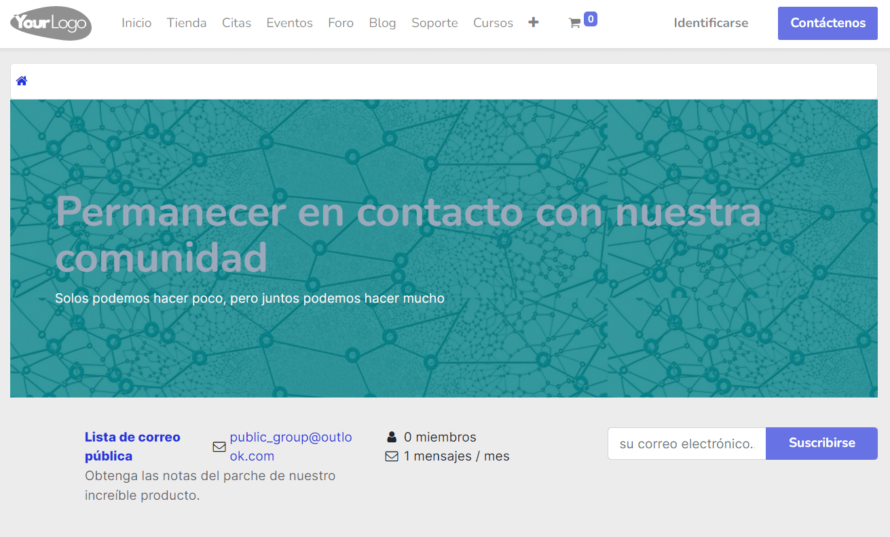

.. tip::
   Es posible crear una opción del menú para que sea más sencillo acceder a la página `/groups`.

En esta página es posible visualizar el nombre del canal, la dirección de correo asociada, una descripción, el número de
miembros, el número de mensajes enviados, y está disponible la opción de suscribirse al canal.

Los visitantes que quieran suscribirse al canal lo pueden hacer introduciendo su dirección de correo electrónico y pulsando
el botón **Suscribirse**. El sistema enviará un correo de forma automática a ese correo electrónico para que el visitante
confirme la suscripción al canal:

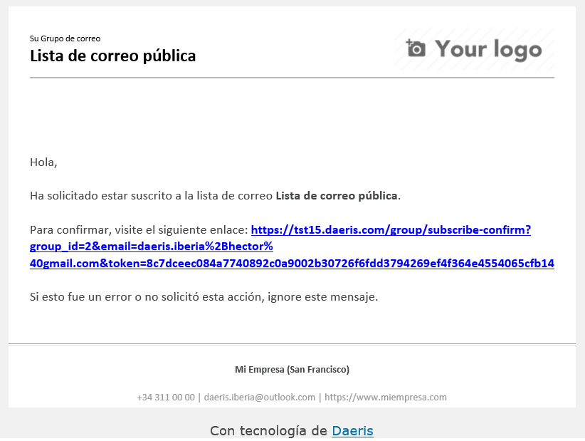

Una vez confirmada la suscripción, se recibirán por correo todas las actualizaciones del canal.

Consultar los mensajes de la lista de correo en el sitio web
============================================================

Desde la página `/groups` del sitio web, los visitantes pueden consultar todos los mensajes enviados al canal, accediendo
al detalle de la lista de correo mediante el enlace disponible en el nombre:

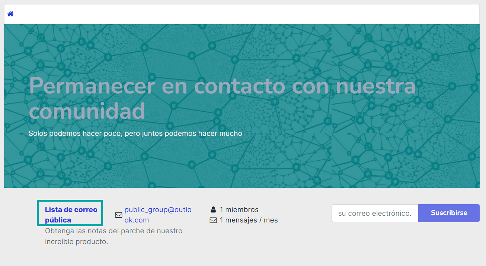

En la página de detalle de la lista de correo se muestran los diferentes mensajes enviados al canal, y una barra de
navegación donde es posible consultar por los hilos de correo o por las fechas:

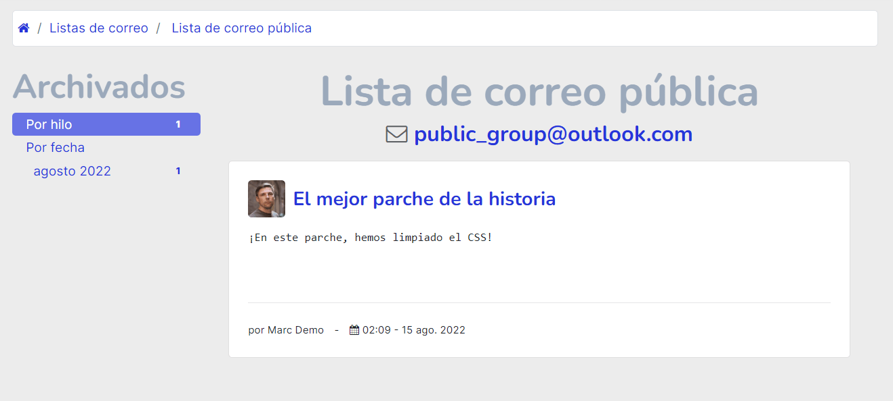

Al acceder al detalle de un mensaje, es posible visualizar el mensaje completo:

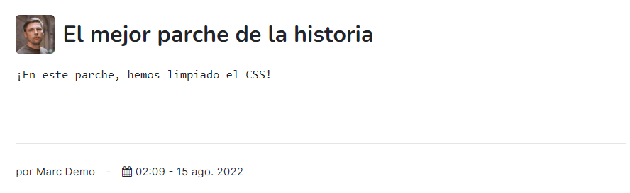

Anular la suscripción a una lista de correo en el sitio web
===========================================================

Si los suscriptores de una lista de correo del sitio web desean anular su suscripción, deben seguir el enlace que se
incluye en cualquier correo recibido de la suscripción:

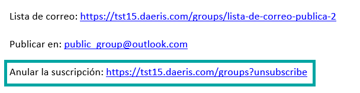

Al navegar a ese enlace, será posible anular la suscripción introduciendo la dirección de correo en el campo correspondiente:

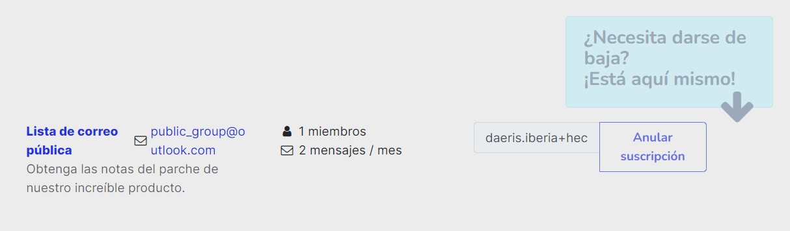

Tras introducir la dirección de correo electrónico y pulsar el botón de **Anular suscripción**, el sistema enviará un
correo de forma automática a ese correo electrónico para que el visitante confirme la anulación de su suscripción:

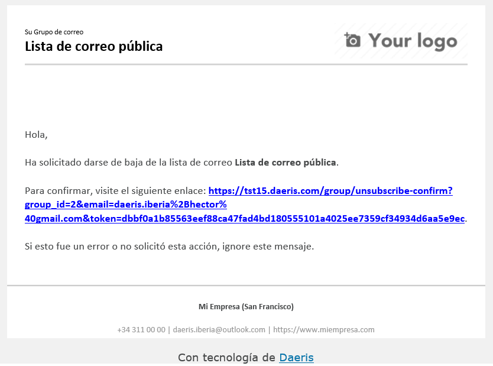

Una vez anulada la suscripción, ese correo electrónico dejará de recibir actualizaciones del canal.