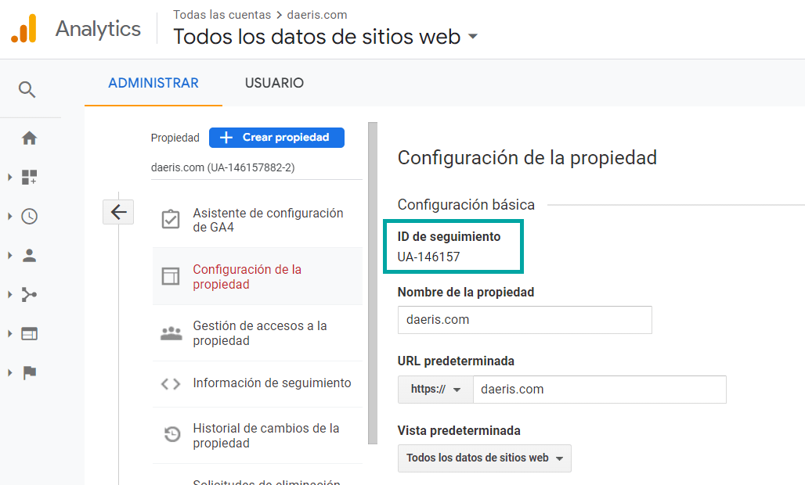
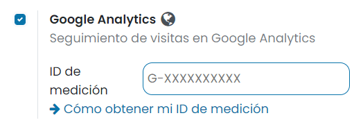

================
Google Analytics
================

**Google Analytics** es una herramienta de analítica web de la empresa Google. Ofrece información agrupada del tráfico
que llega a los sitios web según la audiencia, la adquisición, el comportamiento y las conversiones que se llevan a cabo
en el sitio web.

.. _sitios_web/optimizar/analizar_trafico_google_analytics:

Analizar el tráfico de tu sitio web en Google Analytics
=======================================================

Para hacer el seguimiento del tráfico de tu sitio web con Google Analytics:

-  `Crea una cuenta en Google Analytics <https://www.google.com/analytics/>`__ si no dispones de una.

-  Revisa el formulario de creación y acepta las condiciones para obtener el **ID de seguimiento**. Este ID también lo
   puedes encontrar desde la pantalla de administración de la cuenta, dentro de la configuración de la propiedad:

-  Copia el **ID de seguimiento** para insertarlo en Daeris.

-  Navega a la pantalla :menuselection:`Sitio web --> Configuración --> Ajustes`, activa la opción de **Google Analytics**,
   e informa el **ID de seguimiento** copiado en el paso anterior:

-  Guarda la configuración en ajustes mediante el botón *Guardar*.

A partir de ese momento, ya puedes empezar a analizar el tráfico de tu sitio web en Google Analytics. Para dar tus primeros
pasos en Google Analytics, consulta la `Documentación de Google <https://support.google.com/analytics/answer/9306384?hl=es>`__.

Analizar el tráfico de tu sitio web desde tu tablero de Daeris
==============================================================

.. warning::
   Ya no es posible que las nuevas cuentas de Google Analytics integren su tablero de Google Analytics dentro de su tablero
   de Daeris. Google dejó de usar **Universal Analytics**, que ya no será compatible en `julio de 2023 <https://support.google.com/analytics/answer/11583528>`__.
   Lo están reemplazando con **Analytics 4**. Las nuevas cuentas ya lo están usando.
   **Analytics 4** `no permite <https://issuetracker.google.com/issues/233738709?pli=1>`__ que su tablero se integre en
   sitios web externos.
   Ahora debes verificar tus datos de Analytics directamente en Google Platform, ya que ya no será posible en Daeris.
   Las cuentas creadas antes de `octubre de 2020 <https://support.google.com/analytics/answer/11583832>`__ deberían seguir
   utilizando Universal Analytics y poder integrar su panel de control en un sitio web externo hasta el final oficial del
   soporte a `mediados de 2023 <https://developers.googleblog.com/2022/03/gis-jsweb-authz-migration.html>`__.

Puedes analizar las estadísticas de tráfico directamente en el tablero de sitio web de Daeris gracias a Google Analytics:

-  Un paso preliminar es crear una cuenta en Google Analytics e informar el ID de seguimiento en los ajustes de sitio web
   (consulta el apartado :ref:`sitios_web/optimizar/analizar_trafico_google_analytics`).

-  Navega a la `Plataforma de API de Google <https://console.developers.google.com/>`__ para generar credenciales analíticas
   API. Inicia sesión con tu cuenta de Google.

-  Crea un nuevo proyecto donde ubicar la API.

-  Desde la página de APIs y servicios, pulsa el enlace para **habilitar APIs y servicios**:

   .. image:: google_analytics/google-analytics-3.png
      :align: center
      :alt: Google Analytics (3)

-  Selecciona la API de Google Analytics:

   .. image:: google_analytics/google-analytics-4.png
      :align: center
      :alt: Google Analytics (4)

-  Habilita la API mediante el botón correspondiente:

   .. image:: google_analytics/google-analytics-5.png
      :align: center
      :alt: Google Analytics (5)

-  Configura una pantalla de consentimiento. Pulsa el botón *Crear*:

   .. image:: google_analytics/google-analytics-6.png
      :align: center
      :alt: Google Analytics (6)

-  Informa un nombre de aplicación, un correo electrónico de asistencia, un logotipo, un enlace a la página principal de
   la aplicación (por ejemplo, `https://daeris.com`), un enlace a la política de privacidad de la aplicación (por ejemplo,
   `https://daeris.com/legal/politica-de-privacidad`), un enlace a las condiciones del servicio de la aplicación (por ejemplo,
   `https://daeris.com/legal/condiciones-de-uso`), un dominio autorizado (por ejemplo, `daeris.com`) y un correo electrónico
   de contacto. Una vez completados estos campos, pulsa el botón *Guardar y continuar*.

   .. image:: google_analytics/google-analytics-7.png
      :align: center
      :alt: Google Analytics (7)

   .. image:: google_analytics/google-analytics-8.png
      :align: center
      :alt: Google Analytics (8)

-  En la página de **Permisos**, deja todos los campos como están y haz clic en *Guardar y continuar*.

-  En la pantalla de usuarios, pulsa el botón *Guardar y continuar*.

-  En el menú del lado izquierdo haz clic en :menuselection:`Credenciales`.

   .. image:: google_analytics/google-analytics-9.png
      :align: center
      :alt: Google Analytics (9)

-  Haz clic en *Crear credenciales* y selecciona **ID de cliente OAuth**.

   .. image:: google_analytics/google-analytics-10.png
      :align: center
      :alt: Google Analytics (10)

-  Selecciona **Aplicación web** como el tipo de aplicación y configura las páginas permitidas a las que se les redirigirá.
   Para ello, en el campo **URI de redireccionamiento autorizados**, introduce la URL de tu instancia Daeris seguido de
   `/google_account/authentication`. Por ejemplo, `https://tst15.daeris.com/google_account/authentication`. Una vez informados
   los campos, pulsa el botón *Crear*.

   .. image:: google_analytics/google-analytics-11.png
      :align: center
      :alt: Google Analytics (11)

   .. image:: google_analytics/google-analytics-12.png
      :align: center
      :alt: Google Analytics (12)

-  Copia el **ID de cliente** generado por Google.

   .. image:: google_analytics/google-analytics-13.png
      :align: center
      :alt: Google Analytics (13)

-  Navega a la pantalla :menuselection:`Sitio Web --> Tablero --> Analítica`. Pulsa el botón **Conecta Google Analytics**
   del apartado de visitas:

   .. image:: google_analytics/google-analytics-14.png
      :align: center
      :alt: Google Analytics (14)

-  Informa el ID de seguimiento de Google Analytics y el ID de cliente de la API. Pulsa el botón *Guardar*:

   .. image:: google_analytics/google-analytics-15.png
      :align: center
      :alt: Google Analytics (15)

-  Por último, autoriza a Daeris a acceder a la API de Google:

   .. image:: google_analytics/google-analytics-16.png
      :align: center
      :alt: Google Analytics (16)

-  El sistema mostrará una ventana para solicitar permiso. Deberás permitir el acceso a la aplicación mediante el enlace
   correspondiente:

   .. image:: google_analytics/google-analytics-17.png
      :align: center
      :alt: Google Analytics (17)

Una vez hayas realizado todos los pasos, ya puedes visualizar la información de Google Analytics desde la página
:menuselection:`Sitio Web --> Tablero --> Analítica`.