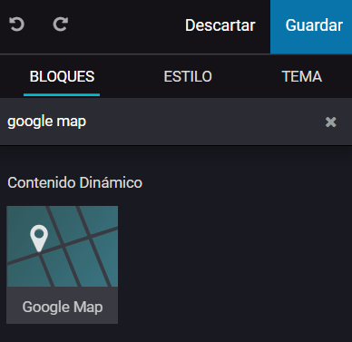

===========
Google Maps
===========

**Google Maps** es un servidor de aplicaciones de mapas en la web que pertenece a Alphabet Inc. Ofrece imágenes de mapas
desplazables, así como fotografías por satélite del mundo e incluso la ruta entre diferentes ubicaciones o imágenes a pie
de calle con Google Street View, condiciones de tráfico en tiempo real (Google Traffic) y un calculador de rutas a pie,
en coche, bicicleta (beta) y transporte público y un navegador GPS, Google Maps Go.

Configuración
=============

Obtener clave de API de Google
------------------------------

Daeris permite integrar su sitio web con mapas de Google, para lo cuál será necesario navegar a la pantalla
:menuselection:`Sitio web --> Configuración --> Ajustes` y activar la opción **Google Maps**:

A continuación, pulsa el enlace **Cree un proyecto de Google y obtenga una Clave**. Este enlace abrirá la consola de
Google Cloud y te permitirá crear un proyecto o seleccionar uno existente:

Una vez creado el proyecto o seleccionado uno, deberás confirmar que realmente deseas realizar cambios sobre ese
proyecto:

.. image:: google_maps/google-maps-3.png
   :align: center
   :alt: Google Maps (3)

En la pantalla para habilitar las APIs, pulsa el botón **Habilitar**:

A continuación, crea tu clave de API mediante el enlace *Crear nueva clave de API*:

.. image:: google_maps/google-maps-5.png
   :align: center
   :alt: Google Maps (5)

Por último, copia la clave de API generada por Google:

Configurar clave de API en Daeris
---------------------------------

Vuelve a la pantalla de ajustes de Daeris, y pega la clave API copiada en el paso anterior:

Pulsa el botón *Guardar* de la pantalla de ajustes para que se apliquen los cambios.

Habilitar la facturación en tu proyecto de Google
-------------------------------------------------

Para que funcione la integración con Google Maps será necesario habilitar la facturación en tu proyecto de Google. Para
ello, pulsa el enlace **Habilite la facturación en su proyecto de Google**:

.. note::
   Google Maps Platform ofrece crédito por valor de 200 US$ al mes para usarlo en Maps, Routes y Places. Algunos clientes
   descubren que gracias a este crédito, no tienen que pagar nada por el uso que hacen de las herramientas. No se te
   aplicará ningún cargo salvo que tu uso supere los 200 US$ al mes.

Desde la página principal de Google Cloud, pulsa el botón *Empezar* y accede con tu cuenta de Google. En el panel principal,
tienes la opción de iniciar una prueba gratuita con $300 de crédito durante 90 días:

A continuación, completa la información de tu cuenta e introduce un método de pago.

Utilizar el bloque de Google Map
================================

A partir de ese momento, cuando edites una página del sitio web, ya podrás hacer uso del bloque de **Google Map**:

