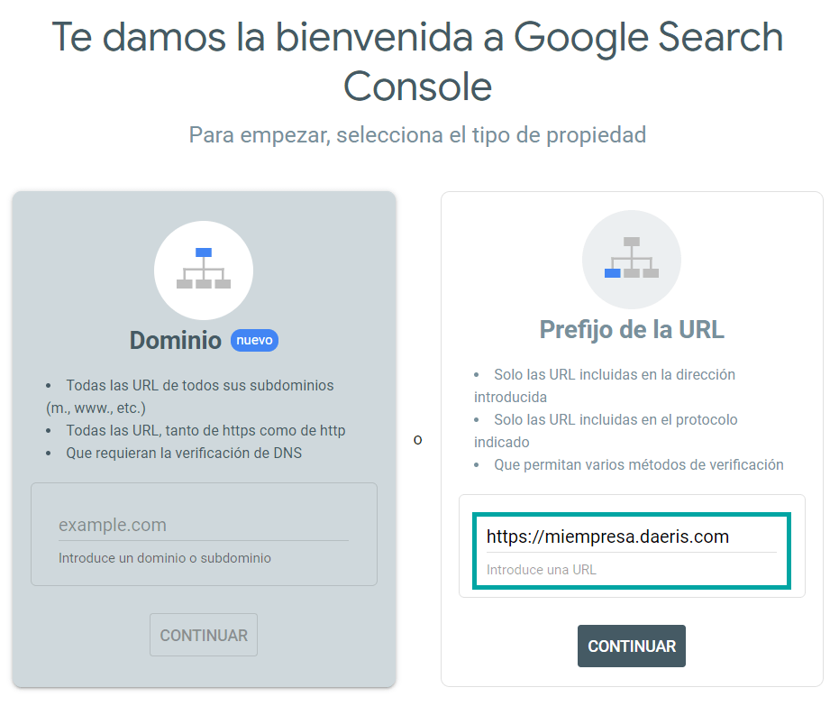
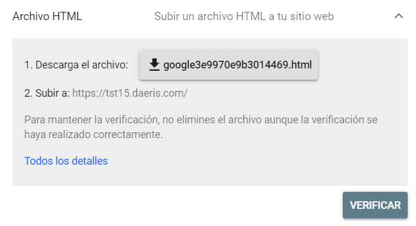
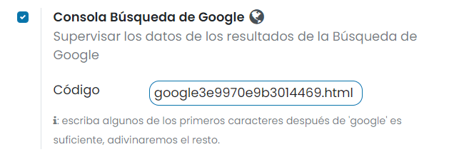
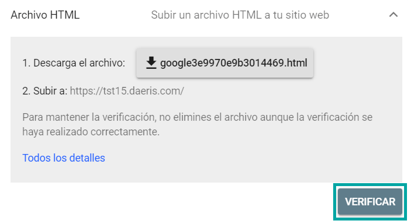
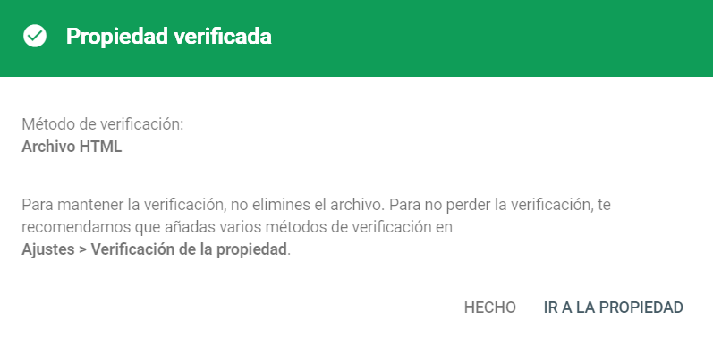

=====================
Google Search Console
=====================

**Google Search Console** es un servicio gratuito de Google que te ayuda a supervisar, mantener y solucionar los problemas
de aparición de tu sitio web en los resultados de la Búsqueda de Google.

Configuración
=============

Para integrar tu sitio web de Daeris con la consola de búsquedas de Google, debes disponer de una cuenta de Google, y
acceder a la `página inicial de Google Search Console <http://www.google.com/webmasters/tools/>`_.

Una vez hayas accedido a tu cuenta, el sistema solicita seleccionar el tipo de propiedad, que en tu caso será **Prefijo de la URL**.
En caso de estar utilizando un subdominio de Daeris, debes introducir la URL `https://miempresa.daeris.com` sustituyendo
miempresa por el nombre de subdominio de tu empresa. Si utilizas un dominio propio, debes introducir la URL de tu empresa.

.. seealso::
   * :ref:`sitios_web/publicar/personalizar_nombre_dominio`

A continuación, debes verificar la propiedad del sitio web, para que Google confirme que realmente se trata de un sitio
web gestionado por ti. Para realizar esta verificación, debes utilizar el método **Archivo HTML**:

En este paso, solamente debes copiar el nombre del fichero HTML proporcionado por Google.

Una vez hecho esto, navega en Daeris a la pantalla :menuselection:`Sitio web --> Configuración --> Ajustes`, marca la
opción de **Consola Búsqueda de Google**, e introduce en el código, el nombre del fichero HTML de Google:

Una vez introducido el valor, guarda la página de ajustes mediante el botón *Guardar*.

Por último, es necesario verificar que el fichero se ha generado correctamente, pulsando el botón **Verificar** de la
consola de búsquedas de Google:

Si todo ha ido bien, Google mostrará el siguiente mensaje, indicando que el sitio web ha sido verificado correctamente:

A partir de este momento, ya puedes empezar a utilizar todas las características de *Google Search Console*.