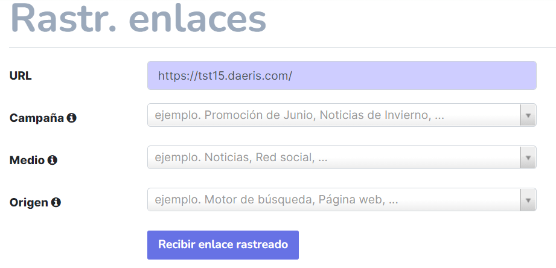

=======================
Rastreadores de enlaces
=======================

Los rastreadores de enlaces te permiten llevar el seguimiento de tus campañas de marketing (correos electrónicos,
publicaciones de redes sociales, enlaces afiliados, etc.). De esta forma podrás identificar tus fuentes de mejor tráfico
y tomar decisiones informadas sobre la distribución de tu presupuesto de marketing.

Configuración
=============

Navega al sitio web y abre el menú :menuselection:`Promover --> Rastreador de enlaces`:

Aquí podrás obtener un URL específica según la campaña, medio y origen que se utiliza:

-  **URL**: URL de la página que deseas rastrear (por ejemplo, la página de inicio o una página de producto).

-  **Campaña**: Contexto de tu enlace (por ejemplo, una promoción especial).

-  **Medio**: Canal que se utiliza para compartir (entregar) tu enlace (por ejemplo, un correo electrónico o un
   anuncio de Facebook).

-  **Origen**: Plataforma que origina el tráfico (por ejemplo, Google o Twitter).

Ahora haz clic en **Recibir enlace rastreado** para generar una URL que puedes publicar o enviar a través del origen
seleccionado:

Seguimiento de enlaces rastreados
=================================

Para ver las estadísticas de tus enlaces, navega al sitio web y abre el menú :menuselection:`Promover --> Rastreador de enlaces`:

Además de poder ver los enlaces con más clics y los usados recientemente, puedes ver las estadísticas completas al hacer
clic en *Estadísticas*, incluso el número de clics y su país de origen:

