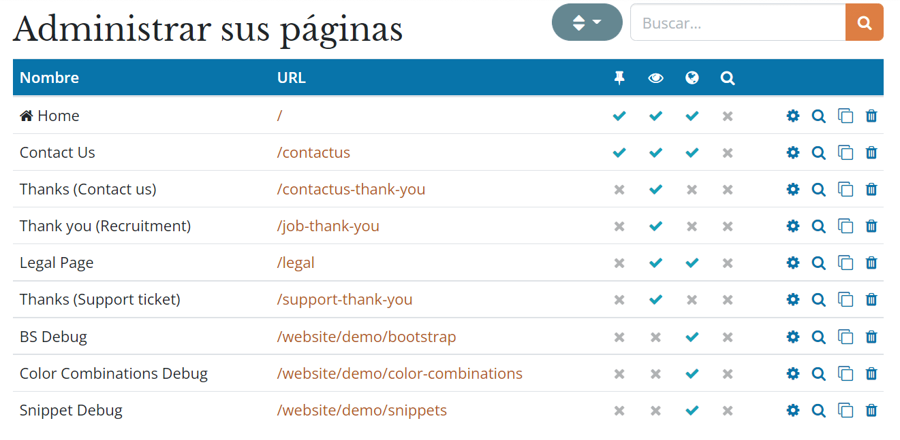
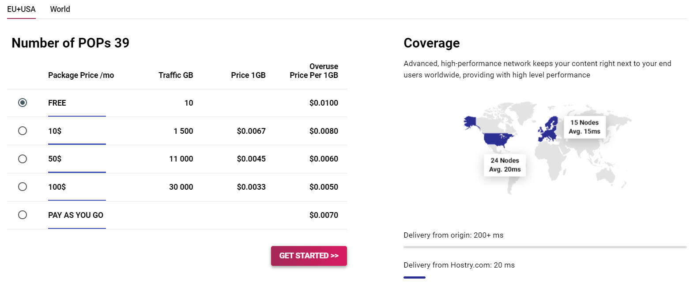

================================
SEO (Search Engine Optimization)
================================

El **SEO (Search Engine Optimization)** es un conjunto de buenas prácticas con el fin de mejorar la posición de un sitio
web en los resultados de los buscadores (como, por ejemplo, Google) para unos términos de búsqueda concretos. En resumen,
un buen SEO permitirá atraer más visitantes al sitio web.

Algunos ejemplos de SEO son los siguientes:

-  Las páginas deben cargar rápido.

-  Las páginas deben tener solamente un título <h1>.

-  Las meta etiquetas deberían ser consistentes con el contenido.

-  El sitio web debería tener un fichero de mapa del sitio (/sitemap.xml).

-  Etc.

Para garantizar que el sitio web de Daeris tenga un buen SEO, Daeris abstrae todas las complejidades técnicas del SEO y
lo gestiona todo por ti de la mejor manera posible.

Etiquetas meta
==============

Título y descripción
--------------------

En primer lugar, cada página debería disponer de las etiquetas **<title>** y **<description>**. Estos elementos son
utilizados por los motores de búsqueda para promocionar tu sitio web. Estas etiquetas son generadas de forma automática
en base al título y contenido de la página, pero también es posible configurarlos.

Mediante el menú del sitio web :menuselection:`Páginas --> Administrar páginas`, puedes gestionar las diferentes páginas
existentes en el sitio web:

Esto te llevará a un listado como el siguiente:

Si pulsas sobre el icono de lupa **Optimizar el SEO de esta página**, se desplegará una ventana con la siguiente información:

-  **Título**: Título de la página, utilizada por los buscadores para mostrar en la página de resultados de la búsqueda.

-  **Descripción**: Descripción de la página, utilizada por los buscadores para mostrar en la página de resultados de la búsqueda.

Puedes observar como también se generan recomendaciones en función de la información introducida. En el ejemplo anterior,
se indica que la descripción proporcionada es demasiado corta, lo que podría penalizar en los resultados de la búsqueda.

Palabras clave
--------------

Por otro lado, y con el objetivo de escribir contenido de calidad y aumentar el tráfico, Daeris proporciona un buscador de
palabras clave. Estas palabras clave son las búsquedas que quieres optimizar en tu sitio web. Para cada palabra clave, es
posible observar si se están utilizando en el contenido (h1, h2, título, descripción, contenido) y cuáles son las búsquedas
relacionadas en Google. Cuantas más palabras clave relacionadas utilices, mejor será el resultado.

Las palabras clave, del mismo modo que las etiquetas de título y descripción, se configuran desde la administración de
páginas, mediante el menú :menuselection:`Páginas --> Administrar páginas`. Si pulsas sobre el icono de **Optimizar el SEO de esta página**,
se desplegará una ventana con la siguiente información:

-  **Palabras clave**: Palabras clave relacionadas con esta página, utilizadas por los buscadores para determinar los
   resultados de búsqueda.

.. note::
   Si el sitio web está configurado en múltiples idiomas, es posible configurar el SEO de las páginas para cada uno de
   los idiomas configurados, y establecer etiquetas específicas.

Crear contenido en el sitio web
===============================

Cuando hablamos de SEO, siempre suele decirse que el contenido es el rey. Daeris proporciona varios módulos para ayudar
a construir el contenido de tu sitio web:

-  Blogs

-  Cursos

-  Foros

-  Listas de correo

-  Etc.

.. note::
   Puedes encontrar más información sobre cada uno de estos módulos en el apartado de documentación correspondiente.

Utilizar Redes Sociales
=======================

Mediante el uso de redes sociales es posible compartir páginas de forma masiva. Si mucha gente comparte el contenido de
tu sitio web en redes sociales, habrá mucha gente que genere enlaces hacia el sitio web, y estos enlaces son un factor
muy importante a tener en cuenta para el SEO.

Daeris introduce varias herramientas para compartir contenido a través de redes sociales.

Redes sociales en blog y eventos
--------------------------------

Por un lado, es posible incluir los enlaces a las cuentas de redes sociales corporativas en la barra lateral del blog
o en los eventos del sitio web. Para ello, navega a la pantalla :menuselection:`Sitio web --> Configuración --> Ajustes`,
marca el campo de medios de comunicación social, e informa las URLs correspondientes:

Una vez informados los campos, pulsa el botón *Guardar* de la página de ajustes.

Desde el blog del sitio web, puedes observar cómo se han añadido los enlaces a las redes sociales en la barra lateral del
blog:

Compartir en redes sociales
---------------------------

Por otro lado, es posible incluir un bloque para compartir en redes sociales en cualquier página que quieras que tus
visitantes puedan compartir. Para ello, edita la página desde el sitio web y arrastra el bloque de compartir en redes
sociales dentro del contenido de la página:

Esto generará de forma automática los siguientes botones para que los visitantes puedan compartir la página en las redes sociales:

.. image:: seo/utilizar-redes-sociales-4.png
   :align: center
   :alt: Utilizar Redes Sociales en el sitio web (4)

Imagen para compartir en redes sociales
---------------------------------------

La mayoría de redes sociales utilizan una imagen para la publicación. Daeris utiliza por defecto el logo del sitio web,
pero también es posible utilizar cualquier otra imagen de tu página desde la herramienta **Optimizar el SEO de esta página**:

Además, es posible cambiar la imagen predeterminada para compartir en redes sociales desde la pantalla
:menuselection:`Sitio web --> Configuración --> Ajustes`:

Página de Facebook
------------------

Además del bloque de compartir en redes sociales, también es posible incluir un bloque de página de **Facebook** en las
páginas del sitio web, que muestre un widget de la página de Facebook de tu compañía y anime a los visitantes a seguirla.
Para ello, edita la página desde el sitio web y arrastra el bloque de página de Facebook dentro del contenido de la página:

Este bloque permite configurar las siguientes opciones desde el editor:

-  **URL de la página**: URL de la página de Facebook.

-  **Etiquetas**: Es posible mostrar la línea de tiempo, los próximos eventos y los mensajes de la página.

-  **Opciones**: Varias opciones de formato de la página.

   -  Usar encabezado pequeño.

   -  Ocultar foto de portada.

   -  Mostrar caras de los amigos.

Una vez configurado el bloque, se visualizará la página de Facebook tal y como has previsualizado en las opciones de
configuración:

Tweets favoritos
----------------

Por último, también es posible mostrar los tweets favoritos de una cuenta de Twitter. Dentro del modo edición, arrastra el
bloque **Desplazador de Twitter** hacia la izquierda y posiciónalo en el contenido de la página:

.. seealso::
   * :doc:`../publicar/twitter`

Una vez hecho esto, puedes observar cómo se ha añadido una nueva sección en donde aparecen todos los tweets favoritos de
la cuenta seleccionada, y dichos tweets se desplazan de forma automática por la pantalla.

Gestionar las URLs del sitio web
================================

Estructura de las URL
---------------------

Una URL típica de daeris tiene la siguiente estructura:

`https://boutique.daeris.com/fr_FR/shop/product/zapatos-36`

Esta URL tiene los siguientes componentes:

-  **https://**: Protocolo.

-  **boutique.daeris.com**: Nombre de dominio.

-  **fr_FR**: Idioma. Esta parte de la URL es eliminada si el visitante navega por el idioma principal del sitio web. Por
   lo tanto, la versión principal de esta página sería `https://boutique.daeris.com/shop/product/zapatos-36`.

-  **/shop/product**: Cada módulo define su propio espacio de nombres. Por ejemplo, *shop* se utiliza en el catálogo de
   la tienda online, y *product* se utiliza para mostrar la página de un producto.

-  **zapatos**: Por defecto, este es el título del producto al cuál hace referencia la página, en formato web (*slug*),
   pero puede ser personalizado por motivos de SEO.

-  **36**: Identificador único del producto.

Cualquier componente dinámico de una URL puede ser reducido a su identificador. Por ejemplo, las siguientes URLs hacen
una redirección 301 a la URL anterior:

-  `https://boutique.daeris.com/fr_FR/shop/product/36`

-  `https://boutique.daeris.com/fr_FR/shop/product/otro-nombre-de-producto-36`

En el ejemplo anterior, puedes observar que cuando la URL de una página cambia, como podría ser el nombre de un producto
por otro, no es necesario actualizar todos los vínculos, ya que:

-  Daeris actualizará de forma automática todos los enlaces a la nueva URL.

-  Si hay sitios web externos que aún apunten a la antigua URL, se realizará de forma automática una redirección 301 hacia
   la nueva URL.

Por otro lado, algunas URLs tienen varias partes dinámicas, como esta (una categoría de blog y una publicación):

-  `https://boutique.daeris.com/blog/blog-boutique-1/post/la-mejor-boutique-online-2`

En el ejemplo anterior:

-  **Blog boutique** es el título del blog.

-  **La mejor boutique online** es el título de una publicación específica del blog.

Cuando una página de Daeris tiene varias páginas de resultados, el número de la página es configurado directamente en la
URL. Esto permite que cada página sea indexada por los motores de búsqueda. Por ejemplo:

-  `https://boutique.daeris.com/blog/page/3`

HTTPS
-----

Los motores de búsqueda mejoran el ranking de sitios web seguros con **HTTPS/SSL**. Por lo que, por defecto, todas las
instancias de Daeris están basadas completamente en HTTPS. Si los visitantes de tu sitio web acceden mediante una URL sin
HTTPS, se realiza una redirección automática a su equivalente en HTTPS.

Enlaces: estrategia nofollow
----------------------------

Por último, en cuanto a los **enlaces**, es muy importante que las páginas sean enlazadas de sitios web externos de
calidad, ya que eso supone una mejora importante en el SEO. A continuación, se describen algunas de las estrategias para
gestionar los enlaces:

-  Cada enlace que se añade al sitio web es *dofollow*, lo que significa que ese enlace contribuye al SEO para la
   página enlazada.

-  Cada enlace publicado en el foro o en los comentarios del blog que enlaza hacia tu propio sitio web se añade también
   como *dofollow*.

-  Cada enlace publicado en el foro o en los comentarios del blog que enlaza hacia un sitio web externo es *nofollow*.
   Esto es así para que no se puedan publicar enlaces hacia páginas web de terceros con mala reputación.

-  Como excepción al punto anterior, al utilizar el foro, los usuarios con una puntuación elevada de Karma no tendrán
   enlaces *nofollow*, ya que se supone que se puede confiar en esos usuarios.

Compatibilidad con múltiples idiomas
====================================

URL en múltiples idiomas
------------------------

Si ejecutas un sitio web en varios idiomas, el contenido estará disponible en diferentes direcciones URL, en función del
idioma utilizado. Por ejemplo:

-  `https://boutique.daeris.com/shop/product/zapatos-36` (idioma principal)

-  `https://boutique.daeris.com/fr_FR/shop/product/zapatos-36` (versión francesa)

En este ejemplo, **fr_FR** es el idioma de la página.

Anotación de idioma
-------------------

Para indicar a los motores de búsqueda que la segunda URL es la traducción francesa de la primera URL, Daeris añade un
elemento en la cabecera HTML. En la sección HTML **<head>** del idioma principal, Daeris añade un elemento apuntando a las
versiones traducidas de la página:

-  `<link rel="alternate" hreflang="fr" href="https://boutique.daeris.com/fr_FR/shop/product/zapatos-36"/>`

Esto permite lo siguiente:

-  Los motores de búsqueda realizarán una redirección al idioma correcto en función del idioma del visitante.

-  Tu sitio web no será penalizado por los motores de búsqueda si tu página no está traducida.

Detección de idioma
-------------------

Cuando un visitante llega a tu página por primera vez, ellos son redireccionados a la versión traducida del sitio web en
función del idioma establecido a nivel del navegador. La próxima vez que accedan al sitio web, se almacena una cookie con
el idioma para evitar la redirección.

Para forzar a un visitante a mantenerse en el idioma por defecto, puedes usar el código del idioma en los enlaces, por
ejemplo `https://boutique.daeris.com/es_ES/shop/product/zapatos-36`. Esto hará que los visitantes siempre visualicen la
versión en español del sitio web, sin usar las preferencias del navegador.

Velocidad de la página
======================

El tiempo de carga de las páginas es un punto muy importante para los motores de búsqueda. Un sitio web más rápido, mejora
la experiencia de usuario y te proporciona mejor ranking en los buscadores. En este manual, se describen las funcionalidades
que utiliza Daeris para acelerar el tiempo de carga de las páginas.

Imágenes
--------

En primer lugar, al cargar imágenes en Daeris, se comprimen de forma automática para reducir su tamaño. Desde el editor,
puedes ajustar la calidad de dichas imágenes, lo que reducirá también su tamaño:

Por otro lado, si haces clic en una imagen, Daeris te muestra los atributos **ALT** y **TITLE** de la etiqueta **.
Puedes configurar tu propio atributo ALT y TITLE para la imagen desde el editor:

En cuanto a los pictogramas, han sido implementados utilizando una fuente (Font Awesome). Por lo tanto, es posible
utilizarlos sin limitaciones en las páginas. No resultarán en peticiones adicionales para cargar la página.

Recursos estáticos: CSS
-----------------------

Todos los ficheros CSS son pre-procesados, concatenados, minimizados, comprimidos y cacheados (del lado del servidor y
del navegador). Como resultado:

-  Solo es necesaria una solicitud de archivo CSS para cargar una página.

-  El archivo CSS está en la caché compartida entre las páginas, de manera que cuando el usuario hace clic en otra página,
   el navegador no tiene que cargar un solo recurso CSS.

-  El archivo CSS es optimizado para que su tamaño sea reducido.

Recursos estáticos: JavaScript
------------------------------

Del mismo modo que con los recursos CSS, los recursos JavaScript son también concatenados, minimizados, comprimidos y
cacheados (del lado del servidor y del navegador). Daeris crea árboles de paquetes JavaScript:

-  Uno para todas las páginas del sitio web.

-  Uno para código JavaScript compartido entre el frontend y el backend.

-  Uno para código JavaScript del backend.

CDN (Red de Entrega de Contenidos)
----------------------------------

Una **Red de Entrega de Contenidos** (*Content Delivery Network* o *CDN*) es un conjunto de servidores ubicados en
diferentes zonas geográficas que contienen copias locales de los contenidos de los clientes. El objetivo es que los
visitantes que están lejos reciban rápidamente el contenido del sitio web desde el servidor más cercano físicamente.

Hay varios proveedores de CDN en el mercado. En esta guía vamos a utilizar una cuenta gratuita de `Hostry <https://hostry.com/>`_
para conectar el sitio web de Daeris con la red de entrega de contenidos.

En primer lugar, es necesario darse de alta en Hostry, y seleccionar el CDN a contratar. En este caso se ha utilizado el
`CDN gratuito de la zona EU+USA <https://hostry.com/products/cdn/>`_:

Una vez hayas dado de alta la cuenta, cuando hayas contratado el CDN, Hostry te proporcionará una URL (*Cname Target*)
correspondiente a la ubicación en donde se alojarán los ficheros de tu servidor:

A continuación, debes navegar a Daeris, y en la pantalla :menuselection:`Sitio web --> Configuración --> Ajustes`, localiza
y activa la opción CDN, en donde debes informar la URL proporcionada por el proveedor de CDN en el campo **URL Base CDN**,
asegurando que se utiliza el protocolo *https://*:

Una vez completados estos campos, debes pulsar el botón *Guardar* de la pantalla de ajustes del sitio web.

Para comprobar que la CDN configurada está funcionando correctamente, debes navegar a tu sitio web. Si inspeccionas
cualquiera de las imágenes de la página, puedes comprobar cómo se están sirviendo desde la red de entrega de contenidos
configurada:

.. tip::
   Es necesario cerrar sesión en Daeris o abrir una pestaña de navegador en modo incógnito para poder hacer esta comprobación.

Páginas HTML
------------

Las páginas HTML pueden ser comprimidas, tarea que es gestionada por los servidores web de Daeris. El constructor de sitios
web de Daeris ha sido optimizado para garantizar un código HTML limpio y corto.

Implementar diseño responsivo
-----------------------------

Los sitios web que no son *mobile-friendly* se ven impactados negativamente en los rankings de los motores de búsqueda.
Todos los temas de Daeris se basan en **Bootstrap**, con el objetivo de funcionar de manera eficiente en función del
dispositivo utilizado: escritorio, tableta o móvil.

Archivos de motores de búsqueda
===============================

Mapa de sitio web
-----------------

El mapa del sitio muestra las páginas que deben ser indexadas por los robots de los motores de búsqueda. Daeris genera
un mapa del sitio ubicado en la página **/sitemap.xml** de forma automática. Por motivos de rendimiento, el fichero es
cacheado y actualizado cada 12 horas.

Por defecto, todas las URLs estarán en un solo fichero */sitemap.xml*, pero si tiene varias páginas, Daeris creará de
forma automática un fichero de mapa del sitio con un índice.

Cada entrada de mapa del sitio tiene una serie de atributos que son calculados de forma automática:

-  **<loc>**: La URL de la página.

-  **<lastmod>**: La fecha de última modificación de la página.

-  **<priority>**: Los módulos pueden implementar su propio algoritmo de prioridad en base a su contenido. La prioridad
   de una página estática se define por su campo prioridad (16 es el valor por defecto).

A continuación, se muestra un mapa del sitio de ejemplo:

Es posible enviar el sitemap a Google desde la aplicación Daeris. Para ello, navega a la pantalla
:menuselection:`Sitio web --> Configuración --> Ajustes` y pulsa el enlace **Enviar sitemap a Google**:

.. note::
   Es necesario definir el dominio del sitio web desde el campo **Dominio**.

Una vez enviado el sitemap a Google, el sistema abrirá una nueva ventana en donde se confirmará la recepción del fichero
sitemap.xml. Será necesario pulsar el enlace mostrado para configurar **Google Search Console**:

.. seealso::
   * :doc:`google_search_console`

Marcado de Datos Estructurados
------------------------------

El marcado de datos estructurados se utiliza para generar fragmentos enriquecidos en los resultados de los motores de
búsqueda. Es una manera para que los propietarios de los sitios web puedan enviar datos estructurados a los robots de
los motores de búsqueda, ayudando a entender tu contenido y a crear resultados bien presentados.

Google soporta un gran número de fragmentos enriquecidos por tipos de contenido: Revisiones, Gente, Productos, Negocios,
Eventos y Organizaciones.

Daeris implementa micro datos, tal y como se define en *schema.org*, para eventos, productos de comercio electrónico,
publicaciones del foro y direcciones de contacto. Esto permite que tus páginas de producto sean mostradas en Google
usando información adicional, como el precio y la puntuación de un producto:

robots.txt
----------

Al indexar tu sitio web, los motores de búsqueda buscan las reglas de indexación general en el fichero **/robots.txt**.
Daeris crea este fichero de forma automática. Por defecto, su contenido es el siguiente:

-  User-agent: *

-  Sitemap: *https://miempresa.daeris.com/sitemap.xml*

Esto significa que todos los robots tienen permitido indexar tu sitio web y que no hay ninguna otra regla de indexación
más que la especificada en el mapa del sitio.

Si quieres que alguna página no sea indexada por los motores de búsqueda, puedes hacerlo modificando las propiedades de
la página, desde el menú del sitio web :menuselection:`Páginas --> Administrar páginas`:

Administra la página que quieras modificar con el icono **Administrar esta página**, y cambia el valor del campo **Indexado**:

Por último, si quieres modificar manualmente el contenido del fichero robots.txt, navega a la pantalla :menuselection:`Sitio web --> Configuración --> Ajustes`
y pulsa el enlace **Editar robots.txt**:

El sistema mostrará una ventana en donde podrás establecer el valor del fichero robots.txt:

.. note::
   Se recomienda probar antes tu robots.txt con la herramienta de Google Search Console.

Una vez realizados los cambios, pulsa el botón *Guardar*.