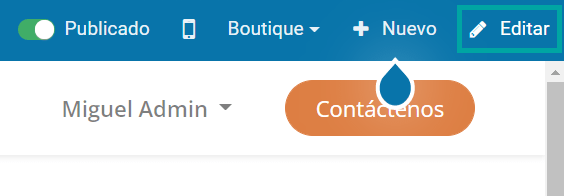
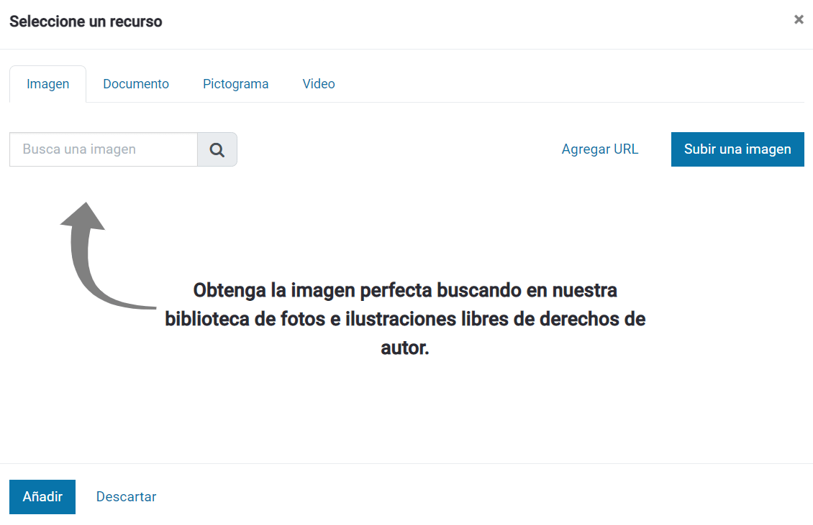
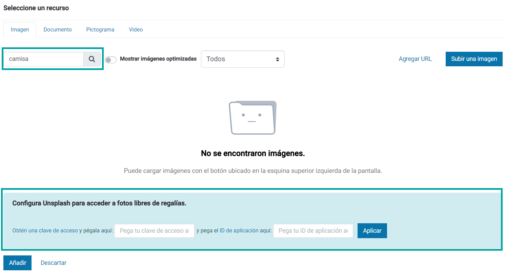
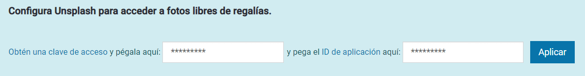
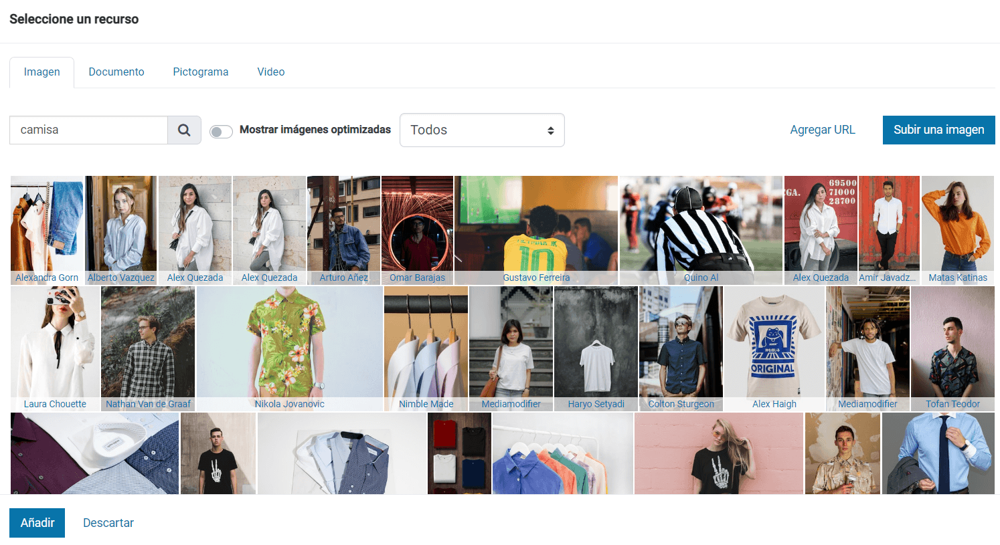

=============================
Unsplash (imágenes gratuitas)
=============================

**Unsplash** es un repositorio que permite navegar por un catálogo de imágenes gratuitas y descargarlas para ser utilizadas
en tu sitio web.

Configuración
=============

Unsplash
--------

Unsplash requiere una clave de acceso y un ID de aplicación. Para generar una clave de acceso y un ID de aplicación, debes
seguir los siguientes pasos:

#. Crea una cuenta en `Unsplash <https://unsplash.com/>`_.

#. Una vez conectado, navega al menú :menuselection:`Desarrolladores/API --> Your apps`, y haz clic en **New Application**.

   .. image:: unsplash/configurar-unsplash.png
      :align: center
      :alt: Configurar unsplash

#. Acepta las condiciones y haz clic en **Accept terms**.

   .. image:: unsplash/configurar-unsplash-2.png
      :align: center
      :alt: Configurar unsplash (2)

#. A continuación, aparecerá un formulario donde debes introducir un nombre para la aplicación y una descripción. Una
   vez informados los campos, haz clic en **Create application**.

   .. image:: unsplash/configurar-unsplash-3.png
      :align: center
      :alt: Configurar unsplash (3)

#. Una vez creada la aplicación, el sistema redirige a la pantalla de detalle de la aplicación, en donde puedes consultar
   la clave de acceso. Esta clave tendrá un límite de 50 peticiones por hora.

   .. image:: unsplash/configurar-unsplash-4.png
      :align: center
      :alt: Configurar unsplash (4)

#. Junto con la clave de acceso, necesitas también el identificador de la aplicación. Para ello, consulta la URL de la
   página del navegador, estando posicionados en la página de detalle de la aplicación. El identificador de la aplicación
   es el número que aparece al final de la URL:

   .. image:: unsplash/configurar-unsplash-5.png
      :align: center
      :alt: Configurar unsplash (5)

Daeris
------

Para configurar Unsplash en Daeris, navega a la página inicial de tu sitio web. A continuación, edita el contenido de la
página mediante el botón *Editar*, ubicado en la parte superior derecha del menú:

Al añadir una nueva imagen al sitio web o al personalizar cualquier elemento de imagen del sitio web, dispondrás de un
panel de configuración como el siguiente:

De entre las opciones disponibles, puedes utilizar una imagen del servidor, subir una nueva imagen, añadir una URL de imagen,
o bien, buscar imágenes de Unsplash.

Si tratas de buscar alguna imagen del repositorio de imágenes de Unsplash, aparecerá la siguiente pantalla de configuración:

Informa la clave de acceso y el identificador de la aplicación en la pantalla de configuración de Unsplash, y pulsa el
botón *Aplicar*:

Una vez aplicados los cambios, ya puedes visualizar las imágenes asociadas a la búsqueda realizada en Unsplash. Puedes
navegar por el repositorio de imágenes mostrado, seleccionando la imagen que más te interese y pulsando el botón *Añadir*
para incorporarla en el sitio web:

.. note::
   Unsplash contiene un repositorio muy extenso de imágenes gratuitas, pero la mayoría de contenidos son en inglés, por
   lo que al hacer las búsquedas de imágenes en Unsplash, es posible que encuentres más resultados realizando dichas
   búsquedas por palabras en inglés.