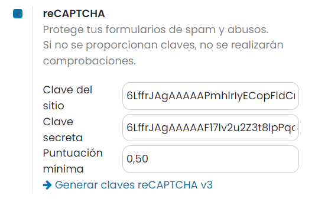
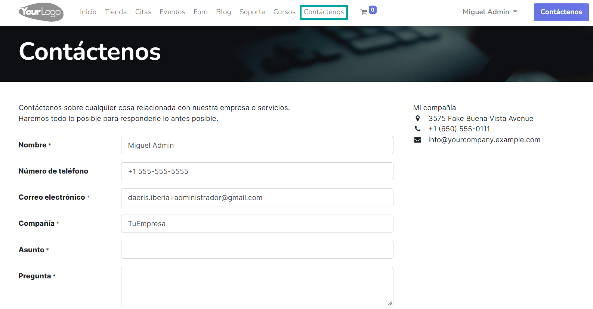
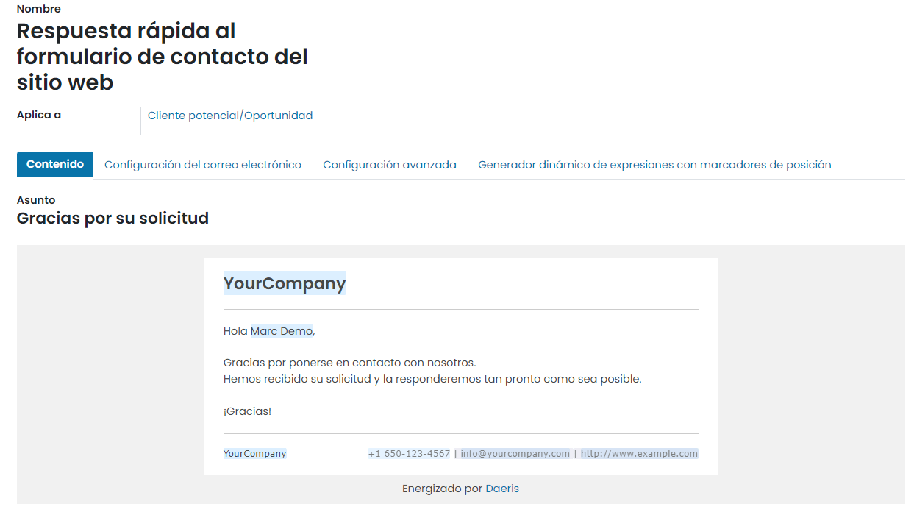
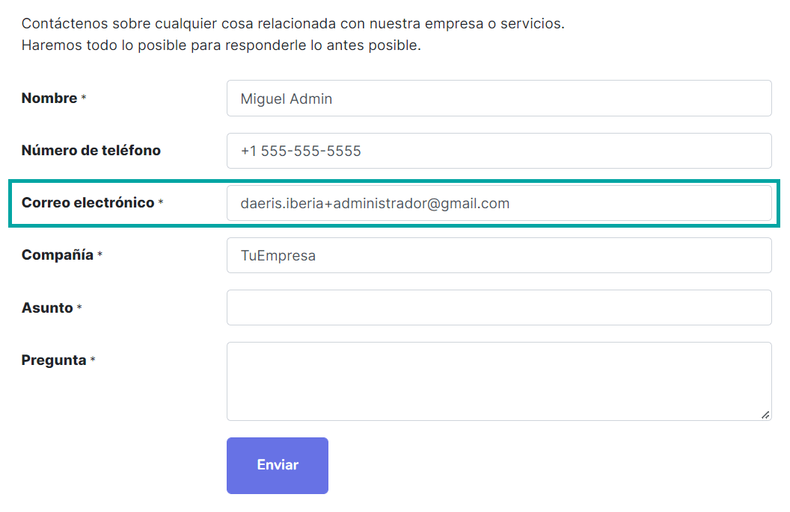
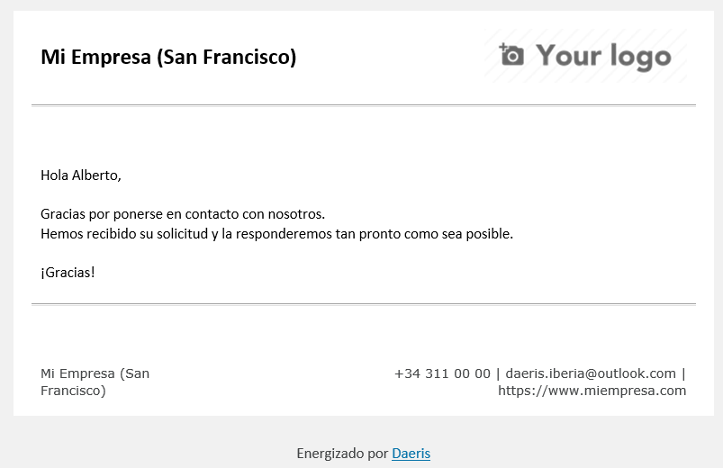
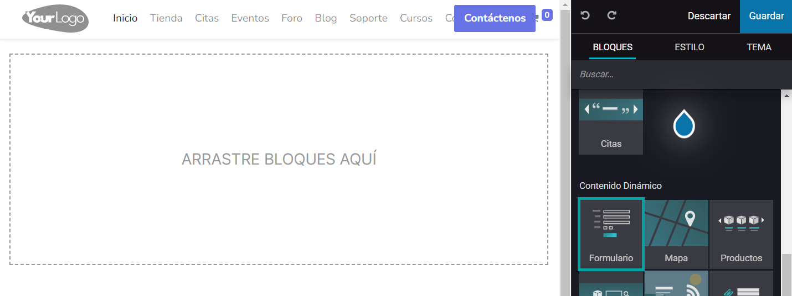
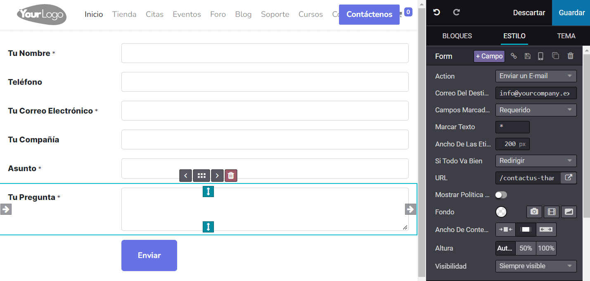
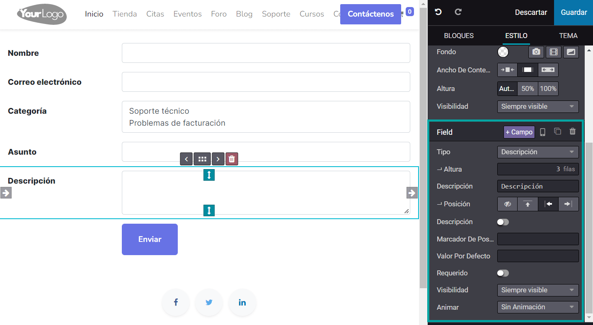

===========
Formularios
===========

Configurar Google ReCaptcha
===========================

El primer paso para utilizar los formularios del sitio web es configurar **Google reCaptcha**. Google reCaptcha
es un servicio gratuito que protege tu sitio web del spam. Utiliza técnicas avanzadas de análisis de riesgos para diferenciar
a humanos y robots.

Para configurar Google reCaptcha, navega a la pantalla :menuselection:`Ajustes --> Opciones generales`, y completa los
siguientes campos:

-  **Clave del sitio**: Debes introducir la clave del sitio.

-  **Clave secreta**: Debes introducir la clave secreta.

-  **Puntuación mínima**: Debe estar entre 0,0 y 1,0. 1,0 es muy probable que sea una buena interacción y 0,0 es muy probable
   que sea un bot.

.. note::
   Si no dispones de una clave ReCaptcha, puedes crear una pulsando el enlace *Generar claves reCAPTCHA v3*. La clave
   creada debe ser de tipo ReCaptcha v3 y el dominio debe coincidir con el dominio de tu instancia Daeris.

Una vez informadas las claves, debes pulsar el botón *Guardar* de la pantalla de ajustes.

Configurar el formulario de contacto genérico del sitio web
===========================================================

Por defecto, Daeris incorpora un formulario de contacto genérico en el sitio web, disponible desde la página **Contáctenos**.
Los clientes potenciales del sitio web pueden cumplimentar dicho formulario para ponerse en contacto con la empresa:

Existe una respuesta automática para que los usuarios que envíen un formulario de contacto genérico a través del sitio web,
reciban una respuesta en su buzón de correo electrónico. Para configurar la plantilla utilizada en esta respuesta, navega
a la pantalla :menuselection:`Ajustes --> Correo electrónico --> Plantillas`. La plantilla utilizada como respuesta
automática predeterminada es la siguiente:

.. tip::
   En caso de ser necesario, puedes modificar esta plantilla para incluir la información que se requiera incluir en el
   mensaje de respuesta automática.

.. seealso::
   * :doc:`../../../varios/correo_electronico/plantillas_correo`

Una vez finalizados los cambios, cuando un usuario complete el formulario de contacto del sitio web, y envíe los datos,
el sistema enviará un mensaje por correo electrónico a la dirección proporcionada en el formulario:

El mensaje enviado por correo electrónico tendrá el siguiente aspecto:

Al enviar el formulario, la información se registra en Daeris como un nuevo cliente potencial u oportunidad, y se puede
consultar desde el módulo de CRM. A partir de este momento, el departamento comercial debería acabar de editar la información
del cliente potencial u oportunidad y continuar con el ciclo de gestión de la venta.

Crear un formulario desde el editor del sitio web
=================================================

El constructor de formularios de Daeris permite crear nuevos formularios y publicarlos en tu sitio web, para que tus
visitantes los puedan rellenar y puedas obtener, de esta manera, información valiosa para tu negocio.

Para crear un formulario, pulsa el botón *Editar* del sitio web, y arrastra el bloque de **Formulario** dentro de la sección
de *Contenido Dinámico*:

Por defecto, se añade un formulario de envío de e-mail, pero si seleccionas cualquier campo del formulario, es posible
modificar el tipo de formulario así como los campos del mismo:

Desde el campo *Acción* tienes disponibles los siguientes valores:

-  **Enviar un E-mail**: Esta es la acción por defecto, y permite enviar un correo a la dirección especificada en el
   campo *Correo del Destinatario*.

   .. image:: formularios/crear-formulario-3.png
      :align: center
      :alt: Crear un formulario desde el editor del sitio web (3)

-  **Solicitar un Empleo**: Esta acción permite a los solicitantes de empleo adjuntar sus datos y su Currículum Vitae,
   para que sea revisado por el equipo de Recursos Humanos de la empresa. Será necesario especificar el *Trabajo solicitado*
   y el *Departamento* a la hora de configurar dicho formulario.

   .. image:: formularios/crear-formulario-4.png
      :align: center
      :alt: Crear un formulario desde el editor del sitio web (4)

-  **Crear una Oportunidad**: Esta acción permite crear un cliente potencial u oportunidad en el sistema, para que sea
   revisado por el equipo de ventas. Será necesario especificar el *Equipo de ventas* y el *Comercial* a la hora de
   configurar dicho formulario.

   .. image:: formularios/crear-formulario-5.png
      :align: center
      :alt: Crear un formulario desde el editor del sitio web (5)

-  **Crear un Contacto**: Esta acción permite crear un contacto en el sistema.

-  **Crear una Tarea**: Esta acción permite crear una tarea asociada a un proyecto. Será necesario especificar el proyecto
   al cuál debe quedar asociada dicha tarea.

   .. image:: formularios/crear-formulario-6.png
      :align: center
      :alt: Crear un formulario desde el editor del sitio web (6)

-  **Crear Ticket de Soporte**: Esta acción permite crear un ticket de soporte en el sistema. En este tipo de formulario
   se deberán añadir, al menos, los campos requeridos, que son el *Nombre*, *Correo electrónico*, *Categoría*, *Asunto*
   y *Descripción*. Es posible añadir dichos campos mediante el botón **+ Campo**, disponible en el editor:

   .. image:: formularios/crear-formulario-7.png
      :align: center
      :alt: Crear un formulario desde el editor del sitio web (7)

En cualquiera de los formularios creados, es posible configurar el nombre y formato de los campos, seleccionando el campo
en cuestión, y accediendo a la configuración de campos del editor:

Una vez configurado el formulario, pulsa el botón *Guardar* para que se apliquen los cambios.

A partir de ese momento, el formulario quedará disponible en la aplicación para que sea informado por los visitantes
del sitio web.