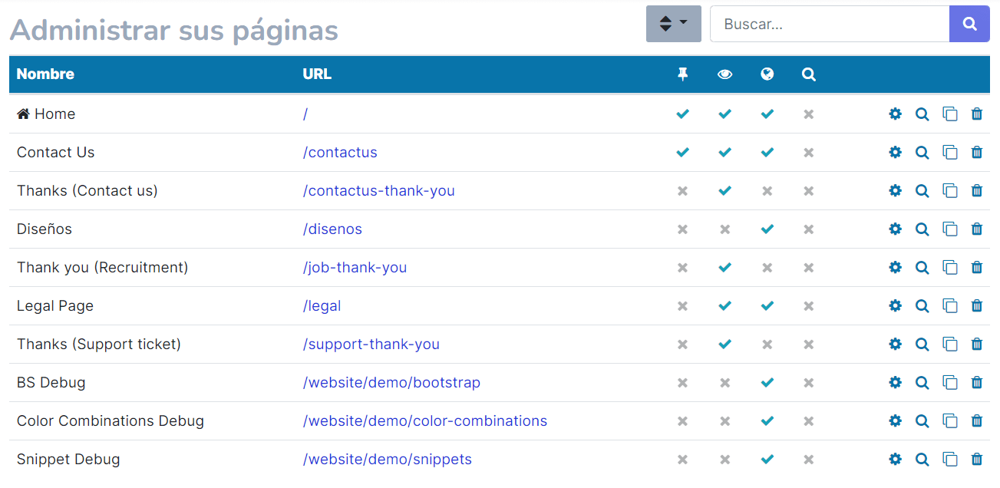
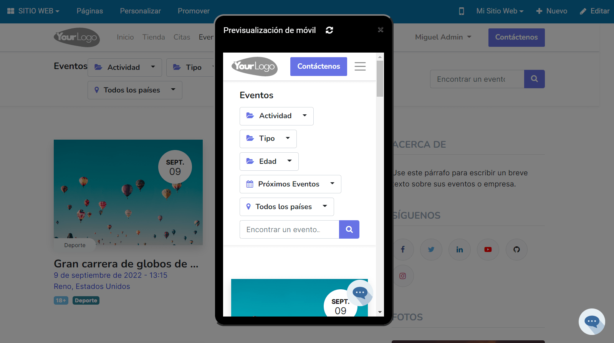

==============
Gestión básica
==============

.. _sitios_web/publicar/personalizar_nombre_dominio:

Personalizar el nombre de dominio
=================================

Por defecto, el sitio web de Daeris utiliza el nombre dominio *miempresa.daeris.com*, donde *miempresa* es único para
cada cliente registrado en Daeris.

Es bastante común que los clientes quieran utilizar su propio nombre de dominio, por ejemplo *miempresa.com*. Esto es
posible con Daeris, y los pasos a seguir son los siguientes:

#. Debes disponer de un dominio propio, por ejemplo *miempresa.com*. Los nombres de dominio se pueden obtener en línea a
   través de multitud de proveedores de dominio existentes en el mercado.

#. Envía un correo a soporte@daeris.com indicando en el asunto del correo `Personalizar nombre de dominio miempresa.daeris.com`,
   donde *miempresa* se corresponde con tu nombre de dominio actual.

#. Una vez enviado el correo, espera a que el equipo de soporte de Daeris se ponga en contacto contigo para iniciar las
   gestiones de cambio de dominio.

Ejecutar el configurador del sitio web
======================================

El configurador del sitio web de Daeris te permite construir tu sitio web de forma automática en unos pocos pasos con
solo responder a unas simples preguntas. Para lanzar el configurador del sitio web, navega a la pantalla
:menuselection:`Sitio web --> Configuración --> Ajustes` y pulsa el botón **Configurador del Sitio Web**:

.. important::
   El configurador del sitio web solo se puede ejecutar una vez por cada sitio web creado. Después de ejecutar el configurador,
   se permitirá solamente cambiar el tema del sitio web.

El sistema navegará al configurador del sitio web. Pulsa el botón **Vamos a hacerlo** para iniciar el configurador:

.. warning::
   Si pulsas el enlace *Saltar y empezar de cero*, el sistema te permitirá seleccionar un tema para que configures el
   sitio web de forma manual, pero ya no podrás volver a lanzar el configurador para este sitio web.

En primer lugar, indica qué tipo de sitio web deseas. Las opciones disponibles son un sitio web empresarial, una tienda
en línea, un blog, un sitio web de eventos o una plataforma de eventos:

A continuación, deberás escribir en inglés el nombre de tu industria o tipo de negocio. El sistema buscará en una base de
datos de industrias, y te mostrará las coincidencias:

Tras esto, indica el objetivo principal de tu sitio web. Las opciones disponibles son obtener clientes potenciales,
desarrollar la marca, vender más, informar a los clientes o programar citas:

El siguiente paso consiste en seleccionar una paleta de colores predefinida para tu sitio web. También puedes cargar tu
logo para que el sistema detecte de forma automática los colores del mismo:

Por último, selecciona las páginas y características que quieres que aparezcan en tu sitio web. Una vez hayas seleccionado
todo lo que necesites, pulsa el botón **Construir mi sitio web**:

.. image:: gestion_basica/configurador-sitio-web-7.png
   :align: center
   :alt: Ejecutar el configurador del sitio web (7)

.. note::
   Algunas páginas y características aparecen instaladas por defecto. Más adelante, podrás ocultar las páginas que no
   necesites editando el menú del sitio web.

El sistema mostrará tres opciones de diseño distintas para tu sitio web. Selecciona la opción que más se adapte a tus
necesidades para instalar ese tema:

Una vez seleccionado el tema, el sistema construirá el sitio web de forma automática, en base a las respuestas proporcionadas
en el configurador:

Al finalizar, podrás editar el contenido de las páginas del sitio web para adaptarlas a tu negocio:

Personalizar el tema del sitio web
==================================

Daeris pone a tu disposición una amplia variedad de temas con diferentes diseños y estilos. Para personalizar el tema del
sitio web, navega a la pantalla :menuselection:`Sitio web --> Configuración --> Ajustes`, y pulsa el botón **Elige un tema**:

.. note::
   Si no aparece el botón de **Elige un tema** y en su lugar aparece el botón de **Configurador del Sitio Web**, deberás
   ejecutar el configurador para construir tu sitio web, y más tarde, si lo deseas, siempre podrás cambiar el tema, una
   vez hayas finalizado el configurador.

Por defecto, Daeris trae instalado el tema por defecto, que no contiene ningún diseño ni estilo predeterminado. Pero puedes
instalar cualquier otro tema de los disponibles en la aplicación:

Antes de instalar el nuevo tema, puedes revisar su diseño pulsando el botón **Previsualización en vivo**:

.. image:: gestion_basica/personalizar-tema-3.png
   :align: center
   :alt: Personalizar el tema del sitio web (3)

El sistema navegará a una pantalla en donde podrás visualizar el diseño del tema para confirmar que se ajusta a tus
necesidades. Mediante los botones *Escritorio* y *Móvil* puedes cambiar el formato de la pantalla para visualizar el tema
en dispositivo de escritorio o móvil. Si el tema es el adecuado, pulsa el botón **Empezar ahora**, y si quieres seleccionar
otro tema, pulsa el enlace **Elige otro tema**:

Al pulsar el botón de **Empezar ahora** el sistema instalará el nuevo tema:

Una vez finalizado, aparecerá el sitio web en formato de edición para que sea posible personalizar las diferentes páginas
del sitio web. Desde la sección de **TEMA** es posible personalizar el tema seleccionado:

Desde el apartado de personalización del tema, se muestran las siguientes opciones:

-  **Colores**: Permite seleccionar colores principales, de fondo, de texto y de estado:

   .. image:: gestion_basica/personalizar-tema-7.png
      :align: center
      :alt: Personalizar el tema del sitio web (7)

-  **Diseño**: Permite seleccionar el diseño del contenido de la página, el fondo y el encabezado:

   .. image:: gestion_basica/personalizar-tema-8.png
      :align: center
      :alt: Personalizar el tema del sitio web (8)

-  **Tipos de letra**: Permite seleccionar las diferentes fuentes utilizadas:

   .. image:: gestion_basica/personalizar-tema-9.png
      :align: center
      :alt: Personalizar el tema del sitio web (9)

-  **Botones** Permite seleccionar el diseño de los botones:

   .. image:: gestion_basica/personalizar-tema-10.png
      :align: center
      :alt: Personalizar el tema del sitio web (10)

-  **Entradas**: Permite seleccionar el diseño de los campos:

   .. image:: gestion_basica/personalizar-tema-11.png
      :align: center
      :alt: Personalizar el tema del sitio web (11)

Una vez finalizados los cambios, pulsa el botón *Guardar*.

Editar el contenido de una página
=================================

Para editar el contenido de una página del sitio web pulsa el botón **Editar**, ubicado en la parte superior derecha del menú:

Al entrar en el modo edición, aparece un menú en la parte derecha de la pantalla con todos los bloques disponibles,
organizados por categorías:

Mediante el buscador, es posible filtrar aquellos bloques relacionados con el texto de búsqueda:

Al arrastrar un bloque al contenido de la página, por ejemplo, el de portada, puedes personalizar dicho bloque, para
adaptarlo a las necesidades de tu negocio. Cada bloque dispone de sus propias opciones de personalización. En este caso,
puedes editar todos los textos mostrados en el bloque, así como personalizar sus propiedades (tipografía, imagen de fondo,
estilos, colores, etc.) en función del tipo de elemento. Para esto, posiciónate sobre el elemento a modificar, y desde
la sección de **ESTILO**, modifica sus propiedades:

Una vez hayas personalizado la página, incluyendo y adaptando todos los bloques necesarios, pulsa el botón *Guardar*.
Esto te llevará de nuevo a la página del sitio web, donde podrás visualizar los cambios realizados.

Utilizar el editor de HTML, CSS y JS
------------------------------------

Para utilizar el editor de HTML, CSS y JS, selecciona la opción del menú :menuselection:`Personalizar --> Editor HTML/CSS/JS`:

Al seleccionar dicha opción, aparece un desplegable en la parte derecha de la pantalla que te permite visualizar y
editar el código HTML, CSS y JS de la página:

.. warning::
   Esta opción se recomienda solamente para usuarios avanzados, ya que cualquier modificación en el código puede
   provocar errores en la página modificada.

Una vez actualizado el código, pulsa el botón *Guardar*, que guardará los cambios en la página y refrescará el contenido
de la misma.

Crear una nueva página
======================

Para crear una nueva página en el sitio web, pulsa el enlace **Nuevo**, ubicado en la parte superior derecha del menú:

Esto desplegará una ventana con una serie de opciones, entre las cuáles debes seleccionar la opción de **Página**:

A continuación, informa el nombre de la nueva página y haz clic en el botón *Crear*:

.. image:: gestion_basica/crear-pagina-3.png
   :align: center
   :alt: Crear una nueva página en el sitio web (3)

Esto te lleva al modo de edición, en donde puedes arrastrar los bloques necesarios para la confección de la nueva página:

Una vez finalizados los cambios, pulsa el botón *Guardar*.

Si quieres que la página sea visible para los visitantes, será necesario que publiques la página desde el botón ubicado
en la parte superior derecha del menú:

Una vez publicada, la página ya será visible para los visitantes del sitio web.

Editar el menú
==============

Mediante la opción de menú :menuselection:`Páginas --> Editar menú`, puedes editar las diferentes opciones de menú
mostradas en el sitio web:

El sistema desplegará una ventana en donde podrás editar las opciones de menú existentes, eliminarlas, reubicarlas y
añadir nuevas entradas de menú:

Si quieres editar o añadir una nueva entrada de menú, informa los siguientes campos:

-  **Etiqueta de menú**: Texto que se muestra en el enlace del menú.

-  **URL o correo electrónico**: URL en donde está ubicada la página o dirección de correo electrónico que se establecerá
   en el enlace.

Por último, si lo que quieres es crear submenús, debes arrastrar alguna de las opciones de menú existentes a la derecha
para que cuelgue de la opción de menú superior:

Configurar un mega menú
-----------------------

Para configurar un mega menú, pulsa el enlace *Agregar elemento de mega menú*, desde el formulario de edición de menú
del sitio web:

A continuación, informa un nombre para el elemento del menú y pulsa el botón *Guardar*:

El mega menú quedará creado y aparecerá con la etiqueta *Mega menú*:

.. image:: gestion_basica/editar-menu-7.png
   :align: center
   :alt: Editar el menú del sitio web (7)

Guarda los cambios del menú y accede a la pantalla de edición del sitio web, desde donde podrás personalizar el mega menú,
seleccionando el bloque del propio mega menú, y accediendo a la sección de **ESTILO**:

Desde el apartado de *Mega Menú*, puedes seleccionar una plantilla y un tamaño para tu mega menú:

.. image:: gestion_basica/editar-menu-9.png
   :align: center
   :alt: Editar el menú del sitio web (9)

Una vez realizados los cambios sobre el estilo, modifica el contenido del mega menú y guarda los cambios mediante el botón
*Guardar*.

Administrar las páginas
=======================

Para administrar las páginas del sitio web, selecciona la opción del menú :menuselection:`Páginas --> Administrar páginas`:

Puedes gestionar las diferentes páginas existentes en el sitio web, aunque solo aparecerán aquellas que sean administrables
desde esta opción de menú:

.. note::
   Hay otras páginas que se administran desde sus propios módulos del backend y que se documentan en manuales específicos.

Para administrar una página, pulsa sobre el icono de **Administrar página**:

A continuación, se desplegará una ventana con la siguiente información:

Si navegas a la pestaña de **Publicar**, aparecen una serie de opciones relacionadas con la publicación e indexación de la página:

.. note::
   Si estás posicionado en alguna de las páginas del sitio web y seleccionas el menú :menuselection:`Páginas --> Propiedades de la página`,
   se desplegará la misma ventana que si pulsas sobre el icono de **Administrar página** desde la administración de páginas.

Una vez realizados los cambios en las propiedades de la página, pulsa el botón *Guardar*.

Visualizar una página en formato móvil
======================================

Para visualizar una página del sitio web en formato móvil, pulsa el botón **Previsualización móvil** ubicado en la parte
superior derecha de la pantalla:

Al pulsar dicho botón, se desplegará una ventana en donde poder visualizar la página en formato móvil, para validar que
se ajusta a tus necesidades:

Pulsando el icono ubicado a la derecha del texto *Previsualización de móvil*, la ventana cambia a formato horizontal:

Desde algunos navegadores también es posible visualizar las páginas del sitio web en modo responsivo. Por ejemplo, si
accedes a modo desarrollador de Google Chrome (F12), puedes seleccionar entre varios tipos de dispositivos, y visualizar
la página en sus respectivos formatos:

Configurar el aviso de cookies
==============================

Las **cookies** son pequeños archivos que se dejan automáticamente en tu ordenador mientras navegas por la web. En sí mismas,
son inofensivas porciones de texto que se almacenan localmente y se pueden ver y eliminar fácilmente. Pero las cookies
pueden dar una gran visión de tus actividades y preferencias, y se pueden utilizar para identificarte sin tu consentimiento
explícito.

.. note::
   Puedes encontrar más información acerca de las cookies `aquí <https://es.wikipedia.org/wiki/Cookie_(inform%C3%A1tica)>`_.

El aviso de cookies es el texto con el que debes informar a los usuarios que visitan tu sitio web acerca del tratamiento y
utilización de las cookies, cumpliendo así con la Ley. Con el aviso de cookies, el visitante debe obtener una información
detallada sobre las cookies de tu sitio web.

A nivel europeo, el Reglamento general de protección de datos (RGPD) y la Directiva sobre la privacidad y las comunicaciones
electrónicas afectan cómo los propietarios de los sitios web pueden hacer uso de las cookies y seguimiento en línea de los
visitantes de la UE. Según este reglamento, un consentimiento adecuado del uso de cookies debe ser:

-  **Informado**: ¿Por qué, cómo y dónde se están utilizando los datos personales? Debe estar claro para el usuario, a
   qué le está dando consentimiento, y debe ser posible aceptar o rechazar los diversos tipos de cookies.

-  **Basado en una opción verdadera**: Esto significa, por ejemplo, que el usuario debe tener acceso a la web, aunque la
   mayoría, excepto las cookies estrictamente necesarias, hayan sido rechazadas.

-  **Otorgado a través de una acción afirmativa y positiva que no se pueda malinterpretar.**

-  **Otorgado antes del tratamiento de cualquier tipo de datos personales.**

-  **Movible**: Debe ser fácil para el usuario cambiar de parecer y retirar el consentimiento.

Para activar el aviso de cookies del sitio web, navega a la pantalla :menuselection:`Sitio web --> Configuración --> Ajustes`
y activa la opción de **Barra de cookies**:

Una vez activado, pulsa el botón *Guardar* de la pantalla de ajustes.

A partir de ese momento, el sitio web de Daeris incluirá un aviso de cookies preconfigurado, que se mostrará a los visitantes
en la parte inferior de la pantalla:

El aviso de cookies permite aceptar o rechazar las cookies, mediante los botones incluidos en el aviso. También dispone de
un enlace hacia la política de cookies. Mediante el botón de **Déjame elegir**, es posible acceder a la configuración:

Desde esta pantalla de configuración, el usuario puede consultar la información acerca de todas las cookies utilizadas
en el sistema, y puede otorgar o retirar el consentimiento de todas las cookies que deseé, excepto aquellas esenciales
y necesarias para el correcto funcionamiento del sitio web.

Una vez confirmada la selección del usuario, en caso que requiera modificar su consentimiento, lo puede hacer mediante
el enlace **Gestionar cookies** incluido en el pie de página:

Este enlace abrirá de nuevo la pantalla de configuración de cookies para que el usuario pueda hacer los cambios que requiera.