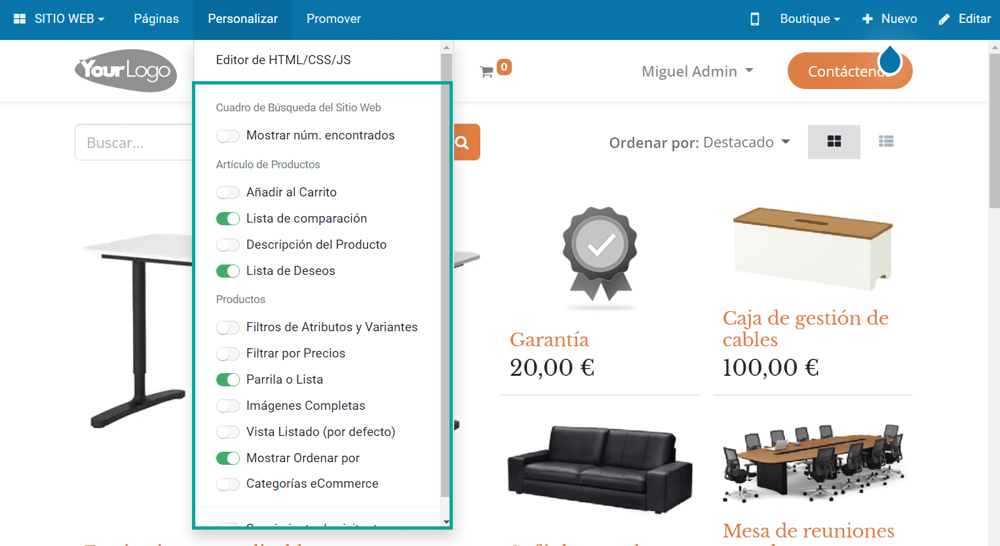

==============================
Gestionar múltiples sitios web
==============================

Crear un nuevo sitio web
========================

Con la funcionalidad de multi sitio web, cada sitio web puede funcionar de forma totalmente independiente, con su tema,
marca, encabezado y pie de página, páginas, idiomas, productos, publicaciones de blog, foro, presentaciones, eventos,
canales de chat en vivo, etc.

Para crear un nuevo sitio web navega a la pantalla :menuselection:`Sitio Web --> Configuración --> Ajustes` y pulsa el
botón **Crear un nuevo sitio web**, ubicado en la cabecera:

A continuación, configura un nombre para tu nuevo sitio. En un primer momento, el nombre de dominio se deberá dejar en
blanco para publicar el nuevo sitio web en el dominio predeterminado. Más adelante se detallará cómo modificar el nombre
de dominio. Una vez completado el formulario, pulsa el botón *Crear*:

En la pantalla de configurador de sitio web, pulsa el botón **Vamos a hacerlo**:

El sistema permitirá seleccionar un tema para el nuevo sitio web:

Una vez que hayas seleccionado el tema, ya puedes comenzar a construir la página de inicio de tu sitio web:

Configurar el nombre de dominio
===============================

Los sitios web publicados en Daeris pueden compartir el mismo nombre de dominio o usar uno específico. Si el nombre es
compartido, es posible adaptar el contenido por región, configurando los grupos de países en la configuración de cada
sitio web. De esta manera, los visitantes serán redirigidos al sitio web correcto utilizando **Geo IP**.

Para ello, navega a la pantalla :menuselection:`Sitio web --> Configuración --> Ajustes`, e informa el grupo de países
que aplica a cada sitio web:

.. image:: multi_sitio_web/configurar-dominio.png
   :align: center
   :alt: Configurar el nombre de dominio

Por otra parte, si lo que quieres es disponer de un nombre de dominio distinto para cada sitio web, lo que debes hacer
en primer lugar es personalizar tu nombre de dominio.

.. seealso::
   * :ref:`sitios_web/publicar/personalizar_nombre_dominio`

Una vez personalizado el nombre de dominio, ya puedes modificar el dominio en el sitio web. Para ello, selecciona el
sitio web a configurar desde la pantalla :menuselection:`Sitio web --> Configuración --> Ajustes`:

Y, por último, informa el nombre de dominio personalizado que le corresponde a ese sitio web:

Crear un menú
=============

Tras crear un sitio web adicional, el nuevo sitio web tiene un menú que incluye, por defecto, todas las aplicaciones
instaladas. Para editarlo, haz clic en el menú :menuselection:`Páginas --> Editar menú`. De esta manera, se estará
editando solamente el menú del sitio web actual:

Cambiar de un sitio web a otro
==============================

Para cambiar de un sitio web a otro en multi sitio web, navega a la pantalla :menuselection:`Sitio web --> Configuración --> Ajustes`,
y selecciona el sitio web que quieres editar:

Una vez seleccionado el sitio web, pulsa el botón **Ir al sitio web**:

Esto te llevará a la página inicial del sitio web seleccionado:

.. note::
   Si intentas cambiar el sitio web desde el desplegable ubicado en el menú superior del sitio web, se conectará con el
   dominio de ese sitio web, y en caso de ser distinto al dominio actual, se solicitará que el usuario inicie sesión. Por
   lo tanto, la recomendación es cambiar de sitio web desde la pantalla de ajustes, tal y como se ha detallado en esta
   página de la documentación.

Configurar los ajustes del sitio web
====================================

En primer lugar, navega a la pantalla :menuselection:`Sitio web --> Configuración --> Ajustes`, y selecciona el sitio web
que quieras editar:

Cada sitio web tiene una serie de opciones específicas en la pantalla de ajustes. Todos los campos con un icono del planeta
tierra indican que solo tienen efecto en el sitio web que hayas seleccionado en el desplegable:

Por ejemplo, es posible configurar opciones específicas para:

-  Idiomas

-  Dominios

-  Enlaces a redes sociales

-  Canales de chat en vivo

-  Etc.

El resto de opciones que no aparecen con el icono de planeta tierra, son globales y aplican a todos los sitios web.

Personalizar las páginas del sitio web
======================================

La experiencia de usuario puede ser personalizada a través del menú :menuselection:`Personalizar` del sitio web. Todas
las opciones disponibles son específicas de cada sitio web. Será necesario navegar a través de las diferentes páginas
del sitio web y adaptarlas a la nueva audiencia:

Publicar contenido específico por sitio web
===========================================

Cualquier contenido creado desde el sitio web (productos, publicaciones del blog, etc.) se publica siempre en el sitio web
en el que te encuentres ubicado. Es posible modificar esta propiedad y hacer que el contenido sea publicado en todos los
sitios web.

Por ejemplo, desde la pantalla :menuselection:`Sitio web --> Configuración --> Blogs`, si accedes al detalle de un blog,
puedes observar como aparece un campo correspondiente al sitio web. Si el campo está informado, el blog será específico
de ese sitio web, mientras que, si el campo está vacío, el blog será publicado en todos los sitios web:

A continuación se detallan varios objetos que es posible relacionar con uno o con todos los sitios web:

-  Productos

-  Categorías de producto del eCommerce

-  Blogs

-  Cursos

-  Foros

-  Eventos

-  Puestos de trabajo

.. note::
   Cuando un registro se crea desde el backend y se publica, como por ejemplo un producto o un evento, queda disponible
   por defecto en todos los sitios web.

Administrar las páginas del sitio web
=====================================

Las páginas estáticas se crean y quedan disponibles solamente en el sitio web en el que te encuentres ubicado. Es posible
duplicarlas a otros sitios web desde la pantalla :menuselection:`Sitio web --> Configuración --> Páginas`. Para que una
página quede publicada en todos los sitios web, deja el campo sitio web en blanco. Si lo que pretendes es duplicarla solo
en un sitio web, informa el sitio web en el campo correspondiente:

Desde el sitio web, es posible gestionar las páginas desde el menú :menuselection:`Páginas --> Administrar páginas`. Cuando
se edita una página publicada en todos los sitios web, se duplica la página de forma automática. Con la agrupación de
páginas del administrador de páginas, es posible identificar de forma sencilla la página original de las páginas editadas:

.. image:: multi_sitio_web/administrar-paginas-2.png
   :align: center
   :alt: Administrar las páginas del sitio web (2)

Multiempresas
=============

Cada sitio web puede vincularse a una empresa específica de tu sistema, en un entorno multiempresas. Para ello, informa
el campo **Compañía** en la página :menuselection:`Sitio web --> Configuración --> Ajustes`:

Con esta configuración, en el sitio web solo aparecerán datos relacionados con la empresa seleccionada (productos,
trabajos, eventos, etc.).

Los editores de sitios web solo pueden ver y editar las páginas de los registros a los que tienen acceso, generalmente
los que pertenecen a su empresa actual (y a sus empresas secundarias). Y pasa lo mismo con los visitantes del sitio web.

Configurar eCommerce en multi sitio web
=======================================

Para configurar el sitio web asociado a un producto, navega a la pantalla :menuselection:`Sitio web --> Productos --> Productos`,
y desde el detalle de un producto, en la pestaña *Ventas*, especifica el sitio web en el que quieres que se
visualice el producto, o déjalo en blanco si quieres que se visualice en todos los sitios web:

.. note::
   Si lo que quieres es publicar el producto en algunos sitios web, pero no en todos, será necesario duplicar el producto
   para cada sitio web.

Por otro lado, para gestionar diferentes tarifas por sitio web, navega a la pantalla :menuselection:`Sitio web --> Productos --> Tarifas`
para crear tarifas adicionales. Dentro de la nueva tarifa creada, se puede seleccionar el sitio web para hacer esa tarifa
disponible solamente desde el sitio web seleccionado. Si dejas ese campo en blanco, quiere decir que esa tarifa aplicará a
todos los sitios web, siempre y cuando se haya marcado la opción *Seleccionable*. Si no se marca esa opción, solo estará
disponible para operaciones de las aplicaciones de *Ventas* y *Punto de Venta*:

En cuanto a los métodos de pago y los métodos de envío, por defecto, siempre estarán publicados en todos los sitios web.
Es posible limitar los métodos de pago informando el campo de sitio web desde la pantalla :menuselection:`Sitio web --> Configuración --> Métodos de pago`,
accediendo al detalle de un método de pago:

Del mismo modo, es posible limitar los métodos de envío informando el campo de sitio web desde la pantalla
:menuselection:`Sitio web --> Configuración --> Métodos de envío`, accediendo al detalle de un método de envío:

Por último, hay una opción que permite elegir cómo gestionar las cuentas de usuario en los sitios web. Es posible permitir
a los clientes utilizar una cuenta a través de todos los sitios web, u obligarles a crear una cuenta para cada sitio web.
Esta última opción es la más conveniente si tus sitios web no deben estar relacionados desde el punto de vista del visitante.
Para informar una opción u otra, navega a la pantalla :menuselection:`Sitio web --> Configuración --> Ajustes`:

