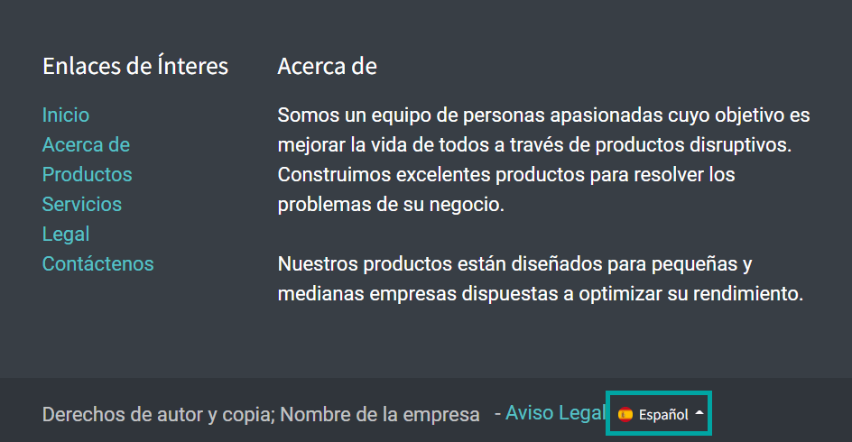
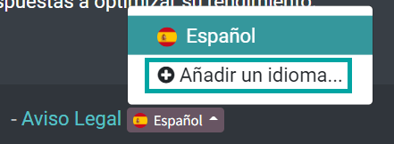
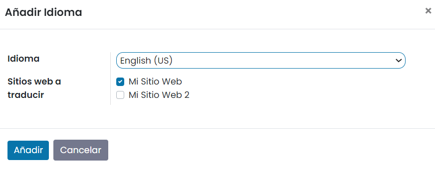
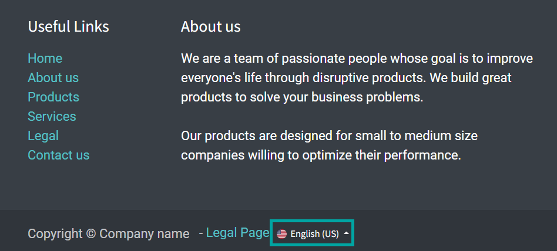
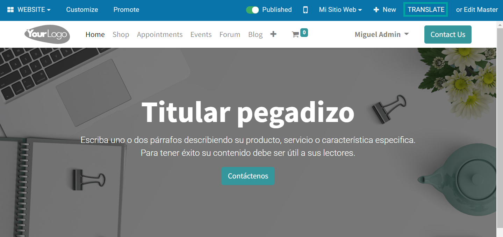
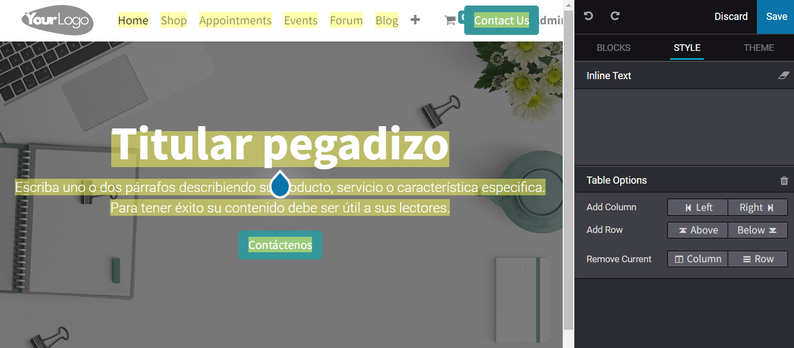
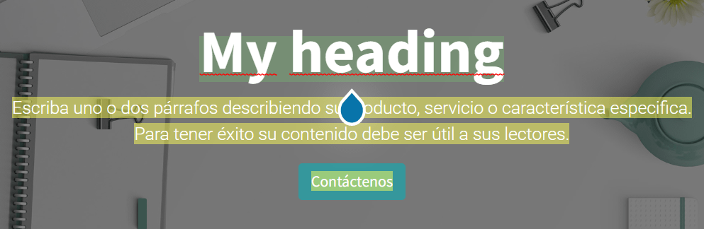

=======================================
Traducir el sitio web a un nuevo idioma
=======================================

El sitio web de Daeris te brinda la posibilidad de traducirlo a varios idiomas. Por defecto, los idiomas instalados se
pueden consultar en el pie de página del sitio web:

Para añadir un nuevo idioma, pulsa la opción de **Añadir un idioma**:

A continuación, selecciona el idioma al cual quieres traducir el sitio web, y pulsa el botón **Añadir**:

Una vez cargado el nuevo idioma, aparecerá disponible en las opciones de idioma del pie de página del sitio web:

Algunos de los textos habrán sido traducidos automáticamente al nuevo idioma, mientras que otros estarán sin traducir.
Para traducir el contenido del sitio web al nuevo idioma, pulsa el botón **Traducir** (en este ejemplo, *TRANSLATE*, del
inglés), ubicado en el menú de la parte superior derecha de la pantalla:

En el modo de traducción, aparece una serie de contenido resaltado en amarillo, que se corresponde con el contenido que
se debe traducir al nuevo idioma:

Conforme se vaya traduciendo el contenido, el sistema irá resaltando en verde todo el contenido ya traducido, para que
puedas llevar un control de lo que queda por traducir:

Una vez traducido el contenido pulsa el botón **Guardar** (en este ejemplo, *Save*, del inglés).