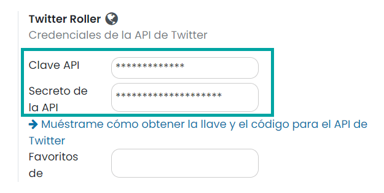
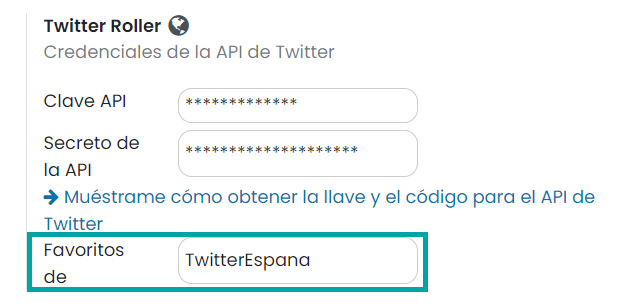
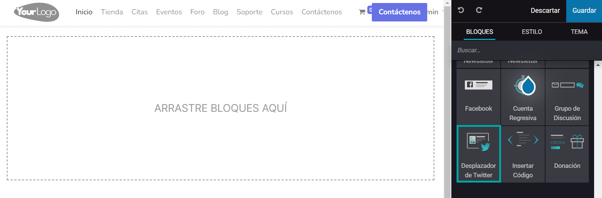
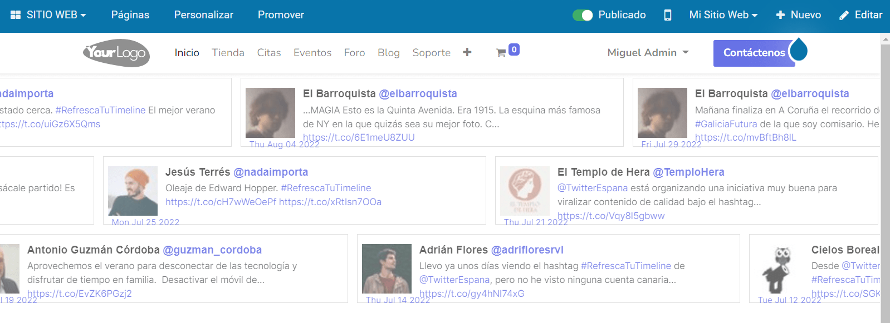

==============
Twitter Roller
==============

La integración de Twitter con el sitio web de Daeris permite añadir un bloque en las páginas del sitio web en donde se
muestran los Tweets favoritos de una cuenta de Twitter. Dicha cuenta es configurable desde la pantalla de ajustes.

Configuración
=============

App de Twitter
--------------

Para configurar la integración de Twitter con el sitio web es necesario crear una app de Twitter, tal y como se muestra
en los siguientes pasos:

#. Navega a la `plataforma de desarrollo de Twitter <https://developer.twitter.com>`_ y pulsa el botón *Sign in* para
   iniciar sesión con tu cuenta de Twitter o *Sign up* para registrarte.

   .. image:: twitter/twitter-roller.png
      :align: center
      :alt: Twitter Roller

#. Tras iniciar sesión, accede al portal del desarrollador. Si no dispones de cuenta de desarrollador, completa el formulario
   como se muestra a continuación y pulsa el botón *Let's do this*:

   .. image:: twitter/twitter-roller-2.png
      :align: center
      :alt: Twitter Roller (2)

#. A continuación, acepta los términos y condiciones y pulsa el botón *Submit*:

   .. image:: twitter/twitter-roller-3.png
      :align: center
      :alt: Twitter Roller (3)

   .. note::
      Es necesario disponer de un número de teléfono asociado a tu usuario de Twitter para poder aceptar los términos
      y condiciones.

#. Una vez activa la cuenta de desarrollador, crea una nueva app. En el campo nombre, informa un nombre descriptivo
   y pulsa el botón *Get keys*:

   .. image:: twitter/twitter-roller-4.png
      :align: center
      :alt: Twitter Roller (4)

#. Copia las claves generadas por Twitter para que puedan ser introducidas en Daeris:

   .. image:: twitter/twitter-roller-5.png
      :align: center
      :alt: Twitter Roller (5)

#. Obtén acceso *Elevated* para tu proyecto, desde la página `https://developer.twitter.com/en/portal/products/elevated`,
   pulsando el botón *Apply* y completando el formulario.

   .. image:: twitter/twitter-roller-5b.png
      :align: center
      :alt: Twitter Roller (5b)

Introducir credenciales en Daeris
---------------------------------

Una vez configurada la app de Twitter, desde la aplicación Daeris, navega a la pantalla :menuselection:`Sitio Web --> Configuración --> Ajustes`,
e informa las claves copiadas en el paso anterior en los campos correspondientes:

En el campo **Favoritos de**, debes informar el nombre de la cuenta de Twitter desde la que se desean cargar los favoritos.
No tiene porqué ser la misma que la de la clave API. Por ejemplo, puedes indicar que quieres visualizar los favoritos de
la cuenta de *TwitterEspana*:

Cuando hayas informado los campos, pulsa el botón *Guardar* en la pantalla de ajustes.

Añadir roller de Twitter en el sitio web
========================================

Una vez realizada la configuración, navega a una página del sitio web y pulsa el botón *Editar* para modificar los bloques
de la página. Dentro del modo edición, arrastra el bloque *Desplazador de Twitter* hacia la izquierda y posiciónalo en el
contenido de la página:

Una vez hecho esto, pulsa el botón *Guardar*, para que los cambios queden registrados.

Puedes observar cómo se ha añadido una nueva sección en donde aparecen todos los tweets favoritos de la cuenta seleccionada
en los ajustes, y dichos tweets se desplazan de forma automática por la pantalla:

