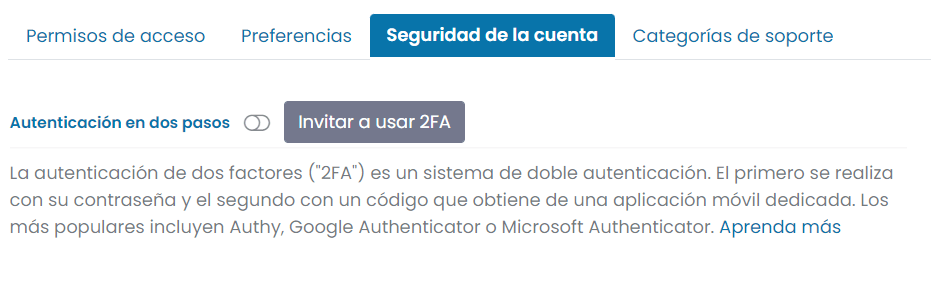
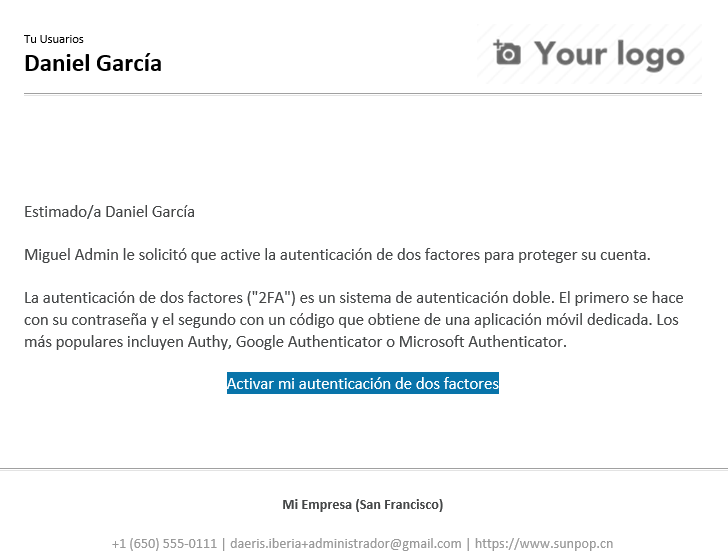
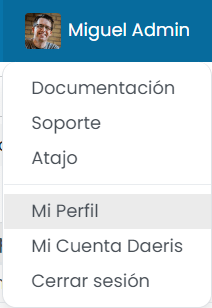
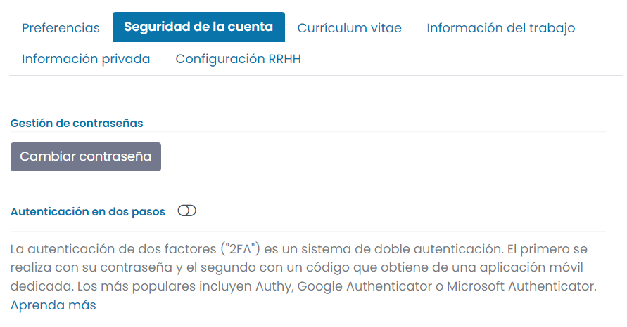
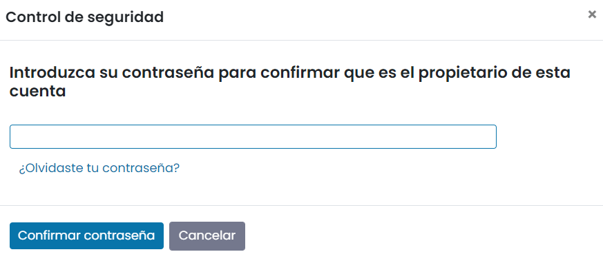
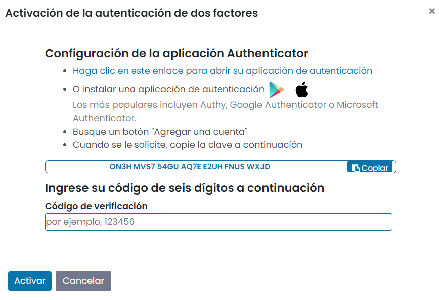
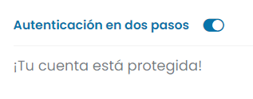
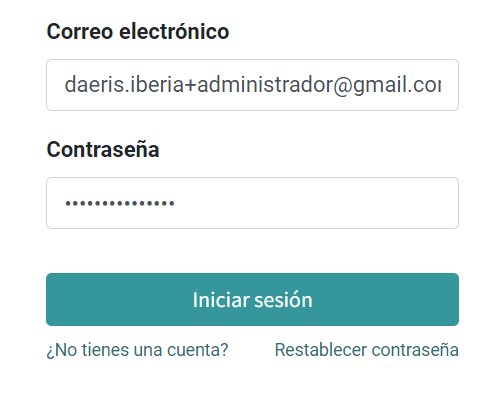
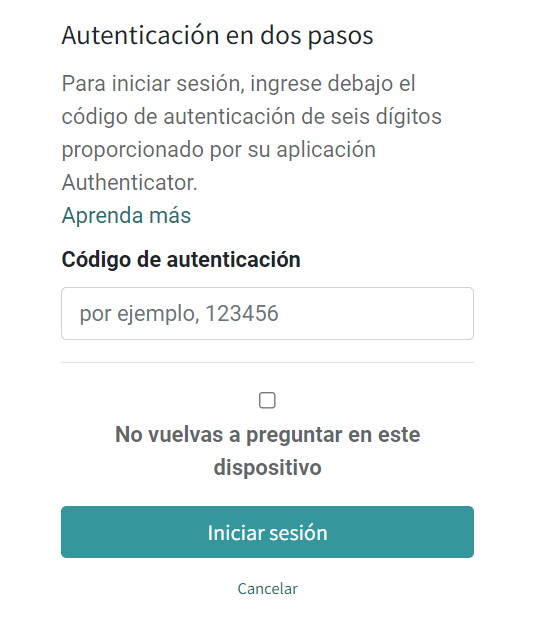

==========================
Autenticación en dos pasos
==========================

Mediante la verificación en dos pasos (también llamada "autenticación de dos factores"), los usuarios tendrán una capa
de protección adicional si les roban la contraseña.

Una vez que tengan activada la verificación en dos pasos, cuando los usuarios inicien sesión, tendrán que completar un
segundo paso para verificar su identidad. Para proteger su cuenta, tendrán que introducir un código de seguridad de la
aplicación *Google Authenticator*.

Invitar a usar la autenticación de dos pasos
============================================

Para invitar a otro usuario a usar la autenticación de dos factores, navega al detalle de un usuario desde la pantalla
:menuselection:`Ajustes --> Usuarios y compañías --> Usuarios` y desde la pestaña de *Seguridad*, haz clic en el botón
**Invitar a usar 2FA**:

El sistema enviará un correo al usuario para que active la autenticación de dos factores:

Configurar la autenticación de dos pasos
========================================

Para configurar la autenticación de dos factores, navega a tu perfil de usuario desde el menú *Mi Perfil*:

A continuación, abre la pestaña *Seguridad de la cuenta*, y haz clic en el botón **Autenticación en dos pasos**:

Ya que esta es una acción importante para la seguridad del usuario, deberás escribir tu contraseña:

Después de eso, verás la siguiente pantalla:

A continuación, desde la aplicación *Google Authenticator*, busca el botón para agregar una nueva cuenta, y selecciona
la opción para **Ingresar clave de configuración**. Escribe un nombre para la cuenta y la clave proporcionada en el
campo de clave de la pantalla de Daeris. Por último, introduce la clave de 6 dígitos del autenticador en el campo
*Código de verificación* y pulsa el botón *Activar*.

A partir de ese momento, la autenticación de dos factores del usuario quedará activada.

Iniciar sesión
==============

Una vez habilitado, cuando el usuario inicie sesión en Daeris, se le pedirá que introduzca su usuario y contraseña:

En lugar de acceder a Daeris inmediatamente, ahora verás una segunda pantalla de inicio de sesión:

Abre la aplicación *Google Authenticator*, introduce el código de 6 dígitos de tu cuenta de Daeris, e inicia sesión.
Si quieres que no se vuelva a preguntar el código para el dispositivo en el que te encuentras conectado, marca la opción
**No vuelvas a preguntar en este dispositivo**.

Eso es todo. De ahora en adelante, a no ser que desactives la autenticación de dos pasos, tendrás que pasar por un
proceso de dos pasos para iniciar sesión, en lugar del antiguo proceso de un paso.

.. danger::
   No pierdas tu autenticador. Si lo haces, necesitarás un Administrador de Daeris para desactivar la autenticación de
   2 pasos en tu cuenta de usuario.