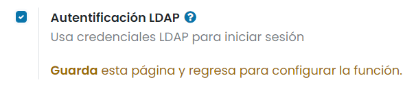
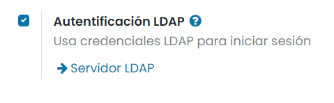
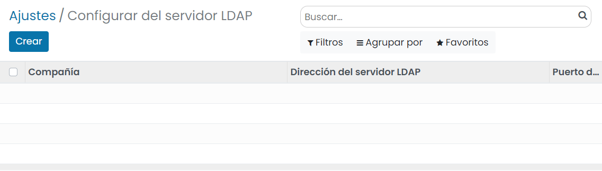
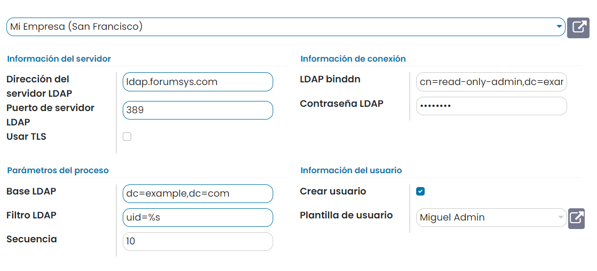
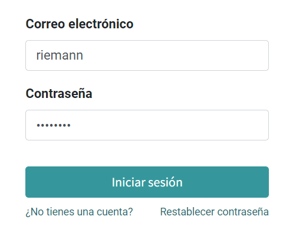
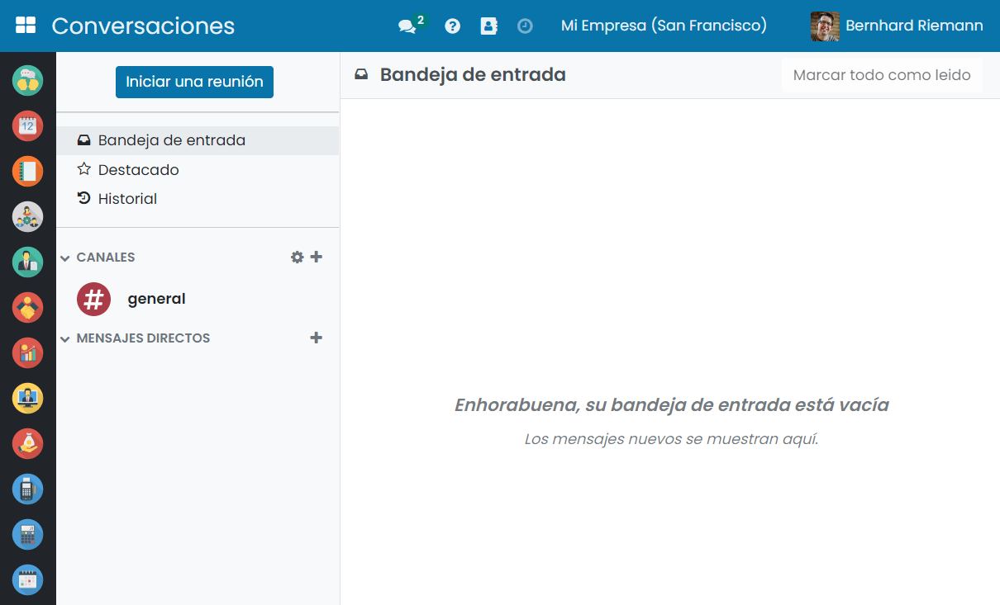

=======================
Iniciar sesión con LDAP
=======================

**LDAP** son las siglas de *Protocolo Ligero de Acceso a Directorio* (o en inglés, *Lightweight Directory Access Protocol*).
Se trata de un conjunto de protocolos de licencia abierta que son utilizados para acceder a la información que está
almacenada de forma centralizada en una red. LDAP soporta la gestión de los ID de usuario y contraseñas en el nivel de
empresa, en lugar de gestionar estos datos en sistemas individuales.

Configurar autentificación con LDAP
===================================

Para configurar LDAP navega a la pantalla :menuselection:`Ajustes --> Opciones Generales`, y activa la opción de
**Autentificación LDAP**:

Una vez activada la opción, pulsa el botón *Guardar*.

A continuación, regresa al apartado de autentificación LDAP y pulsa el enlace *Servidor LDAP*:

El sistema navegará a la pantalla de servidores LDAP, en donde deberás crear un nuevo registro mediante el botón *Crear*:

En el formulario de detalle del servidor LDAP dispones de los siguientes campos:

-  **Empresa**: Selecciona la empresa que va a utilizar el LDAP.

-  **Información del servidor**: Introduce la dirección del servidor y el puerto del mismo. Marca la opción de *Usar TLS*
   si tu servidor es compatible.

-  **Información de conexión**: Introduce el ID y la contraseña de la cuenta utilizada para consultar el servidor. Si se
   deja vacío, se consultará al servidor de forma anónima.

-  **Parámetros del proceso**: Introduce el nombre de dominio de tu servidor LDAP en nomenclatura LDAP (por ejemplo,
   dc=example,dc=com). En *Filtro LDAP*, introduce `uid=%s`.

-  **Información del usuario**: Marca *Crear usuario* si quieres que Daeris cree un perfil de usuario la primera vez
   que alguien inicie sesión con LDAP. En *Plantilla de usuario*, indica una plantilla para los nuevos perfiles creados.
   Si se deja en blanco, el perfil de administrador se usará como plantilla.

Una vez informados todos los campos, pulsa el botón *Guardar*.

Iniciar sesión
==============

A partir de ese momento, cuando un usuario inicie sesión en la aplicación Daeris, el sistema intentará autentificar ese
usuario en el servidor LDAP configurado:

Si todo va bien, el usuario podrá acceder al sistema con su identificador de usuario y contraseña de LDAP:

