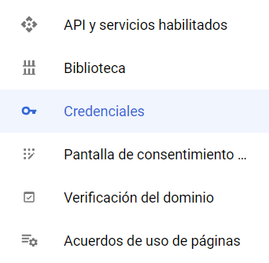
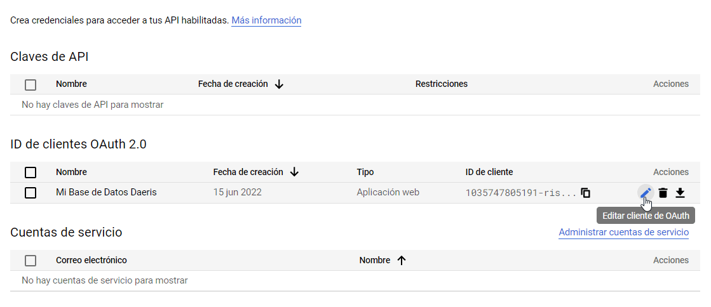
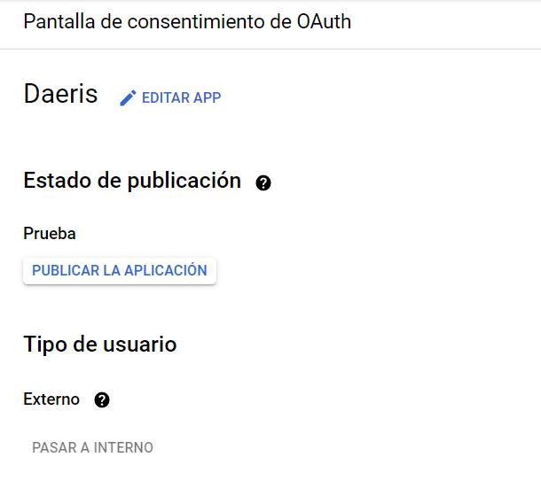
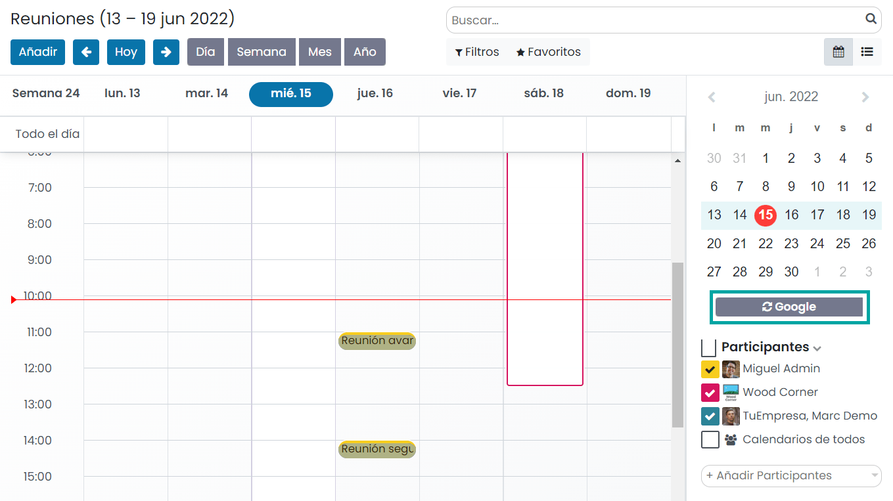
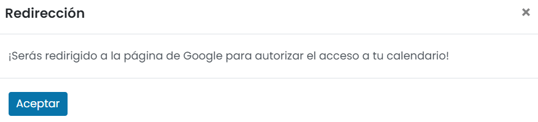
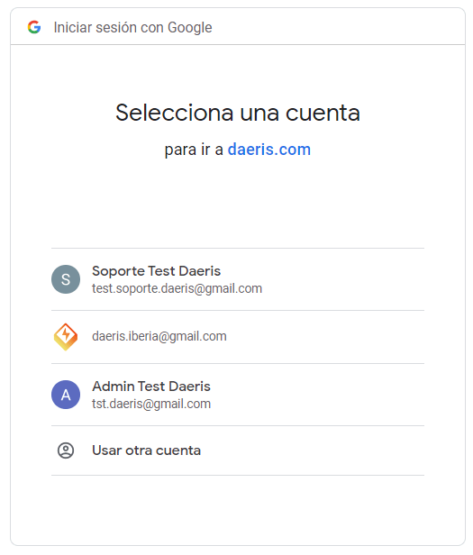
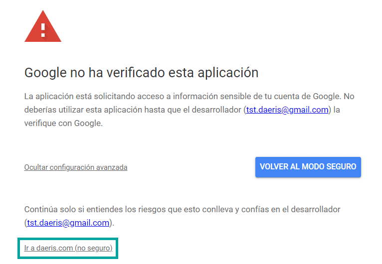
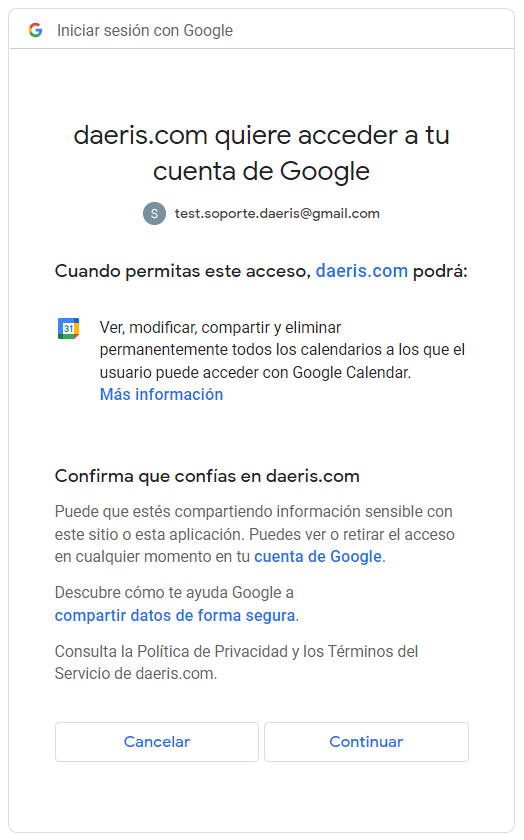
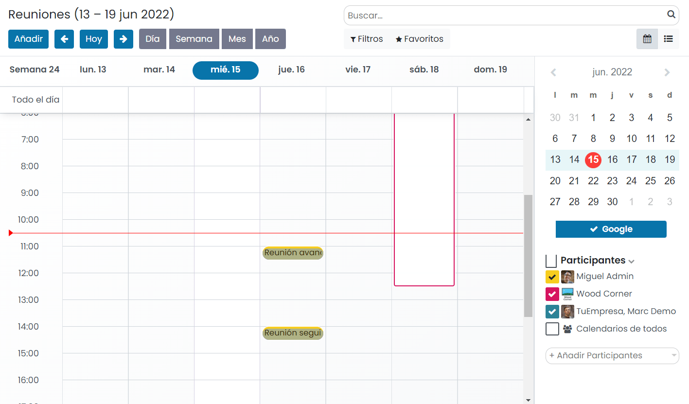
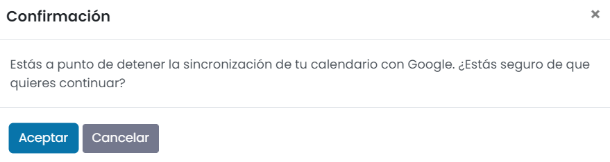

=============================================
Sincronizar el calendario con Google Calendar
=============================================

**Google Calendar** es una agenda y calendario electrónico desarrollado por Google. Permite sincronizarlo con los
contactos de Gmail de manera que puedas invitarlos y compartir eventos.

Daeris permite sincronizar su calendario con Google Calendar, pudiendo gestionar tus reuniones en ambas plataformas.

Configuración
=============

Para permitir la sincronización, será necesario configurar la cuenta de Google, así como ciertas opciones de Daeris.

API de Google
-------------

#. Navega a la plataforma de `APIs de Google <https://console.developers.google.com/>`_.
#. Inicia sesión con tu cuenta de Google.

   .. image:: google/iniciar-sesion-google.png
      :align: center
      :alt: Iniciar sesión en Google

#. Asegúrate de tener abierto el proyecto correcto. Si todavía no tienes un proyecto, haz clic en *Crear proyecto*,
   informa el nombre del proyecto y otros detalles de tu empresa y haz clic en *Crear*.

   .. image:: google/nuevo-proyecto.png
      :align: center
      :alt: Crear un nuevo proyecto en APIs de Google

Habilitar APIs y servicios
~~~~~~~~~~~~~~~~~~~~~~~~~~

#. Desde la página de APIs y servicios, pulsa el enlace para *Habilitar API y servicios*:

   .. image:: google/habilitar-api.png
      :align: center
      :alt: Habilitar API y servicios de Google

#. Selecciona la API de Google Calendar:

   .. image:: google/api-google-calendar.png
      :align: center
      :alt: Seleccionar API de Google Calendar

#. Habilita la API mediante el botón correspondiente:

   .. image:: google/habilitar-api-google-calendar.png
      :align: center
      :alt: Habilitar API de Google Calendar

Credenciales
~~~~~~~~~~~~

#. En el menú del lado izquierdo haz clic en :menuselection:`Credenciales`.

   .. image:: google/seleccionar-credenciales.png
      :align: center
      :alt: Seleccionar credenciales

#. Haz clic en *Crear credenciales* y selecciona **Ayúdame a elegir**.

   .. image:: google/ayudadme-elegir-credenciales.png
      :align: center
      :alt: Ayudadme a elegir credenciales de Google

#. En el primer paso, **Tipo de credencial**, selecciona la API de Google Calendar y el acceso a datos de usuario, y
   pulsa el botón *Siguiente*.

   .. image:: google/que-api-estas-usando.png
      :align: center
      :alt: Qué API estás usando en Google

#. En el segundo paso, **Pantalla de consentimiento de OAuth**, informa un nombre de aplicación, un correo electrónico de
   asistencia del usuario, un logotipo de la app y una dirección de correo electrónico de contacto. Una vez completados
   los campos, pulsa *Guardar y Continuar*.

   .. image:: google/pantalla-consentimiento-oauth.png
      :align: center
      :alt: Pantalla de consentimiento de OAuth

#. Omite el tercer paso, **Permisos**, haciendo clic en *Guardar y continuar*.

#. En el último paso, **ID de cliente de OAuth**, selecciona *Aplicación web* como tipo de aplicación y escribe
   `Mi Base de Datos Daeris` como nombre.

   .. image:: google/id-cliente-oauth.png
      :align: center
      :alt: ID de cliente de OAuth

#. Bajo la sección de *Orígenes autorizados de JavaScript* haz clic en *+ Agregar URI* y escribe la URL de tu instancia
   Daeris. Por otro lado, bajo la sección de *URI de redireccionamiento autorizados* haz clic en *+ Agregar URI* y escribe
   la URL de tu instancia de Daeris seguido de `/google_account/authentication`. Una vez completados los campos, pulsa
   el botón *Crear*.

   .. image:: google/origenes-autorizados.png
      :align: center
      :alt: Orígenes autorizados de Javascript

ID de cliente y secreto de cliente
~~~~~~~~~~~~~~~~~~~~~~~~~~~~~~~~~~

Tanto el ID de cliente como el secreto de cliente son necesarios para conectar Google Calendar a Daeris. Obtén el ID de
cliente y el secreto del cliente abriendo el menú de :menuselection:`Credenciales`.

A continuación, busca las credenciales que acabas de crear para la API de Google Calendar. Luego, haz clic en *Editar cliente de OAuth*
(el icono del lápiz). La página redirigirá a la página de edición, donde podrás ver el ID de cliente y el secreto de cliente:

Publicar la aplicación
~~~~~~~~~~~~~~~~~~~~~~

Si tu aplicación aún está en fase de pruebas, puedes configurar tu estado como *En etapa de prueba*. En este estado puedes
probar tu aplicación con una cantidad limitada de usuarios.

Cuando configuras el estado de tu app como *En producción*, tu aplicación estará disponible para cualquiera que tenga
una Cuenta de Google.

Para publicar la aplicación, navega al menú de :menuselection:`Pantalla de consentimiento de OAuth` y cambia el estado
de publicación mediante el botón *Publicar la aplicación*:

Configuración en Daeris
-----------------------

Activación en Daeris
~~~~~~~~~~~~~~~~~~~~

#. Navega a la pantalla :menuselection:`Ajustes --> Opciones generales` y, desde el apartado de *Integraciones*,
   activa la opción **Calendario de Google** y pulsa el botón *Guardar* de la pantalla de ajustes.

   .. image:: google/activar-google-calendar.png
      :align: center
      :alt: Activar Google Calendar en Daeris

#. A continuación, vuelve a la pantalla :menuselection:`Ajustes --> Opciones generales` y, desde el apartado de *Integraciones*,
   informa el ID de cliente y secreto de cliente generado por Google y pulsa el botón *Guardar* de la pantalla de ajustes.

   .. image:: google/configurar-id-cliente.png
      :align: center
      :alt: Configurar ID de cliente en Daeris

Sincronizar calendario con Google
=================================

.. important::
   | El Calendario de Daeris envía un correo electrónico de confirmación en la creación de un evento a sus asistentes.
     Pero, en la primera sincronización, el calendario de Google también enviará correos electrónicos de confirmación de
     todos los eventos programados (incluidos los anteriores).
   | Para evitar esta situación, recomendamos archivar todos los eventos pasados y eliminarse de los futuros en el
     calendario de Daeris antes de la primera sincronización. Esto evitará que se creen eventos en Google y, por lo
     tanto, no se enviarán correos electrónicos redundantes durante la primera sincronización. Después de la
     sincronización, los eventos solo enviarán un correo electrónico de confirmación.

      .. image:: google/archivar-reuniones.png
         :align: center
         :alt: Archivar reuniones en Daeris

Los usuarios que quieran sincronizar su calendario con Google, deben navegar a la pantalla :menuselection:`Calendario` y
pulsar el botón *Google*:

El sistema mostrará un mensaje indicando que serás redirigido a la página de Google para autorizar el acceso a tu
calendario. Pulsa el botón *Aceptar*:

En la pantalla de inicio de sesión de Google, introduce tu usuario:

En la siguiente pantalla, despliega la configuración avanzada y pulsa el enlace *Ir a daeris.com*:

A continuación, confirma que confías en Daeris haciendo clic en el botón *Continuar*:

A partir de este momento, cualquier reunión del calendario de Daeris será sincronizada en tu cuenta de Google Calendar
y viceversa.

Si, por algún motivo, quieres detener la sincronización, pulsa de nuevo en el botón de *Google*:

El sistema solicitará confirmación para detener la sincronización. Pulsa el botón *Aceptar*:

.. note::
   Todos los usuarios que quieran utilizar la sincronización simplemente necesitan sincronizar su calendario con Google.
   La configuración de la API de Google solo se realiza una vez.