===================
Información general
===================

Daeris dispone de un módulo de calendario dinámico para administrar todos tus horarios y tareas de manera organizada.
Puedes registrar los detalles de tus citas y tareas comerciales en este módulo. El módulo **Calendario** en Daeris es la
mejor solución para planificar tus actividades comerciales diarias.

.. youtube:: HjtHDRYACDk
    :align: right
    :width: 700
    :height: 394

Planificar reuniones desde el calendario
========================================

Si navegas a la pantalla :menuselection:`Calendario`, por defecto, visualizarás una pantalla con todas las reuniones
planificadas en la semana actual:

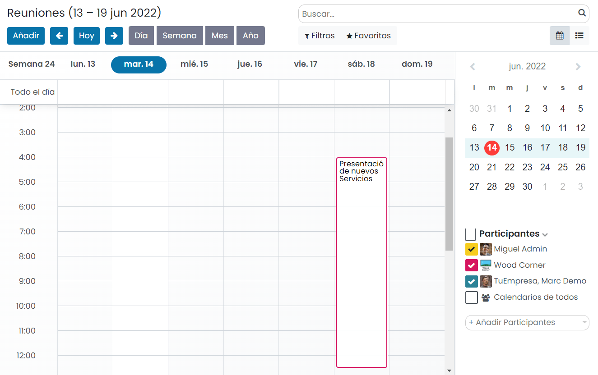

Cada una de las reuniones programadas en la semana actual está ubicada en la franja horaria correspondiente, y al hacer
clic en la reunión, muestra, además del horario, información acerca del título de la reunión y los asistentes a la misma:

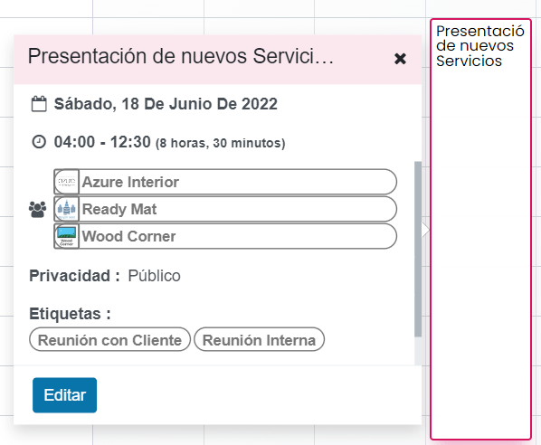

Desde esta misma pantalla puedes planificar una nueva reunión haciendo clic en la franja horaria en la cual quieres fijar
la hora de la reunión, e introduciendo el resumen en el formulario que aparece en pantalla:

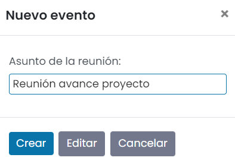

Mediante el botón *Crear*, la reunión queda planificada en el calendario, y mediante el botón *Editar*, puedes modificar
los detalles de la reunión:

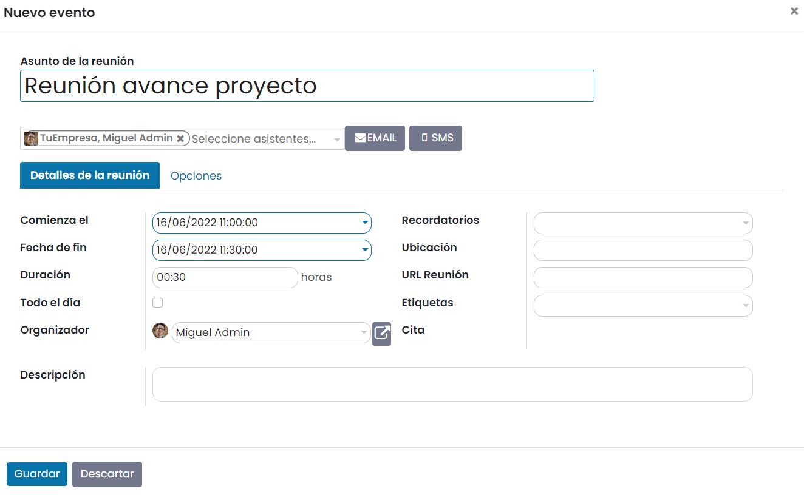

Al editar una reunión puedes informar los siguientes campos:

-  **Asunto de la reunión**: Mediante este campo puedes indicar el asunto principal de la reunión.

-  **Asistentes**: Lista de asistentes de la reunión. Puedes seleccionar asistentes seleccionando del desplegable que
   aparece en pantalla. También es posible buscar más asistentes mediante la opción *Buscar más…* en caso que el
   asistente no aparezca en ese primer listado, o incluso puedes crear un nuevo asistente mediante la opción *Crear y editar…*.

-  **Detalles de la reunión**

   -  **Comienza el**: Fecha y hora de inicio de la reunión.

   -  **Fecha de fin**: Fecha y hora de fin de la reunión.

   -  **Duración**: Duración de la reunión en horas y minutos.

   -  **Todo el día**: Al marcar esta casilla indicas que la reunión está planificada para todo el día.

   -  **Organizador**: Organizador de la reunión.

   -  **Recordatorios**: Este campo de tipo desplegable permite asociar recordatorios a la reunión, para que, llegado el
      momento correspondiente, se ejecuten las acciones definidas en el recordatorio. Mediante la opción *Crear y editar…*
      es posible crear un nuevo recordatorio.

   -  **Ubicación**: Permite establecer la ubicación de la reunión, como por ejemplo la dirección, o nombre de la sala
      de reuniones.

   -  **URL Reunión**: Permite especificar una URL para conectarse a la reunión.

   -  **Etiquetas**: Este campo de tipo desplegable permite asociar etiquetas a la reunión de la lista de etiquetas
      disponible, o también crear nuevas etiquetas escribiendo el nombre de la etiqueta en el mismo campo.

   -  **Descripción**: Notas detalladas acerca de la reunión.

-  **Opciones**

   -  **Recurrente**: Al marcar este campo, aparecen dos campos más, que te permiten establecer la recurrencia de la reunión.

      .. image:: informacion_general/opciones-reunion-calendario.png
         :align: center
         :alt: Opciones de una reunión en el calendario

      -  **Repetir cada**: Permite establecer cada cuantos días, semanas, meses o años se debe repetir la reunión de
         forma automática.

      -  **Hasta**: Permite establecer el número de repeticiones de la reunión, o la fecha de fin en la que no se
         programarán más reuniones de este tipo.

   -  **Privacidad**: Mediante este campo puedes establecer los usuarios que tendrán visibilidad de esta reunión (todos,
      solo yo o solo usuarios internos).

   -  **Mostrar como**: Permite seleccionar entre dos opciones: *Ocupado* (muestra esa hora del calendario del usuario como
      ocupado) o *Disponible* (muestra esa hora del calendario del usuario como libre).

Por otro lado, es posible gestionar las invitaciones de los asistentes a la reunión mediante los botones *EMAIL* y *SMS*:

Mediante la opción *EMAIL* se permite enviar un correo electrónico a los asistentes de la reunión a modo de invitación
o para informar de actualizaciones en la misma:

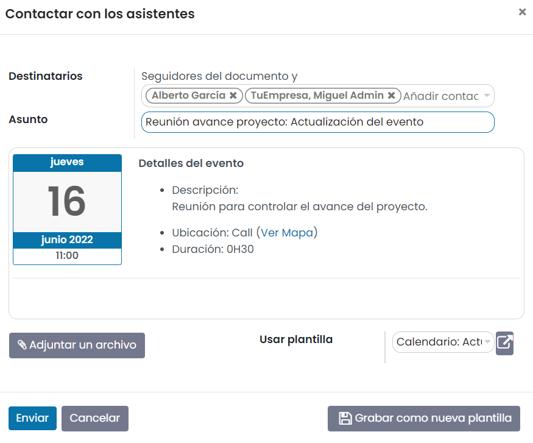

.. seealso::
   * :doc:`../correo_electronico/enviar_correos`

Mediante la opción *SMS* se permite enviar un mensaje de texto a los asistentes de la reunión a modo de invitación
o para informar de actualizaciones en la misma:

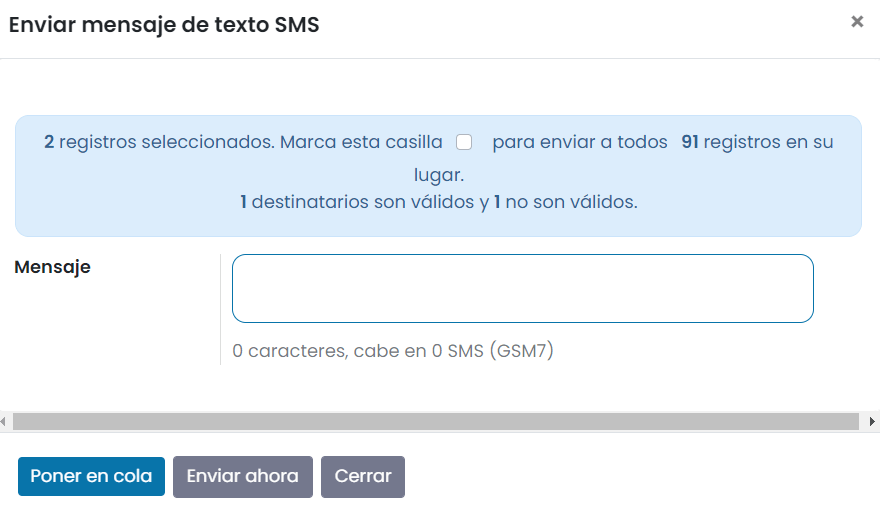

.. seealso::
   * :doc:`../sms`

Una vez informados todos los campos de la reunión, pulsa el botón *Guardar* del formulario de detalle de la reunión.

Filtrar asistentes en el calendario
===================================

Desde el calendario de reuniones, puedes filtrar las reuniones mostradas utilizando el filtro de asistentes ubicado en
la parte derecha del calendario:

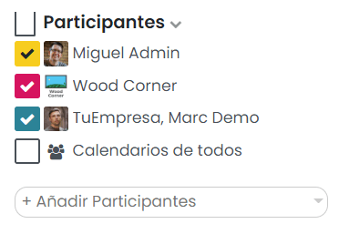

Mediante el desplegable de *Añadir Participantes* puedes seleccionar asistentes a las reuniones. Al seleccionar uno de
los asistentes, aparecerá en la lista de asistentes y lo podrás marcar mediante la casilla correspondiente:

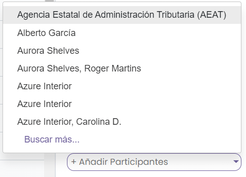

El resultado de esta acción será que el calendario estará filtrado por aquellas reuniones en las que participen los
asistentes seleccionados:

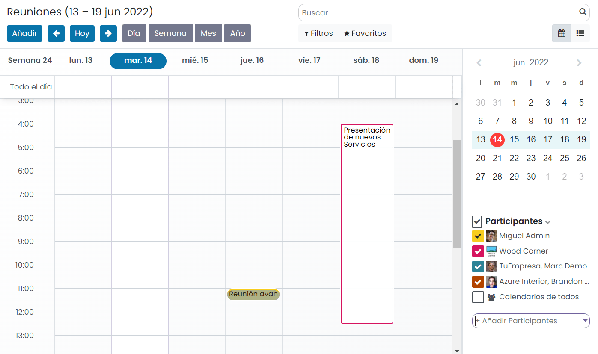

Por último, si quieres eliminar uno de los asistentes que has añadido previamente, lo puedes hacer mediante el icono
de cruz que aparece justo debajo del asistente a eliminar de la lista:

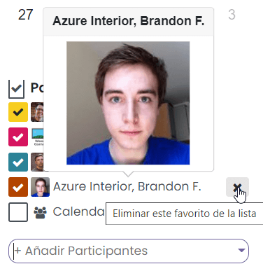

Eliminar una reunión del calendario
===================================

Desde la pantalla de calendario, puedes eliminar una reunión pulsando encima de la reunión ubicada en el calendario, y
haciendo clic en *Suprimir*:

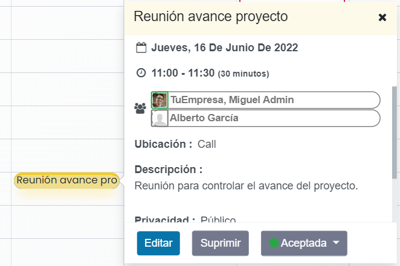

Desde la pantalla de listado, puedes eliminar una reunión marcando la casilla correspondiente y haciendo clic en la
opción del menú :menuselection:`Acción --> Suprimir`, como se muestra a continuación:

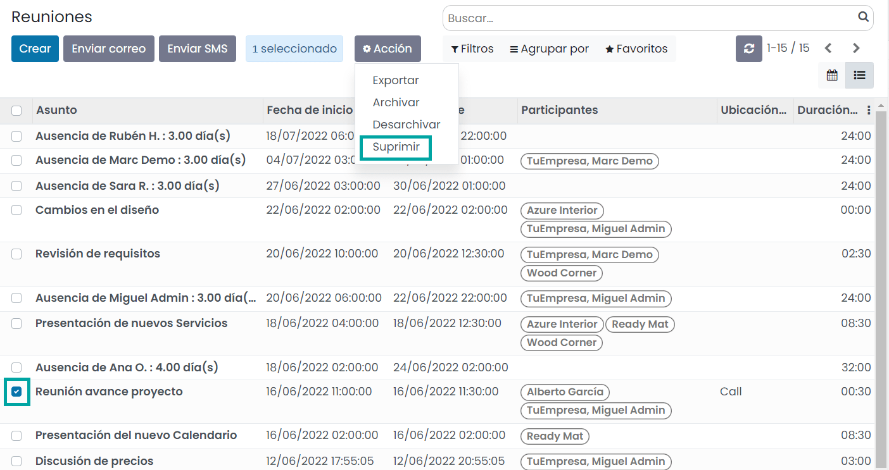