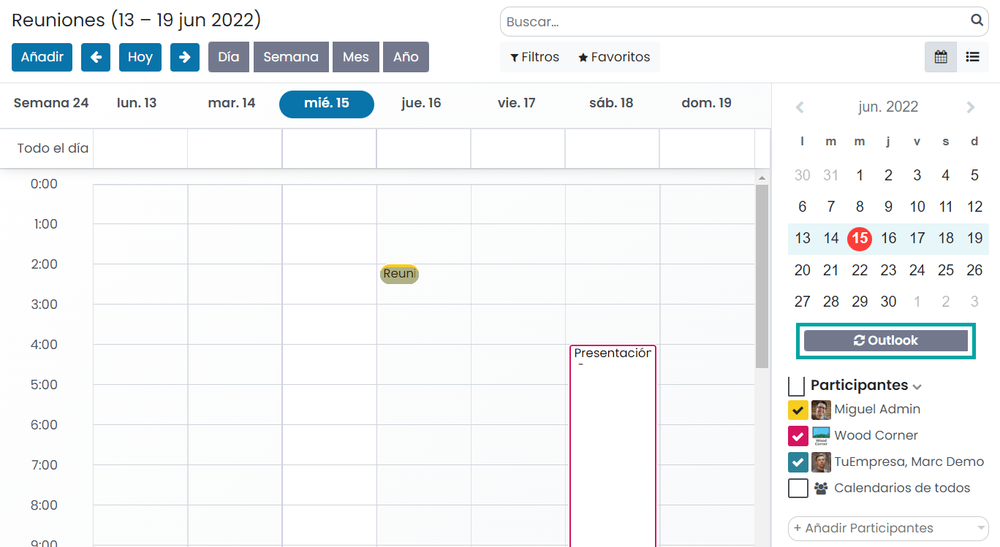
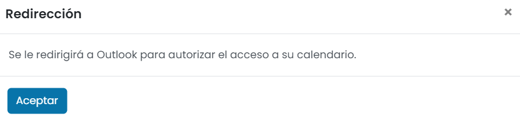
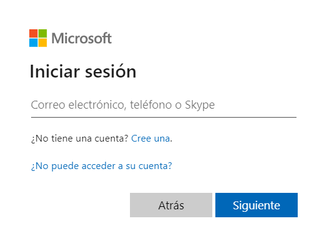
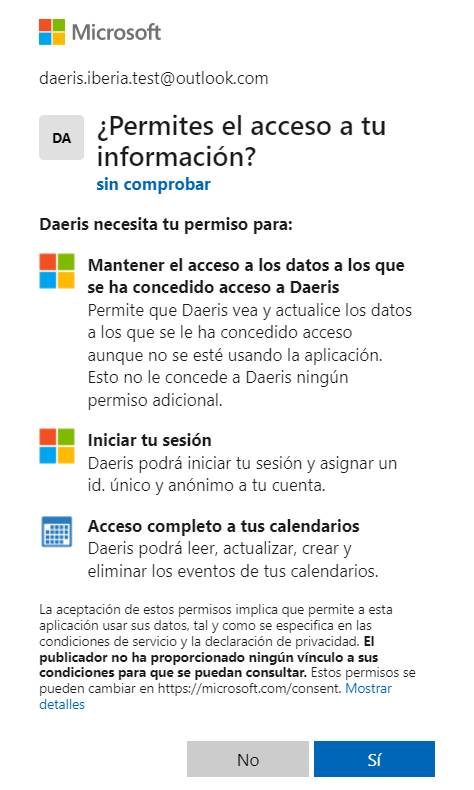
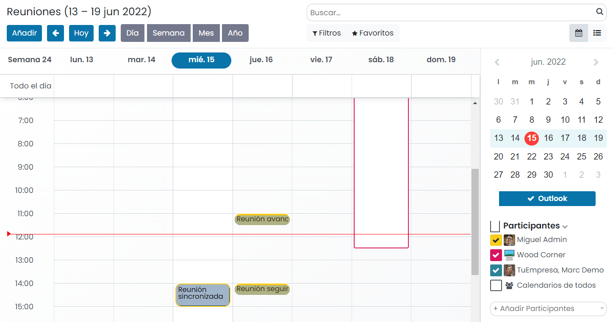
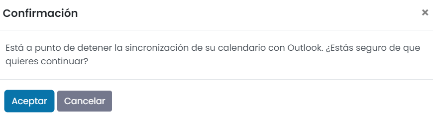

===============================================
Sincronizar el calendario con Microsoft Outlook
===============================================

Sincronizar el calendario principal de **Outlook** con Daeris es útil para realizar un seguimiento de tus tareas y
citas, y en todas las aplicaciones relacionadas.

Configuración
=============

Para permitir la sincronización, será necesario configurar la cuenta de Microsoft Azure, así como ciertas opciones de
Daeris.

Microsoft Azure
---------------

Para poder sincronizar tu calendario de Outlook con el calendario de Daeris, se necesita una cuenta de
`Microsoft Azure <https://azure.microsoft.com/en-us/free/?WT.mc_id=A261C142F>`_. La creación de una cuenta es gratuita
para los usuarios que nunca hayan probado o pagado Azure.

Configurar un inquilino de Azure AD
~~~~~~~~~~~~~~~~~~~~~~~~~~~~~~~~~~~

#. Configura un `inquilino de Azure AD <https://docs.microsoft.com/en-us/azure/active-directory/develop/quickstart-create-new-tenant>`_,
   también llamado entorno, que es una representación de una organización, para administrar y registrar aplicaciones. Al
   crear una cuenta gratuita, por defecto ya se asigna uno por defecto:

   .. image:: outlook/inquilino-de-azure-ad.png
      :align: center
      :alt: Inquilino de Azure AD

Registrar aplicación
~~~~~~~~~~~~~~~~~~~~

#. A continuación, `registra una aplicación <https://docs.microsoft.com/en-us/azure/active-directory/develop/quickstart-register-app>`_,
   eligiendo el tipo de cuenta compatible adecuado. Para ello, selecciona *Azure Active Directory* en el cuadro de búsqueda:

   .. image:: outlook/azure-active-directory.png
      :align: center
      :alt: Azure active directory

#. En el apartado de *Administrar*, selecciona **Registros de aplicaciones**:

   .. image:: outlook/registros-de-aplicaciones.png
      :align: center
      :alt: Registros de aplicaciones de Outlook

#. Solicita un nuevo registro mediante el enlace correspondiente:

   .. image:: outlook/nuevo-registro.png
      :align: center
      :alt: Nuevo registro de aplicación de Outlook

#. Introduce un nombre para mostrar para la aplicación. Los usuarios de tu aplicación pueden ver el nombre para mostrar
   cuando usan la aplicación, por ejemplo, durante el inicio de sesión. Puedes cambiar el nombre para mostrar en cualquier
   momento y varios registros de aplicaciones pueden compartir el mismo nombre. El ID de aplicación (cliente) generado
   automáticamente por el registro de la aplicación, no su nombre para mostrar, identifica de forma única su aplicación
   dentro de la plataforma de identidad:

   .. image:: outlook/nombre-para-mostrar.png
      :align: center
      :alt: Nombre para mostrar de aplicación de Outlook

#. Especifica quién puede usar la aplicación, a veces denominado audiencia de inicio de sesión. Selecciona
   *Cuentas en cualquier directorio organizativo y cuentas de Microsoft personales*:

   .. image:: outlook/tipos-de-cuenta-compatibles.png
      :align: center
      :alt: Tipos de cuenta compatibles de la aplicación de Outlook

#. No introduzcas nada para la URI de redirección (opcional). La URI de redireccionamiento se configurará en la siguiente
   sección. Por último, selecciona *Registrar* para completar el registro inicial de la aplicación:

   .. image:: outlook/registrar-aplicacion.png
      :align: center
      :alt: Registrar aplicación de Outlook

#. Cuando finaliza el registro, el portal de Azure muestra el panel de información general del registro de la aplicación.
   Verás el ID de la aplicación (cliente). También llamado ID de cliente, este valor identifica de forma única tu aplicación
   en la plataforma de identidad de Microsoft. Anota el identificador de cliente de la aplicación, ya que será necesario
   para la configuración posterior en Daeris.

Agregar un URI de redirección
~~~~~~~~~~~~~~~~~~~~~~~~~~~~~

#. A continuación, agrega un URI de redirección haciendo clic sobre el enlace correspondiente:

   .. image:: outlook/agregar-uri-redireccion.png
      :align: center
      :alt: Agregar un URI de redirección

#. Para ello, tendrás que agregar una nueva plataforma Web:

   .. image:: outlook/agregar-plataforma-web.png
      :align: center
      :alt: Agregar una plataforma Web

#. Para las URI de redirección, copia la URL de tu instancia Daeris seguido de `/microsoft_account/authentication`. Una
   vez informada la URI, pulsa el botón *Configurar*:

   .. image:: outlook/uri-redireccion.png
      :align: center
      :alt: URI de redirección

Agregar un secreto de cliente
~~~~~~~~~~~~~~~~~~~~~~~~~~~~~

#. A continuación, navega al panel de información general:

   .. image:: outlook/panel-informacion-general.png
      :align: center
      :alt: Panel de información general de la aplicación

#. Añade un secreto de cliente para restringir el acceso a la aplicación:

   .. image:: outlook/agregar-secreto-cliente.png
      :align: center
      :alt: Agregar secreto de cliente

#. Pulsa el enlace para añadir un *Nuevo secreto de cliente*:

   .. image:: outlook/nuevo-secreto-cliente.png
      :align: center
      :alt: Nuevo secreto de cliente

#. Añade una descripción y una fecha de vencimiento, y pulsa el botón *Agregar*:

   .. image:: outlook/descripcion-secreto-cliente.png
      :align: center
      :alt: Descripción del secreto de cliente

#. Una vez hecho esto, guarda el valor de la clave secreta para usarla en Daeris. Este valor secreto nunca se vuelve a
   mostrar después de salir de esta página.

   .. image:: outlook/valor-secreto-cliente.png
      :align: center
      :alt: Valor del secreto de cliente

Configuración en Daeris
-----------------------

Activación en Daeris
~~~~~~~~~~~~~~~~~~~~

#. Navega a la pantalla :menuselection:`Ajustes --> Opciones generales` y, desde el apartado de *Integraciones*,
   activa la opción **Calendario de Outlook** y pulsa el botón *Guardar* de la pantalla de ajustes.

   .. image:: outlook/activar-calendario-outlook.png
      :align: center
      :alt: Activar Calendario de Outlook en Daeris

#. A continuación, vuelve a la pantalla :menuselection:`Ajustes --> Opciones generales` y, desde el apartado de *Integraciones*,
   informa el ID de cliente y secreto de cliente generado por Outlook y pulsa el botón *Guardar* de la pantalla de ajustes.

   .. image:: outlook/configurar-id-cliente.png
      :align: center
      :alt: Configurar ID de cliente en Daeris

Sincronizar calendario con Outlook
==================================

.. important::
   | El Calendario de Daeris envía un correo electrónico de confirmación en la creación de un evento a sus asistentes.
     Pero, en la primera sincronización, Outlook también enviará correos electrónicos de confirmación de todos los eventos
     programados (incluidos los anteriores).
   | Para evitar esta situación, recomendamos archivar todos los eventos pasados y eliminarse de los futuros en el
     calendario de Daeris antes de la primera sincronización. Esto evitará que se creen eventos en Outlook y, por lo
     tanto, no se enviarán correos electrónicos redundantes durante la primera sincronización. Después de la
     sincronización, los eventos solo enviarán un correo electrónico de confirmación.

      .. image:: outlook/archivar-reuniones.png
         :align: center
         :alt: Archivar reuniones en Daeris

Los usuarios que quieran sincronizar su calendario con Outlook, deben navegar a la pantalla :menuselection:`Calendario` y
pulsar el botón *Outlook*:

El sistema mostrará un mensaje indicando que serás redirigido a la página de Outlook para autorizar el acceso a tu
calendario. Pulsa el botón *Aceptar*:

En la pantalla de inicio de sesión de Outlook, introduce tu usuario:

Posteriormente, concede permiso a la aplicación mediante el botón *Sí*:

A partir de este momento, cualquier reunión del calendario de Daeris será sincronizada en tu cuenta de Outlook y
viceversa.

Si, por algún motivo, quieres detener la sincronización, pulsa de nuevo en el botón de *Outlook*:

El sistema solicitará confirmación para detener la sincronización. Pulsa el botón *Aceptar*:

.. note::
   Todos los usuarios que quieran utilizar la sincronización simplemente necesitan sincronizar su calendario con Outlook.
   La configuración de la cuenta de Azure de Microsoft solo se realiza una vez, ya que los inquilinos de Azure AD son
   únicos y representan una organización que lo ayuda a administrar una instancia específica de los servicios en la nube
   de Microsoft para sus usuarios internos y externos.