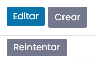

======================================
Enviar correos electrónicos con Daeris
======================================

Los objetos de Daeris (una oportunidad de CRM, una orden de venta, una factura, etc.) tienen un hilo de discusión,
llamado *chatter*. Cuando publicas un mensaje en *chatter*, este mensaje se envía por correo electrónico a los seguidores
del documento. Si un seguidor responde al mensaje, la respuesta actualiza la conversación y Daeris transmite la respuesta
a los seguidores.

Los correos electrónicos de tus usuarios a los contactos (clientes, proveedores) se envían desde la dirección de correo
electrónico de tus usuarios. Del mismo modo, los correos electrónicos de los contactos a los usuarios, se envían desde
la dirección de correo electrónico de los contactos. Esto te permite reconocer de un vistazo quién envió un correo
electrónico transmitido por Daeris.

Los pasos a seguir para crear un servidor de correo saliente pueden variar en función de si se dispone de una cuenta de
correo con dominio propio o si se dispone de una cuenta de correo de Google Gmail o de Microsoft Outlook.

.. note::
   Te recomendamos configurar tu nombre de dominio propio para garantizar que los correos electrónicos de tus usuarios
   lleguen a tus contactos, en lugar de que se consideren spam. Por la misma razón, te recomendamos que siempre proporciones
   a tus usuarios una dirección de correo electrónico de tu propio dominio, en lugar de una dirección de correo electrónico
   genérica (gmail.com, outlook.com, etc.).

Cuenta de correo con dominio propio
===================================

Crear cuentas en tu servidor de correo
~~~~~~~~~~~~~~~~~~~~~~~~~~~~~~~~~~~~~~

#. Crea una dirección de correo electrónico genérica en tu servidor de correo (por ejemplo, *general@miempresa.com*).

.. note::
   Esta cuenta puede ser la misma que la utilizada en tu servidor de correo entrante de Daeris.

Establecer el alias del dominio
~~~~~~~~~~~~~~~~~~~~~~~~~~~~~~~

Establece tu nombre de dominio desde la pantalla :menuselection:`Ajustes --> Opciones generales`. Desde el apartado de
*Conversaciones* activa la opción **Servidores de correo electrónico personalizados** e informa el *Alias del dominio*:

Crear servidor de correo saliente genérico
~~~~~~~~~~~~~~~~~~~~~~~~~~~~~~~~~~~~~~~~~~

A continuación, crea un servidor de correo saliente genérico en Daeris desde la pantalla :menuselection:`Ajustes --> Correo electrónico --> Servidores de correo saliente`.
Para dar de alta un nuevo servidor de correo saliente, haz clic en el botón *Crear*, que abrirá un nuevo formulario en
donde poder informar todos los datos necesarios para la conexión del buzón en Daeris:

-  **Descripción**: Nombre que le damos al servidor de correo saliente en Daeris.

-  **Prioridad**: Cuando para un correo no se especifica un servidor de correo saliente en concreto, se utiliza el de
   mayor prioridad.

-  **Filtro Desde**: Define para qué dirección de correo electrónico o dominio se puede utilizar este servidor. Por ejemplo,
   *comunicaciones@daeris.com* o *daeris.com*.

-  **Activo**: Indica si el servidor de correo saliente se encuentra activo o no.

-  **Información de la conexión**

   -  **Servidor SMTP**: Nombre del servidor de correo donde Daeris debe realizar la conexión.

   -  **Puerto SMTP**: Puerto por el que se realiza la conexión.

-  **Seguridad y Autenticación**

   -  **Autenticar con**: Permite autenticarse con nombre de usuario o con un certificado SSL. En caso se seleccionar
      *Nombre de usuario* se deberá informar un nombre de usuario y contraseña para la conexión al buzón. Por otro lado,
      en caso de seleccionar *Certificado SSL*, se deberá proporcionar un certificado SSL y una clave privada SSL para
      la conexión al buzón.

   -  **Seguridad de la conexión**: Seleccionar entre Ninguno, TLS o SSL/TLS, en función del nivel de seguridad de la
      conexión.

Una vez configurado el buzón de salida, pulsar el botón *Probar conexión*, ubicado en la parte inferior izquierda de la pantalla:

Si todo ha ido bien, aparecerá un mensaje como el siguiente por pantalla:

Cuenta de correo de Google Gmail
================================

Crear cuentas de correo
~~~~~~~~~~~~~~~~~~~~~~~

#. Crea una dirección de correo electrónico genérica en tu proveedor de correo (por ejemplo, *miempresa@gmail.com*).

.. note::
   Esta cuenta puede ser la misma que la utilizada en tu servidor de correo entrante de Daeris.

Establecer el alias del dominio
~~~~~~~~~~~~~~~~~~~~~~~~~~~~~~~

Establece tu nombre de dominio desde la pantalla :menuselection:`Ajustes --> Opciones generales`. Desde el apartado de
*Conversaciones* activa la opción **Servidores de correo electrónico personalizados** e informa el *Alias del dominio*:

Crear servidor de correo saliente genérico
~~~~~~~~~~~~~~~~~~~~~~~~~~~~~~~~~~~~~~~~~~

A continuación, crea un servidor de correo saliente genérico en Daeris desde la pantalla :menuselection:`Ajustes --> Correo electrónico --> Servidores de correo saliente`.
Para dar de alta un nuevo servidor de correo saliente, haz clic en el botón *Crear*, que abrirá un nuevo formulario en
donde poder informar todos los datos necesarios para la conexión del buzón en Daeris:

-  **Descripción**: Nombre que le damos al servidor de correo saliente en Daeris.

-  **Prioridad**: Cuando para un correo no se especifica un servidor de correo saliente en concreto, se utiliza el de
   mayor prioridad.

-  **Filtro Desde**: Define para qué dirección de correo electrónico o dominio se puede utilizar este servidor. Por ejemplo,
   *comunicaciones@daeris.com* o *daeris.com*.

-  **Activo**: Indica si el servidor de correo saliente se encuentra activo o no.

-  **Información de la conexión**

   -  **Servidor SMTP**: Nombre del servidor de correo donde Daeris debe realizar la conexión. Para Gmail, el servidor
      es *smtp.gmail.com*.

   -  **Puerto SMTP**: Puerto por el que se realiza la conexión. Para Gmail, el puerto es el *465*.

-  **Seguridad y Autenticación**

   -  **Autenticar con**: Permite autenticarse con nombre de usuario o con un certificado SSL. En caso se seleccionar
      *Nombre de usuario* se deberá informar un nombre de usuario y contraseña para la conexión al buzón. Por otro lado,
      en caso de seleccionar *Certificado SSL*, se deberá proporcionar un certificado SSL y una clave privada SSL para
      la conexión al buzón.

      .. note::
         Es posible que debas generar una contraseña de aplicación en tu cuenta de Google para permitir la conexión desde
         Daeris a tu cuenta de correo de Gmail. Puedes encontrar más información acerca de cómo crear una contraseña de
         aplicación `aquí <https://support.google.com/accounts/answer/185833?hl=es>`_.

   -  **Seguridad de la conexión**: Seleccionar entre Ninguno, TLS o SSL/TLS, en función del nivel de seguridad de la
      conexión. Para Gmail, seleccionar *SSL/TLS*.

Una vez configurado el buzón de salida, pulsar el botón *Probar conexión*, ubicado en la parte inferior izquierda de la pantalla:

.. important::
   La primera vez que pruebas tu servidor de correo saliente, es posible que Gmail detecte actividad sospechosa en tu
   cuenta. En estos casos, debes comprobar tu buzón de correo de Gmail y revisar la actividad reciente, para confirmar
   que reconoces la conexión realizada a tu buzón. Además, deberás habilitar los ajustes SMTP en tu cuenta de Gmail.

Si todo ha ido bien, aparecerá un mensaje como el siguiente por pantalla:

Cuenta de correo de Microsoft Outlook
=====================================

Crear cuentas de correo
~~~~~~~~~~~~~~~~~~~~~~~

#. Crea una dirección de correo electrónico genérica en tu proveedor de correo (por ejemplo, *miempresa@outlook.com*).

.. note::
   Esta cuenta puede ser la misma que la utilizada en tu servidor de correo entrante de Daeris.

Establecer el alias del dominio
~~~~~~~~~~~~~~~~~~~~~~~~~~~~~~~

Establece tu nombre de dominio desde la pantalla :menuselection:`Ajustes --> Opciones generales`. Desde el apartado de
*Conversaciones* activa la opción **Servidores de correo electrónico personalizados** e informa el *Alias del dominio*:

.. image:: enviar_correos/alias-dominio-outlook.png
   :align: center
   :alt: Alias de dominio de Outlook

Crear servidor de correo saliente genérico
~~~~~~~~~~~~~~~~~~~~~~~~~~~~~~~~~~~~~~~~~~

A continuación, crea un servidor de correo saliente genérico en Daeris desde la pantalla :menuselection:`Ajustes --> Correo electrónico --> Servidores de correo saliente`.
Para dar de alta un nuevo servidor de correo saliente, haz clic en el botón *Crear*, que abrirá un nuevo formulario en
donde poder informar todos los datos necesarios para la conexión del buzón en Daeris:

-  **Descripción**: Nombre que le damos al servidor de correo saliente en Daeris.

-  **Prioridad**: Cuando para un correo no se especifica un servidor de correo saliente en concreto, se utiliza el de
   mayor prioridad.

-  **Filtro Desde**: Define para qué dirección de correo electrónico o dominio se puede utilizar este servidor. Por ejemplo,
   *comunicaciones@daeris.com* o *daeris.com*. Para Outlook, es necesario informar este campo para que solo se puedan enviar
   correos desde la cuenta de correo del servidor, ya que si no, los correos enviados serán rechazados.

   .. note::
      Las retransmisiones del SMTP de Office 365 no son compatibles con Daeris a menos que configures Daeris para forzar la
      dirección «De» predeterminada.

-  **Activo**: Indica si el servidor de correo saliente se encuentra activo o no.

-  **Información de la conexión**

   -  **Servidor SMTP**: Nombre del servidor de correo donde Daeris debe realizar la conexión. Para Outlook, el servidor
      es *smtp-mail.outlook.com*.

   -  **Puerto SMTP**: Puerto por el que se realiza la conexión. Para Outlook, el puerto es el *587*.

-  **Seguridad y Autenticación**

   -  **Autenticar con**: Permite autenticarse con nombre de usuario o con un certificado SSL. En caso se seleccionar
      *Nombre de usuario* se deberá informar un nombre de usuario y contraseña para la conexión al buzón. Por otro lado,
      en caso de seleccionar *Certificado SSL*, se deberá proporcionar un certificado SSL y una clave privada SSL para
      la conexión al buzón.

   -  **Seguridad de la conexión**: Seleccionar entre Ninguno, TLS o SSL/TLS, en función del nivel de seguridad de la
      conexión. Para Outlook, seleccionar *TLS (STARTTLS)*.

Una vez configurado el buzón de salida, pulsar el botón *Probar conexión*, ubicado en la parte inferior izquierda de la pantalla:

.. important::
   La primera vez que pruebas tu servidor de correo saliente, es posible que Outlook detecte actividad sospechosa en tu
   cuenta. En estos casos, debes comprobar tu buzón de correo de Outlook y revisar la actividad reciente, para confirmar
   que reconoces la conexión realizada a tu buzón. Además, deberás habilitar los ajustes SMTP en tu cuenta de Outlook.

Si todo ha ido bien, aparecerá un mensaje como el siguiente por pantalla:

Utilizar una dirección de correo electrónico «De» predeterminada
================================================================

En ocasiones, la dirección «De» (saliente) puede pertenecer a un dominio diferente, y esto puede ser un problema.

Por ejemplo, si un cliente con una dirección *mari@miempresa.com* responde a un mensaje, Daeris tratará de
redistribuir ese mismo correo electrónico a otros suscriptores en el hilo. Pero si el dominio *miempresa.com*
prohíbe ese tipo de uso por seguridad, el correo que Daeris redistribuye será rechazado por los servidores de correo de
algunos de los destinatarios.

Para evitar ese tipo de problemas, debes asegurarte de que todos los correos electrónicos usen una dirección «De» de tu
dominio autorizado.

Para ello, puedes configurar Daeris de la siguiente manera:

#.  Establece tu nombre de dominio desde la pantalla :menuselection:`Ajustes --> Opciones generales`. Desde el apartado de
    *Conversaciones* activa la opción **Servidores de correo electrónico personalizados** e informa el *Alias del dominio*:

    .. image:: enviar_correos/alias-dominio.png
       :align: center
       :alt: Alias de dominio

#.  A continuación, crea un servidor de correo saliente genérico en Daeris desde la pantalla :menuselection:`Ajustes --> Correo electrónico --> Servidores de correo saliente`.
    Para dar de alta un nuevo servidor de correo saliente, haz clic en el botón *Crear*, que abrirá un nuevo formulario en
    donde poder informar todos los datos necesarios para la conexión del buzón en Daeris. Informa el *Filtro Desde*:

    .. image:: enviar_correos/filtro-desde.png
       :align: center
       :alt: Filtro desde

    * Utiliza un dominio (como *miempresa.com*) para mantener la dirección «De» original para correos que provengan
      de ese dominio.

    * Utiliza una dirección (como *general@miempresa.com*) para permitir solo esa dirección saliente.

    * Déjalo vacío para usar este servidor con cualquier dirección de correo electrónico.

    Con esta configuración, si Daeris envía un correo electrónico que no coincida con ninguno de los filtros «De»,
    alterará el «De» de los correos electrónicos antes de enviarlo al servidor de correo.

    Utilizará la dirección de correo electrónico saliente predeterminada, redactada así: `{mail.predeterminado.de}@{alias.de.dominio}`.

#.  **Dirección de correo predeterminada (de)**: Para configurar el alias de correo predeterminado navega a la pantalla
    :menuselection:`Ajustes --> Correo electrónico --> Alias de correo`, y edita la sección *Predeterminado*. Debes informar la
    dirección de correo electrónico predeterminada para los correos salientes.

    .. image:: enviar_correos/alias-de-correo-predeterminado.png
       :align: center
       :alt: Alias de correo predeterminado

Reenviar correos electrónicos fallidos
======================================

Desde la pantalla de :menuselection:`Ajustes --> Correo electrónico --> Correos electrónicos`, puedes navegar a la vista
de correos electrónicos, en donde aparece una pantalla en modo listado con los correos electrónicos enviados desde la
aplicación:

En caso de que algún correo no haya podido ser enviado correctamente, aparece marcado en rojo, y con un icono que permite
reintentar el envío del correo:

Al pulsar en el icono de reintento, aparecen dos opciones, una para enviar ahora y otra para cancelar el envío:

Si accedes al detalle de uno de los correos, puedes ver el contenido del mismo, así como sus archivos adjuntos en caso
de disponer de ellos:

.. note::
   Por motivos de confidencialidad, no es posible visualizar los correos electrónicos enviados por otros usuarios de la
   aplicación. Solo es posible acceder al detalle de los correos electrónicos enviados por tu usuario.

En la parte superior derecha de la pantalla puedes ver el estado en el que se encuentra el correo:

Desde el detalle también se permite reprocesar el correo en el caso de entregas fallidas, mediante el botón
*Reintentar*, ubicado en la parte superior izquierda de la pantalla:

Configurar distintos servidores dedicados para correos masivos y transaccionales
================================================================================

Algunos proveedores de correo están sujetos a un límite diario de correos electrónicos enviados para prevenir el abuso.
Sin embargo, si es necesario, puedes utilizar un servidor de correo diferente para correos electrónicos transaccionales
y correos masivos. Por ejemplo, utiliza el servidor de correo de Gmail para correos transaccionales y Sendgrid, Amazon SES,
o Mailgun para los correos masivos.

Para hacerlo, debes navegar a la pantalla :menuselection:`Ajustes --> Correo electrónico --> Servidores de correo saliente`
Ahí debes crear dos servidores de correo electrónico. Uno para correos electrónicos transaccionales y otro para correos
masivos. Asegúrate de marcar la prioridad del servidor de correos electrónico transaccional más baja que la del
servidor de correo electrónico masivo.

Ahora, navega a la pantalla a :menuselection:`Marketing por email --> Configuración --> Ajustes`, habilita la opción
**Servidor dedicado** y selecciona el servidor de correos masivos creado previamente:

Con estos ajustes, Daeris utiliza el servidor con la prioridad más baja para los correos electrónicos transaccionales,
y el servidor seleccionado aquí para los correos masivos.

Protección SPF, DKIM y DMARC
============================

Cumplimiento SPF
~~~~~~~~~~~~~~~~

El protocolo del Convenio de Remitentes (del inglés, **Sender Policy Framework**) permite al propietario de un nombre de
dominio especificar qué servidores pueden enviar correos electrónicos desde ese dominio. Cuando un servidor recibe un
correo entrante, verifica si la dirección IP del servidor remitente está en la lista de direcciones IP permitidas según
el registro SPF del remitente.

.. note::
   La verificación de SPF se realiza en el dominio que se mencionó en el campo Return-Path del correo electrónico. En el
   caso de un correo electrónico que Daeris envió, este dominio corresponde al valor del alias de dominio especificado.

La política SPF de un dominio se establece mediante un registro TXT. Crear o modificar un registro TXT depende del
proveedor que da alojamiento a la zona DNS de tu nombre de dominio. Para que la verificación funcione de forma adecuada,
cada dominio puede tener solo un registro SPF.

Si tu nombre de dominio aún no tiene un registro SPF, el contenido del registro por crear es el siguiente:

`v=spf1 include:_spf.aliasdominio ~all`

Donde *aliasdominio* se corresponde con el alias de dominio especificado en tu base de datos de Daeris.

.. example::
   Si tu alias de dominio es *gmail.com* el registro SPF a crear es el siguiente, `v=spf1 include:_spf.gmail.com ~all`

Por otro lado, si tu nombre de dominio ya tiene un registro SPF, debes actualizarlo (y no crear uno nuevo).

.. example::
   Si tu registro TXT es `v=spf1 include:_spf.miempresa.com ~all`, debes editarlo para agregar `include:_spf.gmail.com`:
   `v=spf1 include:_spf.miempresa.com include:_spf.gmail.com ~all`

Puedes verificar que tu registro SPF sea válido con una herramienta gratuita como `MXToolbox SPF <https://mxtoolbox.com/spf.aspx>`_.

.. note::
   En caso de disponer de un dominio propio *miempresa.com*, los cambios en la zona DNS de tu nombre de dominio los debes
   hacer siguiendo los pasos de tu proveedor DNS. En caso de utilizar un subdominio de Daeris *miempresa.daeris.com*
   deberás ponerte en contacto con nosotros para que podamos dar de alta el registro SPF en tu subdominio.

Habilitar DKIM
~~~~~~~~~~~~~~

El Correo Identificado con Claves de Dominio (del inglés, **Domain Keys Identified Mail**) te permite autenticar tus
correos electrónicos con una firma digital.

Al enviar un correo electrónico, el servidor de correo incluye una firma DKIM única en los encabezados. El servidor del
destinatario descifra esta firma mediante el registro DKIM en tu nombre de dominio. Si la firma y la clave en el registro
coinciden, garantiza que tu mensaje es auténtico y que no se alteró durante el transporte.

Para habilitar DKIM, debes agregar un registro CNAME o TXT en la zona DNS de tu nombre de dominio. El contenido de dicho
registro variará en función de tu proveedor de correo.

Puedes verificar si tu registro DKIM es válido mediante una herramienta gratuita como `DKIM Core <https://dkimcore.org/tools/>`_.

.. note::
   En caso de disponer de un dominio propio *miempresa.com*, los cambios en la zona DNS de tu nombre de dominio los debes
   hacer siguiendo los pasos de tu proveedor DNS. En caso de utilizar un subdominio de Daeris *miempresa.daeris.com*
   deberás ponerte en contacto con nosotros para que podamos dar de alta el registro DKIM en tu subdominio.

Verificar tu política DMARC
~~~~~~~~~~~~~~~~~~~~~~~~~~~

La Autenticación de Mensajes Basada en Dominios, Reportes y Conformidad (del inglés, **Domain-based Message Authentification Reporting and Conformance**)
es un protocolo que unifica el SPF y el DKIM. Las instrucciones que vienen en el registro DMARC de un nombre de dominio
indican al servidor destino qué hacer con un correo entrante que no cumpla con la verificación de SPF y/o de DKIM.

Hay tres políticas DMARC: - `p=none` - `p=quarantine` - `p=reject`

`p=quarantine` y `p=reject` indican al servidor que recibe el correo electrónico que lo ponga en cuarentena o lo ignore
si no pasó las comprobaciones de SPF y/o de DKIM.

.. danger::
   Yahoo o AOL son ejemplos de proveedores de correo electrónico con una política DMARC establecida como `p=reject`.
   Te recomendamos no usar direcciones *@yahoo.com* o *@aol.com* con tus usuarios. Estos correos electrónicos jamás
   llegarán a su destinatario.

.. important::
   Si uno de tus contactos (clientes o proveedores), utiliza DMARC y definió una de estas políticas, el servidor de Daeris
   no puede retransmitir correos electrónicos de este contacto a tus usuarios. Debes usar las notificaciones de usuario
   en Daeris, o reemplazar la dirección de correo electrónico del contacto con una dirección predeterminada.

El propietario del dominio utiliza `p=none` para recibir reportes sobre entidades que utilicen su dominio. Un fallo en
la comprobación DMARC no debería tener ningún impacto en la entrega.

Para habilitar DMARC, debes agregar un registro TXT en la zona DNS de tu nombre de dominio. El contenido de dicho
registro variará en función de tu política DMARC. Puedes configurar tu política DMARC utilizando una herramienta
como esta de la `Global Cyber Alliance <https://dmarcguide.globalcyberalliance.org/#/>`_.

Puedes revisar el registro DMARC de un nombre de dominio con una herramienta como `MXToolbox DMARC <https://mxtoolbox.com/DMARC.aspx>`_.

.. note::
   En caso de disponer de un dominio propio *miempresa.com*, los cambios en la zona DNS de tu nombre de dominio los debes
   hacer siguiendo los pasos de tu proveedor DNS. En caso de utilizar un subdominio de Daeris *miempresa.daeris.com*
   deberás ponerte en contacto con nosotros para que podamos dar de alta el registro DMARC en tu subdominio.

Documentación de SPF, DKIM y DMARC de los proveedores más comunes
~~~~~~~~~~~~~~~~~~~~~~~~~~~~~~~~~~~~~~~~~~~~~~~~~~~~~~~~~~~~~~~~~

- `OVH DNS <https://docs.ovh.com/us/en/domains/web_hosting_how_to_edit_my_dns_zone/>`_
- `OVH SPF <https://docs.ovh.com/us/en/domains/web_hosting_the_spf_record/>`_
- `GoDaddy TXT record <https://www.godaddy.com/help/add-a-txt-record-19232>`_
- `GoDaddy SPF <https://www.godaddy.com/help/add-an-spf-record-19218>`_
- `GoDaddy DKIM <https://www.godaddy.com/help/add-a-cname-record-19236>`_
- `NameCheap <https://www.namecheap.com/support/knowledgebase/article.aspx/317/2237/how-do-i-add-txtspfdkimdmarc-records-for-my-domain/>`_
- `CloudFlare DNS <https://support.cloudflare.com/hc/en-us/articles/360019093151>`_
- `Google Domains <https://support.google.com/domains/answer/3290350?hl=en>`_
- `Azure DNS <https://docs.microsoft.com/en-us/azure/dns/dns-getstarted-portal>`_

Para probar por completo tu configuración, la herramienta `Mail-Tester <https://www.mail-tester.com/>`_ te dará un
resumen completo del contenido y configuración de un correo electrónico enviado.