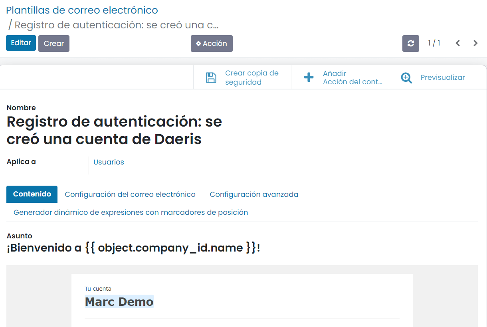
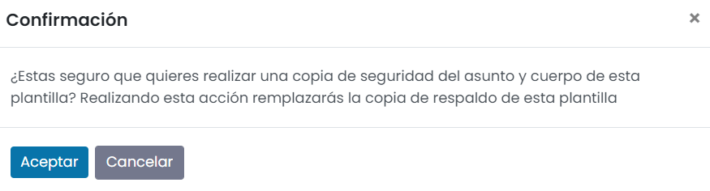
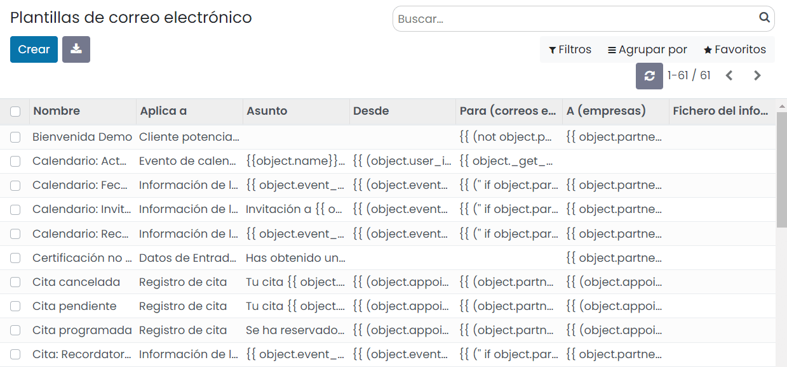
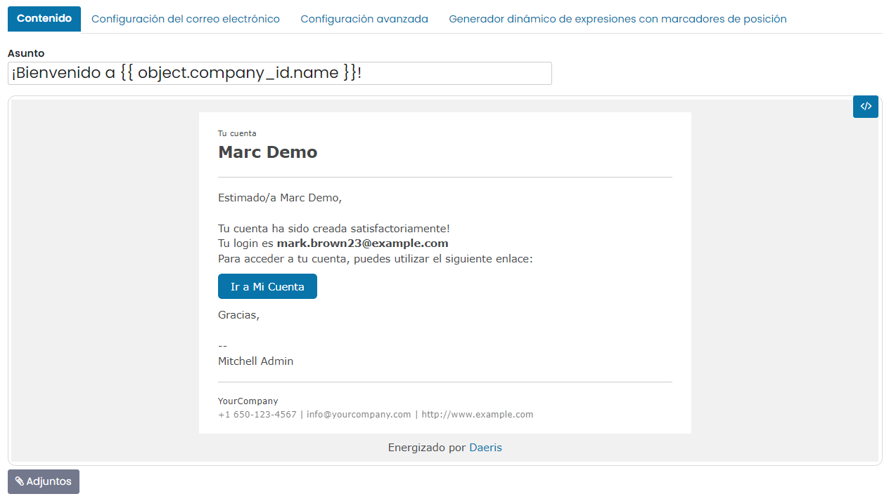
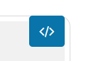
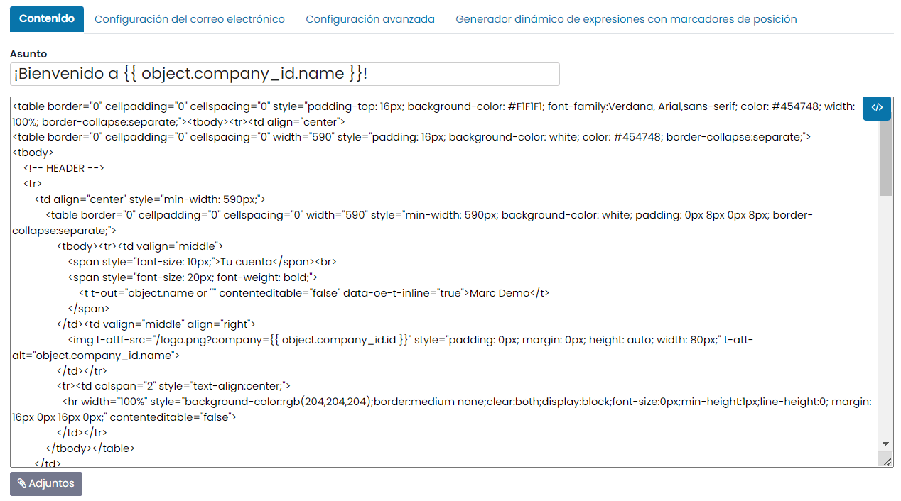
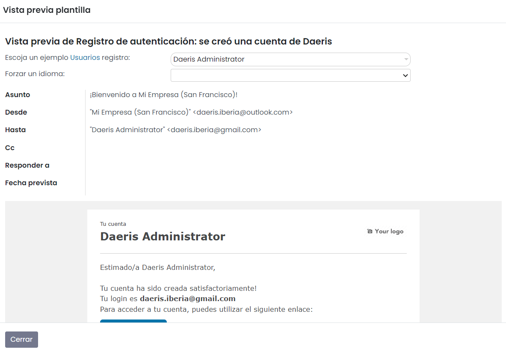
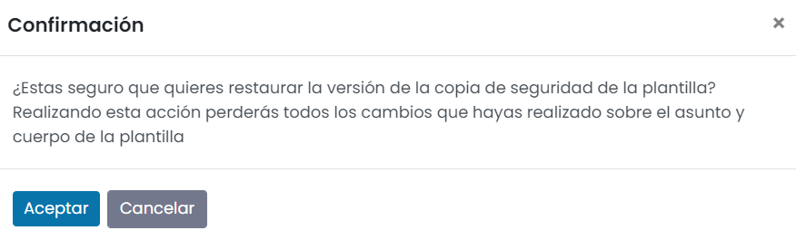
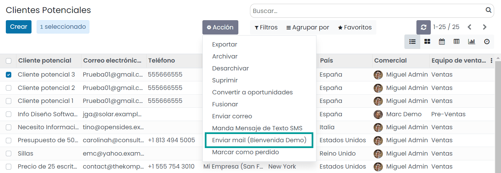
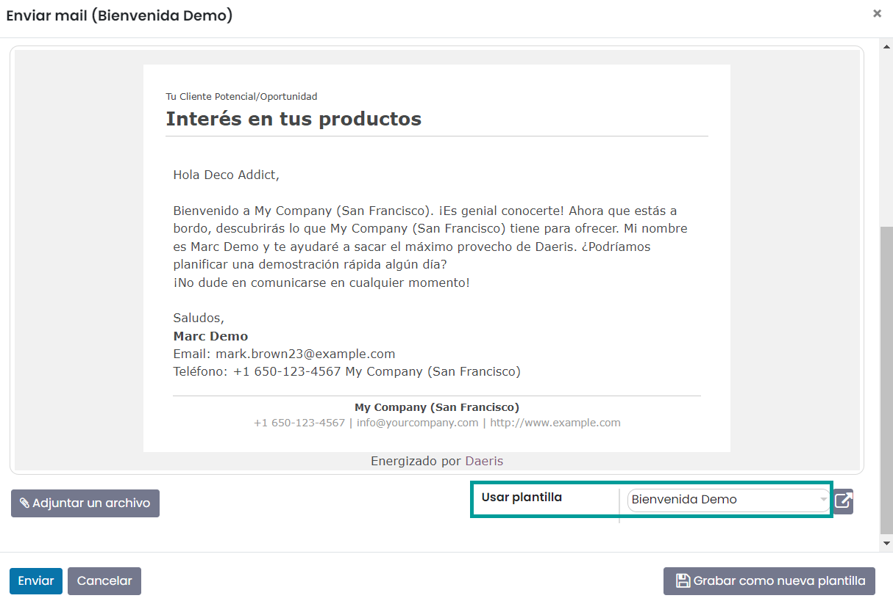

================================
Plantillas de correo electrónico
================================

Escribir buenos correos electrónicos es vital para obtener una alta tasa de respuesta, pero para no tener que volver a
escribir la misma estructura cada vez, es posible utilizar plantillas de correo electrónico. Sin necesidad de reescribir
toda la estructura del correo electrónico cada vez, puedes ahorrar tiempo y concentrarte en el contenido. Además, varias
plantillas te permiten entregar el mensaje correcto al público adecuado, lo que mejora su experiencia general con la empresa.

Crear copia de seguridad de una plantilla de correo electrónico
===============================================================

Antes de llevar a cabo modificaciones en las plantillas de correo electrónico, es muy recomendable realizar una copia
de seguridad de dichas plantillas, para que puedan ser restauradas posteriormente en caso de errores.

Para crear una copia de seguridad de una plantilla, navega a la pantalla :menuselection:`Ajustes --> Correo electrónico --> Plantillas`,
y accede al detalle de una plantilla:

A continuación, pulsa el botón *Crear copia de seguridad*:

El sistema solicitará confirmación para realizar la copia de seguridad de la plantilla:

Una vez aceptado el mensaje, el sistema creará una copia de seguridad de dicha plantilla, para que pueda ser restaurada
posteriormente en caso de ser necesario.

Modificar una plantilla de correo electrónico
=============================================

Desde Daeris se realizan diversos envíos de correos electrónicos, y algunos de ellos utilizan plantillas de correo predefinidas.
El listado completo de plantillas de correo utilizadas desde la aplicación se puede encontrar en la pantalla
:menuselection:`Ajustes --> Correo electrónico --> Plantillas`:

Para modificar el formato de una plantilla existente, navega al detalle de la plantilla en cuestión y pulsa el botón *Editar*:

Desde el modo de edición, puedes modificar el contenido de la plantilla desde la pestaña de *Contenido*:

.. danger::
   Cualquier modificación de una plantilla, puede dar lugar a errores en la configuración de dicha plantilla, que provoquen
   que el correo no se envíe a los destinatarios. Hay que prestar especial atención a las variables definidas entre corchetes,
   ya que hacen referencia a campos internos de los objetos de Daeris.

Para acceder a un modo de edición avanzado de la plantilla, pulsa el botón *Vista de Código*:

Desde la vista de código, es posible editar el código HTML de la plantilla, lo que permite un nivel de edición más avanzado:

Una vez modificada la plantilla, es posible realizar una prueba de visualización, mediante el botón *Previsualizar*,
ubicado en la parte superior derecha de la pantalla:

Al previsualizar la plantilla, puedes confirmar si los cambios realizados son correctos. El sistema te permite elegir un
registro de ejemplo para la previsualización de los datos en la plantilla:

De esta manera, es posible comprobar que tanto las variables como el formato de la plantilla son correctos.

Restaurar una plantilla de correo electrónico
=============================================

En el caso de que una plantilla no se visualice correctamente tras los cambios realizados, o que, al enviar un correo
con esta plantilla, el contenido del correo aparezca en blanco, puedes restaurar la versión original de la plantilla
mediante el botón *Restaurar copia de seguridad*:

.. note::
   El botón de restauración de copia de seguridad solo aparece en caso de haber creado previamente una copia de seguridad
   de la plantilla de correo.

Al pulsar el botón de restauración, el sistema solicitará confirmación para restaurar la plantilla con los datos originales,
sobrescribiendo tanto el asunto como el cuerpo de la plantilla:

Al pulsar el botón *Aceptar*, la plantilla quedará restaurada con su contenido original.

Añadir acción del contexto para una plantilla
=============================================

Es posible mostrar una opción en el objeto asociado a una plantilla para abrir un asistente de composición de correo
electrónico con dicha plantilla. Para ello, pulsa el botón *Añadir acción del contexto* en el detalle de una plantilla:

A continuación, navega a la vista de tipo listado del objeto asociado a la plantilla. Por ejemplo, si añades una acción
del contexto para una plantilla que aplique a *Cliente potencial/Oportunidad*, navega a la pantalla
:menuselection:`CRM --> Clientes potenciales`. Desde la vista de tipo listado, selecciona al menos un registro y haz
clic en el menú *Acción*. Debe aparecer una nueva opción para enviar un correo utilizando la plantilla en la que se
ha añadido la acción del contexto:

.. note::
   Es necesario refrescar o cargar la página de nuevo en el navegador para que se vean reflejados los cambios en el menú Acción.

Al seleccionar esa acción, se desplegará el compositor de correos electrónicos informando por defecto la plantilla de
correo electrónico:

Por último, si la acción se ha creado por error, o si ya no es necesario mostrar esa acción en el contexto del objeto
de la plantilla, es posible eliminar dicha acción pulsando el botón *Eliminar acción del contexto* ubicado en el
formulario de detalle de la plantilla:

