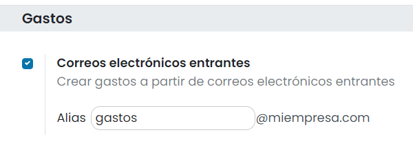
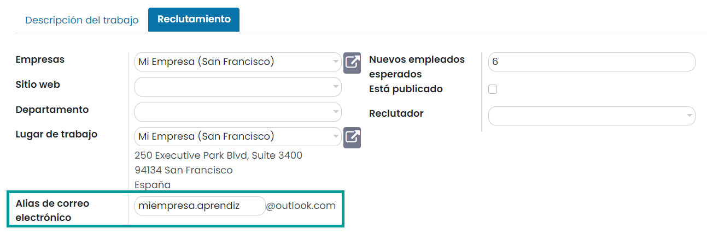

======================================
Recibir correos electrónicos en Daeris
======================================

Daeris se basa en alias de correo electrónico genéricos para recuperar los mensajes entrantes:

-  **Los mensajes de respuesta** de los mensajes enviados desde Daeris se enrutan a su hilo de discusión original (y a la
   bandeja de entrada de todos sus seguidores) por el alias general.

-  **Los mensajes devueltos** porque no han podido ser entregados al destinatario se enrutan por el alias de rebotes para
   rastrearlos en Daeris. Esto se utiliza especialmente en el módulo de Marketing por email para eliminar destinatarios
   no válidos de las listas de correo.

-  **Mensajes originales**: Varios objetos tienen su propio alias para crear nuevos registros en Daeris a partir de correos
   electrónicos entrantes:

   -  Canal de ventas (para crear clientes potenciales u oportunidades)

   -  Canal de soporte (para crear tickets en el servicio de asistencia)

   -  Proyectos (para crear nuevas tareas en el proyecto)

   -  Gastos (para crear tickets de gastos de los empleados)

   -  Facturas (para crear nuevas facturas de proveedor)

   -  Puestos de trabajo (para crear nuevas solicitudes de empleo)

   -  Mantenimiento (para crear nuevas peticiones de mantenimiento)

Todos los alias son personalizables en Daeris. Los alias de objetos se pueden editar desde su respectiva vista de
configuración.

Los pasos a seguir para crear un servidor de correo entrante pueden variar en función de si se dispone de una cuenta de
correo con dominio propio o si se dispone de una cuenta de correo de Google Gmail o de Microsoft Outlook.

Cuenta de correo con dominio propio
===================================

Crear cuentas y alias en tu servidor de correo
----------------------------------------------

#. Crea una dirección de correo electrónico genérica en tu servidor de correo (por ejemplo, general@miempresa.com).

#. Crea una dirección de correo electrónico específica si necesitas gestionar tickets en el servicio de asistencia (por
   ejemplo, soporte@miempresa.com).

#. Crea los alias de correo electrónico correspondientes (también llamados redirecciones) en tu servidor de correo. Estos
   alias de correo deben redirigir los correos a tu dirección de correo genérica creada en el paso 1.

   #. Canal de ventas, para crear clientes potenciales u oportunidades (por ejemplo, ventas@miempresa.com, info@miempresa.com).

   #. Proyectos, para crear nuevas tareas en el proyecto (por ejemplo, proyecto1@miempresa.com, proyecto2@miempresa.com).

   #. Gastos, para crear tickets de gastos de los empleados (por ejemplo, gastos@miempresa.com)

   #. Facturas, para crear nuevas facturas de proveedor (por ejemplo, facturas@miempresa.com)

   #. Puestos de trabajo, para crear nuevas solicitudes de empleo (por ejemplo, director.rrhh@miempresa.com)

   #. Mantenimiento, para crear nuevas peticiones de mantenimiento (por ejemplo, mantenimiento@miempresa.com)

.. note::
   No es necesario crear todos los alias de correo electrónico.
   Crea solamente aquellos alias que necesites en función de tu negocio.

Establecer el alias del dominio
-------------------------------

Establece tu nombre de dominio desde la pantalla :menuselection:`Ajustes --> Opciones generales`. Desde el apartado de
*Conversaciones* activa la opción **Servidores de correo electrónico personalizados** e informa el *Alias del dominio*:

.. image:: recibir_correos/alias-dominio.png
   :align: center
   :alt: Alias de dominio

Crear servidor de correo entrante genérico
------------------------------------------

A continuación, crea un servidor de correo entrante genérico en Daeris desde la pantalla :menuselection:`Ajustes --> Correo electrónico --> Servidores de correo entrante`.
Para dar de alta un nuevo servidor de correo entrante, haz clic en el botón *Crear*, que abrirá un nuevo formulario en
donde poder informar todos los datos necesarios para la conexión del buzón en Daeris:

-  **Nombre**: Nombre que le damos al servidor de correo entrante en Daeris.

-  **Tipo de servidor**: Podemos elegir entre POP, IMAP o local.

-  **Información del servidor**

   -  **Nombre del servidor**: Nombre del servidor de correo donde Daeris debe realizar la conexión.

   -  **Puerto**: Puerto por el que se realiza la conexión.

   -  **SSL/TLS**: Indica si se debe realizar una conexión segura.

-  **Información de inicio de sesión**

   -  **Nombre de usuario**: Nombre del usuario con el que Daeris realiza la conexión al buzón.

   -  **Contraseña**: Contraseña del usuario de conexión.

-  **Acciones a realizar en los correos entrantes**

   -  **Crear un nuevo registro**: Este campo indica si al recibir un correo entrante se debe crear algún registro en
      alguno de los objetos de la aplicación. Para el servidor de correo genérico, este campo debe estar en blanco.

Una vez informado el formulario, pulsa el botón *Probar y confirmar*, ubicado en la parte superior izquierda de la pantalla:

Si todo ha ido bien, el estado del servidor pasará a *Confirmado*:

.. note::
   Por defecto, los mensajes entrantes se actualizan cada 5 minutos en Daeris.

Crear servidor de correo entrante de soporte
--------------------------------------------

Si necesitas gestionar tickets en el servicio de asistencia, crea un servidor de correo entrante adicional en Daeris
desde la pantalla :menuselection:`Ajustes --> Correo electrónico --> Servidores de correo entrante`. Para dar de alta
un nuevo servidor de correo entrante, haz clic en el botón *Crear*, que abrirá un nuevo formulario en donde poder
informar todos los datos necesarios para la conexión del buzón en Daeris:

-  **Nombre**: Nombre que le damos al servidor de correo entrante en Daeris.

-  **Tipo de servidor**: Podemos elegir entre POP, IMAP o local.

-  **Información del servidor**

   -  **Nombre del servidor**: Nombre del servidor de correo donde Daeris debe realizar la conexión.

   -  **Puerto**: Puerto por el que se realiza la conexión.

   -  **SSL/TLS**: Indica si se debe realizar una conexión segura.

-  **Información de inicio de sesión**

   -  **Nombre de usuario**: Nombre del usuario con el que Daeris realiza la conexión al buzón.

   -  **Contraseña**: Contraseña del usuario de conexión.

-  **Acciones a realizar en los correos entrantes**

   -  **Crear un nuevo registro**: Este campo indica si al recibir un correo entrante se debe crear algún registro en
      alguno de los objetos de la aplicación. En el caso del buzón de soporte, es necesario informar este campo con el
      valor “Ticket de soporte”.

Una vez informado el formulario, pulsa el botón *Probar y confirmar*, ubicado en la parte superior izquierda de la pantalla:

Si todo ha ido bien, el estado del servidor pasará a *Confirmado*:

.. note::
   Por defecto, los mensajes entrantes se actualizan cada 5 minutos en Daeris.

Configurar los alias de correo electrónico
------------------------------------------

Por último, es necesario configurar cada uno de los alias utilizados en Daeris:

-  **Dirección de correo general (catchall)**: Para configurar el alias de correo general navega a la pantalla
   :menuselection:`Ajustes --> Correo electrónico --> Alias de correo`, y edita la sección *General*. Debes informar la
   dirección de correo electrónico genérica creada en tu servidor de correo.

-  **Control de correos rebotados**: Para configurar el alias de correos rebotados navega a la pantalla
   :menuselection:`Ajustes --> Correo electrónico --> Alias de correo`, y edita la sección *Rebotes*. Debes informar el
   alias de tu buzón de correos rebotados, que se debería corresponder con el buzón por el que realizas el envío de campañas
   de Marketing por email.

-  **Canal de ventas**: Debes configurar el alias para los diferentes equipos de ventas. Esto lo puedes hacer desde la
   pantalla :menuselection:`CRM --> Ventas --> Equipos`, accediendo a la configuración de uno de los equipos de ventas:

-  **Proyectos**: Para configurar el alias para los diferentes proyectos, y que seas capaz de crear tareas asociadas al
   proyecto, navega a la pantalla :menuselection:`Proyecto --> Proyectos`, y edita uno de los proyectos dados de alta.
   Desde la pestaña de *Ajustes* puedes informar el alias de correo del proyecto.

-  **Gastos**: Para configurar el alias para la generación de tickets de gastos desde correos entrantes, debes navegar a
   la pantalla :menuselection:`Gastos --> Configuración --> Ajustes`, y editar la sección *Gastos*:

-  **Facturas**: Para configurar el alias para las facturas de proveedor debes navegar a la pantalla
   :menuselection:`Facturación / Contabilidad --> Tablero`, y acceder a la configuración de las facturas de proveedor.
   Desde la pestaña de *Configuración avanzada* puedes informar el alias de correo:

-  **Puestos de trabajo**: Para configurar el alias para los puestos de trabajo debes navegar a la pantalla
   :menuselection:`Reclutamiento --> Postulaciones --> Por puesto de trabajo`, y editar un puesto de trabajo.
   Desde la pestaña de *Reclutamiento* puedes informar el alias de correo:

-  **Mantenimiento**: Para configurar el alias para la generación de peticiones de mantenimiento desde correos entrantes,
   debes navegar a la pantalla :menuselection:`Mantenimiento --> Configuración --> Ajustes`, y editar la sección *Mantenimiento*:

Cuenta de correo de Google Gmail
================================

Crear cuentas de correo
-----------------------

#. Crea una dirección de correo electrónico genérica en tu proveedor de correo (por ejemplo, miempresa@gmail.com).

#. Crea una dirección de correo electrónico específica si necesitas gestionar tickets en el servicio de asistencia (por
   ejemplo, soporte.miempresa@gmail.com).

Establecer el alias del dominio
-------------------------------

Establece tu nombre de dominio desde la pantalla :menuselection:`Ajustes --> Opciones generales`. Desde el apartado de
*Conversaciones* activa la opción **Servidores de correo electrónico personalizados** e informa el *Alias del dominio*:

.. image:: recibir_correos/alias-dominio-gmail.png
   :align: center
   :alt: Alias de dominio

Crear servidor de correo entrante genérico
------------------------------------------

A continuación, crea un servidor de correo entrante genérico en Daeris desde la pantalla :menuselection:`Ajustes --> Correo electrónico --> Servidores de correo entrante`.
Para dar de alta un nuevo servidor de correo entrante, haz clic en el botón *Crear*, que abrirá un nuevo formulario en
donde poder informar todos los datos necesarios para la conexión del buzón en Daeris:

-  **Nombre**: Nombre que le damos al servidor de correo entrante en Daeris.

-  **Tipo de servidor**: Podemos elegir entre POP, IMAP o local. Para Gmail, seleccionar *IMAP*.

-  **Información del servidor**

   -  **Nombre del servidor**: Nombre del servidor de correo donde Daeris debe realizar la conexión. Para Gmail, el
      el servidor es *imap.gmail.com*.

   -  **Puerto**: Puerto por el que se realiza la conexión. Para Gmail, el puerto es *993*.

   -  **SSL/TLS**: Indica si se debe realizar una conexión segura. Para Gmail, se debe marcar esta opción.

-  **Información de inicio de sesión**

   -  **Nombre de usuario**: Nombre del usuario con el que Daeris realiza la conexión al buzón. En Gmail se corresponde
      con tu cuenta de correo de Google.

   -  **Contraseña**: Contraseña del usuario de conexión.

.. note::
   Es posible que debas generar una contraseña de aplicación en tu cuenta de Google para permitir la conexión desde
   Daeris a tu cuenta de correo de Gmail. Puedes encontrar más información acerca de cómo crear una contraseña de
   aplicación `aquí <https://support.google.com/accounts/answer/185833?hl=es>`_.

-  **Acciones a realizar en los correos entrantes**

   -  **Crear un nuevo registro**: Este campo indica si al recibir un correo entrante se debe crear algún registro en
      alguno de los objetos de la aplicación. Para el servidor de correo genérico, este campo debe estar en blanco.

Una vez informado el formulario, pulsa el botón *Probar y confirmar*, ubicado en la parte superior izquierda de la pantalla:

.. important::
   La primera vez que pruebas tu servidor de correo entrante, es posible que Gmail detecte actividad sospechosa en tu
   cuenta. En estos casos, debes comprobar tu buzón de correo de Gmail y revisar la actividad reciente, para confirmar
   que reconoces la conexión realizada a tu buzón. Además, deberás habilitar los ajustes IMAP en tu cuenta de Gmail.

Si todo ha ido bien, el estado del servidor pasará a *Confirmado*:

.. note::
   Por defecto, los mensajes entrantes se actualizan cada 5 minutos en Daeris.

Crear servidor de correo entrante de soporte
--------------------------------------------

Si necesitas gestionar tickets en el servicio de asistencia, crea un servidor de correo entrante adicional en Daeris
desde la pantalla :menuselection:`Ajustes --> Correo electrónico --> Servidores de correo entrante`. Para dar de alta
un nuevo servidor de correo entrante, haz clic en el botón *Crear*, que abrirá un nuevo formulario en donde poder
informar todos los datos necesarios para la conexión del buzón en Daeris:

-  **Nombre**: Nombre que le damos al servidor de correo entrante en Daeris.

-  **Tipo de servidor**: Podemos elegir entre POP, IMAP o local. Para Gmail, seleccionar *IMAP*.

-  **Información del servidor**

   -  **Nombre del servidor**: Nombre del servidor de correo donde Daeris debe realizar la conexión. Para Gmail, el
      el servidor es *imap.gmail.com*.

   -  **Puerto**: Puerto por el que se realiza la conexión. Para Gmail, el puerto es *993*.

   -  **SSL/TLS**: Indica si se debe realizar una conexión segura. Para Gmail, se debe marcar esta opción.

-  **Información de inicio de sesión**

   -  **Nombre de usuario**: Nombre del usuario con el que Daeris realiza la conexión al buzón. En Gmail se corresponde
      con tu cuenta de correo de Google.

   -  **Contraseña**: Contraseña del usuario de conexión.

.. note::
   Es posible que debas generar una contraseña de aplicación en tu cuenta de Google para permitir la conexión desde
   Daeris a tu cuenta de correo de Gmail. Puedes encontrar más información acerca de cómo crear una contraseña de
   aplicación `aquí <https://support.google.com/accounts/answer/185833?hl=es>`_.

-  **Acciones a realizar en los correos entrantes**

   -  **Crear un nuevo registro**: Este campo indica si al recibir un correo entrante se debe crear algún registro en
      alguno de los objetos de la aplicación. En el caso del buzón de soporte, es necesario informar este campo con el
      valor “Ticket de soporte”.

Una vez informado el formulario, pulsa el botón *Probar y confirmar*, ubicado en la parte superior izquierda de la pantalla:

.. important::
   La primera vez que pruebas tu servidor de correo entrante, es posible que Gmail detecte actividad sospechosa en tu
   cuenta. En estos casos, debes comprobar tu buzón de correo de Gmail y revisar la actividad reciente, para confirmar
   que reconoces la conexión realizada a tu buzón. Además, deberás habilitar los ajustes IMAP en tu cuenta de Gmail.

Si todo ha ido bien, el estado del servidor pasará a *Confirmado*:

.. note::
   Por defecto, los mensajes entrantes se actualizan cada 5 minutos en Daeris.

Configurar los alias de correo electrónico
------------------------------------------

Por último, es necesario configurar cada uno de los alias utilizados en Daeris:

.. note::
   En Gmail, es posible utilizar alias de correo electrónico de forma automática, insertando a continuación del nombre
   de cuenta, el símbolo “+” y un nombre de alias. Todos los correos enviados a estos alias entrarán en el buzón de
   entrada principal.

-  **Dirección de correo general (catchall)**: Para configurar el alias de correo general navega a la pantalla
   :menuselection:`Ajustes --> Correo electrónico --> Alias de correo`, y edita la sección *General*. Debes informar la
   dirección de correo electrónico genérica creada en Gmail.

-  **Control de correos rebotados**: Para configurar el alias de correos rebotados navega a la pantalla
   :menuselection:`Ajustes --> Correo electrónico --> Alias de correo`, y edita la sección *Rebotes*. Debes informar el
   alias de tu buzón de correos rebotados, que se debería corresponder con el buzón por el que realizas el envío de campañas
   de Marketing por email.

-  **Canal de ventas**: Debes configurar el alias para los diferentes equipos de ventas. Esto lo puedes hacer desde la
   pantalla :menuselection:`CRM --> Ventas --> Equipos`, accediendo a la configuración de uno de los equipos de ventas:

-  **Proyectos**: Para configurar el alias para los diferentes proyectos, y que seas capaz de crear tareas asociadas al
   proyecto, navega a la pantalla :menuselection:`Proyecto --> Proyectos`, y edita uno de los proyectos dados de alta.
   Desde la pestaña de *Ajustes* puedes informar el alias de correo del proyecto.

-  **Gastos**: Para configurar el alias para la generación de tickets de gastos desde correos entrantes, debes navegar a
   la pantalla :menuselection:`Gastos --> Configuración --> Ajustes`, y editar la sección *Gastos*:

-  **Facturas**: Para configurar el alias para las facturas de proveedor debes navegar a la pantalla
   :menuselection:`Facturación / Contabilidad --> Tablero`, y acceder a la configuración de las facturas de proveedor.
   Desde la pestaña de *Configuración avanzada* puedes informar el alias de correo:

-  **Puestos de trabajo**: Para configurar el alias para los puestos de trabajo debes navegar a la pantalla
   :menuselection:`Reclutamiento --> Postulaciones --> Por puesto de trabajo`, y editar un puesto de trabajo.
   Desde la pestaña de *Reclutamiento* puedes informar el alias de correo:

-  **Mantenimiento**: Para configurar el alias para la generación de peticiones de mantenimiento desde correos entrantes,
   debes navegar a la pantalla :menuselection:`Mantenimiento --> Configuración --> Ajustes`, y editar la sección *Mantenimiento*:

Cuenta de correo de Microsoft Outlook
=====================================

Crear cuentas de correo
-----------------------

#. Crea una dirección de correo electrónico genérica en tu proveedor de correo (por ejemplo, miempresa@outlook.com).

#. Crea una dirección de correo electrónico específica si necesitas gestionar tickets en el servicio de asistencia (por
   ejemplo, soporte.miempresa@outlook.com).

Establecer el alias del dominio
-------------------------------

Establece tu nombre de dominio desde la pantalla :menuselection:`Ajustes --> Opciones generales`. Desde el apartado de
*Conversaciones* activa la opción **Servidores de correo electrónico personalizados** e informa el *Alias del dominio*:

Crear servidor de correo entrante genérico
------------------------------------------

A continuación, crea un servidor de correo entrante genérico en Daeris desde la pantalla :menuselection:`Ajustes --> Correo electrónico --> Servidores de correo entrante`.
Para dar de alta un nuevo servidor de correo entrante, haz clic en el botón *Crear*, que abrirá un nuevo formulario en
donde poder informar todos los datos necesarios para la conexión del buzón en Daeris:

-  **Nombre**: Nombre que le damos al servidor de correo entrante en Daeris.

-  **Tipo de servidor**: Podemos elegir entre POP, IMAP o local. Para Outlook, seleccionar *IMAP*.

-  **Información del servidor**

   -  **Nombre del servidor**: Nombre del servidor de correo donde Daeris debe realizar la conexión. Para Outlook, el
      el servidor es *outlook.office365.com*.

   -  **Puerto**: Puerto por el que se realiza la conexión. Para Outlook, el puerto es *993*.

   -  **SSL/TLS**: Indica si se debe realizar una conexión segura. Para Outlook, se debe marcar esta opción.

-  **Información de inicio de sesión**

   -  **Nombre de usuario**: Nombre del usuario con el que Daeris realiza la conexión al buzón. En Outlook se corresponde
      con tu cuenta de correo de Microsoft.

   -  **Contraseña**: Contraseña del usuario de conexión.

-  **Acciones a realizar en los correos entrantes**

   -  **Crear un nuevo registro**: Este campo indica si al recibir un correo entrante se debe crear algún registro en
      alguno de los objetos de la aplicación. Para el servidor de correo genérico, este campo debe estar en blanco.

Una vez informado el formulario, pulsa el botón *Probar y confirmar*, ubicado en la parte superior izquierda de la pantalla:

.. important::
   La primera vez que pruebas tu servidor de correo entrante, es posible que Outlook detecte actividad sospechosa en tu
   cuenta. En estos casos, debes comprobar tu buzón de correo de Outlook y revisar la actividad reciente, para confirmar
   que reconoces la conexión realizada a tu buzón.

Si todo ha ido bien, el estado del servidor pasará a *Confirmado*:

.. note::
   Por defecto, los mensajes entrantes se actualizan cada 5 minutos en Daeris.

Crear servidor de correo entrante de soporte
--------------------------------------------

Si necesitas gestionar tickets en el servicio de asistencia, crea un servidor de correo entrante adicional en Daeris
desde la pantalla :menuselection:`Ajustes --> Correo electrónico --> Servidores de correo entrante`. Para dar de alta
un nuevo servidor de correo entrante, haz clic en el botón *Crear*, que abrirá un nuevo formulario en donde poder
informar todos los datos necesarios para la conexión del buzón en Daeris:

-  **Nombre**: Nombre que le damos al servidor de correo entrante en Daeris.

-  **Tipo de servidor**: Podemos elegir entre POP, IMAP o local. Para Outlook, seleccionar *IMAP*.

-  **Información del servidor**

   -  **Nombre del servidor**: Nombre del servidor de correo donde Daeris debe realizar la conexión. Para Outlook, el
      el servidor es *outlook.office365.com*.

   -  **Puerto**: Puerto por el que se realiza la conexión. Para Outlook, el puerto es *993*.

   -  **SSL/TLS**: Indica si se debe realizar una conexión segura. Para Outlook, se debe marcar esta opción.

-  **Información de inicio de sesión**

   -  **Nombre de usuario**: Nombre del usuario con el que Daeris realiza la conexión al buzón. En Outlook se corresponde
      con tu cuenta de correo de Microsoft.

   -  **Contraseña**: Contraseña del usuario de conexión.

-  **Acciones a realizar en los correos entrantes**

   -  **Crear un nuevo registro**: Este campo indica si al recibir un correo entrante se debe crear algún registro en
      alguno de los objetos de la aplicación. En el caso del buzón de soporte, es necesario informar este campo con el
      valor “Ticket de soporte”.

Una vez informado el formulario, pulsa el botón *Probar y confirmar*, ubicado en la parte superior izquierda de la pantalla:

.. important::
   La primera vez que pruebas tu servidor de correo entrante, es posible que Outlook detecte actividad sospechosa en tu
   cuenta. En estos casos, debes comprobar tu buzón de correo de Outlook y revisar la actividad reciente, para confirmar
   que reconoces la conexión realizada a tu buzón.

Si todo ha ido bien, el estado del servidor pasará a *Confirmado*:

.. note::
   Por defecto, los mensajes entrantes se actualizan cada 5 minutos en Daeris.

Configurar los alias de correo electrónico
------------------------------------------

Por último, es necesario configurar cada uno de los alias utilizados en Daeris:

.. note::
   En Outlook, es posible agregar hasta 10 direcciones de correo a la cuenta de Microsoft. Los alias comparten una única
   contraseña y se puede enviar y recibir correo con cada uno de ellos. El alias principal será el nombre de usuario con
   el que inicias sesión en la cuenta. Puedes encontrar más información acerca de cómo agregar alias de correo electrónico
   en Outlook `en este artículo <https://support.microsoft.com/en-us/office/add-or-remove-an-email-alias-in-outlook-com-459b1989-356d-40fa-a689-8f285b13f1f2>`_.

-  **Dirección de correo general (catchall)**: Para configurar el alias de correo general navega a la pantalla
   :menuselection:`Ajustes --> Correo electrónico --> Alias de correo`, y edita la sección *General*. Debes informar la
   dirección de correo electrónico genérica creada en Outlook.

-  **Control de correos rebotados**: Para configurar el alias de correos rebotados navega a la pantalla
   :menuselection:`Ajustes --> Correo electrónico --> Alias de correo`, y edita la sección *Rebotes*. Debes informar el
   alias de tu buzón de correos rebotados, que se debería corresponder con el buzón por el que realizas el envío de campañas
   de Marketing por email.

.. image:: recibir_correos/alias-de-rebotes-outlook.png
   :align: center
   :alt: Alias de correos rebotados

-  **Canal de ventas**: Debes configurar el alias para los diferentes equipos de ventas. Esto lo puedes hacer desde la
   pantalla :menuselection:`CRM --> Ventas --> Equipos`, accediendo a la configuración de uno de los equipos de ventas:

-  **Proyectos**: Para configurar el alias para los diferentes proyectos, y que seas capaz de crear tareas asociadas al
   proyecto, navega a la pantalla :menuselection:`Proyecto --> Proyectos`, y edita uno de los proyectos dados de alta.
   Desde la pestaña de *Ajustes* puedes informar el alias de correo del proyecto.

-  **Gastos**: Para configurar el alias para la generación de tickets de gastos desde correos entrantes, debes navegar a
   la pantalla :menuselection:`Gastos --> Configuración --> Ajustes`, y editar la sección *Gastos*:

-  **Facturas**: Para configurar el alias para las facturas de proveedor debes navegar a la pantalla
   :menuselection:`Facturación / Contabilidad --> Tablero`, y acceder a la configuración de las facturas de proveedor.
   Desde la pestaña de *Configuración avanzada* puedes informar el alias de correo:

-  **Puestos de trabajo**: Para configurar el alias para los puestos de trabajo debes navegar a la pantalla
   :menuselection:`Reclutamiento --> Postulaciones --> Por puesto de trabajo`, y editar un puesto de trabajo.
   Desde la pestaña de *Reclutamiento* puedes informar el alias de correo:

-  **Mantenimiento**: Para configurar el alias para la generación de peticiones de mantenimiento desde correos entrantes,
   debes navegar a la pantalla :menuselection:`Mantenimiento --> Configuración --> Ajustes`, y editar la sección *Mantenimiento*:

