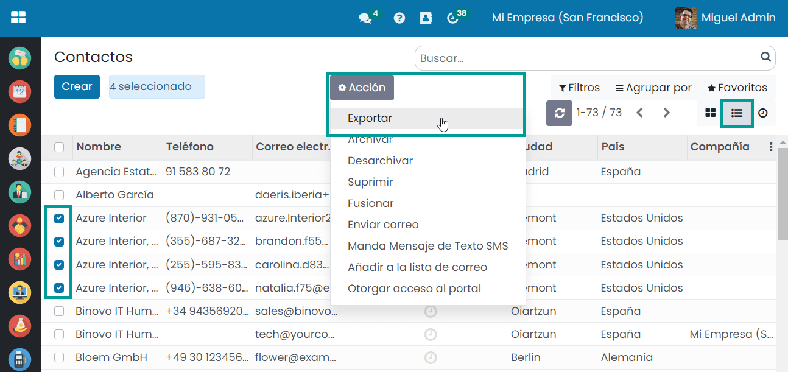
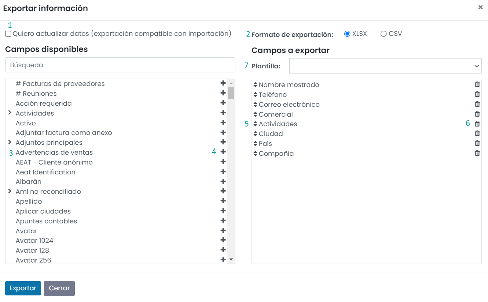
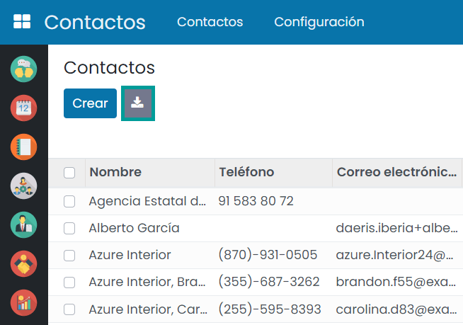
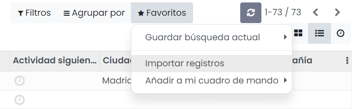
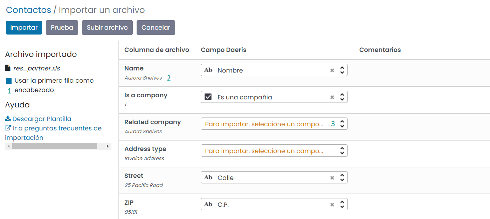
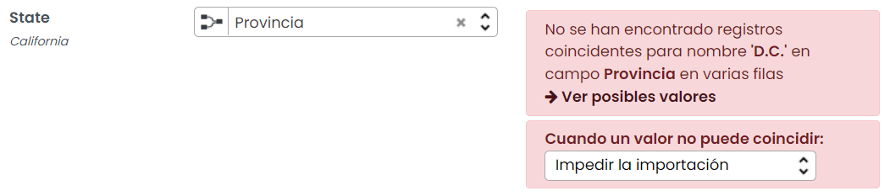
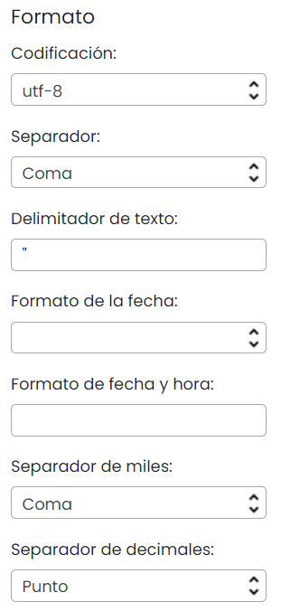

:show-content:

=========================
Exportar e importar datos
=========================

Al trabajar con una base de datos, a menudo es necesario exportar sus datos a un archivo distinto. Hacerlo te puede
ayudar a hacer informes sobre tus actividades.

Por otro lado, a la hora de migrar tus datos a Daeris desde un sistema externo, es necesario disponer de un mecanismo
para facilitar la migración de dichos datos. El asistente de importación de datos de Daeris es muy sencillo de utilizar
y te permite cargar tus datos de sistemas externos en la aplicación.

.. youtube:: xKx3gv7xc-Q
    :align: right
    :width: 700
    :height: 394

Exportar datos desde Daeris
===========================

Exportación personalizada
-------------------------

La aplicación permite la exportación de datos desde las pantallas de lista de datos. Para habilitar la opción de
exportación es requerido seleccionar como mínimo un registro. Por ejemplo, desde la pantalla :menuselection:`Contactos --> Contactos`,
selecciona varios registros, y comprueba que una vez seleccionados, se habilita el menú *Acción* y *Exportar*:

Al hacer clic en *Exportar*, aparece una ventana emergente con varias opciones para los datos que se exportarán:

#. Con la opción de *Quiero actualizar datos* activada, el sistema solo muestra campos que se pueden importar. Esto es
   muy útil en caso de que quieras actualizar registros existentes. Básicamente funciona como un filtro. Si no seleccionas
   la casilla, tienes más opciones de campos, porque se muestran todos los campos, no solo los que se pueden importar.

#. Al exportar puedes elegir dos formatos: .csv y .xlsx. Con .csv, los elementos se separan con una coma, mientras que .xlsx
   guarda información sobre todas las hojas de trabajo en un archivo, incluyendo tanto el contenido como el formato.

#. Estos son los campos disponibles para exportar. Usa las flechas para mostrar más opciones de subcampos. Puedes usar
   la barra de búsqueda para encontrar campos específicos con facilidad. Para usar la opción de buscar con mayor eficiencia,
   haz clic en todas las flechas para mostrar todos los campos.

#. Con el botón de + puedes agregar más campos a la lista de campos a exportar.

#. Las flechas al lado de los campos seleccionados te permiten mover los campos hacia arriba o abajo para cambiar el
   orden en el que se mostrarán en el archivo exportado.

#. Puedes usar la papelera para eliminar campos.

#. Para reportes recurrentes, puede que sea interesante guardar los ajustes de una exportación. Para ello, haz clic en
   la barra de la plantilla, selecciona *Nueva plantilla* y proporciona un nombre. La próxima vez que necesites exportar
   la misma lista, simplemente selecciona la plantilla relacionada.

Una vez seleccionados todos los campos a exportar, pulsa el botón *Exportar* para que se genere el fichero con los datos
correspondientes.

.. warning::
   Las exportaciones masivas de datos (varios cientos o miles de registros) pueden provocar problemas de rendimiento
   sobre la aplicación, por lo que se recomienda limitar este tipo de exportaciones y realizarlas preferentemente en
   horas de poca actividad (noches, fines de semana, etc.).

Exportación rápida
------------------

Es posible exportar todos los registros de un listado de forma rápida, mediante el botón de *Exportar Todo*, presente
en las vistas de tipo lista cuando todavía no hemos seleccionado ningún registro:

Al pulsar ese botón, la aplicación generará un fichero .xlsx con todos los registros del listado actual, y permitirá
guardarlo en el sistema.

Importar datos en Daeris
========================

Puedes importar datos en cualquier objeto empresarial de Daeris usando formatos de Excel (.xlsx) o CSV (.csv). Abre la
vista del objeto que deseas importar y haz clic en :menuselection:`Favoritos --> Importar registros`.

En función de la entidad sobre la que quieras realizar la carga de datos, la aplicación proporciona una plantilla con
todos los campos necesarios para la carga de dicha entidad. Esta plantilla se puede descargar mediante el enlace
correspondiente, y puede ser utilizada posteriormente para su carga en la aplicación, una vez se hayan informado los
datos necesarios:

Una vez dispones del fichero con los datos a cargar en la aplicación, pulsa el botón *Subir archivo*:

El sistema permitirá seleccionar el fichero de datos a cargar en la aplicación, de entre la lista de ficheros de tu equipo.
Una vez seleccionado el fichero, aparece un asistente de carga:

#. Si la primera fila del fichero de carga contiene la etiqueta de la columna a cargar, debes marcar la opción
   *Usar la primera fila como encabezado*. De esta manera, los nombres de las columnas quedarán posicionados en la parte
   izquierda para que puedan ser mapeados con los campos de la entidad y no serán cargados en el sistema.

#. Además de los nombres de las etiquetas de las columnas, también es posible visualizar un registro del fichero de carga,
   para que puedas comprobar de qué tipo de dato se trata.

#. En el caso de que intentes importar una columna y el sistema no detecte su correspondiente campo, aparecerá el valor
   *Para importar, seleccione un campo...*. En este caso, se podrá realizar el cuadre buscando manualmente el campo
   coincidente.

Una vez mapeados todos los campos, pulsa el botón *Prueba*. Si todo ha ido bien, la aplicación mostrará un mensaje
indicando que todo parece correcto. En el caso de que se detecten errores, se mostrará un mensaje indicando que hay
errores, así como el detalle de los mismos:

Cuando hayas corregido todos los errores, pulsa el botón *Importar*, para confirmar la importación de datos. Si todo ha
ido bien, el sistema mostrará un mensaje confirmando la importación de datos. A partir de ese momento, los datos
importados estarán disponibles en la aplicación.

Preguntas frecuentes
--------------------

¿Cómo configurar el fichero de carga?
~~~~~~~~~~~~~~~~~~~~~~~~~~~~~~~~~~~~~

-  Agrega, elimina y ordena las columnas como quieras.

-  Mantén la cabecera (primera fila) del fichero con los nombres de las columnas que necesitas cargar. Esas etiquetas de
   columna se mapean automáticamente en Daeris.

-  Pon una etiqueta a las nuevas columnas. Puedes seleccionar los campos a mapear al importarlos en Daeris.

-  Los campos obligatorios son aquellos campos requeridos no rellenados con valores predeterminados a través del sistema.

-  El fichero de importación no debe sobrepasar los 500 registros y dado el caso de disponer de un mayor volumen a importar,
   realiza divisiones del fichero.

-  Elimina de los ficheros de importación todas aquellas columnas que no deban ser importadas, con tal de agilizar la
   carga de datos en el sistema.

-  Al importar valores numéricos está permitido incorporar signos negativos, caracteres representativos de la moneda,
   separadores de miles y separador de decimales. Al incorporar un símbolo de moneda no reconocido por el sistema, no se
   permitirá la importación del valor.

¿Cómo importar el fichero de carga?
~~~~~~~~~~~~~~~~~~~~~~~~~~~~~~~~~~~

Mantén el tipo de fichero como ‘.xls’ o ‘.xlsx’ (formato Excel), ya que, de esa manera, el formateo de los campos es
automático.

Si importas un fichero ‘.csv’ (fichero de texto separado por comas), verifica que el formateo se interpreta correctamente
en Daeris (codificación, formato de fecha, separadores, etc.). En estos casos, dispones se la sección de formato
en el asistente de importación, que permite introducir las opciones de formato del fichero a cargar.

¿Para qué se utiliza el ‘ID externo’?
~~~~~~~~~~~~~~~~~~~~~~~~~~~~~~~~~~~~~~

Los *ID externo* son identificadores únicos para los registros importados.

Si estableces un ID para cada registro a importar, puedes volver a importar el mismo fichero varias veces y Daeris
actualizará los registros en lugar de crear nuevos si el ID ya existe.

Si el identificador no se incorpora, el sistema lo generará automáticamente.

¿Qué puedo hacer si tengo múltiples coincidencias para un campo?
~~~~~~~~~~~~~~~~~~~~~~~~~~~~~~~~~~~~~~~~~~~~~~~~~~~~~~~~~~~~~~~~

Si, por ejemplo, tienes dos categorías de productos con el nombre secundario «Se puede vender» (es decir, «Productos varios
/ Se puede vender» y «Otros productos / Se puede vender»), la validación se detiene, pero aún puedes importar tus datos.
Sin embargo, te recomendamos que no importes los datos porque todos estarán vinculados a la primera categoría “Se puede vender”
que se encuentra en la lista de Categoría de producto («Productos varios / Se puede vender»). Te recomendamos que modifiques
uno de los valores duplicados o la jerarquía de tu categoría de producto.

Sin embargo, si no deseas cambiar la configuración de las categorías de productos, te recomendamos que utilices el ID externo
para este campo “Categoría”.

¿Cómo importar varios valores sobre un mismo campo (relaciones many2one y many2many)?
~~~~~~~~~~~~~~~~~~~~~~~~~~~~~~~~~~~~~~~~~~~~~~~~~~~~~~~~~~~~~~~~~~~~~~~~~~~~~~~~~~~~~

Existen campos, que por su naturaleza, permiten la incorporación de varios valores. Por ejemplo, en la entidad contacto
se pueden asociar varias etiquetas.

Para incorporar varios valores sobre un campo, debes informar sobre la columna los valores sin ningún espacio y
separados por una coma (por ejemplo: B2B,Platino,Vip).

¿Cómo importar varios registros hijos sobre una entidad padre (relaciones one2many)?
~~~~~~~~~~~~~~~~~~~~~~~~~~~~~~~~~~~~~~~~~~~~~~~~~~~~~~~~~~~~~~~~~~~~~~~~~~~~~~~~~~~~

Incorpora una fila por cada uno de los registros a importar. Por ejemplo, si quieres importar un pedido y todas las
líneas que forman el pedido, debes incorporar el registro del pedido de venta (informando los campos que confirman el
pedido), y un registro adicional por cada línea del pedido (informando únicamente los valores asociados a la línea
del pedido).

¿Cómo importar campos de relación?
~~~~~~~~~~~~~~~~~~~~~~~~~~~~~~~~~~

Un objeto de Daeris siempre se relaciona con muchos otros objetos (por ejemplo, un producto está vinculado a categorías
de productos, atributos, proveedores, etc.). Para importar esas relaciones, primero debes importar los registros del
objeto relacionado desde su propio menú de lista.

Puedes hacerlo tanto usando el nombre del registro relacionado como su ID externo. El ID externo se espera cuando dos
registros tienen el mismo nombre. En tal caso agrega «/ID» al final del título de la columna (por ejemplo, para atributos
de producto: Atributos de Producto/Atributo/ID).

¿Qué sucede si no proporciono un valor para un campo específico?
~~~~~~~~~~~~~~~~~~~~~~~~~~~~~~~~~~~~~~~~~~~~~~~~~~~~~~~~~~~~~~~~

Si no estableces todos los campos en tu archivo de importación, Daeris asignará el valor predeterminado para cada uno de los campos
sin definir. Pero si estableces campos con valores vacíos en tu archivo de importación, Daeris establecerá el valor VACÍO
en el campo, en lugar de asignar el valor predeterminado.

¿Cómo exportar o importar diferentes tablas desde una aplicación SQL a Daeris?
~~~~~~~~~~~~~~~~~~~~~~~~~~~~~~~~~~~~~~~~~~~~~~~~~~~~~~~~~~~~~~~~~~~~~~~~~~~~~~

Si necesitas importar datos de diferentes tablas, tendrás que volver a crear relaciones entre registros que pertenecen a
diferentes tablas. Por ejemplo, si importas empresas y personas, tendrás que volver a crear el vínculo entre cada persona
y la empresa para la que trabaja.

Para gestionar las relaciones entre tablas, puedes utilizar las funciones de «ID externo» de Daeris. El «ID externo» de
un registro es el identificador único de este registro en otra aplicación. Este «ID externo» debe ser único en todos los
registros de todos los objetos, por lo que es una buena práctica anteponer este «ID externo» al nombre de la aplicación o
tabla (como “empresa_1”, “persona_1” en lugar de “1”).

Por ejemplo, imagina que tienes una base de datos SQL con dos tablas que deseas importar: empresas y personas. Cada persona
pertenece a una empresa, por lo que debes recrear el enlace entre una persona y la empresa para la que trabaja.

Se exportarán primero todas las empresas y sus ID externos. En PSQL, escribe el siguiente comando:

.. code-block:: sh

   > copy (select 'company_'||id as "External ID",company_name as "Name",'True' as "Is a Company" from companies) TO '/tmp/company.csv' with CSV HEADER;

Este comando SQL creará el siguiente archivo CSV:

.. code-block:: text

   External ID,Name,Is a Company
   company_1,Bigees,True
   company_2,Organi,True
   company_3,Boum,True

Para crear un archivo CSV para personas, vinculadas a empresas, usaremos el siguiente comando SQL en PSQL:

.. code-block:: sh

    > copy (select 'person_'||id as "External ID",person_name as "Name",'False' as "Is a Company",'company_'||company_id as "Related Company/External ID" from persons) TO '/tmp/person.csv' with CSV

Producirá el siguiente archivo CSV:

.. code-block:: text

   External ID,Name,Is a Company,Related Company/External ID
   person_1,Fabien,False,company_1
   person_2,Laurence,False,company_1
   person_3,Eric,False,company_2
   person_4,Ramsy,False,company_3

Como puedes ver en este archivo, Fabien y Laurence trabajan para la empresa Bigees (empresa_1) y Eric trabaja para la empresa
Organi. La relación entre personas y empresas se realiza utilizando el ID Externo de las empresas. Tuvimos que usar el
nombre de la tabla como prefijo del «ID externo» para evitar un conflicto de ID entre personas y empresas (persona_1 y
empresa_1 que compartían el mismo ID 1 en la base de datos original).

Los dos archivos producidos están listos para importarse en Daeris sin ninguna modificación. Después de importar estos
dos archivos CSV, tendrás 4 contactos y 3 empresas (los dos primeros contactos están vinculados a la primera empresa).
Debes importar primero las empresas y luego las personas.