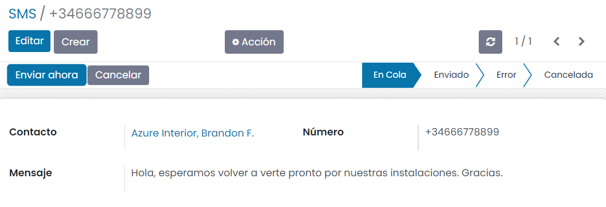

:show-content:

===
SMS
===

Daeris permite realizar envíos de SMS a teléfonos móviles desde varios puntos de la aplicación, lo que resulta bastante
útil para establecer diferentes comunicaciones con tus clientes actuales y potenciales. Gracias a su carácter instantáneo
y a la frecuencia con la que los usuarios consultan sus teléfonos móviles, el SMS goza de unos índices de apertura y
lectura considerablemente elevados.

.. seealso::
   * :ref:`ventas/contactos/enviar_sms_contacto`
   * :ref:`ventas/crm/enviar_sms_cliente_potencial`
   * :ref:`ventas/crm/enviar_sms_oportunidades`

Para poder realizar dichos envíos, es necesario conectar a un proveedor externo de telefonía que realice dichos envíos.
`OVH <https://www.ovh.es/sms/>`_ permite enviar SMS por Internet mediante la conexión a su API.

Configuración
=============

La integración de la función de envío de SMS con OVH requiere que se realice configuración tanto en OVH como en Daeris.

OVH
---

Los pasos a seguir para configurar una cuenta en OVH son los siguientes:

Crear cuenta en OVH
~~~~~~~~~~~~~~~~~~~

#. Crea una cuenta en `OVH <https://www.ovh.es/sms/>`_, introduciendo tu número de teléfono en el apartado de prueba gratuita:

   .. image:: sms/crear-cuenta-ovh.png
      :align: center
      :alt: Crear cuenta en OVH

Añadir remitentes a la cuenta de OVH
~~~~~~~~~~~~~~~~~~~~~~~~~~~~~~~~~~~~

#. Una vez activada tu cuenta, entra a tu área de cliente, y accede al apartado de *Telecom*:

   .. image:: sms/telecom-ovh.png
      :align: center
      :alt: Telecom en OVH

#. En el menú de la izquierda, accede a tu cuenta de SMS:

   .. image:: sms/cuenta-sms-ovh.png
      :align: center
      :alt: Cuenta de SMS en OVH

#. Desde el apartado de *Remitentes*, deberás crear un nuevo remitente desde el menú :menuselection:`Acciones --> Añadir`.
   Este será el nombre correspondiente a tu persona o empresa, y aparecerá en los SMS enviados a tus clientes:

   .. image:: sms/gestionar-remitentes-ovh.png
      :align: center
      :alt: Gestionar remitentes en OVH

Crear una aplicación en OVH
~~~~~~~~~~~~~~~~~~~~~~~~~~~

#. A continuación, accede a la página para `crear una nueva aplicación <https://eu.api.ovh.com/createApp/>`_ para
   conectar a la API SMS. Informa un nombre para la aplicación y una descripción. Cuando hayas informado todos los
   campos, pulsa el botón *Crear*:

   .. image:: sms/crear-aplicacion-ovh.png
      :align: center
      :alt: Crear aplicación en OVH

#. El sistema mostrará una **clave de aplicación** y una **clave secreta**. Guarda estas claves ya que serán necesarias
   para la configuración en Daeris.

Configuración de OVH en Daeris
------------------------------

Configurar la cuenta IAP
~~~~~~~~~~~~~~~~~~~~~~~~

Para configurar el servicio de envío de SMS de OVH en Daeris, navega a la pantalla :menuselection:`Ajustes --> SMS --> Cuenta IAP`:

Accede al detalle del servicio **ovh**, y edita el registro. Deberás informar los siguientes campos:

-  **End Point**: Por defecto, aparece informado con el punto de acceso `ovh-eu`.

-  **Clave de aplicación**: Informa la clave de aplicación obtenida al crear la aplicación.

-  **Secreto de aplicación**: Informa la clave secreta obtenida al crear la aplicación.

-  **Cuenta SMS**: Informa el nombre de tu cuenta SMS visible desde tu área de clientes de OVH.

-  **Remitente**: Informa el nombre del remitente creado desde el área de clientes de OVH.

Una vez informados los campos, guarda el registro mediante el botón *Guardar*.

A continuación, deberás **Obtener la URL de validación** mediante el enlace disponible en el formulario. Siempre y cuando
todos los datos informados sean correctos, el sistema obtendrá una URL de validación y una clave de cliente:

Por último, accede al enlace de la URL de validación, ya que deberás validar la aplicación creada. En la nueva ventana
que se abrirá, pulsa el botón *Continuar*:

Informa un periodo de validez de la aplicación, y autoriza el acceso a la aplicación mediante el botón *Autorizar*:

A partir de ese momento, la aplicación ya dispone de acceso a tu cuenta para poder realizar el envío de SMS desde Daeris:

.. image:: sms/aplicacion-autorizada-ovh.png
  :align: center
  :alt: Aplicación autorizada para el envío de SMS en OVH

Plantillas de SMS
=================

Configurar las plantillas de SMS
--------------------------------

Los mensajes de SMS utilizan plantillas predefinidas. El listado completo de plantillas de SMS utilizadas desde
la aplicación se puede encontrar en la pantalla :menuselection:`Ajustes --> SMS --> Plantillas de SMS`:

Para modificar el contenido de una plantilla existente, navega al detalle de la plantilla en cuestión y pulsa el botón *Editar*.
Desde el modo de edición, puedes modificar el contenido de la plantilla desde el campo *Contenido*:

.. danger::
   Cualquier modificación de una plantilla, puede dar lugar a errores en la configuración de dicha plantilla, que provoquen
   que el SMS no se envíe a los destinatarios. Hay que prestar especial atención a las variables definidas entre corchetes,
   ya que hacen referencia a campos internos de los objetos de Daeris.

Añadir acción del contexto para una plantilla
---------------------------------------------

Es posible mostrar una opción en el objeto asociado a una plantilla para abrir un asistente de composición de SMS
con dicha plantilla. Para ello, pulsa el botón *Agregar acción de contexto* en el detalle de una plantilla:

A continuación, navega a la vista de tipo listado del objeto asociado a la plantilla. Por ejemplo, si añades una acción
del contexto para una plantilla que aplique a *Contacto*, navega a la pantalla :menuselection:`Contactos --> Contactos`.
Desde la vista de tipo listado, selecciona al menos un registro y haz clic en el menú *Acción*. Debe aparecer una nueva
opción para enviar un SMS utilizando la plantilla en la que se ha añadido la acción del contexto:

.. note::
   Es necesario refrescar o cargar la página de nuevo en el navegador para que se vean reflejados los cambios en el menú Acción.

Al seleccionar esa acción, se desplegará el compositor de SMS informando por defecto la plantilla de SMS:

Por último, si la acción se ha creado por error, o si ya no es necesario mostrar esa acción en el contexto del objeto
de la plantilla, es posible eliminar dicha acción pulsando el botón *Eliminar acción de contexto* ubicado en el
formulario de detalle de la plantilla:

Reenviar SMS fallidos o en cola
===============================

Desde la pantalla de :menuselection:`Ajustes --> SMS --> SMS`, puedes navegar a la vista de SMS, en donde aparece una
pantalla en modo listado con los mensajes de texto enviados desde la aplicación y que se encuentran en cola o con algún
tipo de error en el envío:

Si accedes al detalle de uno de los mensajes, puedes ver el contenido del mismo:

En la parte superior derecha de la pantalla puedes ver el estado en el que se encuentra el mensaje:

Desde el detalle también se permite enviar el SMS mediante el botón *Enviar ahora*, ubicado en la parte superior
izquierda de la pantalla:

.. image:: sms/enviar-sms.png
   :align: center
   :alt: Enviar SMS