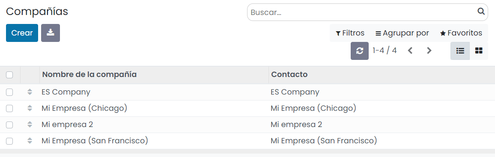
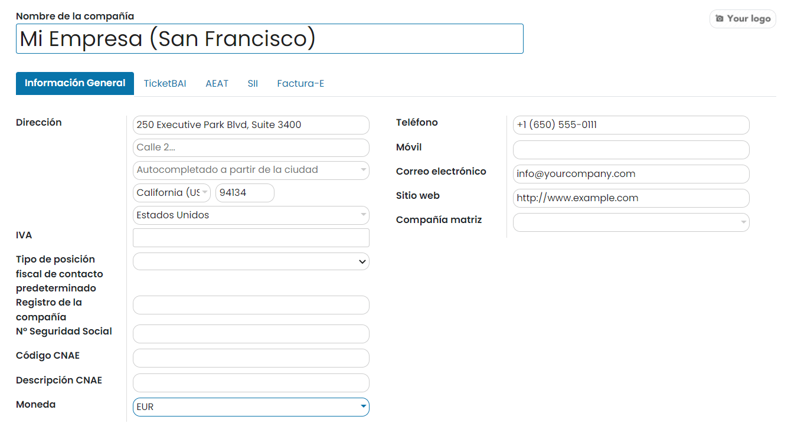
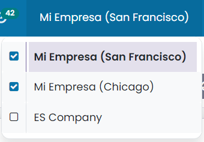
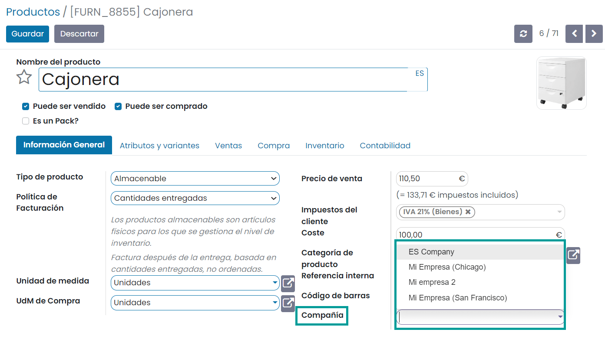
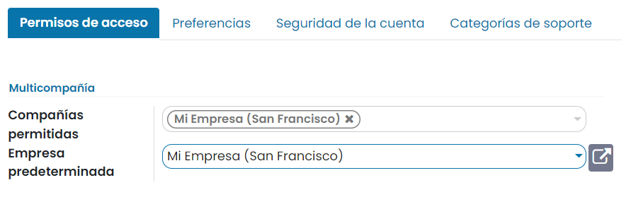
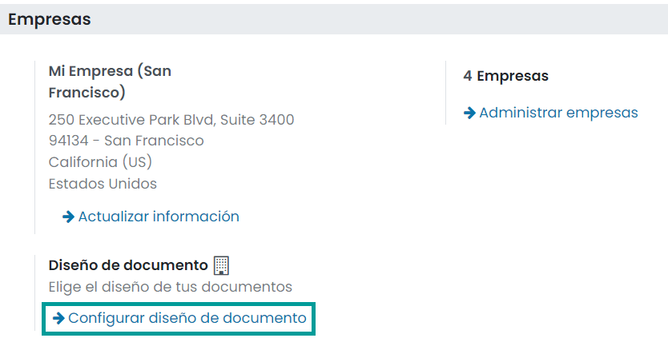
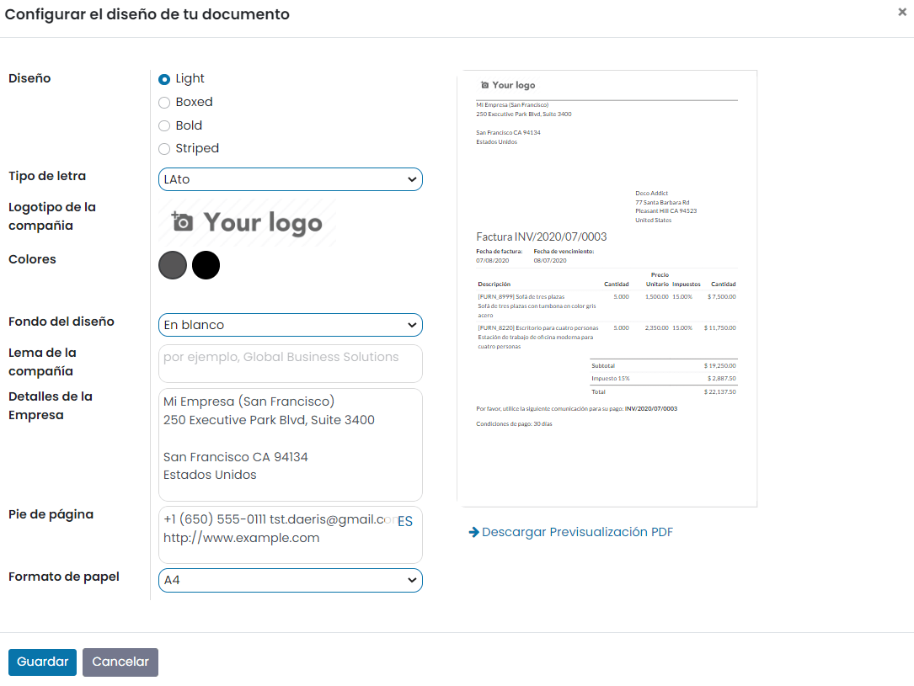

:show-content:

=====================
Administrar compañías
=====================

Daeris te permite seleccionar varias empresas simultáneamente y configurar sus almacenes, clientes, equipos y
contactos específicos. Te brinda la capacidad de generar informes de cifras agregadas sin cambiar de interfaz,
lo que facilita las tareas diarias y el proceso de gestión general.

Gestionar compañías y registros
===============================

Para navegar a la pantalla principal de gestión de compañías, selecciona la opción del menú
:menuselection:`Ajustes --> Usuarios y compañías --> Compañías`, en donde aparece una pantalla en modo listado
con las compañías dadas de alta en la aplicación:

Para configurar los datos de tu compañía, accede al detalle de la misma y edita los datos mediante el botón *Editar*:

En la pestaña de *Información General* puedes añadir los datos principales de la empresa, como el nombre, el logotipo,
la dirección, sitio web, teléfono, etc. Si se selecciona una *Compañía matriz*, los registros se comparten entre las dos
empresas (siempre que ambos entornos estén activos).

.. important::
   En caso de haber configurado servidores de correo entrante en Daeris, la dirección de correo electrónico de la compañía
   se debe corresponder con la dirección de correo electrónico principal configurada como servidor de correo entrante.
   Por ejemplo, si has configurado un servidor de correo entrante con la dirección *hola@miempresa.com*, la dirección de
   correo electrónico a informar en la compañía debería ser la misma.

Una vez configurados los datos de la compañía, pulsa el botón *Guardar*.

A partir de ese momento, es posible cambiar o seleccionar varias empresas, habilitando sus casillas de selección para
activarlas, desde el menú de selección de empresas ubicado en la parte superior derecha de la pantalla. La empresa en
gris es aquella cuyo entorno está en uso. Para cambiar de entorno, haz clic en el nombre de la empresa. En el siguiente
ejemplo, el usuario tiene acceso a tres empresas, dos están activadas y el entorno en uso es *Mi Empresa (San Francisco)*.

Los datos de varias entidades, como por ejemplo, Productos o Contactos, se pueden compartir o configurar para que se
muestren solo para una empresa específica. Para ello, en sus formularios de detalle respectivos, elige entre:

-  **Un campo en blanco**: el registro se comparte con todas las empresas.

-  **Añadir empresa**: el registro es visible para los usuarios conectados a esa empresa específica.

Gestionar las compañías permitidas de los usuarios
==================================================

Una vez que hayas creado las compañías, puedes gestionar los derechos de acceso de los empleados a dichas compañías.
Para ello, navega al detalle de un usuario desde la pantalla :menuselection:`Ajustes --> Usuarios y compañías --> Usuarios`
e informa los campos *Compañías permitidas* y *Empresa predeterminada* en la sección de *Multicompañía*:

Si un usuario tiene varias empresas activadas en su base de datos y está **editando** un registro, la edición se realiza
en la empresa relacionada del registro. Por ejemplo, si se edita un pedido de venta emitido en *Mi Empresa (San Francisco)*
mientras se trabaja en el entorno de *Mi Empresa (Chicago)*, los cambios se aplican en *Mi Empresa (San Francisco)* (la
empresa desde la que se emitió el pedido de venta).

Al **crear** un registro, la empresa que se tiene en cuenta es:

-  La empresa actual (la activa) o,

-  No se establece ninguna empresa (en formularios de productos y contactos, por ejemplo) o,

-  El conjunto de empresa es el vinculado al documento (lo mismo que si se está editando un registro).

Configurar los formatos de los documentos
=========================================

Para configurar los formatos de los documentos según cada empresa, activa y selecciona la compañía correspondiente y,
navega a la pantalla :menuselection:`Ajustes --> Opciones Generales`. En el apartado de *Empresas*, haz clic en el
enlace de *Configurar diseño de documento*:

El sistema mostrará una ventana en donde poder configurar el diseño, tipo de letra, logotipo, colores, y varios aspectos
más relacionados con el formato de los documentos generados en Daeris, como por ejemplo, las facturas:

Una vez realizados los ajustes necesarios, puedes descargar un ejemplo del documento haciendo clic en el enlace
*Descargar Previsualización PDF*. Si todo es correcto, pulsa el botón *Guardar*.