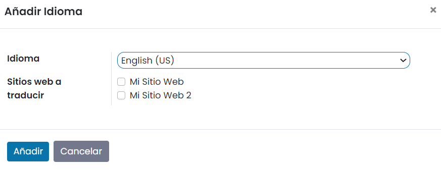
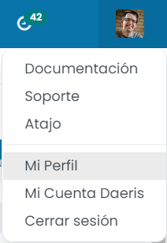

:show-content:

==============
Cambiar idioma
==============

Daeris proporciona la opción de gestionar la aplicación en diferentes idiomas, y cada usuario puede usar Daeris en
su propio idioma.

Añadir un idioma
================

Para añadir un idioma, navega a la pantalla :menuselection:`Ajustes --> Opciones generales`, y desde el apartado de
*Idiomas*, pulsa el enlace de *Añadir idioma*:

A continuación, selecciona el idioma a instalar y haz clic en *Añadir*:

.. note::
   Si seleccionas los «Sitios web a traducir» tendrás la opción de cambiar el idioma de navegación en tu sitio web.

Si todo ha ido bien, la aplicación mostrará el siguiente mensaje:

Modificar tu idioma
===================

Puedes cambiar el idioma instalado yendo al menú desplegable en la esquina superior derecha de tu pantalla y
seleccionando *Mi Perfil*:

A continuación, cambia tu idioma en la pestaña de *Preferencias* y haz clic en *Guardar*:

Cambiar el idioma de otro usuario
=================================

Para cambiar el idioma de un usuario diferente al usuario conectado, navega a la pantalla :menuselection:`Ajustes --> Usuarios y compañías --> Usuarios`
y selecciona el usuario al que quieres cambiar el idioma. Desde el formulario de detalle del usuario, haz clic en *Editar*.
Bajo la pestaña de *Preferencias* puedes cambiar el idioma a cualquier idioma instalado previamente:

