:show-content:

====================
Administrar usuarios
====================

Daeris define un usuario como alguien que tiene acceso a una base de datos para realizar tareas diarias. Puedes restringir
el tipo de información a la que puede acceder cada usuario modificando sus permisos de acceso. También es posible
desactivar usuarios que se han dado de baja, así como gestionar las contraseñas de los usuarios activos.

.. youtube:: cXUuHmRQ4NE
    :align: right
    :width: 700
    :height: 394

Agregar usuarios individuales
=============================

Para dar de alta un nuevo usuario, navega a la pantalla :menuselection:`Ajustes --> Usuarios y compañías --> Usuarios`,
y pulsa el botón *Crear*:

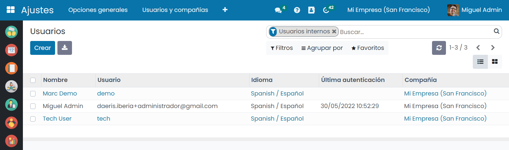

El sistema abrirá un nuevo formulario en donde poder informar el nombre y apellido, el correo electrónico y subir una
fotografía:

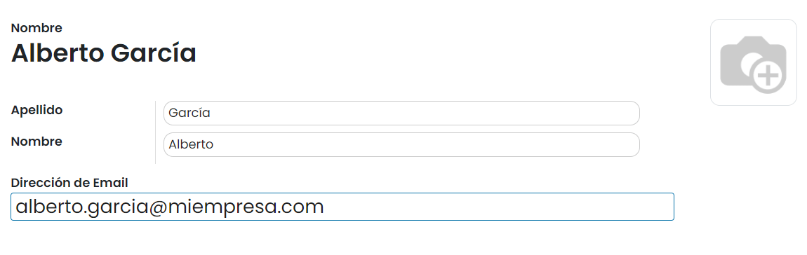

Desde la pestaña de *Permisos de acceso* aparecen todos los permisos de las diferentes aplicaciones de Daeris, agrupados
por categorías. Es necesario otorgar los permisos necesarios al nuevo usuario creado, para que solo tenga acceso a
aquellas funcionalidades relacionadas con su puesto de trabajo:

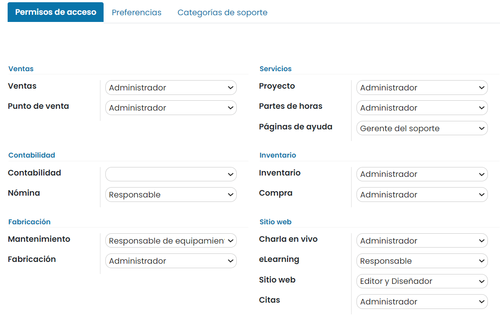

Por lo general, las aplicaciones disponen de un permiso de usuario básico, con acceso a las vistas básicas del módulo,
y de un permiso de administrador, que además del acceso básico, otorga acceso a las pantallas de configuración. Pero
hay algunos módulos que disponen de otro tipo de permisos, y cuya descripción se puede consultar posicionando el ratón
encima del nombre del campo, para desplegar la ayuda:

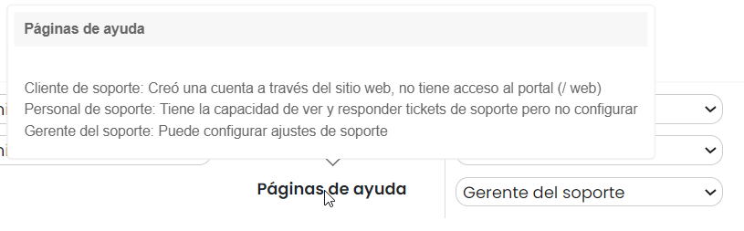

.. note::
   Cualquier usuario creado tiene acceso a las pantallas básicas de los módulos de conversaciones, calendario, notas,
   contactos, sitio web, mantenimiento, empleados, ausencias, gastos y cuadros de mando, ya que se trata de funcionalidades
   básicas que todo usuario debe tener.

Por otro lado, desde la pestaña de *Preferencias*, es posible informar el idioma del usuario, su zona horaria, sus
preferencias de notificación, así como su firma de correo electrónico, su puntuación de Karma del foro y su nombre de
usuario del chat:

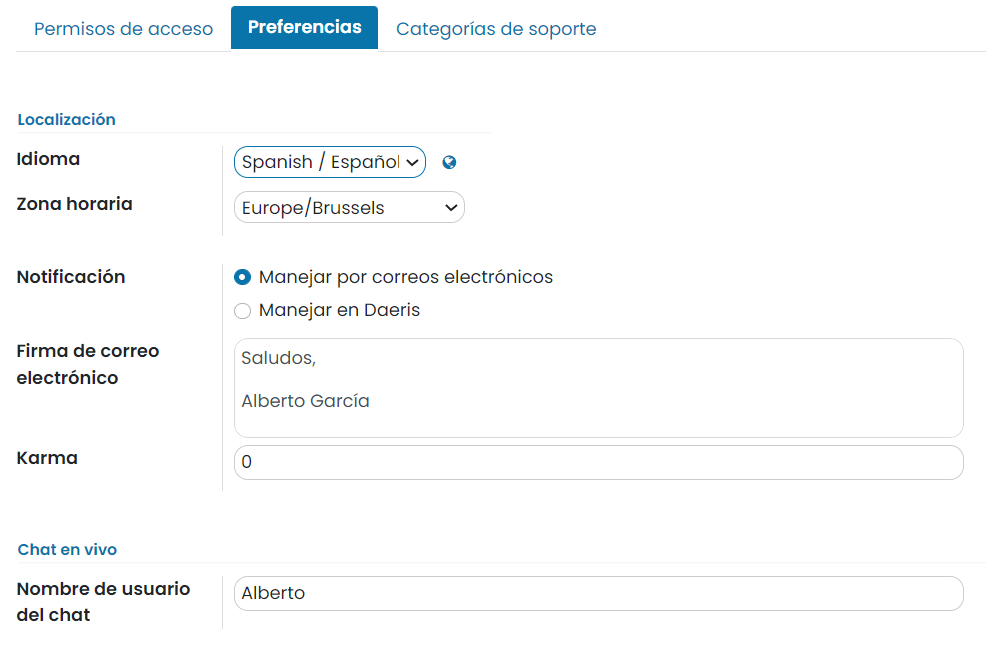

Por último, desde la pestaña de *Categorías de soporte*, es posible seleccionar las categorías de soporte a las que
quedará asignado el usuario:

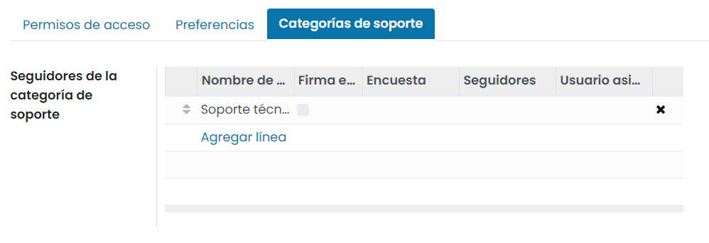

Una vez creado el usuario, tras guardar el registro, se envía automáticamente un correo electrónico de invitación al
usuario. También es posible enviar el correo de forma manual mediante el botón llamado *Enviar un correo de invitación*:

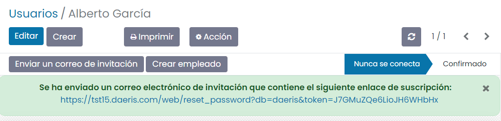

.. important::
   Para que funcione el envío de correo de invitación, debes haber configurado previamente un servidor de correo saliente.

Cuando el usuario reciba el correo y acceda a ese enlace, podrá establecer una contraseña que le permita acceder a la
aplicación por primera vez:

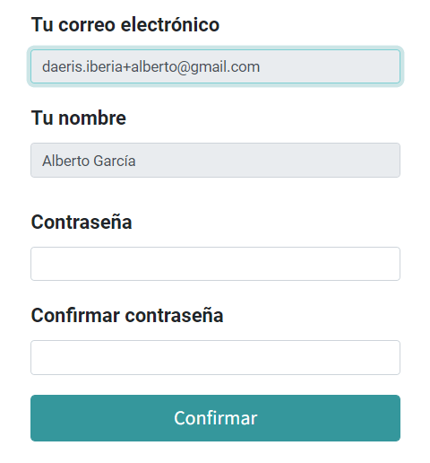

Desactivar usuarios
===================

Cuando un usuario debe dejar de estar operativo en la aplicación, la opción más segura es la inactivación de dicho usuario.
Para ello, basta con acceder a la ficha del usuario desde la pantalla :menuselection:`Ajustes --> Usuarios y compañías --> Usuarios`
y hacer clic en el menú *Acción* sobre la opción *Archivar*:

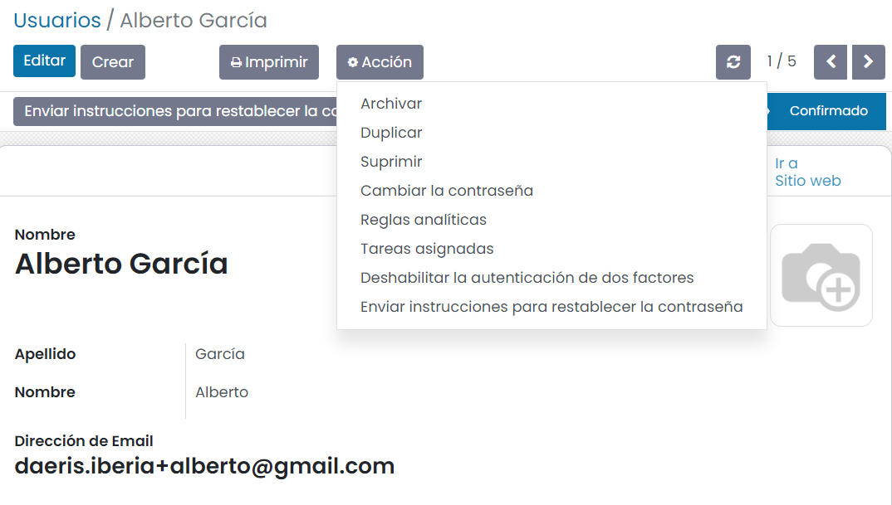

Al desactivar el usuario, deja de aparecer en el listado de usuarios activos de la aplicación.

.. danger::
   **Nunca** desactives el usuario principal.

Gestión de contraseñas
======================

Resetear contraseñas
--------------------

Habilitar el reseteo de las contraseñas desde la página de login
~~~~~~~~~~~~~~~~~~~~~~~~~~~~~~~~~~~~~~~~~~~~~~~~~~~~~~~~~~~~~~~~

Es posible activar el restablecimiento de la contraseña directamente desde la página de inicio de sesión.

Para ello, navega a :menuselection:`Ajustes --> Opciones generales`, y desde el apartado de *Permisos*, activa la opción
de **Reiniciar contraseña**:

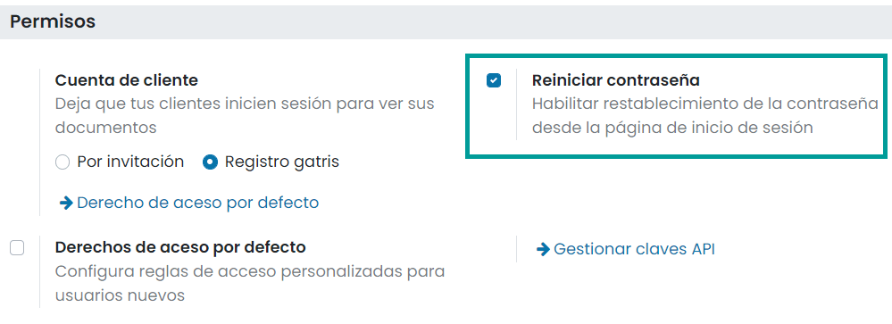

Una vez marcada la opción, pulsa el botón *Guardar* de la pantalla de ajustes.

A partir de ese momento, puedes restablecer la contraseña mediante la opción disponible en la página de inicio de sesión:

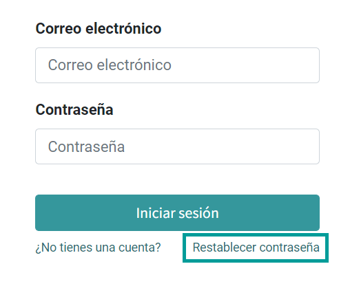

Esto te lleva a una página desde donde puedes introducir tu correo electrónico. Al pulsar el botón *Confirmar*, el
sistema te envía un correo para que restablezcas tu contraseña.

.. important::
   Para que funcione el envío de correo de reseteo de contraseña, debes haber configurado previamente un servidor de
   correo saliente.

Enviar a los usuarios instrucciones de reseteo
~~~~~~~~~~~~~~~~~~~~~~~~~~~~~~~~~~~~~~~~~~~~~~

El administrador de la aplicación tiene la opción de *Enviar instrucciones para restablecer la contraseña*, mediante el
botón ubicado en la ficha del usuario. Para ello, debes navegar al detalle de un usuario desde la pantalla
:menuselection:`Ajustes --> Usuarios y compañías --> Usuarios`, y pulsar el botón correspondiente:

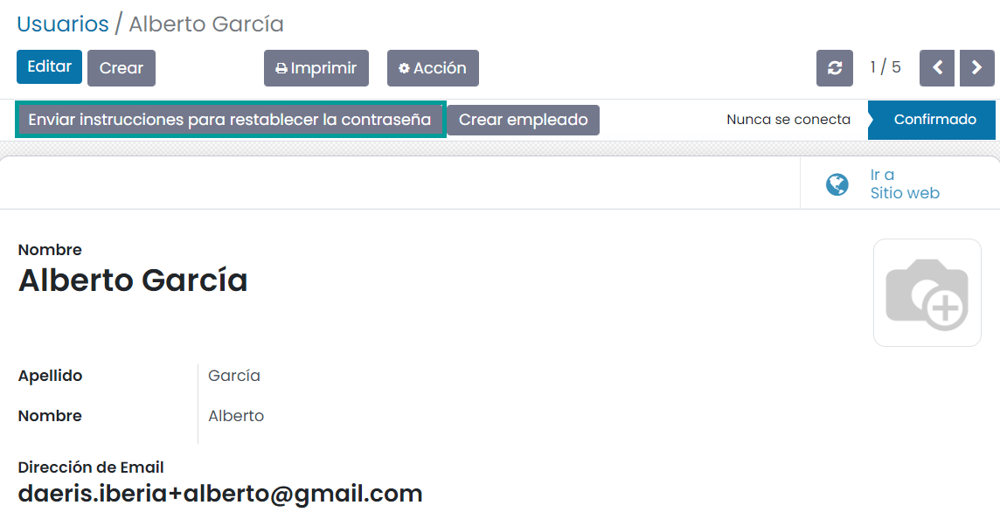

.. note::
   El botón *Enviar instrucciones para restablecer la contraseña* solo aparece si el usuario ya confirmó el correo
   electrónico de invitación de Daeris.

De esta manera, se genera un enlace que es enviado al usuario por correo para que restablezca su contraseña:

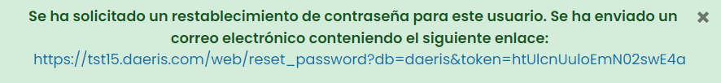

.. important::
   Para que funcione el envío de correo de reseteo de contraseña, debes haber configurado previamente un servidor de
   correo saliente.

Cambiar las contraseñas de los usuarios
---------------------------------------

Para cambiar las contraseñas de los usuarios, navega a la pantalla :menuselection:`Ajustes --> Usuarios y compañías --> Usuarios`
y selecciona un usuario para acceder a su formulario. Haz clic en el botón *Acción* y selecciona *Cambiar la contraseña*:

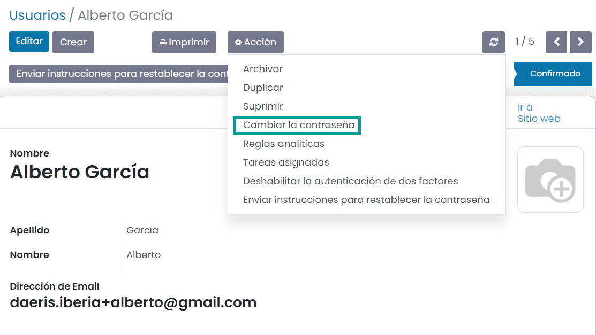

Introduce una nueva contraseña y confírmala haciendo clic en *Cambiar la contraseña*:

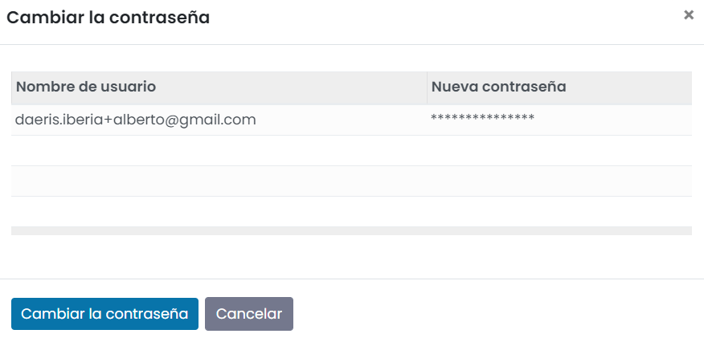