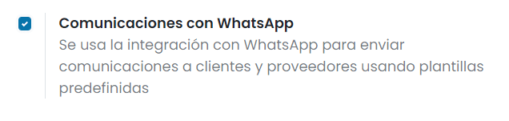
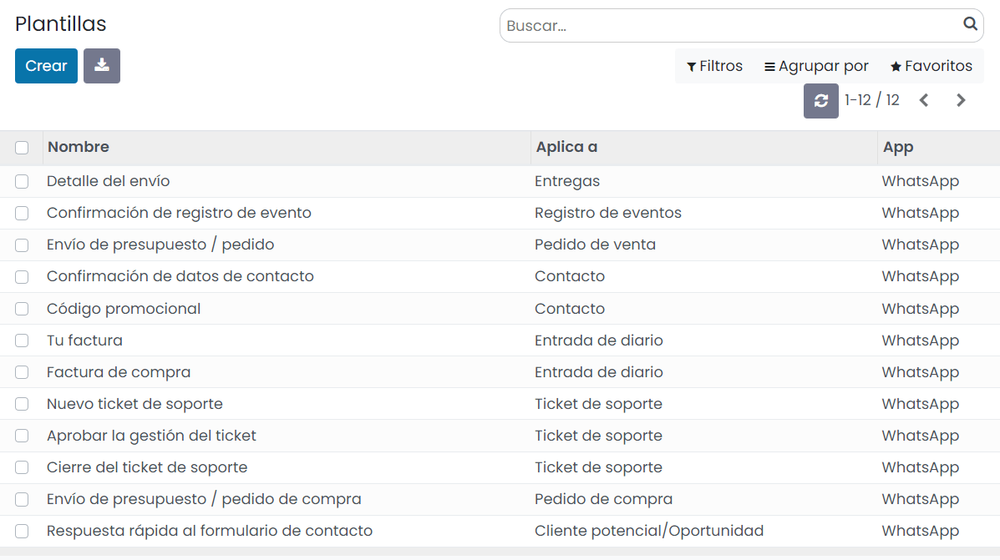
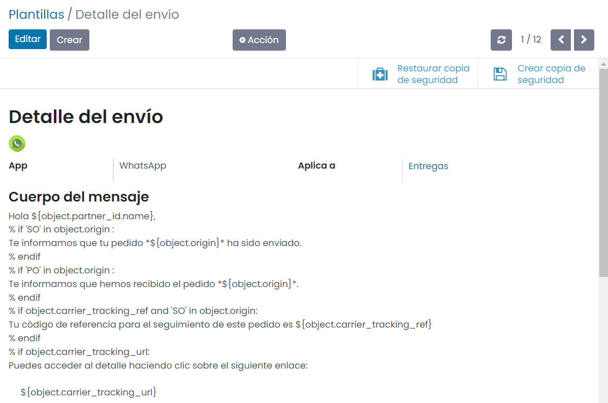
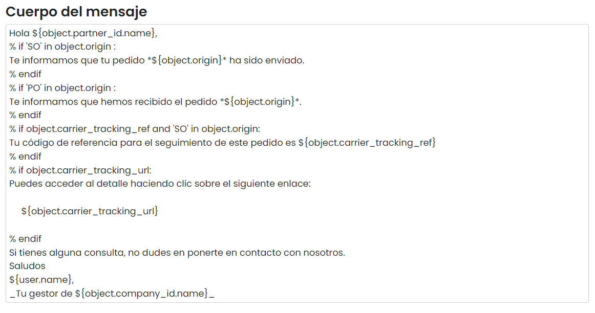
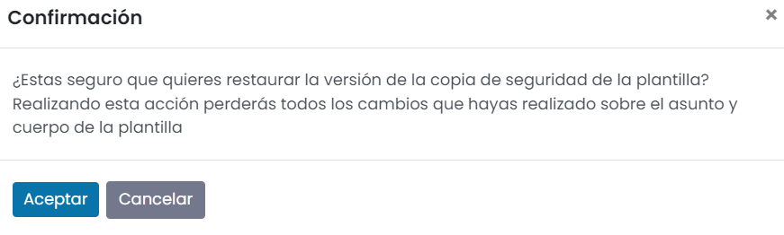

:show-content:

========
WhatsApp
========

Mediante la integración del backend de Daeris con WhatsApp, es posible enviar mensajes de WhatsApp a los clientes y
proveedores utilizando plantillas predefinidas. Al enviar un mensaje, el sistema tratará de realizar el envío a través
de la aplicación WhatsApp instalada en el dispositivo móvil del usuario, o a través de la aplicación WhatsApp Web, para
aquellos mensajes enviados desde un dispositivo de escritorio.

Las entidades que permiten realizar el envío de mensajes de WhatsApp son las siguientes:

-  :ref:`Contactos <ventas/contactos/enviar_whatsapp_contacto>`

-  Pedidos de venta

-  Pedidos de compra

-  Facturas de cliente

-  Facturas de proveedor

-  Transferencias de inventario

-  Tickets de atención al cliente

-  Registro de eventos

-  Oportunidades

-  Clientes potenciales

Activar las comunicaciones con WhatsApp
=======================================

Para activar el envío de comunicaciones con WhatsApp, navega a la pantalla :menuselection:`Ajustes --> Opciones Generales`,
y activa la opción **Comunicaciones con WhatsApp**, dentro del apartado de *Integraciones*:

Una vez marcada esa opción, pulsa el botón *Guardar* de la pantalla de Ajustes.

A partir de ese momento, las comunicaciones con WhatsApp quedarán activas en la aplicación.

Configurar las plantillas de WhatsApp
=====================================

Los mensajes de WhatsApp utilizan plantillas predefinidas. El listado completo de plantillas de WhatsApp utilizadas desde
la aplicación se puede encontrar en la pantalla :menuselection:`Ajustes --> WhatsApp --> Plantillas`:

Para modificar el formato de una plantilla existente, navega al detalle de la plantilla en cuestión y pulsa el botón *Editar*:

Desde el modo de edición, puedes modificar el contenido de la plantilla desde el campo *Cuerpo del mensaje*:

.. danger::
   Cualquier modificación de una plantilla, puede dar lugar a errores en la configuración de dicha plantilla, que provoquen
   que el mensaje no se envíe a los destinatarios. Hay que prestar especial atención a las variables definidas entre corchetes,
   ya que hacen referencia a campos internos de los objetos de Daeris.

En el caso de que una plantilla no se visualice correctamente tras los cambios realizados, o que, al enviar un mensaje
con esta plantilla, el contenido del mensaje aparezca en blanco, puedes restaurar la versión original de la plantilla
mediante el botón *Restaurar copia de seguridad*:

Al pulsar el botón de restauración, el sistema solicitará confirmación para restaurar la plantilla con los datos originales:

Al pulsar el botón *Aceptar*, la plantilla quedará restaurada con su contenido original.