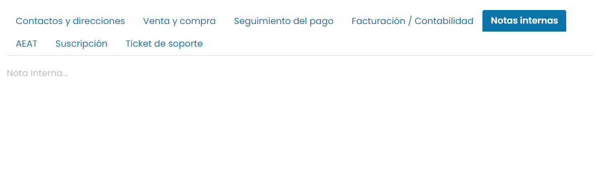

:show-content:

=========
Contactos
=========

El módulo de gestión de **Contactos** de Daeris permite registrar todos los detalles de contacto de los empleados y clientes
de una organización. Puedes administrar de manera efectiva la información de contacto en este módulo sin ninguna dificultad
ni confusión. Este módulo actuará como una libreta de direcciones digital dedicada donde puedes configurar los datos de contacto
básicos de tus empleados, clientes, proveedores y socios de tu negocio. Mantener los datos de contacto es muy importante en un
entorno empresarial.

.. youtube:: IW9Q4xvXutc
    :align: right
    :width: 700
    :height: 394

Crear un contacto de tipo individual
====================================

Los contactos en Daeris se dividen en contactos individuales y en compañías (empresas) que permiten agrupar varios contactos.
Para crear un contacto de tipo individual, debes navegar a la pantalla :menuselection:`Contactos --> Contactos` y pulsar el
botón *Crear*:

Al hacer clic sobre el botón crear, la aplicación navega automáticamente a la pantalla de edición del nuevo contacto, donde
puedes incorporar la información relevante.

En base al primer campo de selección disponible en el formulario (Individual / Compañía) se identifica el tipo de contacto.
En función del valor seleccionado, se visualiza un formulario con unos campos relacionados con el contacto individual
(trabajador de una empresa) o un formulario con unos campos relacionados con la compañía (empresa).

.. note::
   Un autónomo debe ser tratado como una compañía, ya que es un contacto y a la vez su propia empresa.

Al crear un contacto de tipo individual puedes informar los siguientes campos:

- **Nombre**: El nombre completo del contacto.
- **Apellido**: El apellido o apellidos del contacto.
- **Imagen**: Permite seleccionar la fotografía del contacto.
- **Compañía**: Selecciona la empresa a la que pertenece el contacto (siempre que no sea un contacto particular).
- **Direcciones del contacto**: En el caso de ser un contacto de la empresa se incorpora por defecto la dirección de la empresa.
  Si el contacto no dispone de empresa asociada aparecen los campos disponibles para su edición. Es posible añadir diferentes
  direcciones asociadas a un contacto: dirección principal, dirección de factura, dirección de entrega, otra dirección y dirección
  privada. La lista de países, provincias, ciudades y códigos postales se puede configurar desde el apartado de *Localización* del
  menú :menuselection:`Contactos --> Configuración`.
- **Tipo de Posición Fiscal**: Permite especificar si se trata de un cliente final (B2C) o de una compañía (B2B).
- **IVA**: Número de identificación del contacto.
- **Puesto de trabajo**: Puesto de trabajo asociado al contacto.
- **Teléfono**: Teléfono fijo principal del contacto.
- **Móvil**: Teléfono móvil principal del contacto.
- **Correo electrónico**: Email principal del contacto.
- **Sitio Web**: Página web principal del contacto.
- **Título**: Titulo del contacto (Doctor/a, Señor/a, Profesor/a…). Es posible administrar la lista de títulos del contacto desde
  la pantalla :menuselection:`Contactos --> Configuración --> Títulos de contacto`.
- **Categorías**: Conjunto de etiquetas asociadas al contacto. Es posible administrar la lista de etiquetas desde la
  pantalla :menuselection:`Contactos --> Configuración --> Etiquetas de contacto`.

Mediante las pestañas inferiores puedes incorporar la siguiente información:

- **Contactos y direcciones**: Pulsando el botón *Añadir* puedes crear o asociar contactos, así como crear
  nuevas direcciones de facturación, de envío, otras direcciones y direcciones privadas.

- **Venta y compra**: Mediante esta pestaña puedes incorporar aspectos comerciales relacionados con el contacto
  (ventas, compras, información fiscal, etc).

- **Seguimiento del pago**: En esta pestaña se puede realizar un seguimiento del pago de los clientes.

- **Contabilidad**: Mediante esta pestaña puedes incorporar aspectos relacionados con la contabilidad del contacto,
  como, por ejemplo, las cuentas bancarias y los asientos contables. Es posible administrar la lista de bancos
  desde la pantalla :menuselection:`Contactos --> Configuración --> Bancos` y la lista de cuentas bancarias desde
  la pantalla :menuselection:`Contactos --> Configuración --> Cuentas bancarias`.

- **Notas internas**: Mediante esta pestaña puedes incorporar una nota que solo será visible por los empleados con
  acceso al contacto.

- **AEAT**: En caso de estar instalada la contabilidad española, es posible informar datos relacionados con la
  Agencia Estatal de Administración Tributaria.

- **Suscripción**: Información asociada con el estado de membresía del contacto.

- **Ticket de soporte**: Mediante esta pestaña puedes incorporar el empleado por defecto que quieres que ofrezca el
  soporte a este contacto, así como el SLA (acuerdo de tiempos de respuesta) de que dispone el contacto.

Una vez informados todos los campos necesarios, pulsa el botón *Guardar*.

Crear un contacto de tipo compañía
==================================

Los contactos en Daeris se dividen en contactos individuales y en compañías (empresas) que permiten agrupar varios contactos.
Para crear un contacto de tipo compañía, debes navegar a la pantalla :menuselection:`Contactos --> Contactos` y pulsar el
botón *Crear*:

Al hacer clic sobre el botón crear, la aplicación navega automáticamente a la pantalla de edición del nuevo contacto, donde
puedes incorporar la información relevante.

En base al primer campo de selección disponible en el formulario (Individual / Compañía) se identifica el tipo de contacto.
En función del valor seleccionado, se visualiza un formulario con unos campos relacionados con el contacto individual
(trabajador de una empresa) o un formulario con unos campos relacionados con la compañía (empresa).

.. note::
   Un autónomo debe ser tratado como una compañía, ya que es un contacto y a la vez su propia empresa.

Al crear un contacto de tipo compañía puedes informar los siguientes campos:

- **Nombre**: Nombre real (no el nombre comercial) de la compañía o del autónomo. Al incorporar el nombre aparecerá un
  desplegable con diferentes compañías relacionadas. Al seleccionar una de ellas, se añadirá de forma automática el logotipo.
  Si no aparece la empresa deseada puedes incorporar el logotipo manualmente seleccionando la imagen correspondiente siempre
  que dispongas de ella.

- **Nombre comercial**: En caso de estar instalada la contabilidad española, puedes incorporar el seudónimo usado por
  la empresa para desempeñar su negocio.
- **Imagen**: Permite seleccionar el logotipo de la empresa.
- **Dirección**: Dirección principal de la empresa. La lista de países, provincias, ciudades y códigos postales se puede
  configurar desde el apartado de *Localización* del menú :menuselection:`Contactos --> Configuración`.
- **Tipo de Posición Fiscal**: Permite especificar si se trata de un cliente final (B2C) o de una compañía (B2B).
- **IVA**: Número de identificación de la empresa.
- **Teléfono**: Teléfono fijo principal de la empresa.
- **Móvil**: Teléfono móvil principal de la empresa.
- **Correo electrónico**: Email principal de la empresa.
- **Sitio Web**: Página web principal de la empresa.
- **Categorías**: Conjunto de etiquetas asociadas a la empresa. Es posible administrar la lista de etiquetas desde la
  pantalla :menuselection:`Contactos --> Configuración --> Etiquetas de contacto`.

Mediante las pestañas inferiores puedes incorporar la siguiente información:

- **Contactos y direcciones**: Pulsando el botón *Añadir* puedes crear o asociar contactos, así como crear
  nuevas direcciones de facturación, de envío, otras direcciones y direcciones privadas.

- **Venta y compra**: Mediante esta pestaña puedes incorporar aspectos comerciales relacionados con el contacto
  (ventas, compras, información fiscal, etc). Es posible administrar la lista de sectores del contacto desde
  la pantalla :menuselection:`Contactos --> Configuración --> Industrias`.

- **Seguimiento del pago**: En esta pestaña se puede realizar un seguimiento del pago de los clientes.

- **Contabilidad**: Mediante esta pestaña puedes incorporar aspectos relacionados con la contabilidad del contacto,
  como, por ejemplo, las cuentas bancarias y los asientos contables. Es posible administrar la lista de bancos
  desde la pantalla :menuselection:`Contactos --> Configuración --> Bancos` y la lista de cuentas bancarias desde
  la pantalla :menuselection:`Contactos --> Configuración --> Cuentas bancarias`.

- **Notas internas**: Mediante esta pestaña puedes incorporar una nota que solo será visible por los empleados con
  acceso al contacto.

- **Información Mercantil**: En caso de estar instalada la contabilidad española, puedes incorporar información relacionada
  con los datos mercantiles de la empresa (libro, registro mercantil, hoja, folio, sección y tomo).

- **AEAT**: En caso de estar instalada la contabilidad española, es posible informar datos relacionados con la
  Agencia Estatal de Administración Tributaria.

- **Suscripción**: Información asociada con el estado de membresía del contacto.

- **Ticket de soporte**: Mediante esta pestaña puedes incorporar el empleado por defecto que quieres que ofrezca el
  soporte a este contacto, así como el SLA (acuerdo de tiempos de respuesta) de que dispone el contacto.

Una vez informados todos los campos necesarios, pulsa el botón *Guardar*.

Fusionar contactos
==================

Mediante la funcionalidad de fusionar contactos, es posible combinar la información de varios contactos en un solo contacto.
Esto puede ser útil en situaciones en las que se hayan creado contactos duplicados por error, y se quiera regularizar la
situación de dichos contactos.

Para combinar contactos debes navegar a la pantalla :menuselection:`Contactos --> Contactos`, y cambiar al tipo de vista listado.
Desde el modo listado, debes seleccionar los contactos a combinar, y desde el menú *Acción* seleccionar la opción *Fusionar*:

A continuación, el sistema muestra un formulario con el resumen de los contactos a fusionar, desde donde puedes seleccionar
el contacto de destino en donde se combinarán los datos de todos los contactos seleccionados. También puedes añadir o eliminar
contactos del listado de contactos a combinar:

Una vez hayas revisado todos los datos, debes pulsar el botón *Combinar contactos*. El sistema mostrará entonces un mensaje
indicando que no hay más contactos a combinar en esta petición.

En caso de querer buscar más contactos duplicados, pulsa el botón *Deduplicar los otros contactos*. El sistema mostará un
formulario en donde se podrán seleccionar los campos utilizados para buscar registros duplicados, así como los contactos que
deben quedar excluídos de la búsqueda:

Al pulsar el botón *Combinar con verificación manual* el sistema realizará la búsqueda de contactos duplicados y permitirá
verificar manualmente la fusión, antes de llevarla a cabo. Por el contrario, si se pulsa el botón *Combinar automáticamente*,
el sistema realizará la búsqueda de contactos duplicados y la fusión de forma automática.

Enviar un correo electrónico a un contacto
==========================================

.. seealso::
   * :doc:`../varios/correo_electronico/enviar_correos`

Es posible enviar un correo electrónico a un contacto desde el mismo listado de contactos. Para ello, debes navegar a la
pantalla :menuselection:`Contactos --> Contactos`, y cambiar al tipo de vista listado.

Desde el modo listado, debes seleccionar el contacto al que quieras enviar el correo electrónico, y desde el menú
*Acción* seleccionar la opción *Enviar correo*:

El sistema desplegará un formulario desde donde podrás redactar el asunto y cuerpo del correo electrónico. También es posible
adjuntar ficheros mediante el botón *Adjuntar un archivo*. Si quieres utilizar una plantilla de correo electrónico para que
se complete el asunto y el cuerpo del correo de forma automática, selecciona la plantilla en el desplegable *Usar plantilla*.
O si quieres crear una nueva plantilla con el asunto y cuerpo del mensaje redactado, pulsa el botón *Grabar como nueva plantilla*.
Por último, si quieres que la respuesta al correo se registre en el hilo de discusión original, marca la opción *Registrar en
el hilo de discusión original*, o si quieres que la respuesta se redirija a otra dirección de correo electrónico, marca la opción
correspondiente e informa el campo *Responder A*.

Una vez completados los campos necesarios, debes pulsar el botón *Enviar*. De esta manera, el correo electrónico se enviará
a los contactos seleccionados.

Enviar un SMS a un contacto
===========================

.. seealso::
   * :doc:`../varios/sms`

Es posible enviar un SMS a un contacto desde el mismo listado de contactos. Para ello, debes navegar a la
pantalla :menuselection:`Contactos --> Contactos`, y cambiar al tipo de vista listado.

Desde el modo listado, debes seleccionar el contacto al que quieras enviar el SMS, y desde el menú
*Acción* seleccionar la opción *Manda Mensaje de Texto SMS*:

El sistema desplegará un formulario desde donde podrás redactar el mensaje de texto:

.. note::
   El número de teléfono debe estar informado con formato internacional (por ejemplo, +33123456789).

Una vez informado el mensaje, debes pulsar el botón *Enviar ahora*. De esta manera, el SMS se enviará a los contactos
seleccionados. También tienes la opción de *Poner en cola* el mensaje, para que pueda ser enviado más tarde.

Desde el formulario de detalle del contacto también dispones de la opción de envío de SMS, ya sea mediante el menú de acción,
o mediante el icono de SMS disponible al lado del campo de teléfono o móvil del contacto:

.. note::
   El número de teléfono debe estar informado con formato internacional (por ejemplo, +33123456789).

.. _ventas/contactos/enviar_whatsapp_contacto:

Enviar un WhatsApp a un contacto
================================

.. seealso::
   * :doc:`../varios/whatsapp`

Es posible enviar un WhatsApp a un contacto desde el formulario de contactos. Para ello, debes navegar a la
pantalla :menuselection:`Contactos --> Contactos`, y acceder al detalle de un contacto.

Desde el formulario de detalle del contacto dispones de la opción de envío de WhatsApp mediante el icono de WhatsApp
disponible al lado del campo de teléfono móvil del contacto:

.. note::
   El número de teléfono móvil debe estar informado con formato internacional (por ejemplo, +33123456789).

El sistema desplegará un formulario desde donde podrás redactar el mensaje de WhatsApp o seleccionar una plantilla que
informe el mensaje de forma automática:

Una vez informado el mensaje, debes pulsar el botón *Enviar*.

En caso de estar conectado a la aplicación mediante un dispositivo de escritorio, el sistema tratará de establecer
conexión mediante la aplicación WhatsApp Web, para lo cual, habrá que escanear el código QR mostrado en pantalla, e
iniciar sesión en tu cuenta de WhatsApp.

Por otro lado, en caso de estar conectado a la aplicación mediante un dispositivo móvil, el sistema tratará de enviar
el mensaje mediante la aplicación WhatsApp instalada en el dispositivo.

Una vez enviado el mensaje desde WhatsApp, cierra la ventana del mensaje mediante la cruz ubicada en la parte superior
derecha del formulario:

En la botonera ubicada en la parte superior del formulario del contacto, puedes encontrar una opción que muestra el
número de mensajes de WhatsApp enviados al contacto:

.. note::
   El botón de WhatsApp solamente aparece si el contacto tiene el número de teléfono *Móvil* informado.

Al pulsar dicho botón, el sistema navega al listado de mensajes de WhatsApp asociados al contacto:

Para consultar el detalle de un mensaje, puedes hacer clic sobre el mensaje correspondiente, acción que mostrará el
formulario de detalle con la información asociada:

También es posible acceder al listado de mensajes de WhatsApp enviados a todos los contactos desde la pantalla
:menuselection:`Ajustes --> WhatsApp --> Registro de WhatsApp`. En este caso, el listado no estará filtrado por ningún
contacto en concreto y se podrán consultar todos los mensajes enviados.

Localizar geográficamente a un contacto
=======================================

La geolocalización es el proceso de encontrar, determinar y proporcionar la ubicación exacta de un ordenador, dispositivo
de red o equipo. Permite la ubicación del dispositivo según las coordenadas geográficas. Por lo general, utiliza
Global Positioning System (GPS) y otras tecnologías relacionadas para evaluar y especificar ubicaciones geográficas.

En Daeris, utilizamos la geolocalización de contactos para encontrar la ubicación de los clientes. Para activar dicha
funcionalidad, navega a la pantalla :menuselection:`Ajustes --> Opciones Generales`, y dentro del apartado de integraciones,
marca la opción de **Localización geográfica**:

Una vez marcada la opción, pulsa el botón *Guardar* de la pantalla de ajustes.

A continuación, selecciona la API que se utilizará para geolocalizar a los contactos. Es posible seleccionar entre
*Open Street Map* y *Google Place Map*:

.. image:: contactos/api-localizacion-geografica.png
   :align: center
   :alt: API de la localización geográfica

.. note::
   En el caso de seleccionar Google Place Map, será necesario introducir una clave para la API.

Una vez configurada la API, navega al detalle de un contacto desde la pantalla :menuselection:`Contactos --> Contactos`,
y asegúrate de que el contacto dispone de la dirección correctamente informada:

A continuación, navega a la pestaña de *Asignación del contacto*. En esta pestaña se puede observar que la latitud y la
longitud del contacto es 0. Tras pulsar el enlace *(actualizar)*, se actualizará de forma automática la geolocalización
del contacto, informando la latitud y longitud correspondientes a la dirección del contacto:

Importar la lista de ciudades de GeoNames
=========================================

Para importar la lista de ciudades de un país de GeoNames, navega a la pantalla
:menuselection:`Contactos --> Configuración --> Importar de GeoNames`, y selecciona el país para el cuál quieres realizar la
importación. A continuación, selecciona el tipo de capitalización de las ciudades a importar, y pulsa el botón *Importar*:

El sistema se conectará con la base de datos de GeoNames y realizará la importación de todas las ciudades del país seleccionado,
junto con sus códigos postales. Una vez finalizada la importación, se podrán consultar los datos importados desde la pantalla
:menuselection:`Contactos --> Configuración --> Ciudades`:

