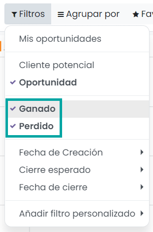

=======================
Analizar el rendimiento
=======================

Revisar tu relación de ganancia/pérdida
=======================================

Para saber qué tan bien está tu embudo de ventas, puedes ver la relación de ganancias y pérdidas. Para ver este informe,
navega a la pantalla :menuselection:`CRM --> Informes --> Embudo`:

Desde ahí podrás filtrar las oportunidades que quieras ver, las tuyas, las de tu canal de ventas, las de toda tu empresa, etc.
Después puedes hacer clic en el filtro para ver las oportunidades ganadas y perdidas:

También puedes cambiar las medidas a *Ingreso esperado*:

Ahora, agrupa la información del gráfico por el campo *Activo*:

Por último, cambia el tipo de gráfico a gráfico circular para ver la relación de ingresos ganados y perdidos en las
oportunidades de venta:

.. note::
   El valor 'true' se corresponde con las oportunidades activas (ganadas), mientras que el valor 'false' se corresponde
   con las oportunidades inactivas (perdidas).

.. seealso::
   * :ref:`productividad/informes/analizar_datos`