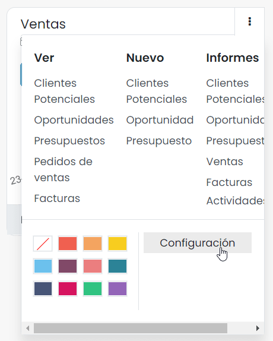
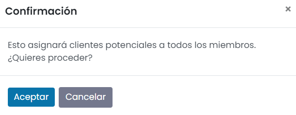

============================
Asignar clientes potenciales
============================

Configuración
=============

Habilitar la asignación basada en reglas
----------------------------------------

La asignación basada en reglas permite asignar de forma manual o automática a los clientes potenciales a los equipos de
ventas en función de las reglas definidas. Para activar la asignación basada en reglas, navega a la pantalla
:menuselection:`CRM --> Configuración --> Ajustes` y marca la opción correspondiente:

A continuación, mediante el desplegable, selecciona si quieres que la asignación se realice de forma manual, o de
forma repetitiva. En caso de seleccionar la opción de repetición, deberás informar el intervalo:

Una vez informados los campos, pulsa el botón *Guardar* de la pantalla de ajustes.

Crear las reglas de asignación
------------------------------

Daeris puede asignar clientes potenciales a equipos específicos según las reglas configuradas. Para configurar las reglas
de asignación, navega a la pantalla :menuselection:`CRM --> Ventas --> Equipos` y accede a la pantalla de configuración
del equipo de ventas:

A continuación, edita el dominio de las reglas de asignación mediante el botón *Editar dominio*:

El sistema desplegará una ventana en donde poder añadir reglas al dominio, para que solo los clientes potenciales que coincidan
con esta regla, se asignen al equipo de ventas:

Una vez hayas creado las reglas de asignación, guarda los cambios en el equipo de ventas mediante el botón *Guardar*.

Asignar los clientes potenciales
================================

En caso de haber configurado la asignación para que se realice de forma repetitiva, el sistema realizará la asignación
de los clientes potenciales en el intervalo definido.

Por otro lado, si se ha configurado una asignación manual, puedes realizar la asignación navegando a la pantalla de
configuración de un equipo de ventas desde la pantalla :menuselection:`CRM --> Ventas --> Equipos`:

En el detalle del equipo de ventas, pulsa el botón *Asignar clientes potenciales*:

El sistema solicitará confirmación para realizar la asignación de los clientes potenciales:

Si todo ha ido bien, el sistema mostrará un mensaje de confirmación con un resumen de la asignación realizada:

Evaluar a los clientes potenciales sin asignar
==============================================

Es posible que muchos de los clientes potenciales no cumplan las reglas establecidas en tus equipos de ventas, por lo que
Daeris no los asignará de forma automática.

Para ver tus clientes potenciales sin asignar, navega a la pantalla a :menuselection:`CRM --> Clientes potenciales` y
selecciona el filtro *Sin asignar*:

.. note::
   También puedes encontrar clientes potenciales no asignados y crear campañas de reactivación mediante las aplicaciones
   de **Marketing por correo electrónico** o **Marketing por SMS**.