============================
Generar clientes potenciales
============================

Crear un cliente potencial por la aplicación
============================================

Para crear un cliente potencial de forma manual, navega a la pantalla :menuselection:`CRM --> Clientes potenciales`.
Desde el listado de clientes potenciales es posible crear un cliente potencial mediante el botón *Crear*:

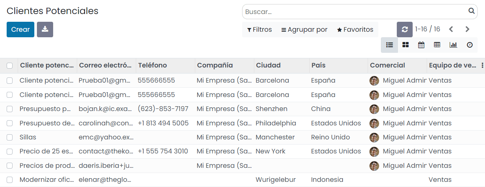

Al crear un cliente potencial el sistema despliega un formulario que dispone de los siguientes campos:

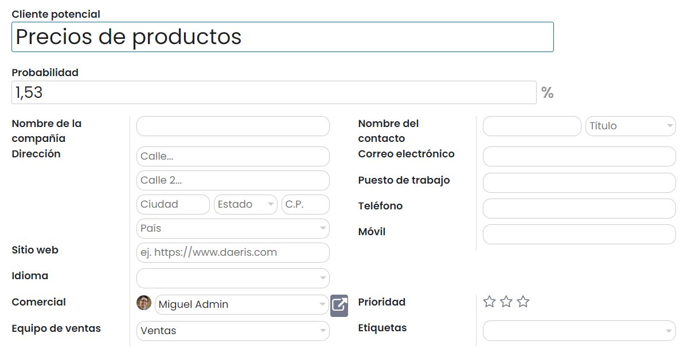

El detalle de los campos es el siguiente:

-  **Cliente potencial**: Texto descriptivo de la solicitud.

-  **Probabilidad**: Porcentaje de probabilidad de conversión del cliente potencial.

-  **Nombre de la compañía**: Nombre de la empresa que emite la solicitud.

-  **Dirección**: Dirección del cliente potencial.

-  **Sitio Web**: Pagina web del cliente potencial.

-  **Idioma**: Idioma principal del cliente potencial.

-  **Comercial**: Usuario responsable del cliente potencial.

-  **Equipo de ventas**: Equipo de ventas asociado al cliente potencial.

-  **Nombre del contacto**: Nombre de la persona que emite la solicitud.

-  **Correo electrónico**: Email del contacto.

-  **Puesto de trabajo**: Rol del contacto en su empresa.

-  **Teléfono**: Teléfono del contacto.

-  **Móvil**: Teléfono móvil del contacto.

-  **Prioridad**: Nivel de prioridad del cliente potencial.

-  **Etiquetas**: Etiquetas asociadas al cliente potencial.

Por otro lado, en la pestaña de *Notas internas*, se incorporan los datos que el agente considera relevantes.

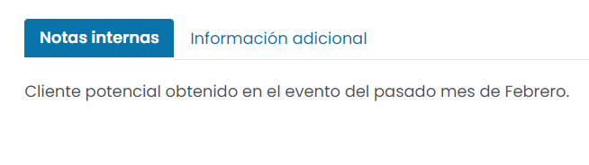

Desde la pestaña de *Información adicional* es posible informar los siguientes campos:

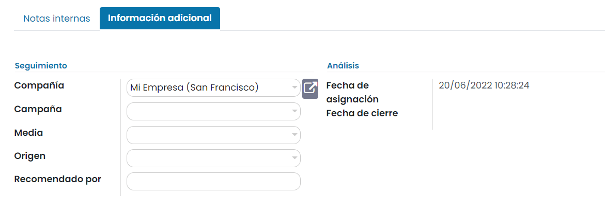

-  **Compañía**: Compañía de Daeris asociada al cliente potencial.

-  **Campaña**: Campaña de marketing asociada al cliente potencial.

-  **Media**: Medio de entrega de la campaña de marketing asociada al cliente potencial.

-  **Origen**: Origen de la campaña de marketing asociada al cliente potencial.

-  **Recomendado por**: En el caso de que el cliente potencial haya sido recomendado por alguien, especificar por quién.

-  **Fecha de asignación**: Fecha en la que se ha creado el cliente potencial.

-  **Fecha de cierre**: Fecha en la que se ha cerrado el cliente potencial.

Una vez completados los campos necesarios, pulsa el botón *Guardar*.

A partir de ese momento, el cliente potencial quedará disponible para su posterior gestión en el sistema por parte del
equipo de ventas.

Crear un cliente potencial por el chat
======================================

.. seealso::
   * :doc:`../../../sitios_web/chat_en_vivo`

Las conversaciones iniciadas por los visitantes aparecerán en el módulo de *Conversaciones* y también aparecerán como un
mensaje directo. Por lo tanto, las consultas pueden ser respondidas desde cualquier parte de Daeris.

Si hay varios operadores a cargo de un canal, el sistema enviará las sesiones aleatoriamente entre ellos.

Los comandos son atajos útiles para completar ciertas acciones o para acceder a la información que puedas necesitar.
Para crear un cliente potencial desde el chat, simplemente escribe el siguiente comando en el chat: `/lead título-cliente-potencial`.

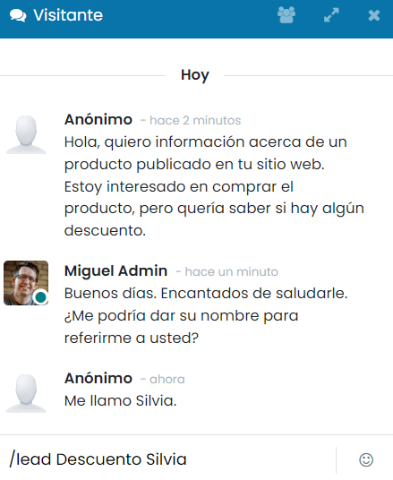

Si todo ha ido bien, el sistema confirmará la creación del cliente potencial en el mismo chat:

Mediante el enlace incluido en el chat, el agente podrá navegar al detalle del cliente potencial creado:

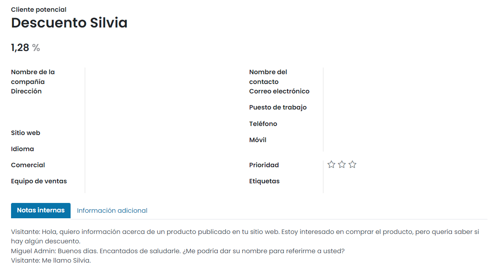

A partir de ese momento, el cliente potencial quedará disponible para su posterior gestión en el sistema por parte del
equipo de ventas.

Crear un cliente potencial por correo electrónico
=================================================

.. seealso::
   * :doc:`../../../varios/correo_electronico/recibir_correos`

Para permitir a los clientes potenciales que puedan enviar sus consultas por correo electrónico, es necesario navegar a
la pantalla :menuselection:`CRM --> Ventas --> Equipos` y navegar a la pantalla de configuración de un equipo de ventas.

En el campo *Alias de correo electrónico* informa el alias correspondiente para la creación de clientes potenciales:

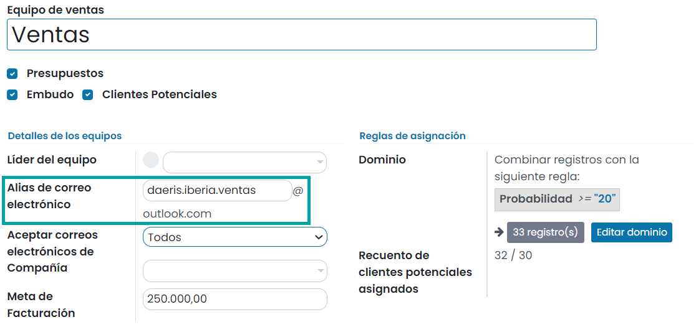

Una vez hayas configurado el alias de correo, pulsa el botón *Guardar*.

A partir de ese momento, ya es posible que los clientes potenciales envíen sus correos electrónicos a la dirección
configurada en los ajustes. Es posible informar un asunto, que se corresponderá con el nombre del cliente potencial,
un cuerpo del mensaje, que se corresponderá con la descripción, e incluir ficheros adjuntos:

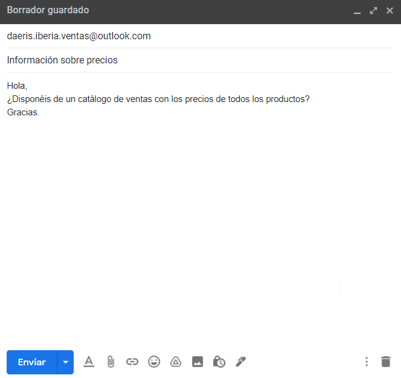

Pasados unos minutos, el cliente potencial se creará en el sistema, y será posible gestionarlo desde la pantalla
:menuselection:`CRM --> Clientes potenciales`. El cliente estará asociado al equipo de ventas en el cuál se ha creado
el alias de correo:

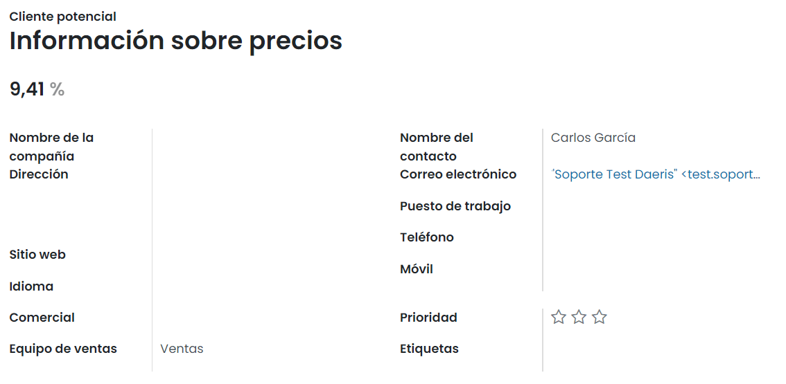

Desde la sección de *chatter* será posible consultar el detalle del correo electrónico enviado:

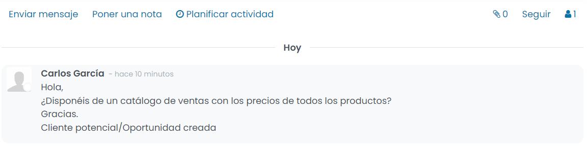

A partir de ese momento, el cliente potencial quedará disponible para su posterior gestión en el sistema por parte del
equipo de ventas.

Crear un cliente potencial por el formulario de contacto del sitio web
======================================================================

Daeris incorpora un formulario de contacto genérico en el Sitio Web, disponible desde la página *Contáctenos*.
Los clientes potenciales del Sitio Web pueden cumplimentar dicho formulario para ponerse en contacto con la empresa:

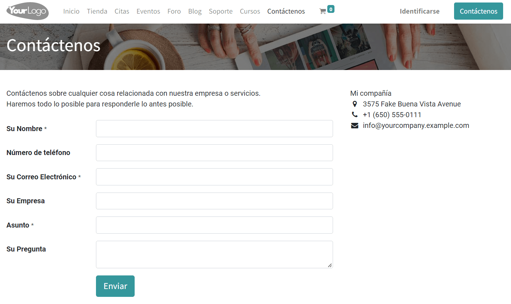

Por defecto, al enviar el formulario, el sistema enviará un correo electrónico a la dirección de correo definida desde
la pantalla de edición del formulario. Pero es posible cambiar este comportamiento, para que en lugar de enviar un
correo electrónico, se genere un nuevo cliente potencial en la aplicación.

Para ello, edita la página de contacto del sitio web mediante el botón *Editar*:

A continuación, pulsa sobre cualquier campo del formulario, y en la sección de edición del lado derecho de la pantalla,
informa la *Acción* con el valor de creación de oportunidades, así como los campos de *Equipo de Ventas* y *Comercial*,
con el equipo de ventas y comercial que quieres que se asocie por defecto a los clientes potenciales creados desde el
formulario:

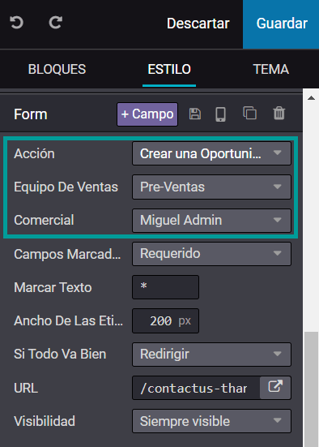

Una vez informados los campos necesarios, pulsa el botón *Guardar*.

Al enviar el formulario, la información se registra en Daeris como un nuevo cliente potencial. Este nuevo cliente potencial
se puede consultar desde la pantalla :menuselection:`CRM --> Clientes potenciales`.

A partir de este momento, el departamento comercial debería acabar de editar la información del cliente potencial y
continuar con el ciclo de gestión de la venta.