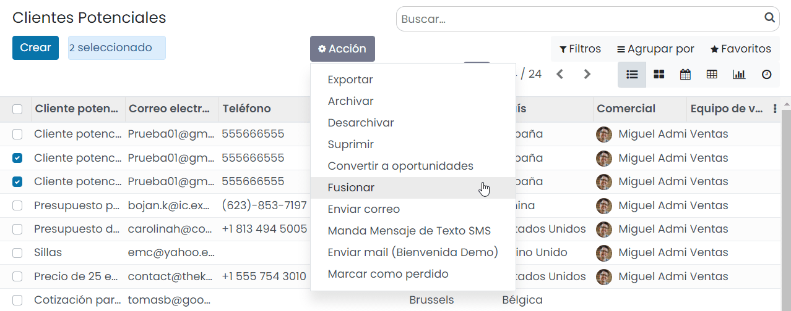

==============================
Gestionar clientes potenciales
==============================

.. youtube:: w25vLQLNA5g
    :align: right
    :width: 700
    :height: 394

Configuración
=============

Habilitar los clientes potenciales
----------------------------------

El sistema puede generar clientes potenciales en lugar de oportunidades, para agregar un paso de calificación antes de
convertir un cliente potencial en una oportunidad y asignar a los vendedores correctos.

Para activar esta función navega a la pantalla :menuselection:`CRM --> Configuración --> Ajustes` y activa la opción
de **Clientes Potenciales**:

Una vez activada la opción, pulsa el botón *Guardar* de la pantalla de ajustes.

A partir de ese momento, podrás ver un nuevo menú en CRM donde se agregarán los nuevos clientes potenciales:

Configurar la tasa de éxito de los clientes potenciales
-------------------------------------------------------

La tasa de éxito de los clientes potenciales es calculada según la etapa, pero puedes añadir más campos en el análisis
estadístico.

Para ello, navega a la pantalla :menuselection:`CRM --> Configuración --> Ajustes` y pulsa el botón *Actualizar probabilidades*:

El sistema mostrará un formulario en donde poder añadir campos adicionales a tener en cuenta en el cálculo de probabilidades
de éxito de los clientes potenciales. Mediante el campo de tipo fecha, es posible indicar una fecha a partir de la cuál
sean tenidos en cuenta los clientes potenciales para la actualización de la probabilidad en base a los nuevos campos:

Una vez actualizados los campos, pulsa el botón *Confirmar* para que el sistema realice la actualización de las
probabilidades de éxito de los clientes potenciales.

Convertir un cliente potencial en oportunidad
=============================================

Para convertir un cliente potencial en oportunidad, navega al detalle del cliente potencial desde la pantalla
:menuselection:`CRM --> Clientes potenciales`, y pulsa el botón *Convertir a oportunidad*:

A continuación, el sistema desplegará un formulario con las siguientes opciones:

-  **Acciones de conversión**

   -  **Convertir a oportunidad**: Convierte el cliente potencial en una nueva oportunidad.

   -  **Fusionar con oportunidades existentes**: Incorpora la información del cliente potencial en una oportunidad existente.

-  **Asignar esta oportunidad a**

   -  **Comercial**: Usuario al que se asignará la oportunidad.

   -  **Equipo de ventas**: Equipo de ventas al que se asignará la oportunidad.

-  **Cliente**: En caso de convertir el cliente potencial a oportunidad, se permitirá enlazar a un cliente existente,
   crear un nuevo cliente o no enlazar a ningún cliente.

Una vez informados los campos correspondientes, pulsa el botón *Crear oportunidad*.

Cuando el cliente potencial se convierte en oportunidad, este deja de estar visible en el listado de clientes potenciales
y pasa a estarlo en el listado de oportunidades. La oportunidad, dispone de la misma información que el cliente potencial:

Marcar un cliente potencial como perdido
========================================

Para marcar un cliente potencial como perdido, navega al detalle del cliente potencial desde la pantalla
:menuselection:`CRM --> Clientes potenciales`, y pulsa el botón *Perdido*:

Esta acción dará como perdido al cliente potencial, que dejará de ser visible sobre el listado de clientes potenciales.

.. note::
   Los clientes potenciales perdidos serán visibles utilizando el filtro de clientes potenciales perdidos.

Una vez marcado como perdido, se habilita el botón *Restaurar*, que permite volver a activar el cliente potencial:

Fusionar clientes potenciales
=============================

Mediante la funcionalidad de fusionar clientes potenciales, es posible combinar la información de varios clientes
potenciales en uno solo. Esto puede ser útil en situaciones en las que se hayan creado clientes potenciales duplicados
por error, y se quiera regularizar la situación de dichos clientes potenciales.

Para combinar clientes potenciales debes navegar a la pantalla :menuselection:`CRM --> Clientes potenciales`. Desde el
modo listado, debes seleccionar los clientes potenciales a combinar, y desde el menú *Acción* seleccionar la opción *Fusionar*:

Esto desplegará una ventana en donde poder informar el comercial y equipo de ventas al que asignar los clientes potenciales
resultantes de la fusión. También es posible añadir más clientes potenciales desde el listado:

.. image:: gestionar_clientes_potenciales/formulario-fusionar-clientes-potenciales.png
   :align: center
   :alt: Formulario de fusión de clientes potenciales

Una vez completada la información necesaria, pulsa el botón *Fusionar*. El sistema navega al detalle del cliente
potencial resultante de la fusión, donde se habrán incorporado los datos de los registros afectados:

Comunicarse con los clientes potenciales
========================================

.. _ventas/crm/enviar_correo_cliente_potencial:

Enviar un correo a los clientes potenciales
-------------------------------------------

.. seealso::
   * :doc:`../../../varios/correo_electronico/enviar_correos`

Es posible realizar un envío de correo a los clientes potenciales a partir de la selección de uno o más clientes
potenciales desde la pantalla :menuselection:`CRM --> Clientes potenciales`. Para ello, marca todos los clientes
potenciales a los que les quieres enviar el correo y desde el menú *Acción*, pulsa *Enviar correo*:

El sistema desplegará un formulario desde donde podrás redactar el asunto y cuerpo del correo electrónico. También es posible
adjuntar ficheros mediante el botón *Adjuntar un archivo*. Si quieres utilizar una plantilla de correo electrónico para que
se complete el asunto y el cuerpo del correo de forma automática, selecciona la plantilla en el desplegable *Usar plantilla*.
O si quieres crear una nueva plantilla con el asunto y cuerpo del mensaje redactado, pulsa el botón *Grabar como nueva plantilla*.
Por último, si quieres que la respuesta al correo se registre en el hilo de discusión original, marca la opción *Registrar en
el hilo de discusión original*, o si quieres que la respuesta se redirija a otra dirección de correo electrónico, marca la opción
correspondiente e informa el campo *Responder A*.

Una vez completados los campos necesarios, pulsa el botón *Enviar*. El correo electrónico se enviará a los clientes
potenciales seleccionados.

.. _ventas/crm/enviar_sms_cliente_potencial:

Enviar un SMS a los clientes potenciales
----------------------------------------

.. seealso::
   * :doc:`../../../varios/sms`

Es posible enviar un SMS a un cliente potencial desde el mismo listado de clientes potenciales. Para ello, debes navegar a la
pantalla :menuselection:`CRM --> Clientes potenciales`. Desde el modo listado, debes seleccionar el cliente potencial al
que quieras enviar el SMS, y desde el menú *Acción* seleccionar la opción *Manda Mensaje de Texto SMS*:

El sistema desplegará un formulario desde donde podrás redactar el mensaje de texto:

.. note::
   El número de teléfono debe estar informado con formato internacional (por ejemplo, +33123456789).

Una vez informado el mensaje, debes pulsar el botón *Enviar ahora*. De esta manera, el SMS se enviará a los clientes potenciales
seleccionados. También tienes la opción de *Poner en cola* el mensaje, para que pueda ser enviado más tarde.

Desde el formulario de detalle del cliente potencial también dispones de la opción de envío de SMS, ya sea mediante el
menú de acción, o mediante el icono de SMS disponible al lado de los campos de teléfono del cliente potencial:

.. _ventas/crm/enviar_whatsapp_cliente_potencial:

Enviar un mensaje de WhatsApp a un cliente potencial
----------------------------------------------------

.. seealso::
   * :doc:`../../../varios/whatsapp`

Es posible enviar un WhatsApp a un cliente potencial desde el formulario de clientes potenciales. Para ello, debes navegar a la
pantalla :menuselection:`CRM --> Clientes potenciales`, y acceder al detalle de un cliente potencial.

Siempre y cuando se haya informado el campo **Móvil**, aparecerá un botón que permitirá enviar un mensaje de WhatsApp al
cliente potencial:

.. note::
   El número de teléfono móvil debe estar informado con formato internacional (por ejemplo, +33123456789).

El sistema desplegará un formulario desde donde podrás redactar el mensaje de WhatsApp o seleccionar una plantilla que
informe el mensaje de forma automática:

Una vez informado el mensaje, debes pulsar el botón *Enviar*.

En caso de estar conectado a la aplicación mediante un dispositivo de escritorio, el sistema tratará de establecer
conexión mediante la aplicación WhatsApp Web, para lo cual, habrá que escanear el código QR mostrado en pantalla, e
iniciar sesión en tu cuenta de WhatsApp.

Por otro lado, en caso de estar conectado a la aplicación mediante un dispositivo móvil, el sistema tratará de enviar
el mensaje mediante la aplicación WhatsApp instalada en el dispositivo.

Una vez enviado el mensaje desde WhatsApp, cierra la ventana del mensaje mediante la cruz ubicada en la parte superior
derecha del formulario:

.. image:: gestionar_clientes_potenciales/cerrar-formulario-enviar-whatsapp.png
   :align: center
   :alt: Cerrar formulario para enviar WhatsApp a un cliente potencial