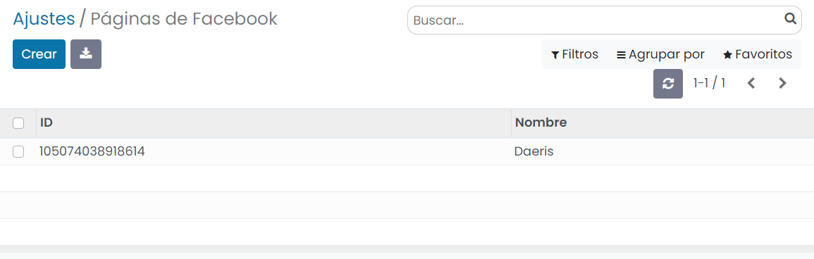

=========================================
Importar clientes potenciales de Facebook
=========================================

En la actualidad, uno de los métodos más comunes para promocionar tu negocio es a través de la publicidad en redes
sociales. Si dispones de una página de Facebook relacionada con tu negocio puedes promocionarlo a través de los
formularios de captación de clientes.

Cuando el usuario de Facebook hace clic en un anuncio, se abre un formulario y los campos se auto-completan con la
información que Facebook ya tiene del perfil del usuario: Nombre, email, teléfono, etc. El usuario puede decidir usar
esta información, cambiarla si así lo decide y completar los campos adicionales que siguen en blanco.

Configuración
=============

La importación de clientes potenciales de Facebook requiere que se realice configuración tanto en Facebook como en Daeris.

Página de Facebook
------------------

Para poder promocionar tú negocio en Facebook deberás disponer de una pagina de Facebook. Para ello deberías acceder a
`Facebook <https://es-es.facebook.com/>`_ con tu cuenta personal y hacer clic sobre la opción del menú
:menuselection:`Crear --> Página`.

.. image:: importar_clientes_potenciales/crear-pagina-facebook.png
   :align: center
   :alt: Crear página de Facebook

Facebook te guiará mediante sus asistentes para que puedas realizar el alta de la página de tu negocio cumplimentando
la información necesaria:

Una vez cumplimentada la información, la aplicación se posicionará sobre la nueva página de Facebook:

Para averiguar el identificador de la página, haz clic sobre la opción del menú :menuselection:`Más --> Información`:

Al final de la pantalla de información, tienes el identificador de la página:

Formularios de captación de clientes en Facebook
------------------------------------------------

#. Para crear un nuevo formulario de captación de clientes potenciales accede a `Facebook Business <https://business.facebook.com/>`_.

#. A continuación, haz clic sobre la opción del menú :menuselection:`Todas las herramientas --> Formularios instantáneos`:

   .. image:: importar_clientes_potenciales/formularios-instantaneos.png
      :align: center
      :alt: Formularios instantáneos de Facebook

#. Haz clic sobre el botón *Crear formulario*:

   .. image:: importar_clientes_potenciales/crear-formularios-instantaneos.png
      :align: center
      :alt: Crear nuevo formulario de Facebook

#. Selecciona la opción de crear un nuevo formulario y haz clic en *Siguiente*:

   .. image:: importar_clientes_potenciales/nuevo-formulario-facebook.png
      :align: center
      :alt: Crear nuevo formulario de Facebook

#. En la pestaña de *Configuración* selecciona el idioma:

   .. image:: importar_clientes_potenciales/idioma-formulario-facebook.png
      :align: center
      :alt: Idioma del formulario de Facebook

#. En la pestaña de *Contenido*, completa toda la información de tu formulario. Una vez finalizada la configuración, pulsa
   el botón *Publicar*.

   .. image:: importar_clientes_potenciales/publicar-formulario-facebook.png
      :align: center
      :alt: Publicar el formulario de Facebook

#. Haz clic en el registro del formulario recién creado y selecciona el enlace de *Formulario de prueba*:

   .. image:: importar_clientes_potenciales/formulario-prueba-facebook.png
      :align: center
      :alt: Formulario de prueba de Facebook

#. Registra la información solicitada en el formulario y pulsa el botón *Siguiente*.

   .. image:: importar_clientes_potenciales/completar-formulario-prueba-facebook.png
      :align: center
      :alt: Completar formulario de prueba de Facebook

#. Esta acción ha generado un cliente potencial que puedes descargar mediante el botón *Descargar*.

#. Una vez hayas probado que el formulario funciona correctamente, puedes promocionarlo mediante el botón *Crear anuncio*.

Apps de Facebook
----------------

#. Navega a la plataforma de `Apps de Facebook <https://developers.facebook.com/apps>`_.
#. Inicia sesión con tu cuenta de Facebook.

   .. image:: importar_clientes_potenciales/iniciar-sesion-facebook.png
      :align: center
      :alt: Iniciar sesión en Facebook

   .. note::
      En caso de no disponer de una cuenta de Facebook para desarrolladores, selecciona la opción del menú *Empezar*
      para crear una nueva cuenta.

Crear una App de Facebook
~~~~~~~~~~~~~~~~~~~~~~~~~

#. Crea una nueva app:

   .. image:: importar_clientes_potenciales/crear-app.png
      :align: center
      :alt: Crear app en Apps de Facebook

#. Selecciona el tipo de app *Negocios* y pulsa el botón *Siguiente*:

   .. image:: importar_clientes_potenciales/tipo-app-facebook.png
      :align: center
      :alt: Tipo de app de Facebook

#. Incorpora un nombre intuitivo a la app y una cuenta de correo, y pulsa el botón *Crear app*:

   .. image:: importar_clientes_potenciales/informacion-basica-app-facebook.png
      :align: center
      :alt: Información básica de la app de Facebook

Configuración de la App
~~~~~~~~~~~~~~~~~~~~~~~

#. Una vez creada la app, en el lado izquierdo del menú haz clic en :menuselection:`Configuración --> Básica`.

   .. image:: importar_clientes_potenciales/configuracion-basica-app-facebook.png
      :align: center
      :alt: Configuración básica de la app de Facebook

#. Informa un icono de la app, un enlace a la política de privacidad de la aplicación (por ejemplo,
   `https://daeris.com/legal/politica-de-privacidad`), un enlace a las condiciones del servicio de la aplicación (por ejemplo,
   `https://daeris.com/legal/condiciones-de-uso`), un dominio autorizado (por ejemplo, `daeris.com`), un correo electrónico
   de contacto, e informa la categoría *Negocios y páginas*. Una vez completados estos campos, pulsa el botón *Guardar cambios*.

   .. image:: importar_clientes_potenciales/pantalla-configuracion-basica-app-facebook.png
      :align: center
      :alt: Pantalla de configuración básica de la app de Facebook

   .. note::
      Copia el **Identificador de la app** y la **Clave secreta de la app**, que necesitarás más adelante para configurar Daeris.

Obtener el token de acceso
~~~~~~~~~~~~~~~~~~~~~~~~~~

#. Navegar al `Explorador de la API Graph <https://developers.facebook.com/tools/explorer/>`_.

#. Selecciona la app de Facebook creada y haz clic sobre :menuselection:`Generar Token de Acceso`.

   .. image:: importar_clientes_potenciales/generar-token-acceso.png
      :align: center
      :alt: Obtener token de acceso a la página de Faceboook

#. Concede acceso a tu cuenta de Facebook en la ventana emergente desplegada.

#. Modifica la forma de obtener el identificador introduciendo el valor `me/accounts`.

   .. image:: importar_clientes_potenciales/me-accounts.png
      :align: center
      :alt: Me accounts en Facebook API Graph

#. Añade los siguientes permisos:

   #. pages_show_list

   #. leads_retrieval

   #. pages_read_engagement

   #. pages_manage_ads

   .. image:: importar_clientes_potenciales/anadir-permisos.png
      :align: center
      :alt: Añadir permisos en Facebook API Graph

#. Vuelve a generar el token de acceso haciendo clic sobre :menuselection:`Generar Token de Acceso`.

#. Selecciona las páginas de Facebook que deseas incorporar:

   .. image:: importar_clientes_potenciales/incorporar-paginas.png
      :align: center
      :alt: Incorporar páginas en Facebook API Graph

#. Para finalizar, pulsa el botón *Listo*, en la página de confirmación de los permisos:

   .. image:: importar_clientes_potenciales/confirmar-permisos.png
      :align: center
      :alt: Confirmar permisos en Facebook API Graph

#. Copia el token de acceso generado y guárdalo:

   .. image:: importar_clientes_potenciales/token-acceso.png
      :align: center
      :alt: Token de acceso en Facebook API Graph

#. Accede a la `herramienta de tokens de acceso <https://developers.facebook.com/tools/accesstoken/>`_.

#. Sobre la aplicación que quieras obtener el token, haz clic en el botón *Depurar* del apartado *User Token*:

   .. image:: importar_clientes_potenciales/depurar-user-token.png
      :align: center
      :alt: Depurar user token

#. Copia el token mostrado en pantalla:

   .. image:: importar_clientes_potenciales/copiar-token-acceso.png
      :align: center
      :alt: Copiar token de acceso de larga duración de Facebook

.. seealso::
   - `Tokens de acceso
     <https://developers.facebook.com/docs/facebook-login/guides/access-tokens>`_

Configuración de clientes potenciales de Facebook
-------------------------------------------------

Configuración en Daeris
~~~~~~~~~~~~~~~~~~~~~~~

Navega a la pantalla :menuselection:`CRM --> Configuración --> Ajustes` y, desde el apartado de *Configuración de clientes potenciales de Facebook*,
informa los siguientes campos:

-  **Identificador de la app**: Identificador de la app de Faceboook.

-  **Clave secreta de la app**: Clave secreta de la app de Facebook.

-  **Token de acceso**: Token de acceso permanente generado.

Una vez informados los campos, pulsa el botón *Guardar* de la pantalla de ajustes.

Con el objetivo de recuperar la información de tus páginas de Facebook haz clic sobre el enlace **Obtener páginas**. Esta
acción recupera el identificador y nombre de tus paginas y navega a la pantalla de páginas de Facebook:

Al hacer clic sobre cualquier página del listado navegas al formulario de detalle. Mediante el botón *Obtener formularios*,
el sistema recupera todos los formularios de la página de Facebook asociada:

A continuación, navega a la pantalla de configuración de formularios de Facebook ubicada en
:menuselection:`CRM --> Configuración --> Formularios de Facebook`:

Al acceder al detalle de un formulario de Facebook, puedes encontrar los siguientes campos:

-  **Nombre**: Nombre del formulario.

-  **Página de Facebook**: Nombre de la página de Facebook.

-  **Equipo de ventas**: Equipo de ventas que gestionará los clientes potenciales generados por el formulario.

-  **ID de formulario**: Identificador del formulario.

-  **Campaña**: Campaña asociada al formulario de Facebook.

-  **Media**: El medio de donde procede el formulario.

-  **Origen**: El origen de donde procede el formulario.

-  **Mapeos**: Correspondencias entre los campos de Facebook y los campos de Daeris. Cada vez que incorpores un nuevo
   formulario, debes incorporar los mapeos correspondientes, de modo que los campos del formulario queden registrados
   en los campos de Daeris. Cada vez que un cliente potencial complete un formulario, Daeris registrará los campos del
   formulario de Facebook en los campos mapeados, dando de alta el registro como cliente potencial.

.. tip::
   Mediante el botón "Obtener campos" es posible recuperar los campos del formulario, mientras que con el botón
   "Adivinar el mapeo" se intentan emparejar los campos del formulario con los campos de Daeris.

Analizar los clientes potenciales de Facebook
=============================================

Para analizar los clientes potenciales importados en Daeris y procedentes de Facebook, navega a la pantalla
:menuselection:`CRM --> Clientes potenciales` y filtra por el campo *Cliente potencial Facebook* está establecido:

El sistema filtrará aquellos clientes potenciales que proceden de Facebook:

.. note::
   La aplicación dispone de una tarea repetitiva que revisa e incorpora los nuevos clientes potenciales de Facebook.
   Esta tarea se ejecuta cada hora.

Al acceder al detalle de uno de ellos, es posible consultar toda la información relacionada, así como los datos que ha
introducido en el formulario en el campo de *Notas internas*:

Por último, desde la pestaña de *Formulario de Facebook* puedes consultar la página y formulario de Facebook asociada
al cliente potencial así como otra información relacionada:

