================
Equipos de venta
================

Daeris te permite administrar varios equipos, departamentos o canales de ventas, cada uno con sus propios procesos de
ventas únicos, utilizando **equipos de ventas**.

.. youtube:: 40Jk3Nft1xU
    :align: right
    :width: 700
    :height: 394

Configuración
=============

Asignar vendedores a varios equipos de ventas
---------------------------------------------

Por defecto, los usuarios de la aplicación solo pueden pertenecer a un equipo de ventas. Pero también es posible configurar
el sistema para que los usuarios puedan pertenecer a varios equipos de ventas. Para ello, navega a la pantalla
:menuselection:`CRM --> Configuración --> Ajustes` y activa la opción de **Equipos múltiples**:

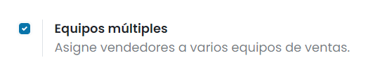

Una vez marcada la opción, pulsa el botón *Guardar* de la pantalla de ajustes.

A partir de ese momento, el sistema permitirá añadir el mismo comercial a varios equipos de ventas.

Crear un equipo de ventas
=========================

Para crear un equipo de ventas navega a la pantalla :menuselection:`CRM --> Configuración --> Equipos de ventas` y haz
clic en el botón *Crear*:

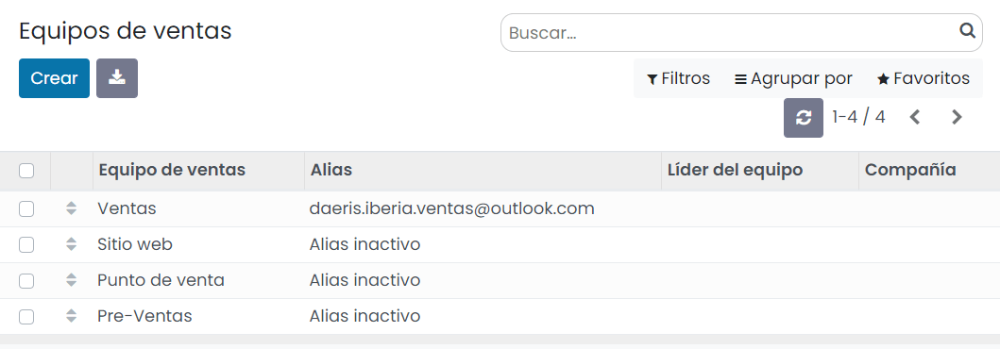

En la página de creación, tienes disponibles los siguientes campos:

-  **Equipo de ventas**: Nombre descriptivo del equipo.

-  **Presupuestos**: Indicador de que el equipo puede gestionar presupuestos. Marca esta casilla si envías presupuestos
   a tus clientes antes de confirmar los pedidos. Esto añadirá los botones específicos de gestión de presupuestos a tu
   panel de equipo.

-  **Embudo**: Indicador de que el equipo puede gestionar oportunidades en el CRM. Mediante esta opción aparecerán
   acciones relacionadas con los flujos de venta del CRM sobre el panel del grupo. Marca esta casilla para gestionar un
   proceso de preventa mediante oportunidades.

-  **Clientes potenciales**: Indicador de que el equipo puede gestionar clientes potenciales. Mediante esta opción
   aparecerán acciones relacionadas con los clientes potenciales sobre el panel del grupo. Marca esta casilla para filtrar y
   calificar las solicitudes entrantes como prospectos antes de convertirlas en oportunidades y asignarlas a un vendedor.

-  **Líder del equipo**: Nombre del usuario responsable del equipo de ventas.

-  **Alias de correo electrónico**:establece un alias de correo electrónico para generar automáticamente un cliente
   potencial/oportunidad para este equipo de ventas cada vez que se envíe un correo a esa dirección de correo electrónico
   única. También puedes elegir si aceptas correos electrónicos de *Todos*, *Empresas autenticadas*, *Solo seguidores* o
   *Empleados autenticados*.

-  **Compañía**: Empresa asociada al equipo de ventas.

-  **Meta de Facturación**: Establece un objetivo de facturación si este equipo tiene objetivos de ingresos mensuales
   específicos.

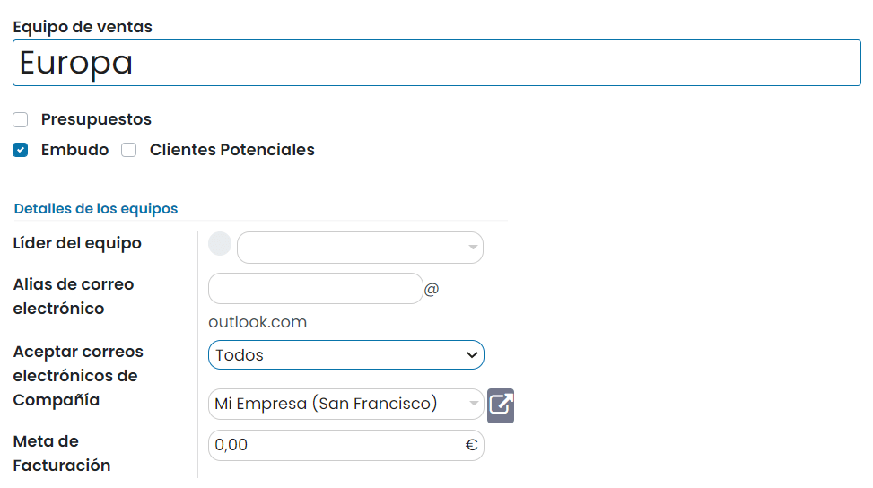

Añadir miembros a un equipo de ventas
-------------------------------------

Para agregar miembros del equipo, haz clic en *Añadir* en la pestaña de *Miembros* al editar la página de configuración
del equipo de ventas:

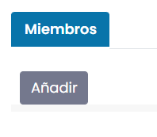

Selecciona uno o varios vendedores del menú desplegable o crea un nuevo vendedor:

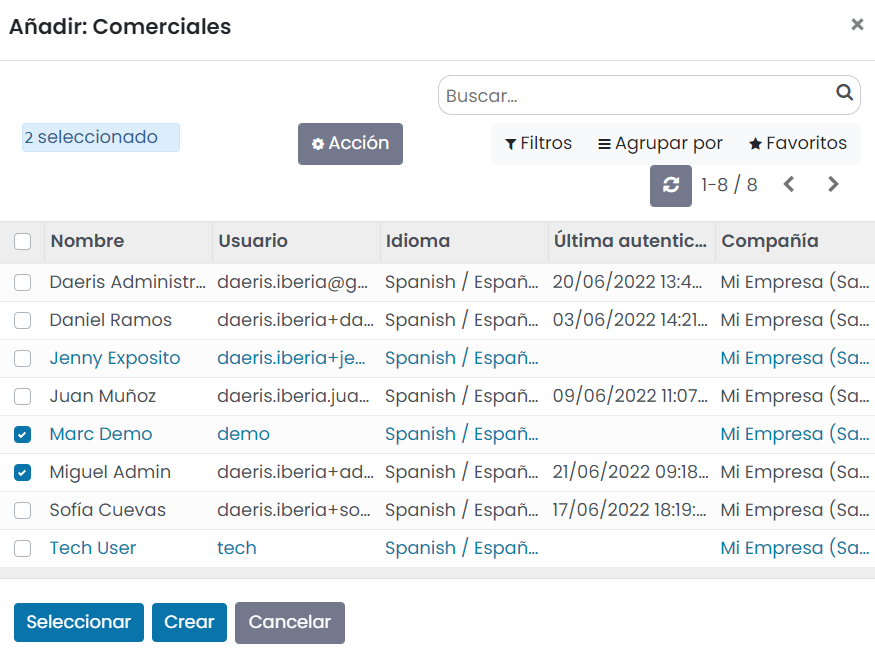

Una vez seleccionados los miembros, guarda el equipo de ventas mediante el botón *Guardar*.

A continuación, vuelve a editar el equipo de ventas mediante el botón *Editar* y establece un número máximo de clientes
potenciales que se pueden asignar a cada uno de los vendedores en un período de 30 días, para asegurarte de que no se
saturen. Esto lo puedes hacer haciendo clic sobre cada uno de los vendedores:

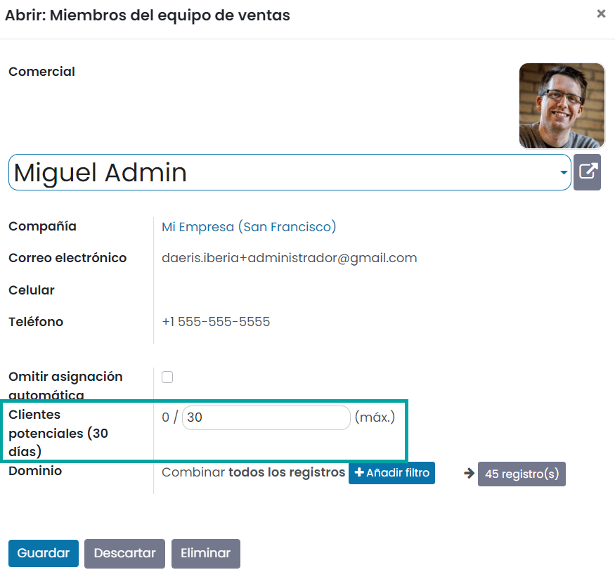

.. note::
   Por defecto, se establece un máximo de 30 clientes potenciales por vendedor en los últimos 30 días.

Panel del equipo de ventas
==========================

Para ver el panel del equipo de ventas, navega a la pantalla :menuselection:`CRM --> Ventas --> Equipos`. Todos los
equipos de los que seas parte aparecerán en el panel.

Cada equipo ofrece una descripción general de las oportunidades abiertas, presupuestos, pedidos de ventas e ingresos
esperados del equipo de ventas, así como un gráfico de barras de nuevas oportunidades por semana y una barra de progreso
de facturación:

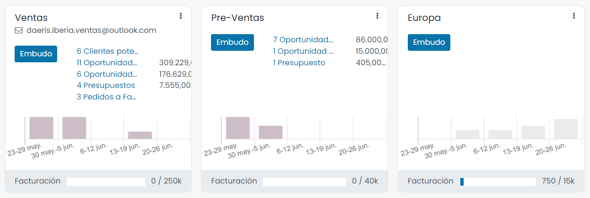

Haz clic en los tres puntos en la esquina de un equipo para abrir un menú de navegación que te permite ver rápidamente
documentos o informes, crear nuevos presupuestos u oportunidades, elegir un color para este equipo o acceder a su página
de configuración:

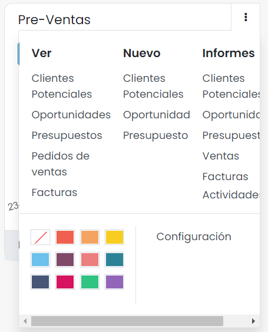

Haz clic en el botón *Embudo* para ir directamente al embudo de CRM de ese equipo.

¿Cómo motivar y recompensar a mis vendedores?
=============================================

Una excelente manera de reforzar los buenos hábitos y de mejorar la productividad de tu equipo de ventas es retar a tus
empleados para alcanzar objetivos específicos. El módulo de gamificación te ofrece maneras creativas y simples de motivar
y evaluar a tus empleados. También tendrán reconocimientos en tiempo real e insignias mediante mecánicas de juego.

Crear un desafío
----------------

Para crear un desafío navega a la pantalla :menuselection:`Empleados --> Configuración --> Desafíos`.

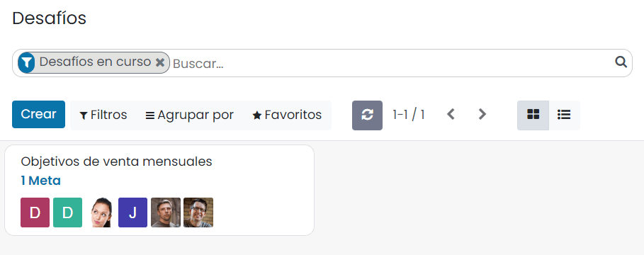

Un desafío es una misión que le envías a tu equipo de ventas. Puedes incluir una o varias metas que se deben llevar a
cabo durante un periodo específico de tiempo. Así puedes configurar tu desafío:

#. Asigna a los vendedores a los que retarás.

#. Asigna a un responsable.

#. Configura la periodicidad así como la fecha de inicio y fecha final.

#. Selecciona las metas.

#. Configura las recompensas (insignias).

.. note::
   Las insignias se otorgan cuando se termina el desafío. Esto sucede ya sea al final del periodo en curso (por ejemplo,
   al final del mes para un desafío mensual), en la fecha final del desafío (si no se configura un periodo), o cuando el
   desafío se cierra manualmente.

En el siguiente ejemplo, estamos retando a 6 empleados con un objetivo mensual de ventas. El desafío se basa en 2 objetivos:
la cantidad total facturada y los nuevos clientes potenciales generados. Al final del mes el ganador obtendrá una insignia.

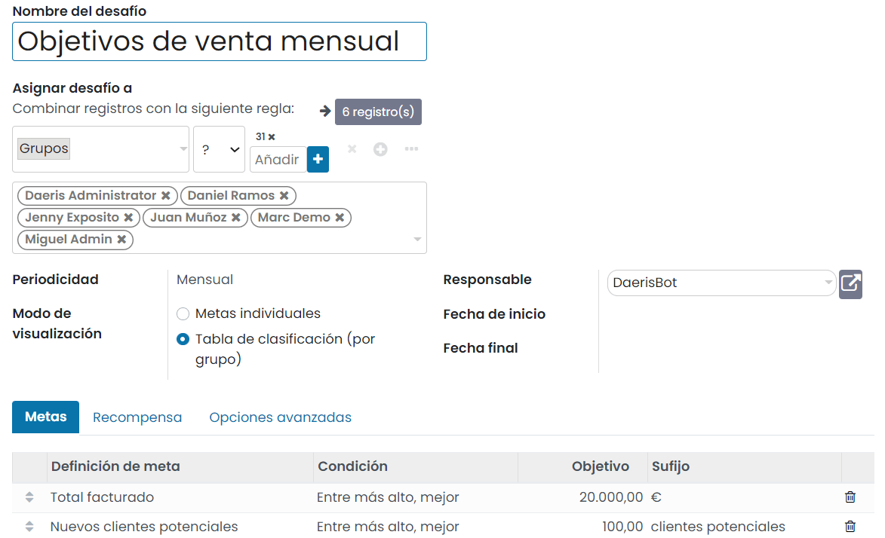

Configurar las metas
~~~~~~~~~~~~~~~~~~~~

A los usuarios se les puede evaluar según metas u objetivos numéricos que alcanzaron. Las metas se asignan a través de
los desafíos que evalúan y comparan a los miembros de un equipo a lo largo del tiempo.

Puedes crear una nueva meta sobre la marcha desde un desafío, haciendo clic en *Agregar línea* en el listado de metas.
Selecciona el objeto empresarial de acuerdo a las necesidades de tu empresa. Por ejemplo: número de clientes potenciales
nuevos, tiempo para calificar un cliente potencial, cantidad total facturada durante una semana, un mes o cualquier
espacio de tiempo específico en tus preferencias de gestión, etc.

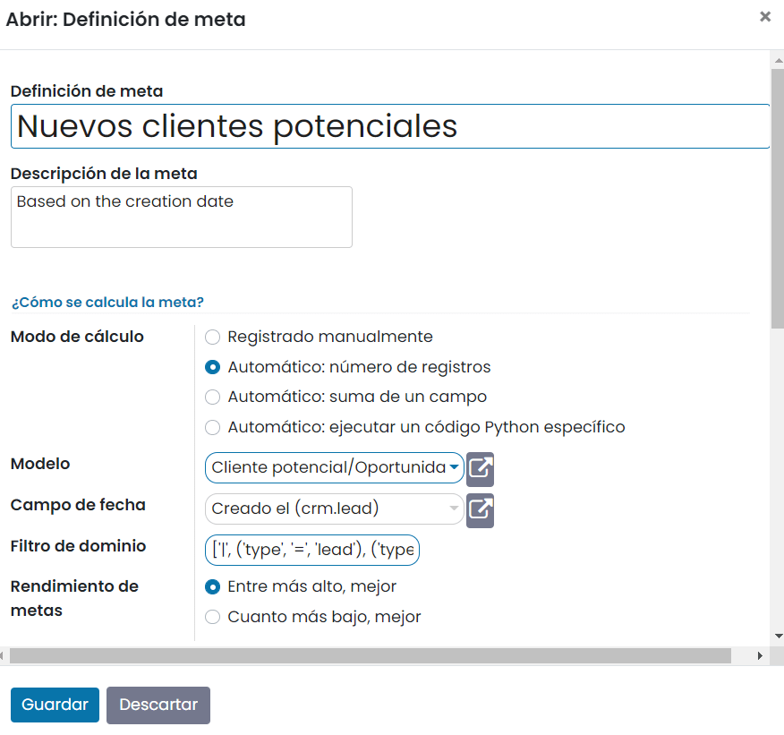

Configurar las recompensas
~~~~~~~~~~~~~~~~~~~~~~~~~~

Se pueden dar insignias a los usuarios cuando superen sus desafíos. Desde un simple gracias hasta un maravilloso logro, una
insignia es una gran manera de expresar gratitud por un trabajo bien hecho. Para crear y otorgar insignias a tus empleados
según su rendimiento selecciona la recompensa a otorgar desde la pestaña de *Recompensas*:

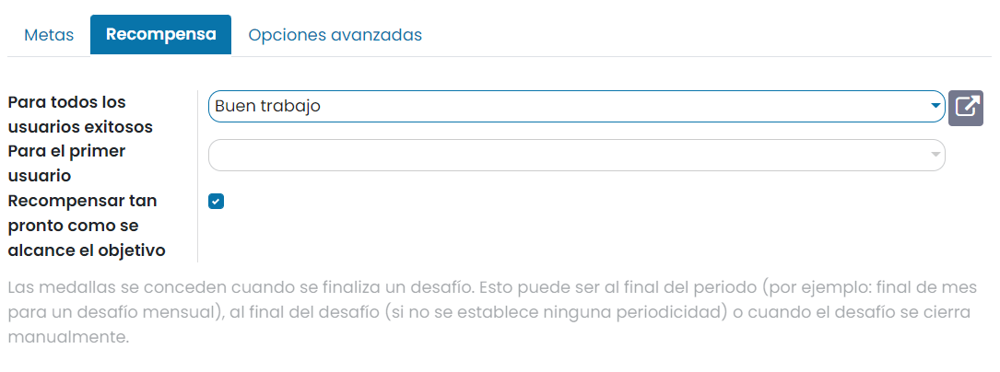

Para administrar las insignias existentes o crear nuevas insignias, navega a la pantalla
:menuselection:`Empleados --> Configuración --> Medallas`:

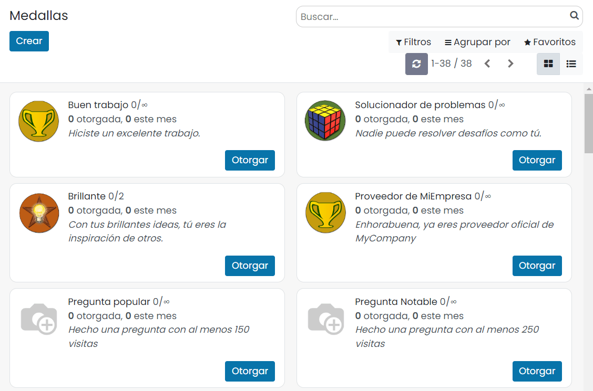