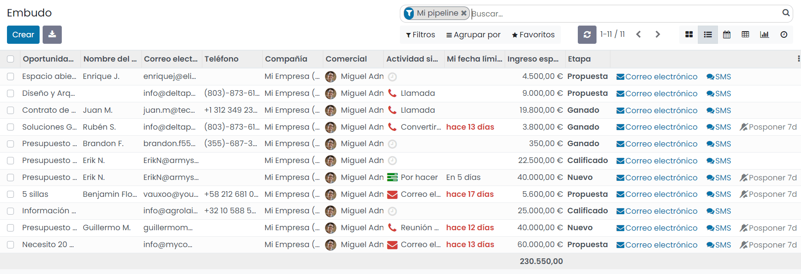

======================
Oportunidades de venta
======================

Configuración
=============

.. _ventas/crm/oportunidades/etapas:

Configurar las etapas de las oportunidades de venta
---------------------------------------------------

Las etapas son las fases en las que se puede encontrar una oportunidad dentro del CRM. En función de tu modelo de negocio
y sistema de ventas, es posible que necesites aumentar o modificar las inicialmente propuestas.

Por lo general, la gestión de oportunidades se basa en las siguientes etapas:

-  Nuevo

-  Calificado

-  Propuesta

-  Ganado

Desde la pantalla :menuselection:`CRM --> Ventas --> Mi pipeline` puedes visualizar la vista Kanban de oportunidades:

Cada oportunidad está ubicada en su correspondiente columna en base a su etapa. Para incorporar una nueva etapa debes
hacer clic sobre el icono *Agregar una columna*:

.. image:: oportunidades/agregar-columna.png
   :align: center
   :alt: Agregar etapa a la oportunidad

A continuación, debes introducir el nombre de la nueva etapa en el campo habilitado para ello:

Una vez añadida la nueva etapa, aparecerá como una nueva columna en la pantalla de oportunidades:

Para cambiar la ubicación de la nueva etapa, puedes arrastrar la columna sobre la posición deseada:

A continuación, es posible configurar la etapa pulsando la opción *Editar Etapa*:

En el formulario de detalle de la etapa puedes encontrar los siguientes campos:

El detalle de los campos es el siguiente:

-  **Nombre de la etapa**

-  **¿Está en la etapa ganada?**: Indica si las oportunidades dentro de esta etapa son oportunidades ya ganadas.

-  **Doblado en el pipeline**: Si está marcado, se muestra la etapa replegada en la vista kanban de oportunidades.

-  **Equipo de ventas**: Si se informa, este equipo será el único que pueda visualizar la etapa dentro de la vista
   kanban de oportunidades.

-  **Requerimientos**: Instrucciones para los agentes de los equipos de ventas. Cuando informas este campo con un texto,
   aparece en la vista kanban de oportunidades cuando pasas el ratón sobre el nombre de la etapa.

Una vez informados todos los campos necesarios, pulsa el botón *Guardar*.

.. _ventas/crm/oportunidades/actividades:

Configurar los tipos de actividad
---------------------------------

Cuando planificas actividades, minimizas el riesgo de incertidumbres, ya que proporcionas instrucciones claras para el
curso de tu próxima acción. Además de eso, no dejas espacio para actividades inútiles y reduces la posibilidad de que
haya acciones superpuestas entre los miembros del equipo.

Para configurar los tipos de actividad, navega a la pantalla :menuselection:`CRM --> Configuración --> Tipos de actividad`.
Hay varios tipos de actividades disponibles de forma predeterminada en Daeris (llamada, correo electrónico, reunión, etc.).
Sin embargo, puedes establecer nuevos tipos si así lo deseas:

.. tip::
   Si necesitas crear un tipo de actividad con un calendario disponible, asegúrate de crearlo con una *Acción* para
   realizar establecida como *Reunión*.

   .. image:: oportunidades/tipo-actividad-reunion.png
      :align: center
      :alt: Tipos de actividad con acción establecido como reunión

Daeris te ayuda a planificar un flujo de actividades permitiéndote establecer próximas actividades recomendadas mediante
el apartado de *Actividad siguiente*:

Una vez que se complete la actividad respectiva, al seleccionar *¡Hecho! Prepare el próximo*, se sugieren los siguientes
pasos:

En este ejemplo, cuando se completa una actividad de correo electrónico, se sugiere planificar una actividad de llamada,
por lo que al marcar la actividad de correo electrónico como hecha e indicar que se prepare la próxima actividad, el
sistema despliega automáticamente una nueva actividad de llamada:

.. _ventas/crm/oportunidades/motivos:

Configurar los motivos de pérdida de las oportunidades
------------------------------------------------------

Cuando un usuario define que una oportunidad se ha perdido mediante el botón *Perdido*, aparece un desplegable que exige
seleccionar un motivo.  Para configurar los motivos de pérdida de las oportunidades, navega a la pantalla
:menuselection:`CRM --> Configuración --> Motivos de pérdida`.

Sobre esta pantalla puedes crear, editar y dar de baja los motivos de pérdida, que posteriormente aparecerán sobre el
campo seleccionable de motivo de pérdida al marcar una oportunidad como perdida:

.. _ventas/crm/oportunidades/etiquetas:

Configurar etiquetas de las oportunidades de venta
--------------------------------------------------

Las etiquetas son categorías que puedes asociar a las oportunidades en base a las necesidades de tu negocio. Puedes crear
categorías como *Muy urgente*, *Venta estratégica* o *Admin. Pública* y asociarles un color representativo que aparecerá
sobre la vista kanban de oportunidades.

Para crear una etiqueta, navega a la pantalla :menuselection:`CRM --> Configuración --> Etiquetas`. Inicialmente
encuentras un listado con todas las etiquetas dadas de alta en el sistema. Desde el listado puedes crear un nuevo
registro mediante el botón *Crear*:

Al crear un registro puedes informar un nombre y seleccionar un color de entre los colores disponibles:

Una vez configurada la etiqueta, es posible asociarla a una oportunidad desde el detalle de la misma, en la pantalla
:menuselection:`CRM --> Ventas --> Mi pipeline`.

Al asociar una etiqueta a una oportunidad, se podrá visualizar la misma desde el kanban de oportunidades:

.. _ventas/crm/oportunidades/planes:

Definir planes e ingresos recurrentes en las oportunidades
----------------------------------------------------------

Existen oportunidades de venta que, además de tener un ingreso estimado fijo, puedan llegar a tener un ingreso estimado
recurrente, como por ejemplo, en el caso de las suscripciones. Si ese es tu caso, navega a la pantalla
:menuselection:`CRM --> Configuración --> Ajustes` y activa la opción de **Ingresos recurrentes**:

Una vez activada esa opción, pulsa el botón *Guardar*.

A continuación, configura tus planes recurrentes haciendo clic en el enlace *Gestiona planes recurrentes*:

El sistema navegará a la pantalla listado de planes recurrentes, donde podrás configurar tus planes y el número de meses
de cada plan:

Una vez configurados los planes, si navegas al detalle de una oportunidad desde la pantalla :menuselection:`CRM --> Ventas --> Mi pipeline`,
puedes ver que aparecen disponibles dos nuevos campos, en donde es posible informar el ingreso recurrente y el plan
recurrente asociado:

Tras informar el ingreso recurrente en una oportunidad, también es posible visualizarlo desde la pantalla kanban de
oportunidades:

.. image:: oportunidades/ingreso-recurrente-kanban.png
   :align: center
   :alt: Ingreso recurrente en la vista kanban de oportunidades

Gestión de oportunidades
========================

.. youtube:: lsrxqKjmes4
    :align: right
    :width: 700
    :height: 394

Crear una oportunidad de venta
------------------------------

Para crear una oportunidad, navega a la pantalla :menuselection:`CRM --> Ventas --> Mi pipeline`, y pulsa el botón *Crear*:

El sistema desplegará un nuevo elemento de oportunidad en la vista kanban, y permitirá informar los campos principales
de la misma:

Mediante el botón *Añadir*, la oportunidad queda creada. Si pulsas el botón *Editar*, el sistema navega a la pantalla de
detalle de la oportunidad.

Los campos que encuentras en el detalle de la oportunidad son los siguientes:

-  **Oportunidad**: Título de la oportunidad.

-  **Ingreso esperado**: Estimación del valor económico de la oportunidad.

-  **Probabilidad**: Probabilidad de cerrar la oportunidad con éxito.

-  **Cliente**: Nombre del cliente asociado a la oportunidad.

-  **Correo electrónico**: Email asociado al cliente.

-  **Teléfono**: Teléfono asociado al cliente.

-  **Comercial**: Usuario de Daeris responsable de gestionar la oportunidad.

-  **Equipo de ventas**: Equipo de ventas asociado a la oportunidad.

-  **Cierre esperado**: Fecha en la que se estima se podrá cerrar la oportunidad.

-  **Prioridad**: Nivel de prioridad de la oportunidad.

-  **Etiquetas**: Etiquetas asociadas a la oportunidad.

-  **Compañía**: Compañía asociada a la oportunidad.

-  **Notas internas**: Descripción de la oportunidad o notas asociadas a la misma.

Si haces clic sobre la pestaña de *Información adicional*, encuentras los siguientes campos:

.. image:: oportunidades/informacion-adicional-oportunidad.png
   :align: center
   :alt: Información adicional de una oportunidad de venta

-  **Información de contacto**: En este apartado aparece información de contacto del cliente, como su dirección, sitio
   web, idioma, nombre del contacto y de la compañía asociada, puesto de trabajo y teléfono móvil.

-  **Marketing**: En este apartado aparece información relacionada con la campaña, medio y origen asociados a la oportunidad.

-  **Recomendado por**: En el caso de que el cliente de esta oportunidad haya sido recomendado por alguien, especificar
   por quién.

Una vez completados los campos necesarios, pulsa el botón *Guardar*. A partir de ese momento, la oportunidad quedará
disponible para su gestión por parte del equipo de ventas.

Gestionar una oportunidad de venta
----------------------------------

Las oportunidades son situaciones que requieren de acciones comerciales sobre un cliente para realizar una venta. Para
gestionar las oportunidades, navega a la pantalla :menuselection:`CRM --> Ventas --> Mi pipeline`. Inicialmente encuentras
la pantalla de oportunidades en modo kanban, filtrando por las oportunidades de las cuáles eres propietario:

Desde esta pantalla puedes interactuar con las oportunidades realizando varias acciones:

-  **Cambiar de etapa**: Arrastrando la oportunidad de una etapa a otra.

   .. image:: oportunidades/cambiar-etapa-oportunidades.png
      :align: center
      :alt: Cambiar etapa de las oportunidades

-  **Cambiar la prioridad**: Haciendo clic sobre los iconos de las estrellas.

   .. image:: oportunidades/cambiar-prioridad-oportunidades.png
      :align: center
      :alt: Cambiar prioridad de las oportunidades

-  **Planificar una tarea**: Haciendo clic sobre el icono de planificación de tareas, aparecerá un desplegable de
   gestión de actividades en el que se podrá crear una nueva actividad mediante el botón *Planificar una actividad*.

   .. image:: oportunidades/planificar-tarea-oportunidades.png
      :align: center
      :alt: Planificar tarea en las oportunidades

-  **Marcar una actividad como hecha**: Para marcar una actividad como hecha, despliega el listado de actividades mediante
   el icono del reloj, y pulsa el icono para marcar como hecho.

   .. image:: oportunidades/marcar-tarea-hecha-oportunidades.png
      :align: center
      :alt: Marcar tarea como hecha en las oportunidades

-  **Identificar el estado de las tareas pendientes y el sumatorio del importe**: Debajo del nombre de la etapa aparece
   información acerca de las actividades y el importe de la oportunidad. En función de los colores, puedes saber si la
   oportunidad dispone de actividades pendientes de realizar (en rojo actividades vencidas pendientes de realizar, en
   amarillo actividades para realizar hoy y en verde actividades programadas para el futuro).

   .. image:: oportunidades/identificar-estado-tareas-oportunidades.png
      :align: center
      :alt: Identificar estado de las tareas en las oportunidades

Si cambias el tipo de vista a lista, puedes consultar el listado de oportunidades junto con su información más relevante:

También tienes disponible una vista calendario desde donde poder visualizar todas las oportunidades sobre el calendario
en base a su fecha:

Por otro lado, desde la vista pivote, es posible visualizar el ingreso esperado de las oportunidades por fecha y etapa:

Si cambias a la vista de tipo gráfico, puedes consultar un gráfico del embudo de oportunidades:

Por último, desde la vista de actividades, dispones de todas las actividades asociadas a las oportunidades, agrupadas por
oportunidad y tipo de actividad:

Marcar una oportunidad de venta como ganada
-------------------------------------------

Para marcar una oportunidad como ganada, navega al detalle de la oportunidad desde la pantalla :menuselection:`CRM --> Ventas --> Mi pipeline`,
y pulsa el botón *Ganado*:

Al hacer esto, el estado de la oportunidad cambia a *Ganado*:

Marcar una oportunidad de venta como perdida
--------------------------------------------

Para marcar una oportunidad como perdida, navega al detalle de la oportunidad desde la pantalla :menuselection:`CRM --> Ventas --> Mi pipeline`,
y pulsa el botón *Perdido*:

El sistema solicitará informar un motivo de la pérdida:

.. image:: oportunidades/motivo-perdida.png
   :align: center
   :alt: Informar motivo de la pérdida de la oportunidad

Una vez informado el motivo de la pérdida, pulsa el botón *Enviar*.

A partir de ese momento, se habilita el botón *Restaurar*, que permite volver a activar la oportunidad en caso de ser
necesario:

Comunicarse en las oportunidades de venta
=========================================

Enviar un correo en las oportunidades
-------------------------------------

.. seealso::
   * :doc:`../../varios/correo_electronico/enviar_correos`

Es posible realizar un envío de correo a las oportunidades de venta a partir de la selección de una o más oportunidades
desde la pantalla :menuselection:`CRM --> Ventas --> Mi pipeline`. Para ello, cambia a la vista de tipo lista y marca
todas las oportunidades a las que les quieres enviar el correo. Desde el menú *Acción*, pulsa *Enviar correo*:

El sistema desplegará un formulario desde donde podrás redactar el asunto y cuerpo del correo electrónico. También es posible
adjuntar ficheros mediante el botón *Adjuntar un archivo*. Si quieres utilizar una plantilla de correo electrónico para que
se complete el asunto y el cuerpo del correo de forma automática, selecciona la plantilla en el desplegable *Usar plantilla*.
O si quieres crear una nueva plantilla con el asunto y cuerpo del mensaje redactado, pulsa el botón *Grabar como nueva plantilla*.
Por último, si quieres que la respuesta al correo se registre en el hilo de discusión original, marca la opción *Registrar en
el hilo de discusión original*, o si quieres que la respuesta se redirija a otra dirección de correo electrónico, marca la opción
correspondiente e informa el campo *Responder A*.

Una vez completados los campos necesarios, pulsa el botón *Enviar*. El correo electrónico se enviará a las oportunidades
seleccionadas.

.. _ventas/crm/enviar_sms_oportunidades:

Enviar un SMS en las oportunidades
----------------------------------

.. seealso::
   * :doc:`../../varios/sms`

Es posible realizar un envío de SMS a las oportunidades de venta a partir de la selección de una o más oportunidades
desde la pantalla :menuselection:`CRM --> Ventas --> Mi pipeline`. Para ello, cambia a la vista de tipo lista y marca
todas las oportunidades a las que les quieres enviar el SMS. Desde el menú *Acción*, pulsa *Manda Mensaje de Texto SMS*:

.. image:: oportunidades/enviar-sms.png
   :align: center
   :alt: Enviar SMS a una oportunidad

El sistema desplegará un formulario desde donde podrás redactar el mensaje de texto:

.. note::
   El número de teléfono debe estar informado con formato internacional (por ejemplo, +33123456789).

Una vez informado el mensaje, debes pulsar el botón *Enviar ahora*. De esta manera, el SMS se enviará a las oportunidades
seleccionadas. También tienes la opción de *Poner en cola* el mensaje, para que pueda ser enviado más tarde.

Desde el formulario de detalle de la oportunidad también dispones de la opción de envío de SMS, ya sea mediante el
menú de acción, o mediante el icono de SMS disponible al lado de los campos de teléfono de la oportunidad:

.. _ventas/crm/enviar_whatsapp_oportunidades:

Enviar un mensaje de WhatsApp en una oportunidad
------------------------------------------------

.. seealso::
   * :doc:`../../varios/whatsapp`

Es posible enviar un WhatsApp a una oportunidad desde el formulario de oportunidades. Para ello, debes navegar a la
pantalla :menuselection:`CRM --> Ventas --> Mi pipeline`, y acceder al detalle de una oportunidad.

Siempre y cuando se haya informado el campo **Móvil**, aparecerá un botón que permitirá enviar un mensaje de WhatsApp
en la oportunidad:

.. note::
   El número de teléfono móvil debe estar informado con formato internacional (por ejemplo, +33123456789).

El sistema desplegará un formulario desde donde podrás redactar el mensaje de WhatsApp o seleccionar una plantilla que
informe el mensaje de forma automática:

Una vez informado el mensaje, debes pulsar el botón *Enviar*.

En caso de estar conectado a la aplicación mediante un dispositivo de escritorio, el sistema tratará de establecer
conexión mediante la aplicación WhatsApp Web, para lo cual, habrá que escanear el código QR mostrado en pantalla, e
iniciar sesión en tu cuenta de WhatsApp.

Por otro lado, en caso de estar conectado a la aplicación mediante un dispositivo móvil, el sistema tratará de enviar
el mensaje mediante la aplicación WhatsApp instalada en el dispositivo.

Una vez enviado el mensaje desde WhatsApp, cierra la ventana del mensaje mediante la cruz ubicada en la parte superior
derecha del formulario:

Gestión de presupuestos
=======================

Crear un presupuesto desde una oportunidad de venta
---------------------------------------------------

Para crear un presupuesto desde una oportunidad de venta, navega al detalle de la oportunidad desde la pantalla
:menuselection:`CRM --> Ventas --> Mi pipeline`, y pulsa el botón *Nuevo Presupuesto*:

.. note::
   Si la oportunidad no dispone de cliente asociado, el sistema preguntará si crear un nuevo cliente, enlazar a un cliente
   existente, o no enlazar a ningún cliente.

Esta acción creará un nuevo presupuesto, heredando varios de los campos de la oportunidad. El sistema navegará al
detalle del presupuesto creado:

A partir de ese momento, ya puedes continuar con el circuito de venta, completando el presupuesto generado, y enviándolo
al cliente para su aprobación.