:show-content:

========
Miembros
========

Daeris dispone de un módulo de gestión de **Miembros**. Este módulo puede ser usado para operar clubes,
gimnasios, bibliotecas y muchas otras organizaciones. El módulo de miembros de Daeris es el más adecuado
para los usuarios finales, ya que incluye todas las funciones necesarias para administrar la membresía.

Daeris permite la personalización de la membresía con muy poco esfuerzo. Daeris te ayudará a administrar
la membresía en cualquier organización sin tener en cuenta el tamaño de la misma. Una característica única
de Daeris es que permite al usuario emitir membresías gratuitas, membresías de pago y membresías asociadas.

Los módulos de ventas y contabilidad se pueden integrar con los sistemas de gestión de Miembros de Daeris.
La integración con estos módulos ayuda en la generación automatizada de facturas y el envío de solicitudes
para la renovación de la membresía.

Crear y administrar productos de suscripción
============================================

Para crear un producto de suscripción, navega a la pantalla :menuselection:`Miembros --> Configuración --> Productos de Suscripción`
y pulsa el botón *Crear*:

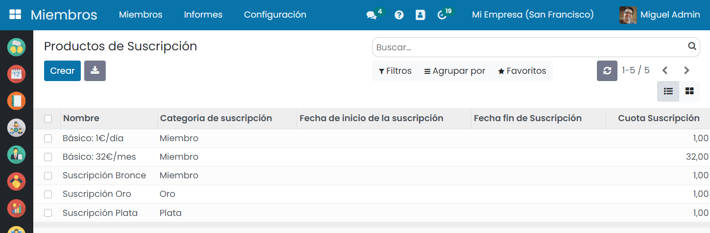

A continuación, en el formulario de productos de suscripción, puedes informar los siguientes campos:

- **Nombre del producto**: Nombre del producto de suscripción.
- **Referencia interna**: Código que puede servir para identificar internamente el producto.
- **Categoría de producto**: Valor seleccionable del listado de categorías de producto configurado en la aplicación.
- **Compañía**: Valor seleccionable de compañías en el caso de trabajar con multicompañía.
- **Categoría de suscripción**: Los usuarios pueden definir categorías de suscripción en :menuselection:`Miembros --> Configuración --> Categorías de Suscripción`.
- **Activo**: Indica si el producto de suscripción se encuentra activo o no.
- **Tipo de suscripción**: Es posible especificar fechas variables o fijas. En caso de seleccionar fechas fijas,
  será necesario informar una fecha de inicio y de fin de la suscripción. En caso de seleccionar fechas variables,
  será necesario informar el intervalo en días, semanas, meses o años.
- **Cuota suscripción**: Si la membresía es de pago, en este campo se puede indicar el precio de la misma.
- **Cuenta de ingresos**: Cuenta contable en la que quedarán registradas las ventas de este producto.
- **Impuestos**: Impuestos aplicados a la venta del producto de la suscripción.
- **Descripción**: Descripción del producto de suscripción.
- **Descripción de ventas**: Descripción mostrada en los presupuestos de venta.

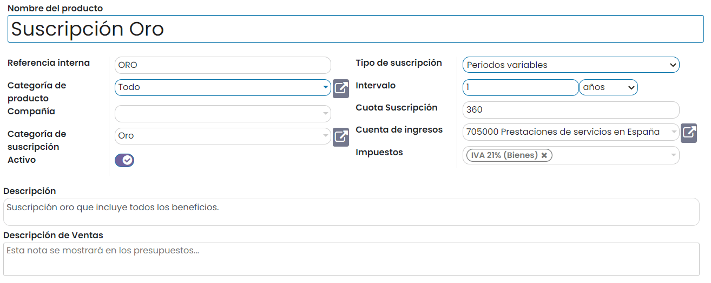

Una vez informados todos los campos necesarios, pulsa el botón *Guardar*.

Crear y configurar miembros
===========================

Para crear un nuevo miembro, navega a la pantalla :menuselection:`Miembros --> Miembros` y pulsa el botón *Crear*:

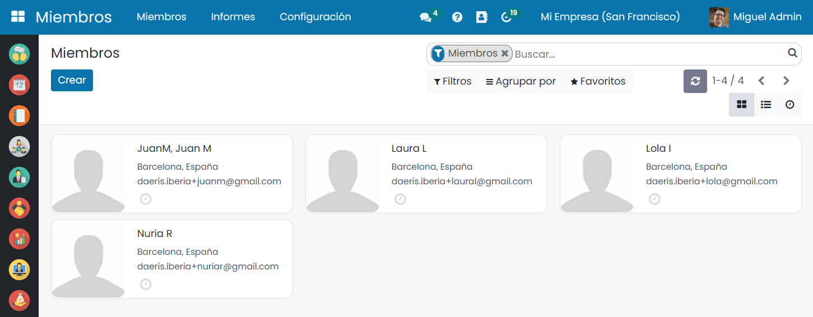

A continuación, en el formulario de miembros, puedes informar los siguientes campos:

- **Tipo de miembro**: Indicar si se trata de un miembro individual o de una compañía.
- **Nombre**: Nombre del miembro.
- **Apellido**: Apellido del miembro.
- **Datos de contacto**: Direcciones de contacto del miembro, teléfono, correo electrónico, sitio web, etc.
- **Imagen**: Fotografía del miembro o logo de la compañía.

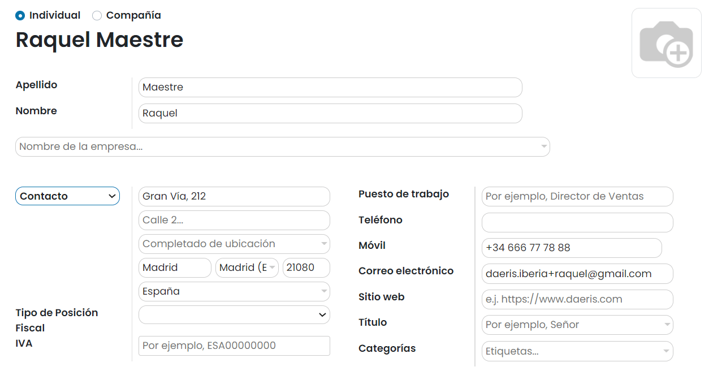

Una vez informados todos los campos necesarios, pulsa el botón *Guardar*.

Configurar la membresía gratuita
--------------------------------

Es posible configurar una membresía gratuita cuando creamos miembros en Daeris. El formulario ofrece opciones
para una membresía gratuita y para comprar la membresía.

Para configurar la membresía gratuita, navega al detalle de un miembro desde la pantalla :menuselection:`Miembros --> Miembros`:

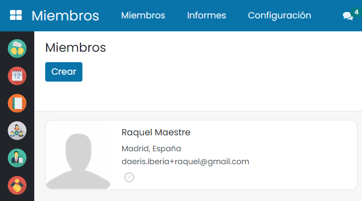

A continuación, accede a la pestaña *Suscripción*:

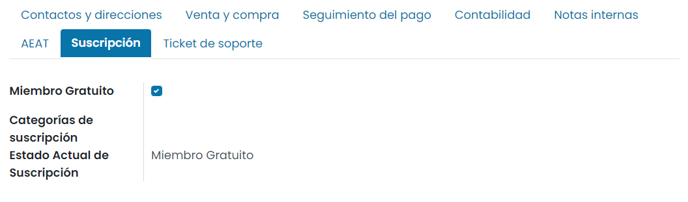

El usuario puede elegir la opción de **Miembro gratuito** desde aquí. Si la opción está habilitada, al marcar la casilla,
el miembro obtendrá una membresía gratuita. El estado de membresía actual del miembro cambiará a *Miembro gratuito*.

Comprar y facturar una membresía
--------------------------------

Es posible configurar una membresía de pago cuando creamos miembros en Daeris. El formulario ofrece opciones para una
membresía gratuita y para comprar la membresía.

Para configurar la membresía de pago, navega al detalle de un miembro desde la pantalla :menuselection:`Miembros --> Miembros`:

A continuación, accede a la pestaña *Suscripción*:

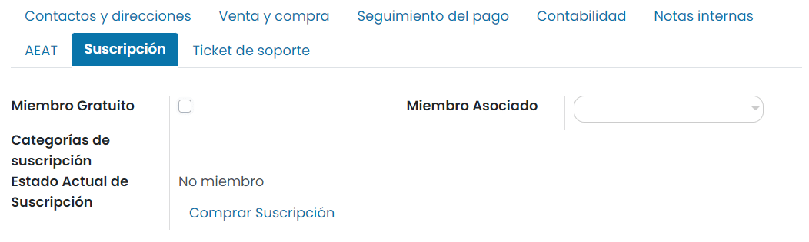

Si no deseas ofrecer una membresía gratuita, puedes desmarcar la opción de **Miembro gratuito**. En este caso, el estado
de membresía actual será *No miembro*. Las personas se convertirán en miembros solo al comprar la membresía. Para ello,
deberás pulsar la opción *Comprar Suscripción*. El sistema mostrará una ventana para completar la siguiente información:

- **Suscripción**: Producto de suscripción asociado al miembro.
- **Precio miembro**: Precio asociado al producto de suscripción.

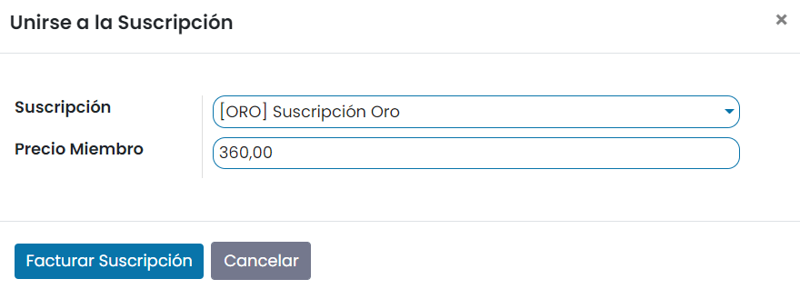

Una vez completados los campos necesarios, pulsa el botón *Facturar Suscripción*.

El sistema generará una factura en estado borrador y navegará al listado de facturas del miembro.

Al acceder al detalle de la factura, será posible revisar los datos y confirmarla mediante el botón *Confirmar*:

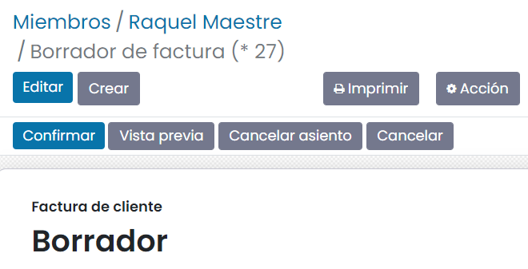

Por último, será necesario registrar el pago de la factura mediante el botón *Registrar pago*.

Al registrar el pago será necesario informar los datos del pago en la siguiente ventana:

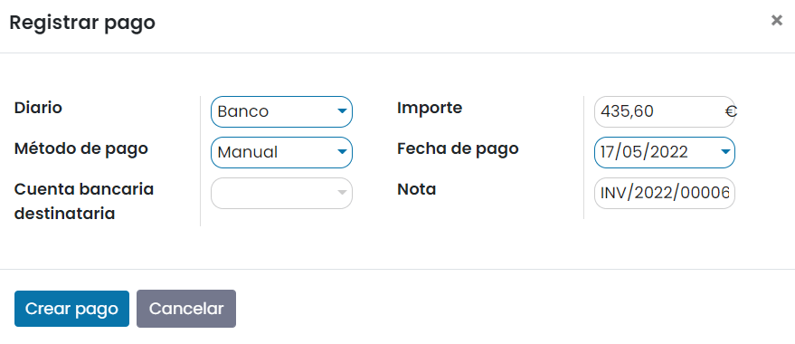

Una vez completados los datos del pago, se deberá pulsar el botón *Crear pago*. La factura quedará marcada como pagada o
en proceso de pago:

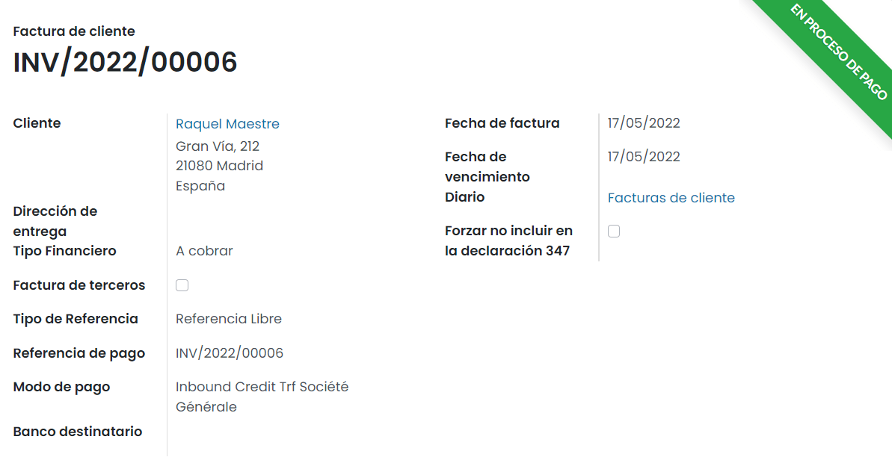

Al volver al detalle del miembro, se puede comprobar la fecha de inicio y fin de la suscripción, así como el producto
de suscripción asociado al miembro:

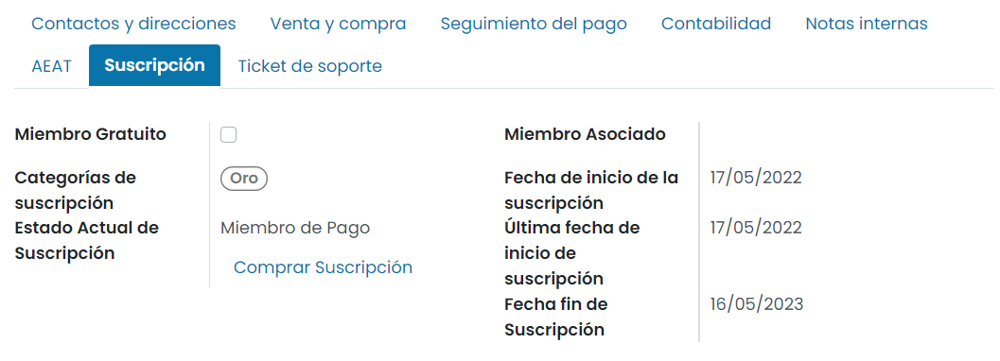

Asociar un miembro a otro
-------------------------

Si seleccionamos la opción de **Miembro Asociado** al crear un nuevo miembro, entonces el período de
membresía del nuevo miembro se basará en el período de membresía del miembro asociado:

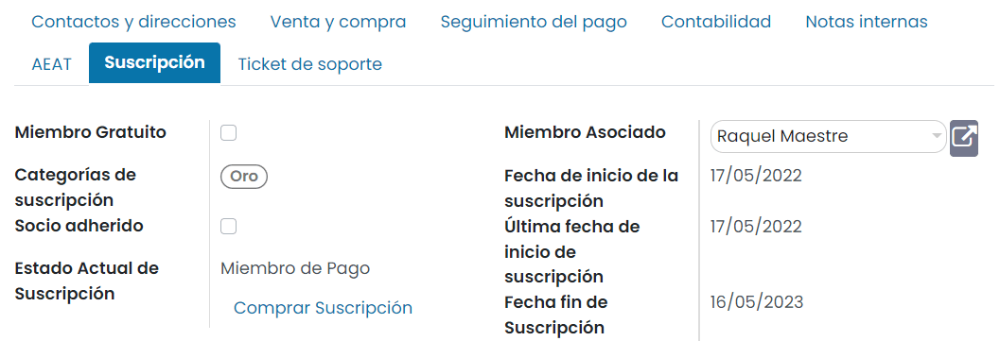