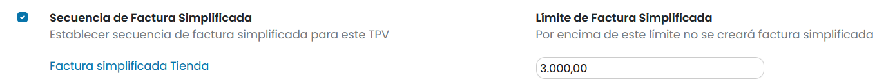

==============
Contabilidad
==============

Indicar el diario de ventas contable del TPV
---------------------------------------------

Para asociar el TPV con un diario contable (contabilidad), navega al detalle del TPV desde la pantalla
Punto de Venta > Configuración > Punto de Venta, y bajo el apartado Contabilidad, informa el campo
Diario de ventas, indicando el diario concreto, e indica si quieres agrupar los apuntes o no
(normalmente se agrupan los apuntes de este tipo de diarios).

Diario de ventas

A partir de ese momento, el diario aparecerá como un nuevo panel en la pantalla Contabilidad > Información general.

Diario de ventas TPV

Desde las opciones del menú del panel de Diario de ventas TPV, puedes acceder a varias pantallas, como, por ejemplo,
la consulta y análisis de facturas.

Diario de ventas TPV

Adaptar el TPV a la legislación Española
------------------------------------------

Para Adaptar tu TPV a la legislación Española, navega a la pantalla :menuselection:`Punto de Venta --> Configuración --> Punto de Venta`, accede al detalle
del TPV y sobre el apartado **Facturas y recibos**, informa la opción **Secuencia de Factura Simplificada**.

Además, en función del tipo de ventas que realiza tu negocio, debes establecer el importe límite sobre el cual
no se puede emitir una factura simplificada. Para ello, activa la opción **Límite de Factura Simplificada** e
incorpora el importe que consideres oportuno (3000 es la cantidad predeterminada).

Activar esta opción supone:

    - No emitir recibos desde el TPV si no facturas o facturas simplificadas.
    - Adaptar el recibo a la factura simplificada (Incorpora secuencia).
    - Validar que no se realiza factura simplificada por un importe mayor al configurado.

.. note::
   En el siguiente `artículo <https://sede.agenciatributaria.gob.es/Sede/iva/facturacion-registro/facturacion-iva/tipos-factura.html>`_ se puede leer todo lo referente a esta normativa española.
