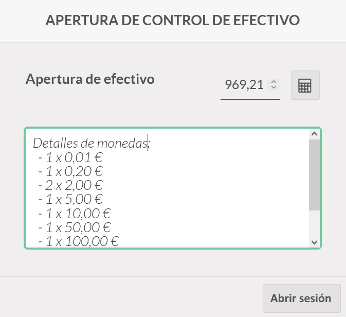

===============
Control de Caja
===============

Gestión del TPV
================

Control de Apertura
--------------------

Para que un empleado pueda abrir una sesión de TPV debe realizar previamente el **control de apertura**.

Esta tarea se basa en contabilizar el efectivo de que dispone la caja registradora. Para ello, navega a la pantalla
:menuselection:`Punto de Venta --> Tablero`, y sobre una sesión de TPV no iniciada, pulsa el botón **Nueva sesión**.

Al iniciar una nueva sesión, se solicita la identificación del empleado (en el caso de que el TPV este configurado para ello).
Posteriormente, se muestra una pantalla donde se indica el saldo de apertura de la caja. Además, se
puede gestionar el número de monedas y billetes mediante el icono de la **calculadora**.

Al hacer clic sobre la calculadora, se debe incorporar el número de monedas y billetes disponible en la caja
registradora.

Una vez revisado el listado de monedas y billetes, y realizados los ajustes necesarios, pulsa el botón Confirmar.
El saldo de apertura de actualizará con el efectivo introducido.

A continuación, para abrir la sesión, pulsa el botón **Abrir sesión**.

Al abrir la sesión, se mostrará la pantalla inicial del TPV.

Control de Cierre
-------------------

Para realizar el **control de caja** sobre un TPV, pulsa el botón **Cerrar** de la barra superior derecha.

El sistema muestra la pantalla de control de cierre de la sesión del TPV, donde es posible indicar el número de monedas
disponibles en la caja registradora, haciendo clic sobre el botón **calculadora**.

En este punto, el empleado deberá contabilizar el número de monedas y billetes disponible en la caja registradora.
Posteriormente deberá confirmar la operación haciendo clic sobre el botón **confirmar**.

En el caso de existir diferencias entre lo contabilizado por el sistema y lo contabilizado en caja, aparecerán sobre
el apartado diferencia. En el caso de que el empleado desee registrar la diferencia deberá seleccionar la opción
**Acepta la diferencia de pagos y publica una entrada en el diario de pérdidas y ganancias** y cerrar la sesión
mediante el botón **Cerrar sesión**.

El TPV quedará disponible para iniciar una nueva sesión desde la pantalla :menuselection:`Punto de Venta --> Tablero`,
desde donde es posible consultar el detalle de todas las sesiones haciendo clic sobre el botón **Sesiones**.

Sobre la pantalla de sesiones del TPV, es posible identificar todas las sesiones realizadas.

Al hacer clic sobre un registro del listado, accedemos a su detalle desde donde es posible consultar toda la información
relevante de la sesión así como sus registros relacionados haciendo clic sobre los botones de acceso a Pedidos,
albaranes, pagos, apuntes contables y registros de caja.

Entrada y retirada de efectivo
-------------------------------

Daeris permite la entrada y retirada de efectivo a los empleados **administradores** del TPV sin necesidad de
tener que cerrar la sesión.

Para realizar la entrada o retira de efectivo, haz clic sobre el botón **Efectivo +/-** disponible sobre la barra
superior.

Al hacer clic sobre el botón se muestra una pantalla desde la que se debe indicar si es una entrada o retirada de efectivo
pulsando el botón correspondiente, el cual, quedará sombreado. Posteriormente, incorpora la cantidad de efectivo
a incorporar o retirar, el motivo por el cual se realiza la acción y haz clic sobre el botón **Aceptar**.

Todos los movimientos realizados se podrán visualizar cuando se realice el control de cierre.

Todos los movimientos quedarán auditados y se crearán los apuntes contables pertinentes para su control.

Opciones adicionales
=====================

Establecer la diferencia máxima sobre el control de caja
-----------------------------------------------------------

En ocasiones, debido a un error a la hora de devolver el cambio a un cliente, se producen descuadres de caja.
Daeris, permite establecer una diferencia máxima a la hora de realizar el control de caja, sin pasar por la autorización
de un responsable.

.. note::
   Esta opción solo es válida si **no se usa** la opción **Empleados autorizados** debido a que con esta opción, solo pueden cerrar sesión del TPV y hacer control de caja , los usuarios con permisos de **Administrador** del punto de venta.

.. seealso::
   * :doc:`../../varios/usuarios_companias/usuarios`

Para ello, navega a la pantalla :menuselection:`Punto de Venta --> Configuración --> Punto de Venta`, accede al
detalle del TPV y sobre el apartado *Pagos* incorpora la opción **Establecer la diferencia máxima** y añade la
diferencia máxima autorizada.

Cuando un empleado intenta realizar un control de cierre superando la diferencia máxima, se muestra un mensaje por
pantalla, indicando que ha de contactar con un responsable para **Aceptar** la diferencia máxima permitida.

El empleado responsable con permisos de administrador del TPV , deberá realizar el control de cierre para poder cerrar la sesión, ya que a este, no le aplicará
dicha restricción.

.. _ventas/punto_de_venta/control_caja/monedas:

Establecer los tipos de monedas y billetes que permite el TPV
-------------------------------------------------------------------

En primer lugar, navega a la pantalla :menuselection:`Punto de Venta --> Configuración --> Punto de Venta`, accede al
detalle del TPV y sobre el apartado *Pagos* incorpora la opción **Efectivo** como método de pago.

Al incorporar este método, es posible establecer los tipos de monedas y billetes que pueden existir en caja tanto al iniciar
como al finalizar la sesión.

Para gestionar las posibles monedas o billetes que puedes disponer en la caja del TPV, navega a la pantalla :menuselection:`Punto de Venta --> Configuración --> Monedas / Billetes`.
Esta acción te llevará a la pantalla de valores de moneda de los TPV, donde podrás crear nuevos registros mediante el
botón **Crear** o actualizar los existentes.

Una vez configuradas las agrupaciones de moneda, desde la pantalla de configuración del TPV, deberás seleccionar
aquellas que consideres oportunas sobre el apartado **Monedas / Billetes**.

