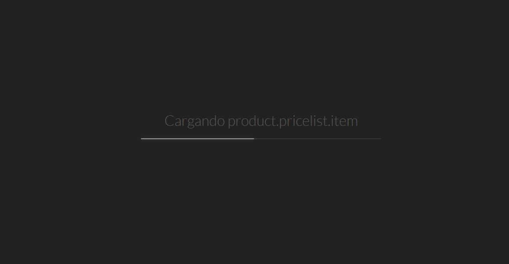
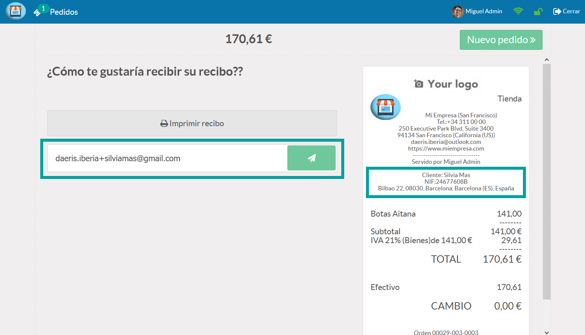

==============
Gestión Básica
==============

Introducción
=============

Introducción al TPV de daeris
----------------------------------

El **terminal de punto de venta** de Daeris, es una aplicación intuitiva y de fácil manejo que permite realizar las
gestiones de ventas con comodidad al estar integrado con las aplicaciones de contabilidad, inventario, ventas y CRM, permitiendo
disponer de datos estadísticos de todas las ventas en tiempo real.

Es necesaria **conexión online al iniciar y finalizar la sesión** de cada TPV y se puede ejecutar sobre maquinas
industriales, ordenadores personales, ordenadores portátiles y dispositivos iOS/Android (móviles y tabletas).

Cuando un empleado inicia sesión en el TPV, se encuentra con una aplicación divida en secciones que le permitirá
realizar diversas acciones en función de cómo se haya configurado previamente.

Las secciones principales de las que se compone la pantalla principal del TPV son:

    - **1 - Sesión**: Permite crear/eliminar pedidos ,identificar al empleado y cerrar sesión
    - **2 - Lista de Pedido**: Incorpora un listado con todos los productos añadidos al pedido.
    - **3 - Categoría y subcategoría**: Muestra la categoría y subcategoría sobre la que estás posicionado.
    - **4 - Imágenes de categoría**: Muestra las imágenes de las categorías.
    - **5 - Panel de acción**: Permite realizar múltiples acciones mediante el panel de botones.
    - **6 - Selección de productos**: Muestra todos los productos de la categoría.

Sesiones
=============

Configución de acceso al TPV
------------------------------

Es posible configurar la lista de posibles candidatos que pueden usar las sesiones del punto de venta.
Para ello, navega a la pantalla :menuselection:`Punto de Venta --> Configuración --> Punto de Venta`, accede al detalle
del TPV e informa la opción **Empleados Autorizados**. Posteriormente, selecciona todos las
empleados a los que quieras otorgar acceso y pulsa el botón **Guardar**.

En el caso de que desees añadir una clave PIN a un empleado, navega a la pantalla :menuselection:`Empleados --> Empleados`,
y haz clic sobre el empleado deseado. Sobre el formulario de detalle, posiciónate sobre la pestaña **Configuración RRHH**.
Añade sobre el campo **Código PIN**, el PIN deseado.

En el caso de querer incorporar una credencial que pueda ser escaneada por el empleado en sustitución de la introducción
del codigo PIN, informa el campo **ID de credencial** y haz clic sobre el botón **Generar**.

Para imprimir la insignia , haz clic sobre el botón **Imprimir Insignia**.

La insignia se abrirá en una nueva pestaña desde donde podrá ser impresa.

Iniciar o reanudar una sesión
------------------------------

Para iniciar una sesión sobre el TPV, navega a la pantalla :menuselection:`Punto de Venta --> Tablero`, donde
encontrarás todos los puntos de venta disponibles. Haz clic sobre el botón **Nueva sesión o Seguir vendiendo** del TPV al
que quieras acceder.

Sobre la pantalla aparecerá un indicador de carga de la aplicación TPV.

Al finalizar la carga (suele tardar unos segundos), aparecerá la pantalla inicial del TPV .

En el caso de que dispongas de más de un empleado operando con el TPV, se mostrará una pantalla inicial de inicio de sesión.
Desde esta pantalla es posible escanear la credencial del empleado que va a inciar sesión o seleccionarlo manualmente mediante
el botón **Seleccionar cajero**.

Si seleccionamos la opción **Seleccionar cajero**, se mostrará una pantalla desde donde seleccionar el cajero que va a usar el TPV.

Si el usuario seleccionado dispone de **PIN de autentificación**, deberá incorporarlo para poder iniciar a sesión.

En el caso de iniciar una nueva sesión, se mostrará el formulario inicial de control de efectivo.
En el caso de haber reanudado la sesión, el empleado dispondrá del pedido tal y como lo dejó al haber finalizado
la sesión anterior.

Cambiar de empleado sobre una sesión
-------------------------------------
Cambiar el empleado que usa un TPV suele ser una tarea frecuente que requiere de agilidad para no dejar al cliente
en espera. Para cambiar de empleado sobre una sesión de TPV, pulsa sobre el nombre del empleado de la sesión actual.

Esta acción abrirá una nueva ventana, donde podrás escoger entre una lista de posibles candidatos.

Si el usuario seleccionado dispone de **PIN de autentificación**, deberá incorporarlo para poder acceder a la sesión.

Al cambiar de empleado, se cambiará el nombre en la parte superior de la sesión de TPV. La sesión continuará donde
lo había dejado el empleado anterior.

Salir de una sesión
----------------------------

Para cerrar una sesión de TPV, debes pulsar el botón **Cerrar**.

A continuación, se mostrará la pantalla de control de cierre, desde donde es posible indicar el importe disponible
al contado en la caja registradora (control de caja), asi como incorporar notas de los sucesos de la sesión.

Además, es posible realizar las siguientes acciones:

    - **Continuar venta**: Permite salir de la pantalla de control de cierre y continuar operando en la sesión.
    - **Mantener abierta**: Permite salir del TPV sin cerrar la sesión, para continuarla posteriormente.
    - **Cerrar sesión**: Permite salir del TPV cerrando la sesión actual.

Al salir de la sesión, daeris navegará a la pantalla :menuselection:`Punto de Venta --> Tablero`, donde podrás ver
la *Última fecha de cierre* y el *Último saldo de efectivo de cierre*.

En el caso de que hayas mantenido abierta la sesión y quieras continuarla, deberás hacer clic sobre el botón **Seguir vendiendo**.

Pedidos
=============

Añadir artículos a un pedido de forma manual
---------------------------------------------

Para **añadir artículos** a un nuevo pedido del TPV, puedes buscar sobre las categorías cada uno de los artículos
que quieras incorporar. En caso de disponer de muchos productos o categorías, puedes utilizar el buscador para
encontrar el artículo.

Al hacer **clic sobre el artículo**, aparecerá sobre el pedido incorporando el precio y el número de unidades.

En el caso de que quieras ampliar el número de unidades, puedes:

    - Hacer **clic sobre el artículo** tantas veces como unidades quieras incorporar.
    - Hacer **clic sobre el teclado numérico**, indicando el número de unidades (es necesario que esté seleccionada la opción **Cantidad** del teclado numérico).

Una vez añadido un producto, puedes eliminar el término buscado, mediante el botón derecho del buscador. Posteriormente
puedes continuar añadiendo productos al pedido,seleccionando otras categorías y haciendo clic sobre los productos a incorporar.

Añadir artículos a un pedido mediante la lectura del código de barras
------------------------------------------------------------------------

Para añadir artículos a un pedido del TPV mediante la lectura del código de barras del producto, debes posicionarte
sobre la pantalla de pedidos del TPV.

Al escanear el código de barras del producto con el lector de código de barras, el sistema localizará el producto
correspondiente y lo añadirá al pedido.

En el caso de que quieras ampliar el número de unidades, puedes:

    - Volver a **escanear el código de barras** del producto, tantas veces como unidades quieras añadir.
    - Hacer **clic sobre el artículo** tantas veces como unidades quieras incorporar.
    - Hacer **clic sobre el teclado numérico**, indicando el número de unidades (es necesario que esté seleccionada la opción Cantidad del teclado numérico).

.. image:: gestion_basica/tpv_unidades.png
   :align: center
   :alt: Unidades del artículo añadido al pedido del TPV

Una vez añadido un producto, puedes continuar añadiendo productos al pedido, escaneando los códigos de barras de los
productos correspondientes.

Gestionar múltiples pedidos 
----------------------------
Una de las situaciones que generan malestar a los clientes se produce cuando un cliente bloquea una cola de ventas.
Esta situación se puede producir por varias razones como:

    - Le falta un producto por adquirir para completar su venta.
    - Quiere realizar un cambio de producto.
    - Ha descuidado su forma de pago y necesita ausentarse unos instantes para disponer de ella.
    - Necesita realizar una consulta externa para garantizar el pedido y no generar una devolución.

A esta lista le podríamos sumar un largo etcétera que a ojos del resto de clientes generan malestar.

Para evitar en la medida de lo posible estas situaciones y evitar que el empleado tenga que deshacer todo el pedido
ya gestionado, Daeris permite **gestionar múltiples pedidos de forma simultánea**. De este modo, si un empleado se
encuentra con una situación como las indicadas, puede mantener a la espera el pedido del cliente bloqueado y
continuar gestionando pedidos del resto de la cola de ventas.

Para crear **nuevos pedidos en una sesión de TPV**, tan solo es necesario hacer clic sobre el botón **Pedidos** de la sección
superior. Este botón incorpora el número total de pedidos abiertos que hay en la sesión.

Al hacer clic sobre el botón **Pedidos**, aparece una nueva pantalla desde donde es posible buscar pedidos anteriores ,
asi como crear nuevos. Para ello, pulsa el botón **Nuevo pedido**.

Esta acción abrirá un nuevo pedido y añadirá un pedido al contador de pedidos activos. El empleado podrá
gestionar este nuevo pedido de la forma habitual.

Para volver al pedido anterior tan solo deberá hacer clic sobre el botón **pedidos** y volver a hacer clic sobre el pedido del listado.

Eliminar un pedido incompleto
-------------------------------

Una de las situaciones que puede llegar a ocurrir mientras se está gestionando un pedido, es que el cliente decida
no completarlo. Esta situación puede darse por múltiples razones, como, por ejemplo, que haya cambiado de opinión,
que no disponga de medios de pago o efectivo suficiente, etc.

Para que un empleado pueda **deshacer el pedido** de forma completa, deberá hacer clic sobre el botón **Pedidos** de la
sección superior.

Posteriormente, deberá hacer clic sobre el botón **Eliminar** (icono de papelera de reciclaje) del listado de pedidos.

El sistema solicitará **confirmación** para la eliminación del pedido:

Una vez confirmada la eliminación, el sistema posicionará al empleado sobre el pedido anterior (en caso de disponer
de más de un pedido en proceso) o creará uno nuevo (en caso de no disponer de pedidos anteriores en proceso).

Identificar o crear clientes
-------------------------------
Disponer de la mayor información posible de los clientes te permite hacer crecer tu negocio por múltiples vías,
así como poder ofrecer servicios especializados mejorando la fidelidad (descuentos, campañas especiales,
envío de catálogos, etc.).

Tener a tus clientes registrados te permitirá, además, agilizar los procesos de facturación, así como ofrecerles
información detallada de su historial. Para agilizar el registro de clientes, daeris permite al empleado crear
nuevos clientes desde el TPV.

Para crear un nuevo cliente desde una sesión de TPV, pulsa el botón Cliente del teclado numérico:

Esta acción abrirá una nueva pantalla donde aparece un listado con todos los clientes disponibles, un buscador útil
en el caso de que quieras realizar la búsqueda de un cliente en concreto y un botón que permitirá registrar los
datos de un nuevo cliente.

Al hacer clic sobre el botón ** +Crear**, se abre un nuevo formulario donde introducir los datos del cliente. El empleado
puede registrar los datos que le ofrece el cliente.

Campos como el NIF, pueden disponer de validaciones para evitar la introducción de datos erróneos. Una vez
introducidos los datos, pulsa el icono de **Guardar**.

Al guardar el formulario, puedes indicar al TPV que se realizará la venta a este cliente, haciendo clic sobre el
botón **Establecer cliente**.

Esta acción te devolverá a la pantalla de venta principal. Sobre el botón **cliente** aparecerá el nombre del cliente
recién creado, y sobre el que puedes proceder a realizar la venta.

Al proceder a registrar el pago, el cliente aparecerá identificado sobre la pantalla de pago.

Una vez validado el pago, aparecerán los datos del cliente en el correspondiente ticket de compra y permitirá enviarle
el recibo por correo electrónico.

Si accedes al detalle del cliente creado desde la pantalla :menuselection:`Contactos --> Contactos`, podrás
visualizar todas las compras realizadas desde el TPV a este cliente haciendo clic sobre el botón **Pedidos TPV**.

El sistema mostrará un listado de las ventas realizadas a ese cliente mediante la TPV.

