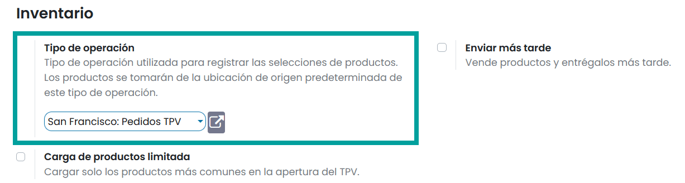
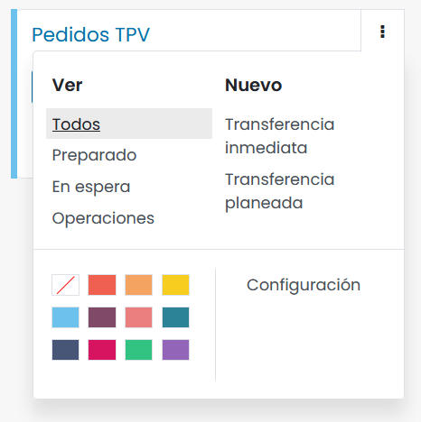

==============
Inventario
==============

Configuración
=============

Configurar el TPV sobre el tablero del inventario
------------------------------------------------------------

Para asociar el TPV con un panel de inventario, navega al detalle del TPV desde la pantalla
:menuselection:`Punto de Venta --> Configuración --> Punto de Venta`, y sobre el apartado de Inventario,
informa el campo **Tipo de operación**.

Al navegar a la pantalla :menuselection:`Inventario --> Información general`, podrás visualizar un panel de
Pedidos TPV.

Desde las opciones del menú del panel de Pedidos TPV, puedes acceder a diferentes consultas sobre los movimientos
de inventario realizados a partir de las ventas realizadas a los clientes.

Enviar los productos vendidos por TPV.
-----------------------------------------------------------------------------------

Daeris permite vender tus productos desde el TPV para que sean enviados más tarde. Para ello, debes indicar
el almacén donde residen las existencias que estas vendiendo, asi como la politica de entrega. Para ello,
navega al detalle del TPV desde la pantalla :menuselection:`Punto de Venta --> Configuración --> Punto de Venta`
e informa el campo **Enviar más tarde**.

Posteriormente debes informar el **almacén** y la **política de entrega**, siendo posible seleccionar entre enviar
los productos a medida que esten disponibles o enviarlos cuando todos esten disponibles.

Al cobrar un pedido aparecerá la opción **enviar más tarde**. En el caso de que quieras enviar el pedido a la dirección del cliente,
deberás pulsar la opción **enviar más tarde** y seleccionar el cliente al que realizar el envío.

Una vez el pedido haya sido validado, podrás encontrar el albaran de entrega sobre las expediciones del almacén configurado.
Para ello navega a la pantalla :menuselection:`Inventario --> Información general` y haz clic sobre el registro
**Expediciones**.

En el caso de que existan existencias del producto vendido, dispondrás de un movimiento en estado **Preparado** a la
espera de que realices el correspondiente envío. En el caso de que no existan existencias, el movimiento estará en
estado **En espera**.

Desde el detalle del registro, es posible gestionar el envío.

