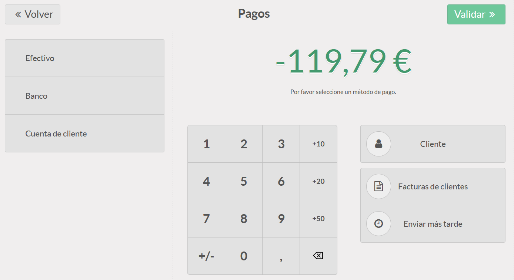
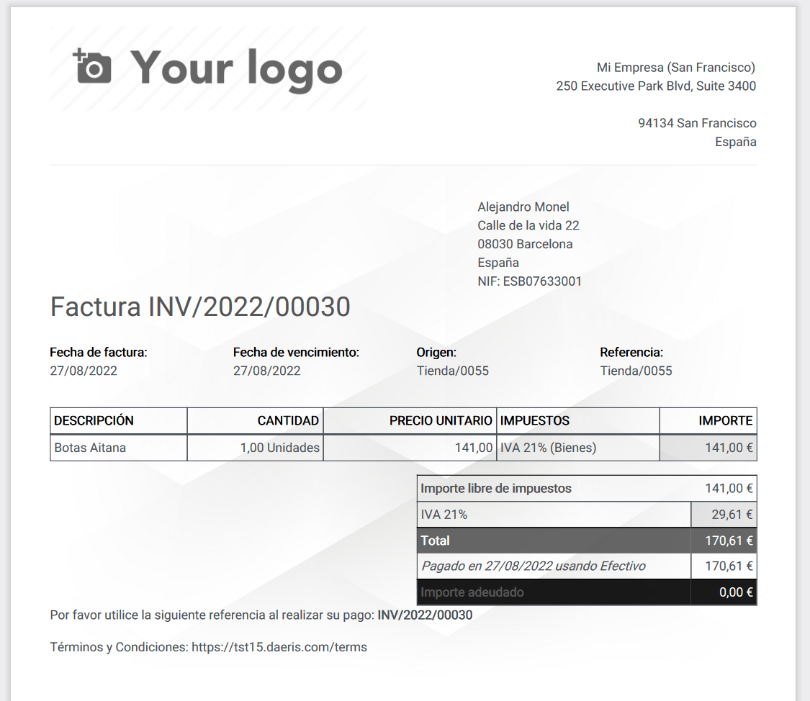
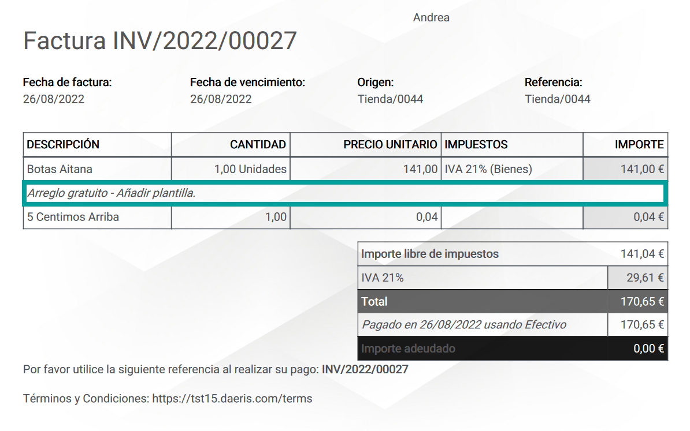
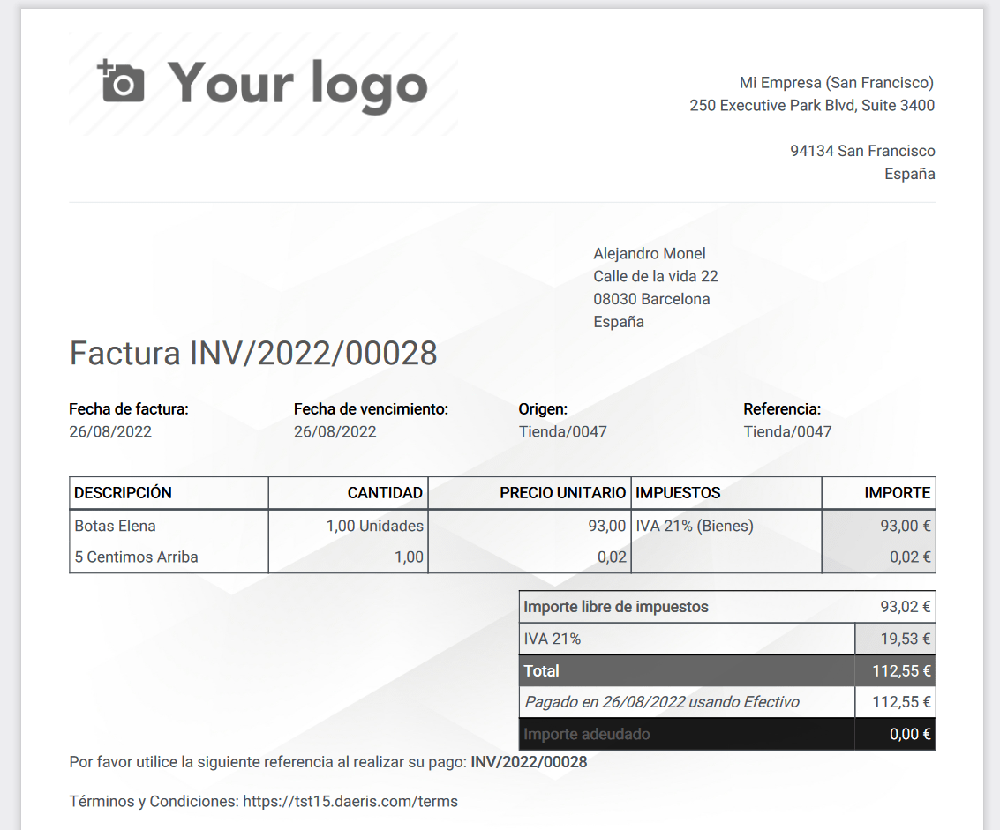

===================
Pagos y Reembolsos
===================

Pagos
=============

Pago en efectivo de un pedido
---------------------------------------------

Para realizar el pago de un pedido en una sesión de TPV, pulsa el botón **Pagos** cuando hayas acabado de introducir
los artículos de la compra del cliente.

En el caso de que quieras gestionar el cobro en efectivo, pulsa sobre el botón **Efectivo**.

Al hacer clic sobre el botón **Efectivo** aparecerá el panel de pagos indicando por defecto que el cliente realiza el
pago de la cantidad exacta. Si ocurre esta situación, el empleado tan solo debe **Validar la operación**.

Si el cliente no entrega la cantidad exacta, el empleado podrá desde el panel de pagos:

    - **Seleccionar** desde el teclado numérico la **cantidad de efectivo** ofrecida por el cliente.
    - **Seleccionar** desde el teclado numérico **los billetes** entregados por el cliente (+10, +20, +50). Cada vez que haga clic, se reducirá del importe debido el número correspondiente al billete seleccionado.

Por ejemplo, si pulsas 5 veces el botón +50, el sistema cuantificará como cantidad entregada, 250, tal y como se muestra a continuación:

El empleado deberá retornar al cliente el cambio indicado por pantalla y pulsar sobre el botón **Validar**,
que mostrará la pantalla de factura de compra.

En el caso de tener automatizada la impresión, se realizará la impresión para el cliente. De otro modo el empleado
deberá hacer clic sobre el botón **Imprimir recibo**.

En el caso de que el cliente desee recibir el ticket en su correo electrónico, el empleado deberá introducirla sobre
el campo **Recibo por email** y hacer clic sobre el botón **Enviar**.

El cliente recibirá en  su correo un email con el anexo del recibo de compra.

Pago de bolsas
----------------------------

Desde que entrara en vigor el Real Decreto 293/2018, la legislación española prohíbe expresamente ofrecer a los
clientes bolsas de plástico sin coste alguno.

.. note::
   En el siguiente `artículo <https://www.boe.es/buscar/doc.php?id=BOE-A-2018-6651>`_ se puede leer todo lo referente a esta normativa.

Siendo obligatorio en algunos países el cobro por las bolsas, se hace necesario que esta gestión sea sumamente
sencilla de gestionar desde cualquier TPV. Para ello daeris permite configurar una categoría especifica y
habilita un botón que realiza las siguientes funciones:

    - En el caso de que solo dispongas de un tipo de bolsa, **añade la bolsa al pedido**.
    - En el caso de disponer de varios tipos de bolsa, **muestra un desplegable para seleccionar la bolsa deseada**.

Para configurar la operativa, navega a la pantalla :menuselection:`Punto de Venta --> Configuración --> Punto de Venta`, accede al detalle
del TPV y marca la opción **Permitir cargos por bolsa** y selecciona la categoría que se corresponda con la categoría
que reúna todos los tipos de bolsa disponibles.

.. seealso::
   * :doc:`../../ventas/punto_de_venta/productos`

A continuación, navega a la pantalla :menuselection:`Punto de Venta --> Producto --> Productos` y crea el producto bolsa, incorporando la siguiente información:

    - Imagen
    - Nombre identificativo
    - Tipo de producto (Almacenable)
    - Puede ser vendido
    - Puede ser comprado
    - Precio de venta
    - Coste

Sobre la pestaña de Ventas, debes informar:

    - Disponible en TPV
    - Categoría

.. note::
   Debes crear un producto con las características indicadas por cada tipo de bolsa que desees vender.

Recuerda, que si estas restringiendo categorías en tu TPV, deberás añadir la categoría **Bolsa de punto de venta**.

Al iniciar sesión en el TPV, podrás ver un nuevo botón **Bolsa**. Cada vez que hagas clic sobre el botón,
se incorporará una unidad.

En el caso de que dispongas de varios tipos de bolsa, se abrirá un desplegable que
permitirá seleccionar entre todos los tipos de bolsa disponibles.

Cuando el empleado haga clic sobre un tipo de bolsa, se incorporará al pedido una unidad del tipo de bolsa
seleccionado.

Redondeo de efectivo
---------------------

El **redondeo de efectivo** se realiza cuando la moneda más pequeña que puede usarse sobre el TPV, es más alta que
la unidad mínima de la cuenta.

Existen países que exigen el redondeo al alza o a la baja del importe total de una factura a los cinco céntimos más
cercanos, cuando el pago se realiza en efectivo.

Daeris permite configurar el redondeo de efectivo sobre los totales de las facturas y recibos.

Para activar el redondeo de efectivo , navega a la pantalla :menuselection:`Punto de Venta --> Configuración --> Ajustes`
y activa la opción **Redondeo de efectivo**.

Para crear un nuevo método de redondeo, haz clic sobre el enlace **Redondeos de efectivo**.

Al hacer clic sobre el enlace se accede a la lista de métodos de redondeo. Para crear un nuevo método haz clic sobre
el botón **Crear**.

Sobre el formulario, informa los detalles del redondeo.

Posteriormente, navega a la pantalla :menuselection:`Punto de Venta --> Configuración --> Punto de Venta`, accede al detalle
del TPV y marca la opción **Redondeo de efectivo**, además del **Método de redondeo**. En el caso de que solo quieras
usar el redondeo cuando el cliente pague en efectivo, incorpora la opción **Solo para métodos de efectivo**.

Sobre el formulario, informa los detalles del redondeo.

Por último, recuerda hacer clic sobre el botón **Guardar**.

Cuando se realice un nuevo pedido sobre el TPV, se usará el redondeo establecido.

Para ello, el empleado deberá seleccionar el método de pago **Efectivo**, acción que procederá a realizar el
cobro por el importe redondeado.

Sobre el recibo, aparacerá una línea que hará referencia al redondeo cobrado al cliente.

Restringir el cambio de precios en las líneas de pedido
--------------------------------------------------------
En el caso de que desees que únicamente los empleados con permisos de **administrador** del punto de venta puedan
modificar los precios de los productos al realizar ventas sobre el TPV, navega a la pantalla
:menuselection:`Punto de Venta --> Configuración --> Punto de Venta`, accede al detalle de un TPV y marca la opción
**control de precios**.

.. image:: tarifas_promociones/control_precio.png
   :align: center
   :alt: Impedir que los empleados no administradores puedan modificar los precios.

Al usar esta opción, el botón **Precio** aparecerá deshabilitado sobre los empleados que no sean administradores.

.. image:: tarifas_promociones/precio_deshabilitado.png
   :align: center
   :alt: Impedir que los empleados no administradores puedan modificar los precios.

Reembolsos
=============

Realizar un reembolso
-----------------------

En ocasiones un cliente puede solicitar un reembolso a partir de una devolución.

Daeris permite efectuar un reembolso sobre un pedido completado. Para ello, accede al TPV y haz clic sobre el
botón **Pedidos** disponible sobre la barra superior derecha.

Esta acción presenta la pantalla de pedidos filtrada por el pedido actual.

.. image:: pagos/asoc2.png
   :align: center
   :alt: Reembolsar un pedido completado desde el TPV

Sobre el buscador de pedidos, cambia el filtro de búsqueda a pedidos **Pagados**.

Mediante el buscador de pedidos, intenta identificar el pedido a reembolsar. Puedes buscar
por cliente, número de pedido y fecha.

Una vez identificado el pedido, haz clic sobre la línea. Sobre el panel inferior derecho puedes iniciar el
reembolso haciendo clic sobre el botón **Reembolso**.

Al reembolsar el pedido, aparecen sobre el TPV, todas las líneas del pedido con importe negativo (devolución).
Es posible modificar la cantidad de productos de las líneas, si el reembolso no es total si no parcial.

Al efectuar el abono al cliente mediante el botón **Pagos** aparece la pantalla de pago desde donde se debe seleccionar
el método de pago apropiado para efectuar la devolución.

Al validar el pedido se muestra el recibo de la operación efectuada.

Recibos y facturas
===================

Crear recibos
--------------

Un recibo es un documento que acredita la compra de productos o servicios y se usa como comprobante de la
transacción comercial entre el vendedor y comprador.

En Daeris, el recibo dispone de:

    - la **fecha** en la que se realiza la transacción.
    - Los **artículos** que componen la venta.
    - El detalle de los **impuestos** aplicados
    - Toda la información disponible que identifica al **vendedor**.
    - El detalle del **pago** realizado.
    - El código correlativo y único** por cada **propuesta** de venta realizada (Pedido XXXX-XXX-XXX).

Se diferencia de la factura simplificada en que la factura simplificada muestra un **código correlativo y único**
por cada **venta** realizada (TPV).

Cada vez que se realiza una venta desde el TPV de Daeris, se emite un recibo para su impresión tras validar
el pago del pedido. También es posible enviarlo al cliente por correo electrónico.

Ejemplo de recibo:

Crear facturas
---------------

Una factura es un documento que acredita la compra de productos o servicios y se usa como comprobante de la
transacción comercial entre el vendedor y comprador.

En Daeris, una factura dispone de:

    - la **fecha** en la que se realiza la transacción.
    - Los **artículos** que componen la venta.
    - El detalle de los **impuestos** aplicados
    - Toda la información disponible que identifica al **vendedor**.
    - Información relevante que identifica al **comprador**.
    - El detalle del **pago** realizado.
    - El código correlativo y único** por cada **venta** realizada (INV/AÑO/XXXXX).

Se diferencia de la factura simplificada en que incluye los datos del vendedor, además de ser **Obligatoria** para
efectuar diferentes tramites burocráticos a partir de determinados importes y/o situaciones.

Sobre el TPV de Daeris es posible generar una factura identificando al cliente mediante el botón **Cliente**.
Antes de validar el pago del pedido será requerido hacer clic sobre el botón **Factura** (quedará sombreado).

Al validar el pago, se mostrará la pantalla de impresión de recibo (que no dispondrá de código alguno).
Desde esta pantalla es posible enviar al cliente la factura y el recibo al correo electrónico.

.. image:: pagos/pagos3b.png
   :align: center
   :alt: Pantalla de factura al realizar el pago

También se generará una factura en formato pdf que podrá se impresa y entregada al cliente.

Para **Permitir facturar desde el TPV** navega a la pantalla :menuselection:`Punto de Venta --> Configuración --> Punto de Venta`, accede al detalle
del TPV y sobre el apartado **Facturas y recibos** marca la opción **Facturación**. Posteriormente, incorpora el **diario** contable asociado al TPV.

.. image:: pagos/permitir_facturar.png
   :align: center
   :alt: Permitir facturar desde un TPV

.. note::
   La opción para generar facturas desde Daeris viene activa por defecto al crear un TPV y no es recomendable deshabilitarla.

Añadir notas sobre las íde pedido
----------------------------------------

Daeris permite incorporar notas sobre las líneas del pedido. Estas notas aparecerán en la facturas y el recibo.

Para permitir incorporar notas sobre las líneas del pedido , navega a la pantalla :menuselection:`Punto de Venta --> Configuración --> Punto de Venta`, accede al detalle
del TPV y marca la opción **Notas del cliente**. Recuerda hacer clic sobre el botón **Guardar** para que se apliquen tus cambios.

Sobre el TPV, aparece el botón **Nota del cliente**.

Para incorporar una nueva nota, selecciona una línea del pedido y haz clic sobre el botón **Nota del cliente**.
A continuación, incorpora la nota sobre el cajetín de texto.

.. image:: pagos/notas3.png
   :align: center
   :alt: Incorporar notas sobre las líneas de los recibos

Al hacer clic sobre el botón **OK** se introduce la nota sobre la línea de pedido seleccionada.

.. image:: pagos/notas4.png
   :align: center
   :alt: Incorporar notas sobre las líneas de los recibos

Al efectuar el pago, la nota aparece tanto en la factura del cliente como en el propio recibo.

Añadir Texto predeterminado sobre el recibo
--------------------------------------------

Daeris permite incorporar un texto predeterminado sobre el encabezado y el pie de página del recibo.

Para usar esta opción, navega a la pantalla :menuselection:`Punto de Venta --> Configuración --> Punto de Venta`, accede al detalle
del TPV y marca la opción **Encabezado y pie de página**.

Posteriormente, añade el texto que quieres que aparezca sobre el encabezado y/o el pie de página del recibo,
sobre los campos **encabezado** y **pie de página**. Recuerda hacer clic sobre el botón **Guardar** para que se apliquen tus cambios.

Al imprimir un nuevo recibo, el texto configurado aparecerá sobre el encabezado y el pie de página.

Imprimir recibos por defecto
-----------------------------

Daeris, permite imprimir los recibos tras realizar el pago de forma automática.

Para usar esta opción, navega a la pantalla :menuselection:`Punto de Venta --> Configuración --> Punto de Venta`, accede al detalle
del TPV y marca la opción **Impresión automática del recibo**.

En el caso de que quieras que se omita la pantalla de impresión del recibo **siempre que se puede realizar la impresión de forma automática**,
selecciona la opción **Saltar pantalla de vista previa**.

Por último, recuerda hacer clic sobre el botón **Guardar**.

Reimprimir recibos y facturas
------------------------------

En ocasiones puede ocurrir que un cliente reclame una copia de un recibo extraviado o una segunda copia del recibo.

Daeris permite la reimpresión de los recibos. Para ello, accede al TPV y haz clic sobre el botón **Pedidos** disponible sobre la barra superior derecha.

.. image:: pagos/reimprimir1.png
   :align: center
   :alt: Imprimir los recibos tras realizar el pago de forma automática

Esta acción presenta la pantalla de pedidos filtrada por el pedido actual.

Sobre el buscador de pedidos, cambia el filtro de búsqueda a pedidos **Pagados**.

.. image:: pagos/reimprimir3.png
   :align: center
   :alt: Imprimir los recibos tras realizar el pago de forma automática

Mediante el buscador de pedidos, intenta identificar el pedido a reimprimir. Puedes buscar
por cliente, número de pedido y fecha.

Una vez identificado el pedido, haz clic sobre la línea. Sobre el panel inferior derecho puedes
**Reimprimir factura** e **Imprimir recibo**.

Sobre el panel inferior derecho puedes:

Al **Reimprimir factura** se descarga la factura en fichero pdf. En función de las opciones de tu navegador es
posible realizar la impresión.

Al **Imprimir recibo** aparece una nueva pantalla que muestra el recibo. Desde esta pantalla es posible realizar
la impresión haciendo clic sobre el botón **Imprimir recibo**.

Métodos de pago
===============

Crear tarjeta de crédito como método de pago
---------------------------------------------

Para crear un nuevo método de pago, navega a la pantalla :menuselection:`Punto de Venta --> Configuración --> Métodos de pago`

El sistema navegará a la pantalla de métodos de pago del TPV, donde podrás crear un nuevo método de pago mediante el botón **Crear**.

Sobre el nuevo método de pago, se deberán informar los siguientes campos:

   - **Método**: Especificar un nombre para el método de pago.
   - **Tipo**: Se deberá seleccionar **Banco**.
   - **Identificar al cliente**: Vacío. Obliga a identificar al cliente a la hora de realizar el pago.
   - **Cuenta pendiente**: Dejad en blanco para usar una cuenta predeterminada o seleccionad una del listado. Utilizada como cuenta pendiente al crear registros de pago contables para pagos bancarios.
   - **Cuenta intermedia**: Dejad en blanco para usar una cuenta predeterminada o seleccionad una del listado. Anula la cuenta por cobrar de la empresa (Para el TPV) utilizada en las entradas de diario.

Una vez informados los campos necesarios, guarda el método de pago mediante el botón **Guardar**.

A continuación, vuelve al detalle del TPV, e informa el nuevo método de pago creado en el campo **Métodos de Pago**:

Para poder visualizar el nuevo método de pago sobre una sesión de TPV, será necesario finalizar la sesión activa, si hay una en proceso, y abrir una de nueva.

Para usar el nuevo método de pago, completa un pedido y haz clic sobre el botón **Pagos**.

El sistema navegará a la pantalla de pagos, donde aparecerá el nuevo método de pago configurado.

Al hacer clic sobre el nuevo método de pago, se incorporará todo el coste como entregado y podrás incorporar **manualmente** el importe sobre el
datáfono del banco. Cuando confirmes que la transacción es correcta, deberás hacer clic sobre el botón **Validar**.

Sobre el ticket de caja, aparecerá como método de pago, el método usado:

